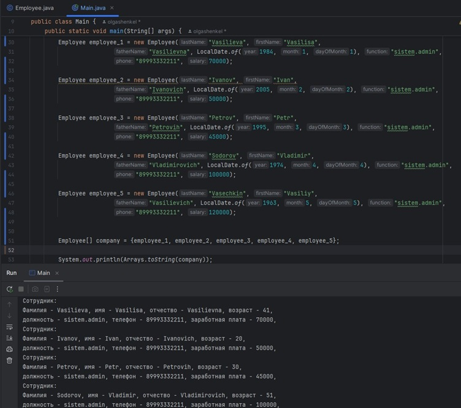

# Урок 3. Классы и объекты


## Домашняя работа

### Задание 1 

Задача: Решить все задания (в том числе «со звёздочкой»), если они не были решены на семинаре, без ограничений по времени


### Задание 2 ([решение](https://github.com/olgashenkel/GeekBrains-technological_specialization/tree/main/01.%20Java%20Core/Seminar_03/src))

Задача: Написать прототип компаратора - метод внутри класса сотрудника, сравнивающий две даты, представленные в виде трёх чисел гггг-мм-дд, без использования условного оператора

```
public int compareDates(int yyyy1, int mm1, int dd1, int yyyy2, int mm2, int dd2) {
        int date1 = yyyy1 * 10000 + mm1 * 100 + dd1;
        int date2 = yyyy2 * 10000 + mm2 * 100 + dd2;
        return Integer.compare(date1, date2);
    }
```


### Задание 3 ([решение]())

Задача: Опишите класс руководителя, наследник от сотрудника. Перенесите статический метод повышения зарплаты в класс руководителя, модифицируйте метод таким образом, чтобы он мог поднять заработную плату всем, кроме руководителей. В основной программе создайте руководителя и поместите его в общий массив сотрудников. Повысьте зарплату всем сотрудникам и проследите, чтобы зарплата руководителя не повысилась.


---
## Задачи с семинара

### Задание 1 

Задача: Создать класс ”Сотрудник” с полями: ФИО, должность, телефон, зарплата, возраст.


2-ой вариант генерации геттеров и сеттеров с помощью Lombok: 
~~~
@Setter
@Getter
public class Employee {
    String lastName;
    String firstName;
    String fatherName;
    int birthDate;
    String function;
    String phone;
    int salary;
}
~~~


### Задание 2 

Задача: Написать функцию выводящую всю доступную информацию об объекте


### Задание 2** 

Задача: Написать функцию выводящую всю доступную информацию об объекте с использованием форматирования
строк.


### Задание 2* 

Написать функцию выводящую всю доступную информацию об объекте таким образом, чтобы функция возвращала значение


### Задание 3 

Задача: Создать массив из 5 сотрудников


### Задание 3* 

Задача: Создать массив из 5 сотрудников. Массив должен быть сразу инициализирован




### Задание 3** 

Задача: Создать массив из 5 сотрудников. Массив должен быть сразу инициализирован и не должно быть создано дополнительных переменных

~~~
Employee[] company = {
                new Employee("Vasilieva", "Vasilisa",
                        "Vasilievna", LocalDate.of(1984,1,1), "sistem.admin",
                        "89993332211", 70000),
                new Employee("Ivanov", "Ivan",
                        "Ivanovich", LocalDate.of(2005,2,2), "sistem.admin",
                        "89993332211", 50000),
                new Employee("Petrov", "Petr",
                        "Petrovih", LocalDate.of(1995, 3, 3), "sistem.admin",
                        "89993332211", 45000),
                new Employee("Sodorov", "Vladimir",
                        "Vladimirovich", LocalDate.of(1974, 4, 4), "sistem.admin",
                        "89993332211", 100000),
                new Employee("Vasechkin", "Vasiliy",
                        "Vasilievich", LocalDate.of(1963, 5, 5), "sistem.admin",
                        "89993332211", 120000)};
        
~~~


### Задание 4

Задача: Создать метод, повышающий зарплату всем сотрудникам старше 45 лет на 5000. Метод должен принимать в качестве параметра массив сотрудников

```
    // метод класса Employee для вычисления возраста сотрудника

    public int getAge() {
        return Period.between(birthDate, LocalDate.now()).getYears();
    }
```


```
// метод класса Employee для повышения з/п сотрудникам 

    public void salaryUp(int amount) {
        this.salary += amount;
    }
```
```
// метод класса Main для повышения з/п сотрудникам старше 45 лет

    private static void increaserSalary(Employee[] array) {
        for (Employee employee : array) {
            if (employee.getAge() > 45) {
                employee.salaryUp(5000);
            }
        }
    }
```

    

### Задание 4*

Задача: Написать тот же метод, но возраст и размер повышения должны быть параметрами метода

```    
    int age = 45;
    int amount = 5000;
    increaserSalary(company, age, amount);
    System.out.println(Arrays.toString(company));
``` 

``` 
// метод класса Main для повышения з/п сотрудникам старше 45 лет

    private static void increaserSalary(Employee[] array, int age, int amount) {
        for (Employee employee : array) {
            if (employee.getAge() > age) {
                employee.salaryUp(amount);
            }
        }
    }
```

    

### Задание 4**

Задача: Написать тот же метод в качестве статического в классе сотрудника

``` 
// метод класса Employee для повышения з/п сотрудникам старше 45 лет

    public static void increaserSalary(Employee[] array, int age, int amount) {
        for (Employee employee : array) {
            if (employee.getAge() > age) {
                employee.salaryUp(amount);
            }
        }
    }
```


### Задание 5 (необязательное)

Задача: Написать методы (принимающие на вход массив сотрудников), вычисляющие средний возраст и среднюю зарплату сотрудников, вывести
результаты работы в консоль.

```
    // метод для вычисления среднего возраста сотрудников

    public static double middleAge(Employee[] array) {
        if (array.length == 0) {
            System.out.println("Массив пуст!");
            return 0;
        }
        int sum = 0;
        for (Employee employee : array) {
            sum += employee.getAge();
        }
        System.out.print("Средний возраст сотрудников составляет - ");
        return (double) sum / array.length;
    }
```
```
    // метод для вычисления средней з/п

    public static double averageSalary(Employee[] array) {
        if (array.length == 0) {
            System.out.println("Массив пуст!");
            return 0;
        }
        int sum = 0;
        for (Employee employee : array) {
            sum += employee.salary;
        }
        System.out.print("Средняя з/п сотрудников составляет - ");
        return (double) sum / array.length;
    }
```


