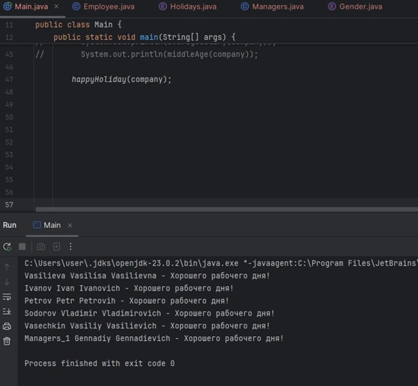
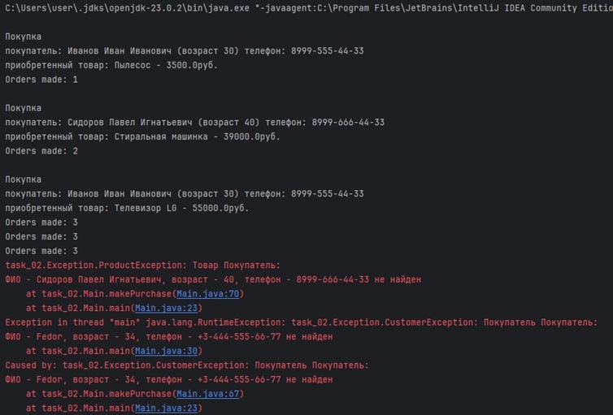

# Урок 3. Классы и объекты


## Домашняя работа

### Задание 1 ([решение](https://github.com/olgashenkel/GeekBrains-technological_specialization/tree/main/01.%20Java%20Core/Seminar_04/seminar_04/src/main/java/homework))

Задача: В класс покупателя добавить перечисление с гендерами, добавить в сотрудника свойство «пол» со значением созданного перечисления. Добавить геттеры, сеттеры

```
package homework;

public enum Gender {
    MALE, FEMALE
}
```
```
@Setter
@Getter
public class Employee {
    String lastName;
    String firstName;
    String fatherName;
    LocalDate birthDate;
    Gender gender;
    String function;
    String phone;
    int salary;


    public Employee(String lastName, String firstName, String fatherName,LocalDate birthDate, Gender gender, String function, String phone, int salary) {
        this.lastName = lastName;
        this.firstName = firstName;
        this.fatherName = fatherName;
        this.birthDate = birthDate;
        this.gender = gender;
        this.function = function;
        this.phone = phone;
        this.salary = salary;
    }
```


### Задание 2

Задача: Добавить в основную программу перечисление с праздниками (нет праздника, Новый Год, 8 марта, 23 февраля), написать метод, принимающий массив сотрудников, поздравляющий всех сотрудников с Новым Годом, женщин с 8 марта, а мужчин с 23 февраля, если сегодня соответствующий день

```
package homework;

import lombok.Getter;

import java.time.LocalDate;
import java.time.chrono.ChronoLocalDate;

@Getter
public enum Holidays {
    NEW_YEAR(LocalDate.of(LocalDate.now().getYear(), 12, 31)),
    MARCH_8(LocalDate.of(LocalDate.now().getYear(), 3, 8)),
    FEBRUARY_23(LocalDate.of(LocalDate.now().getYear(), 2, 23));


    private final LocalDate holiday;

    Holidays(LocalDate holiday) {
        this.holiday = holiday;
    }    
}
```
Метод вычисления праздничного дня и поздравление сотрудников
```
    
    public static void happyHoliday(Employee[] array) {
        LocalDate dateNow = LocalDate.now();
        for (int i = 0; i < array.length; i++) {
            if (LocalDate.now().isEqual(Holidays.FEBRUARY_23.getHoliday()) &&
                    array[i].gender.equals(Gender.MALE)) {
                System.out.println(array[i].lastName + " " + array[i].firstName
                        + " " + array[i].fatherName + " - С Днём защитника Отечества!");
            } else if (LocalDate.now().isEqual(Holidays.MARCH_8.getHoliday()) &&
                    array[i].gender.equals(Gender.FEMALE)) {
                System.out.println(array[i].lastName + " " + array[i].firstName + " " + array[i].fatherName +
                        " - С Международным Женским днём - 8 Марта!");
            } else if (LocalDate.now().isEqual(Holidays.NEW_YEAR.getHoliday())) {
                System.out.println(array[i].lastName + " " + array[i].firstName + " " + array[i].fatherName +
                        " - Счастливого Нового года!");
            } else {
                System.out.println(array[i].lastName + " " + array[i].firstName + " " + array[i].fatherName +
                        " - Хорошего рабочего дня!");
            }

        }
    }
```




---
## Задачи с семинара

### Задание 1 ([решение](https://github.com/olgashenkel/GeekBrains-technological_specialization/tree/main/01.%20Java%20Core/Seminar_04/seminar_04/src/main/java/task_01))

Задача: Проверка логина и пароля
1. Создать статический метод который принимает на вход три параметра: login, password и confirmPassword.
2. Длина login должна быть меньше 20 символов. Если login не соответствует этим требованиям, необходимо выбросить WrongLoginException.
3. Длина password должна быть меньше 20 символов. Также password и confirmPassword должны быть равны. Если password не соответствует этим требованиям, необходимо выбросить WrongPasswordException.

```
package task_01;

public class Login_Password {

    public static boolean dataVerification(String login, String password, String confirmPassword){
        try {
            if (login.length() >= 20){
                throw new WrongLoginException(login.length());
            } else if (password.length() < 20) {
                throw new WrongPasswordException(password.length());
            } else if (!password.equals(confirmPassword)) {
                System.out.println("\nПароли не совпадают!");
                return false;
            }
            return true;
        } catch (WrongLoginException | WrongPasswordException e) {
            e.printStackTrace();
            return false;
        }
    }
}
```

4. WrongPasswordException и WrongLoginException - пользовательские классы исключения с двумя конструкторами – один по умолчанию, второй принимает сообщение исключения и передает его в конструктор класса Exception.

```
package task_01;

public class WrongPasswordException extends RuntimeException{
    private int passwordLength;

    public WrongPasswordException(int passwordLength) {
        super();
        this.passwordLength = passwordLength;
    }

    @Override
    public String getMessage() {
        return String.format("Длина пароля должна составлять не менее 20 символов. " +
                "Длина введенного пароля - %d", passwordLength);
    }
}
```

```
package task_01;

public class WrongLoginException extends RuntimeException{
    private int loginLength;

    public WrongLoginException(int loginLength) {
        super();
        this.loginLength = loginLength;
    }

    @Override
    public String getMessage() {
        return String.format("Длина логина не должна превышать 20 символов. " +
                "Длина введенного логина - %d", loginLength);
    }
}
```

5. В основном классе программы необходимо по-разному обработать исключения.

6. Метод возвращает true, если значения верны или false в другом случае.

```
package task_01;

import java.util.Scanner;

public class Main {
    public static void main(String[] args) {
        Scanner scanner = new Scanner(System.in);

        // создание массива данных с вводом данных от пользователя
        String[] login_password = new String[3];
        System.out.print("Введите логин (не более 20 символов): ");
        login_password[0] = scanner.nextLine();
        System.out.print("Введите пароль (не менее 20 символов): ");
        login_password[1] = scanner.nextLine();
        System.out.print("Повторите пароль: ");
        login_password[2] = scanner.nextLine();

        System.out.println(Login_Password.dataVerification(login_password[0], login_password[1], login_password[2]));
    }
}
```


### Задание 2 ([решение](https://github.com/olgashenkel/GeekBrains-technological_specialization/tree/main/01.%20Java%20Core/Seminar_04/seminar_04/src/main/java/task_02))

Задача: Эмуляция интернет-магазина
1. Написать классы покупатель, товар и заказ:
- покупатель (ФИО, возраст, телефон);

```
import lombok.Getter;
import lombok.Setter;

@Getter
@Setter
public class Buyer {
    public String fullName;
    public int age;
    public String phone;

    public Buyer(String fullName, int age, String phone) {
        this.fullName = fullName;
        this.age = age;
        this.phone = phone;
    }

    @Override
    public String toString() {
        return "Покупатель:\n" +
                "ФИО - " + fullName +
                ", возраст - " + age +
                ", телефон - " + phone;
    }
}
```

- товар (название, цена);
```
import lombok.Getter;
import lombok.Setter;

@Getter
@Setter
public class Product {
    public String productName;
    public double price;


    public Product(String productName, double price) {
        this.productName = productName;
        this.price = price;
    }

    @Override
    public String toString() {
        return "Товар: " +
                "наименование товара - " + productName + '\'' +
                ", цена - " + price;
    }
}
```

- заказ (объект покупатель, объект товар, количество).
```
public class Order {
    Buyer buyer;
    Product product;
    int count;

    public Order(Buyer buyer, Product product, int count) {
        this.buyer = buyer;
        this.product = product;
        this.count = count;
    }

    @Override
    public String toString() {
        return "Заказ {" +
                "покупатель: " + buyer +
                ", товар: " + product +
                ", количество: " + count +
                '}';
    }
}
```
2. Создать массив покупателей, массив товаров и массив заказов:
- массив покупателей (2 элемента);

```
private final static Buyer[] buyers = {
        new Buyer("Иванов Иван Иванович", LocalDate.of(1995, 3, 3), "8999-555-44-33"),
        new Buyer("Сидоров Павел Игнатьевич", LocalDate.of(1985, 2, 1), "8999-666-44-33")
};
```       
- массив товаров (5 элементов);

```
private final static Product[] products = {
        new Product("Пылесос", 3500),
        new Product("Стиральная машинка", 39000),
        new Product("Телевизор LG", 55000),
        new Product("Чайник электрический", 2700),
        new Product("Холодильник", 49000)
};
```
      
- массив заказов (пустой на 5 элементов).

```
private static Order[] orders = new Order[5];
```
      
3. Создать статический метод “совершить покупку” со строковыми параметрами, соответствующими полям объекта заказа. Метод должен вернуть объект заказа.

```
    public static Order makePurchase(Buyer buyer, Product product, int quantity) {
        if (!isInArray(buyers, buyer)) {
            throw new CustomerException("Покупатель " + buyer + " не найден");
        }
        if (!isInArray(products, product)) {
            throw new ProductException("Товар " + buyer + " не найден");
        }
        if (quantity < 0 || quantity > 100) {
            throw new AmountException("Введено некорректное количество товара - " + quantity +
                    "\nУкажите количество товара в пределах от 1 до 100.");
        }
        System.out.println("\nПокупка\n" + "покупатель: " + buyer.fullName + " (возраст " + buyer.getAge() + ")"
                + " телефон: " + buyer.phone
                + "\nприобретенный товар: " + product.productName + " - " + product.price + "руб.");

        return new Order(buyer, product, quantity);
    }
```

4. Если в метод передан несуществующий покупатель, товар или отрицательное количество, метод должен выбросить соответствующее исключение:
- Если в метод передан несуществующий покупатель - метод должен выбросить исключение CustomerException   
```
   package task_02.Exception;

public class CustomerException extends RuntimeException {
    public CustomerException(String message) {
        super(message);
    }
}
```
- если передан несуществующий товар, метод должен выбросить исключение ProductException
```
package task_02.Exception;

public class ProductException extends RuntimeException {
    public ProductException(String message) {
        super(message);
    }
}
```
- если было передано отрицательное или слишком большое значение количества (например, 100), метод должен выбросить исключение AmountException
```
package task_02.Exception;

public class AmountException extends RuntimeException {
    public AmountException(String message) {
        super(message);
    }
}
```


5. Вызвать метод совершения покупки несколько раз таким образом, чтобы заполнить массив покупок возвращаемыми значениями. Обработать исключения:
    - Вызвать метод совершения покупки несколько раз таким образом, чтобы заполнить массив покупок возвращаемыми значениями. Обработать исключения следующим образом (в заданном порядке):
        - если был передан неверный товар - вывести в консоль сообщение об ошибке, не совершать данную покупку;
        - если было передано неверное количество - купить товар в количестве 1;
        - если был передан неверный пользователь - завершить работу приложения с исключением.


6. Вывести в консоль итоговое количество совершённых покупок после выполнения приложения.   
