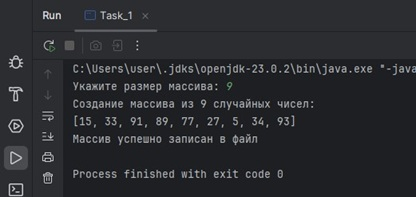

# Урок 5. Тонкости работы


## Домашняя работа

### Задание 1 ([решение](https://github.com/olgashenkel/GeekBrains-technological_specialization/blob/main/01.%20Java%20Core/Seminar_05/seminar_05/src/main/java/seminar_05/DZ_1.java))

Задача: Написать функцию, создающую резервную копию всех файлов в директории (без поддиректорий) во вновь созданную папку

```
    public static void main(String[] args) {
        String sourceDirectory = "."; // Путь к директории
        String backupDirectory = "./backup"; // Путь резервной копии
        backupDirectory(sourceDirectory, backupDirectory);
    }


    public static void backupDirectory(String sourceDirPath, String backupDirPath) {
        Path sourceDir = Paths.get(sourceDirPath);
        Path backupDir = Paths.get(backupDirPath);

        if (!Files.exists(sourceDir) || !Files.isDirectory(sourceDir)) {
            System.err.println("Ошибка: Источник не является директорией или не существует.");
            return;
        }

        try {
            if (!Files.exists(backupDir)) {
                Files.createDirectories(backupDir);
            }

            Files.list(sourceDir)
                    .filter(Files::isRegularFile)
                    .forEach(sourceFile -> {
                        Path backupFile = backupDir.resolve(sourceFile.getFileName());
                        try {
                            Files.copy(sourceFile, backupFile, StandardCopyOption.REPLACE_EXISTING);
                            System.out.println("Файл скопирован: " + sourceFile.getFileName());
                        } catch (IOException e) {
                            System.err.println("Ошибка при копировании файла " + sourceFile.getFileName() + ": " + e.getMessage());
                        }
                    });
            System.out.println("Резервная копия создана в: " + backupDir);

        } catch (IOException e) {
            System.err.println("Ошибка при создании директории: " + e.getMessage());
        }
    }
```


### Задание 2 ([решение](https://github.com/olgashenkel/GeekBrains-technological_specialization/blob/main/01.%20Java%20Core/Seminar_05/seminar_05/src/main/java/seminar_05/DZ_2.java))

Задача:  Предположить, что числа в исходном массиве из 9 элементов имеют диапазон [0, 3], и представляют собой, например, состояния ячеек поля для игры в крестикинолики, где 0 – это пустое поле, 1 – это поле с крестиком, 2 – это поле с ноликом, 3 – резервное значение. Такое предположение позволит хранить в одном числе
типа int всё поле 3х3. Записать в файл 9 значений так, чтобы они заняли три
байта

```
public static void main(String[] args) throws IOException {

        int[] ar2 = {3, 1, 0, 2, 1, 3, 2, 3, 0};

        FileOutputStream fos = new FileOutputStream("src/main/java/seminar_05/board.txt");
        for (int b = 0; b < 3; b++) { // write to 3 bytes
            byte wr = 0;
            for (int v = 0; v < 3; v++) { // write by 3 values in each
                wr += (byte) (ar2[3 * b + v] << (v * 2));
            }
            fos.write(wr);
        }
        fos.flush();
        fos.close();
    }
```


### Задание 3 ([решение](https://github.com/olgashenkel/GeekBrains-technological_specialization/blob/main/01.%20Java%20Core/Seminar_05/seminar_05/src/main/java/seminar_05/DZ_3.java))

Задача: Прочитать числа из файла, полученного в результате выполнения задания 2

```
    public static void main(String[] args) throws IOException {

        int[] ar20 = new int[9];

        FileInputStream fis = new FileInputStream("src/main/java/seminar_05/board.txt");
        int b;
        int i = 0;
        while ((b = fis.read()) != -1) {
            for (int v = 0; v < 3; ++v) {
                ar20[i++] = b >> (v * 2) & 0x3;
            }
        }
        fis.close();
        System.out.println(Arrays.toString(ar20));
    }
```


---
## Задачи с семинара

### Задание 1 ([решение](https://github.com/olgashenkel/GeekBrains-technological_specialization/blob/main/01.%20Java%20Core/Seminar_05/seminar_05/src/main/java/seminar_05/Task_1.java))

Задача: Создать массив из 9 цифр и записать его в файл, используя поток вывода.

```
    // Метод записи (дозаписи) массива в файл:
    public static void writesArrayToFile(int[] arrays) {
        try (FileWriter writeArray = new FileWriter("src/main/resources/array.txt", true)) {
            writeArray.append("[");
            for (int i = 0; i < arrays.length; i++) {
                if (i == (arrays.length - 1)) {
                    writeArray.write(String.valueOf(arrays[i]));  // Явное преобразование числа в строку и запись в файл
                } else {
                    writeArray.write(arrays[i] + ", ");// Записываем значения массива в файл
                }
            }
            writeArray.append("]");
            writeArray.append("\n");     // Переход в файле на новую строку

            System.out.println();
            System.out.println("Массив успешно записан в файл"); // Сообщение пользователю
        } catch (IOException ex) {
            System.err.println("Ошибка при записи в файл: " + ex.getMessage());
        }
    }
```



### Задание 1* ([решение](https://github.com/olgashenkel/GeekBrains-technological_specialization/blob/main/01.%20Java%20Core/Seminar_05/seminar_05/src/main/java/seminar_05/Task_1.java))

Задача: Создать массив из 9 цифр и записать его в файл, используя поток вывода.

```
    // *Метод записи (дозаписи) массива в файл:
    public static void writesArrayToFile2(int[] arrays) {
        try (FileWriter writeArray = new FileWriter("src/main/resources/array_2.txt", true)) {
            for (int i = 0; i < arrays.length; i++) {
                if (i == (arrays.length - 1)) {
                    writeArray.write(String.valueOf(arrays[i]));// Записываем значения массива в файл
                    writeArray.write("\n");     // Переход в файле на новую строку
                } else {
                    writeArray.write(String.valueOf(arrays[i]));// Записываем значения массива в файл
                    writeArray.write(String.valueOf(0));
                }
            }
            System.out.println("Массив успешно записан в файл"); // Сообщение пользователю
        } catch (IOException ex) {
            System.err.println("Ошибка при записи в файл: " + ex.getMessage());
        }
    }
```


### Задание 2 ([решение](https://github.com/olgashenkel/GeekBrains-technological_specialization/blob/main/01.%20Java%20Core/Seminar_05/seminar_05/src/main/java/seminar_05/Task_2.java))

Задача: Создать массив целых чисел и заполнить его информацией из файла, записанного в предыдущем задании.


```
    public static void main(String[] args) throws IOException {

        String filePath = "src/main/resources/array.txt";
        try {
            String fileContent = new String(Files.readAllBytes(Paths.get(filePath)));
            int[] numbers = readFileArray(fileContent);

            if (numbers != null) {
                System.out.println(Arrays.toString(numbers));
            }

        } catch (IOException e) {
            System.err.println("Ошибка при чтении файла: " + e.getMessage());
        }

    }


    public static int[] readFileArray(String input) throws IOException {
        String cleanedInput = input.trim();
        String numbersString = cleanedInput.substring(1, cleanedInput.length() - 1);
        String[] numberStrings = numbersString.split(",");

        List<Integer> numberList = new ArrayList<>();
        for (String numStr : numberStrings) {
            try {
                numberList.add(Integer.parseInt(numStr.trim()));
            } catch (NumberFormatException e) {
                System.err.println("Ошибка при преобразовании строки в число. Пропускаю.");
            }
        }
        return numberList.stream().mapToInt(Integer::intValue).toArray();
    }
```


### Задание 3 ([решение](https://github.com/olgashenkel/GeekBrains-technological_specialization/blob/main/01.%20Java%20Core/Seminar_05/seminar_05/src/main/java/seminar_05/Task_3.java))

Задача: Написать программу заменяющую указанный символ в текстовом файле на пробел, сохраняющую получившийся текст в новый файл.


```
public static void main(String[] args) {
        Scanner scanner = new Scanner(System.in);
        String inputFile = "src/main/resources/text.txt"; // Имя входного файла
        String outputFile = "src/main/resources/new_text.txt"; // Имя выходного файла

        System.out.print("Введите символ, необходимый для замены: ");
        char character = scanner.next().charAt(0); // Заменяемый символ

        try (BufferedReader reader = new BufferedReader(new FileReader(inputFile, StandardCharsets.UTF_8));
             BufferedWriter writer = new BufferedWriter(new FileWriter(outputFile, StandardCharsets.UTF_8))) {

            int c;
            while ((c = reader.read()) != -1) {
                if ((char) c == character) {
                    writer.write(' ');
                } else {
                    writer.write(c);
                }
            }
            System.out.println("Файл успешно обработан. Результат сохранен в " + outputFile);

        } catch (IOException e) {
            System.err.println("Ошибка при обработке файла: " + e.getMessage());
        }
    }
```


### Задание 3* ([решение](https://github.com/olgashenkel/GeekBrains-technological_specialization/blob/main/01.%20Java%20Core/Seminar_05/seminar_05/src/main/java/seminar_05/Task_3.java))

Задача: Модифицировать алгоритм поиска замены символа так, чтобы программа осуществляла замену слова (последовательного набора символов) в исходном файле и записывала результат в новый файл.


```
    public static void main(String[] args) {
        Scanner scanner = new Scanner(System.in);

        String inputFile = "src/main/resources/text.txt"; // Имя входного файла
        String outputFile = "src/main/resources/new_text.txt"; // Имя выходного файла
        String outputFile_2 = "src/main/resources/new_text_word.txt"; // Имя выходного файла - 2

        System.out.println();
        System.out.print("Введите слово, необходимое для замены: ");
        String word = scanner.nextLine(); // Заменяемое слово
        System.out.print("На какое слово необходимо заменить: ");
        String new_word = scanner.nextLine();

        try (BufferedReader reader = new BufferedReader(new FileReader(inputFile));
             BufferedWriter writer = new BufferedWriter(new FileWriter(outputFile_2))) {

            String line;
            while ((line = reader.readLine()) != null) {
                    String modifiedLine = line.replace(word, new_word);
                    writer.write(modifiedLine);
                    writer.newLine();
            }
        } catch (IOException e) {
            throw new RuntimeException(e);
        }
    }
```


### Задание 4 ([решение](https://github.com/olgashenkel/GeekBrains-technological_specialization/blob/main/01.%20Java%20Core/Seminar_05/seminar_05/src/main/java/seminar_05/Task_4.java))

Задача:  Написать программу, читающую и выводящую в содержимое текущей папки.


```
    public static void main(String[] args) throws IOException {

        // Получаем текущую рабочую директорию
        Path currentDir = Paths.get(".");

        // Используем DirectoryStream для перечисления файлов и папок
        try (DirectoryStream<Path> stream = Files.newDirectoryStream(currentDir)) {
            System.out.println("Содержимое текущей папки:");
            for (Path file : stream) {
                // Выводим имя файла или папки
                System.out.println(file.getFileName());
            }
        } catch (IOException e) {
            System.err.println("Ошибка при чтении директории: " + e.getMessage());
        }
    }
```

