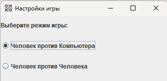
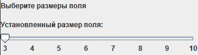
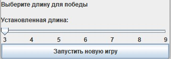
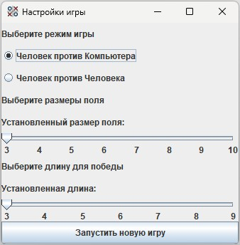
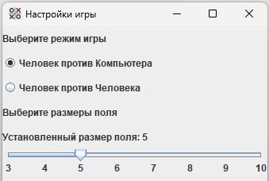
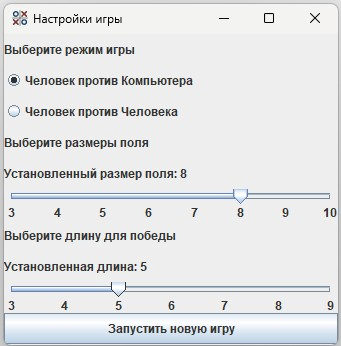
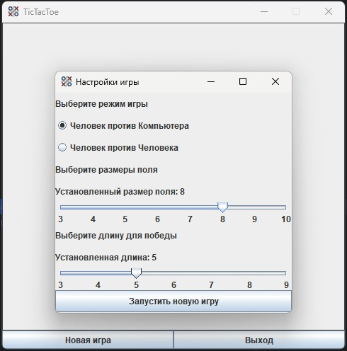

# Урок 1. Графические интерфейсы


## Домашняя работа


---
## Задачи с семинара


### Задание 1 ([решение](https://github.com/olgashenkel/GeekBrains-technological_specialization/tree/main/02.%20Java%20Development%20Kit/Seminar_01/seminar_01/src/main/java/seminar_01))

**Задача:** На лекции был написан фрейм, содержащий одну кнопку – начать игру и расположением самого окна настроек автоматически, относительно игрового окна.

Добавить на экран компоновщик-сетку с одним столбцом и добавить над
существующей кнопкой следующие компоненты в заданном порядке: 
1) JLabel с заголовком «Выберите режим игры», сгруппированные в ButtonGroup
переключаемые JRadioButton с указанием режимов «Человек против
компьютера» и «Человек против человека»
```    
    rbHumanVsAi = new JRadioButton(PLAYER_VS_AI, true);
    rbHumanVsHuman = new JRadioButton(PLAYER_VS_PLAYER);
    ButtonGroup gameModeGroup = new ButtonGroup();
    gameModeGroup.add(rbHumanVsAi);
    gameModeGroup.add(rbHumanVsHuman);

    ...

    setLayout(new GridLayout(0, 1));
    add(new JLabel(GAME_MODE));
    add(jrbHumanVsAi);
    add(jrbHumanVsHuman);

```


2) JLabel с заголовком «Выберите размеры поля», JLabel с заголовком «Установленный размер поля:», JSlider со значениями 3..10, 
```
    add(new JLabel(FIELD_SIZE));
    add(new JLabel(SELECTED_FIELD_SIZE));
    add(jslFieldSize);
```



3) JLabel с заголовком «Выберите длину для победы», JLabel с заголовком «Установленная длина:», JSlider со значениями 3..10
```
    add(new JLabel(LENGTH_VICTORY));
    add(new JLabel(SELECTED_LENGTH_VICTORY));
    add(jslVictorySize);
```



### Задание 1\* 
Задача: Сгруппировать объявление компонентов в два метода по смыслу – регулирование режима игры, 
```
    private void gameMode() {  // Метод "Регулирование режима игры"
    /* JLabel с заголовком «Выберите режим игры», сгруппированные в ButtonGroup
    переключаемые JRadioButton с указанием режимов «Человек против компьютера»
    и «Человек против человека»
    */
        jrbHumanVsAi = new JRadioButton(PLAYER_VS_AI, true);
        jrbHumanVsHuman = new JRadioButton(PLAYER_VS_PLAYER);
        ButtonGroup gameModeGroup = new ButtonGroup();
        gameModeGroup.add(jrbHumanVsAi);
        gameModeGroup.add(jrbHumanVsHuman);

        // Добавление значений в окно настроек
        add(new JLabel(GAME_MODE));
        add(jrbHumanVsAi);
        add(jrbHumanVsHuman);
    }

```
регулирование параметров поля. 
```
    private void fieldSize() {  // Метод "Регулирование параметров поля"
    /*JLabel с заголовком «Выберите размеры поля», JLabel с заголовком «Установленный
    размер поля:», JSlider со значениями 3..10
     */
        jslFieldSize = new JSlider(MIN_VALUE, MAX_VALUE, DEFAULT_VALUE);
        jslFieldSize.setPaintLabels(true);    // Отображение значений делений
//        jslFieldSize.setPaintTicks(true);     // Отображение делений
        jslFieldSize.setMajorTickSpacing(1); // Расстояние между делениями

        // Добавление значений в окно настроек
        add(new JLabel(FIELD_SIZE));
        add(new JLabel(SELECTED_FIELD_SIZE));
        add(jslFieldSize);
    }
```
Объявить компоненты так, чтобы они оказались доступны для обработчика кнопки.

```
        setLayout(new GridLayout(0, 1));
        gameMode();     // Метод "Регулирование режима игры"
        fieldSize();    // Метод "Регулирование параметров поля"
        victoryOptions();  // Метод "Регулирование параметров для победы"
        startButton(gameWindow);    // Метод "Обработчик кнопки"
```

### Задание 1\*\* 
Задача: 
1) Вынести неизменяемую часть изменяемых сообщений (подписи к слайдерам) в константы класса. 

```
    private static final String GAME_SETTINGS = "Настройки игры";

    private static final String GAME_MODE = "Выберите режим игры ";
    private static final String PLAYER_VS_AI = "Человек против Компьютера";
    private static final String PLAYER_VS_PLAYER = "Человек против Человека";

    private static final String FIELD_SIZE = "Выберите размеры поля";
    private static final String SELECTED_FIELD_SIZE = "Установленный размер поля: ";

    private static final String LENGTH_VICTORY = "Выберите длину для победы";
    private static final String SELECTED_LENGTH_VICTORY = "Установленная длина: ";

    private static final String START_NEW_GAME = "Запустить новую игру";

```

2) Вынести размеры, применяемые в слайдерах в константы класса (избавиться от магических чисел). 
```
    private static final int DEFAULT_VALUE = 3;
    private static final int MIN_VALUE = 3;
    private static final int MAX_VALUE = 10;
    private static final int STEP_FOR_INCREASING = 1;
```


3) Вынести обработчик кнопки в отдельный метод.

```
    private void startButton(GameWindow gameWindow) {   // Метод "Обработчик кнопки"
        startButton.addActionListener(new ActionListener() {
            @Override
            public void actionPerformed(ActionEvent e) {
                int mode = jrbHumanVsAi.isSelected() ? Map.MODE_HUMAN_VS_AI : Map.MODE_HUMAN_VS_HUMAN;
                int size = jslFieldSize.getValue();
                gameWindow.startNewGame(mode, size);
                setVisible(false);
            }
        });
        add(startButton);
    }
```



### Задание 2 ([решение](https://github.com/olgashenkel/GeekBrains-technological_specialization/tree/main/02.%20Java%20Development%20Kit/Seminar_01/seminar_01/src/main/java/seminar_01))

Задача: Добавить компонентам интерактивности, а именно, при перемещении ползунка слайдера в соответствующих лейблах должны появляться текущие значения слайдеров. Для этого необходимо добавить к слайдеру слушателя изменений (как это было сделано для действия кнопки).
```
    JLabel labelFieldSize = new JLabel(SELECTED_FIELD_SIZE + MIN_VALUE);

    // Добавление слушателя изменений
    jslFieldSize.addChangeListener(new ChangeListener() {
        @Override
        public void stateChanged(ChangeEvent e) {
            // Получаем слайдер из источника события
            JSlider sourceSlider = (JSlider) e.getSource();
            // Получаем новое значение
            int newValue = sourceSlider.getValue();
            // Обновляем текст метки
            labelFieldSize.setText(SELECTED_FIELD_SIZE + newValue);
        }
    });

    // Добавление значений в окно настроек
    add(new JLabel(FIELD_SIZE));
    add(labelFieldSize);
    add(jslFieldSize);
```


```
    JLabel labelVictorySize = new JLabel(SELECTED_LENGTH_VICTORY + MIN_VALUE);

    // Добавление слушателя изменений
    jslVictorySize.addChangeListener(new ChangeListener() {
        @Override
        public void stateChanged(ChangeEvent e) {
            // Получаем слайдер из источника события
            JSlider sourceSlider = (JSlider) e.getSource();
            // Получаем новое значение
            int newValue = sourceSlider.getValue();
            // Обновляем текст метки
            labelVictorySize.setText(SELECTED_LENGTH_VICTORY + newValue);
        }
    });

    // Добавление значений в окно настроек
    add(new JLabel(LENGTH_VICTORY));
    add(labelVictorySize);
    add(jslVictorySize);
```


### Задание 2\*

Задача: Добавить автоматическое регулирование максимального значения у слайдера выигрышной длины при изменении значения слайдера размера поля.
```

```


### Задание 2\*\*

Задача: Добавить центрирование окна настроек относительно главного (родительского) окна. То есть, в центре родительского окна должен быть не левый верхний угол окна настроек (как это сделано сейчас), а также его центр.
```
    setLocationRelativeTo(gameWindow); 
```


### Задание 3 

Задача: 

```
    
```

### Задание 4**

Задача: 

```
    
```