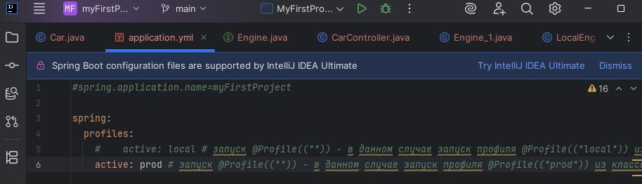

# Урок 2. Основы Spring. Spring Boot

### План урока

- Введение в Spring Framework
- Инверсия управления (IoC) и внедрение зависимостей (DI)
- Создание и конфигурация Spring Bean'ов
- Аннотации в Spring: @Component, @Autowired и другие
- Введение в Spring Boot и его преимущества
- Создание Spring Boot приложения
- Настройка Spring Boot приложения через application.properties/yml
- Работа с профилями в Spring Boot
- Понимание Spring Boot Autoconfiguration
- Создание простого веб-сервиса с помощью Spring Boot

## Практическая работа ([решение]())

Запуск клинт/серверного приложения:

Настройка файла application.yml:

