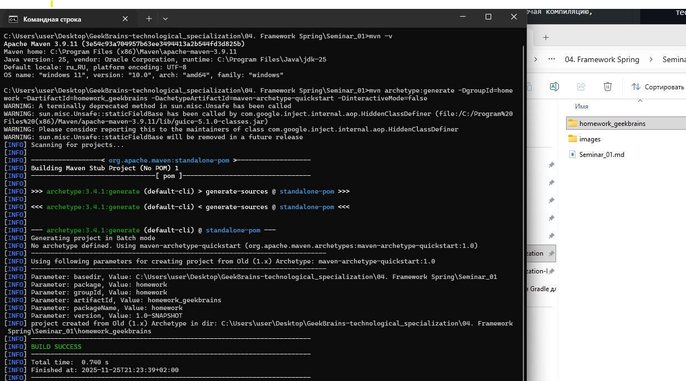

# Урок 1. Системы сборки Maven и Gradle для разработки Java приложений

### План урока

- Создание простого проекта с использованием Maven и Gradle.
- Настройка зависимостей проекта и управление версиями библиотек.
- Создание сборки проекта, включая компиляцию, тестирование и пакетирование.

## Домашняя работа ([решение]())
**Задание:** 

Создать проект с использованием Maven или Gradle, добавить в него несколько зависимостей и написать код, использующий эти зависимости.
Задание:
1. Создайте новый Maven или Gradle проект, следуя инструкциям из блока 1 или блока 2.



2. Добавьте зависимости 
   - org.apache.commons:commons-lang3:3.12.0 *(установлена более новая версия 3.18.0 на момент выполнения Д/З)*
   - com.google.code.gson:gson:2.8.6*(установлена более новая версия 2.8.9 на момент выполнения Д/З)*.

```
    <dependencies>
        <dependency>
            <groupId>junit</groupId>
            <artifactId>junit</artifactId>
            <version>3.8.1</version>
            <scope>test</scope>
        </dependency>

        <dependency>
            <groupId>org.apache.commons</groupId>
            <artifactId>commons-lang3</artifactId>
            <version>3.18.0</version>
        </dependency>
        <dependency>
            <groupId>com.google.code.gson</groupId>
            <artifactId>gson</artifactId>
            <version>2.8.9</version>
        </dependency>

        <dependency>
            <groupId>org.projectlombok</groupId>
            <artifactId>lombok</artifactId>
            <version>1.18.38</version>
            <scope>provided</scope>
        </dependency>
    </dependencies>
```

3. Создайте класс Person с полями firstName, lastName и age.
4. Используйте библиотеку commons-lang3 для генерации методов toString, equals и hashCode.
```
@Override
public String toString() {
    return new ToStringBuilder(this)
            .append("Имя: ", firstName)
            .append("Фамилия: ", lastName)
            .append("Возраст: ", age)
            .toString();
}

@Override
public boolean equals(Object o) {
    if (this == o) return true;
    if (o == null || getClass() != o.getClass()) return false;
    Person person = (Person) o;
    return new EqualsBuilder()
            .append(age, person.age)
            .append(firstName, person.firstName)
            .append(lastName, person.lastName)
            .isEquals();
}

@Override
public int hashCode() {
    return new HashCodeBuilder(17, 37)
            .append(firstName)
            .append(lastName)
            .append(age)
            .toHashCode();
}
```
5. Используйте библиотеку gson для сериализации и десериализации объектов класса Person в формат JSON.

```
// 1. Создание коллекции объектов
    List<Person> persons = new ArrayList<>();
    persons.add(new Person("Иван", "Иванов", 25));
    persons.add(new Person("Артем", "Артемов", 35));
    persons.add(new Person("Семен", "Семенов", 45));


// 2. Использование Gson для сериализации
    Gson gson = new GsonBuilder().setPrettyPrinting().create();
    String json = gson.toJson(persons);

    System.out.println("Сериализованный объект (JSON):");
    System.out.println(json);

// 3. Использование Gson для десериализации
    // 1) Определение типа коллекции
    Type listOfPersonType = new TypeToken<List<Person>>(){}.getType();
    // 2) Десериализация
    List<Person> read = gson.fromJson(json, listOfPersonType);
    // 3) Вывод результата
    System.out.println("Десериализованный объект (JSON): " + read);

```
