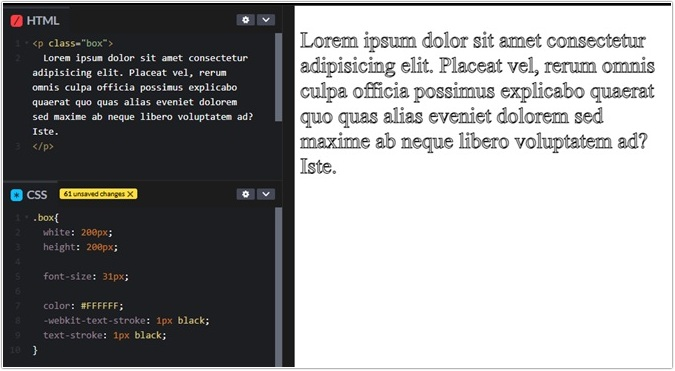
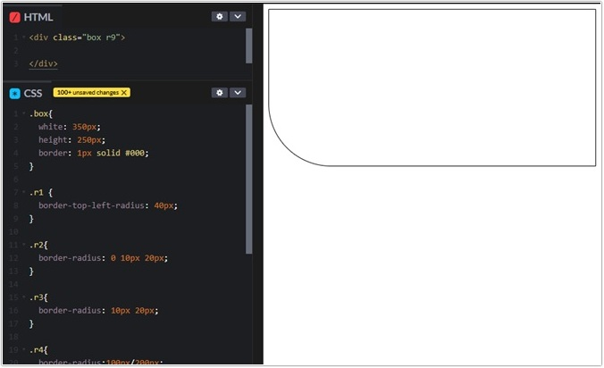
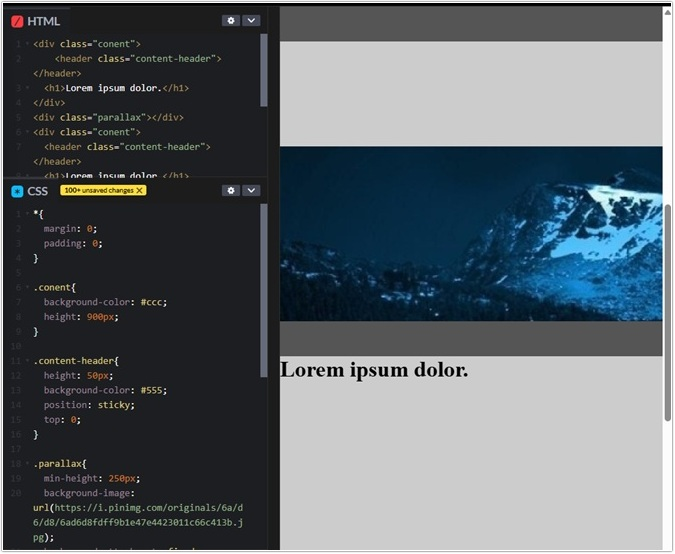
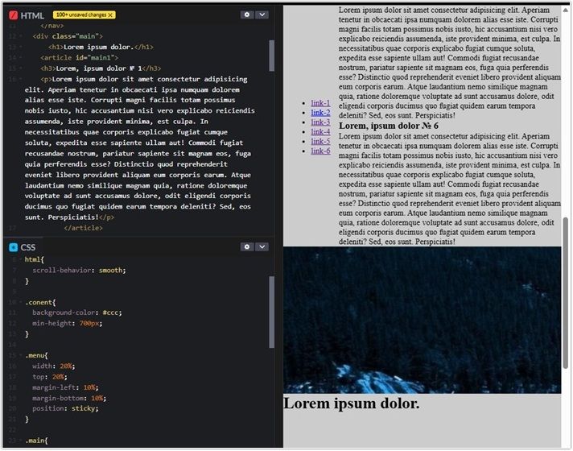

# Урок 3. Новые возможности CSS3

### План урока

- Подключение сторонних шрифтов
- Добавление теней к тексту
- CSS3 Рамки

## Практическая работа ([решение](https://github.com/olgashenkel/GeekBrains-technological_specialization/tree/main/05.%20Advanced%20HTML%20%2B%20CSS/Lesson_03/lesson_03))

**Результат выполнения работы:**

