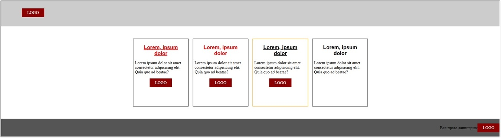

# Урок 4. Методология БЭМ

### План урока

- Введение
- Минусы стандартного именования классов
- Плюсы использования методологии

## Практическая работа ([решение](https://github.com/olgashenkel/GeekBrains-technological_specialization/tree/main/05.%20Advanced%20HTML%20%2B%20CSS/Lesson_04))

**Результат выполнения работы:**

Реализация методологии

Добавление разделительного символа "/" между меню навигации

