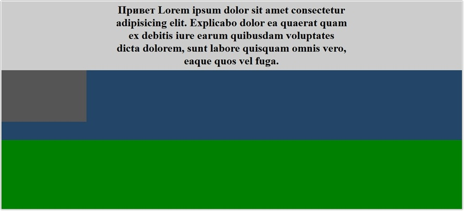
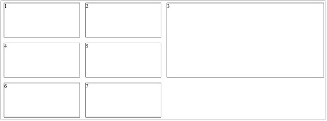

# Урок 5. Адаптивная вёрстка


### План урока

- Введение
- Новые единицы измерения vh, vw
- Адаптивные единицы для текста em, rem
- Новые адаптивные возможности flexbox
- Новые адаптивные возможности grid layout


## Практическая работа ([решение](https://github.com/olgashenkel/GeekBrains-technological_specialization/tree/main/05.%20Advanced%20HTML%20%2B%20CSS/Lesson_05/lesson_05))


### **Результат выполнения работы:**

***Реализация единиц измерения vh, vw***

*HTML*
```
<section class="top">
    <h1 class="title">Привет Lorem ipsum dolor sit amet consectetur adipisicing elit. Explicabo dolor ea quaerat
        quam ex debitis iure earum quibusdam voluptates dicta dolorem, sunt labore quisquam omnis vero, eaque quos
        vel fuga.</h1>
</section>

<section class="block">
    <header class="block__header">            
    </header>
</section>
<div class="item">
</div>
```

*CSS*
```
.top {
    display: flex;
    align-items: center;
    justify-content: center;
    background-color: #ccc;
    min-height: 100vh;
    box-sizing: border-box;
}

.title {
    width: 50vw;
    text-align: center;
}

.block {
    position: relative;
    min-height: 100vh;
    background-color: #234567;

    &__header {
        position: sticky;
        height: 150px;
        width: 250px;
        background-color: #555;
        top: 100px;
        left: 0;
    }
}

.item{
    background-color: green;
    min-height: 100vh;
}
```



***Адаптивные единицы для текста em, rem***

*HTML*
```
<div class="block">
    <h1 class="block__title">Lorem, ipsum dolor.</h2>
        <h2 class="block__heading">Lorem ipsum dolor sit.</h2>
        <h3 class="block__subtitle">Lorem ipsum dolor sit amet.</h3>
        <p class="block__text">Lorem ipsum dolor sit amet consectetur adipisicing elit. Corporis eos quaerat
            dignissimos
            quo ipsam soluta fugit amet, id tempora illo dolores nemo voluptatibus in provident expedita culpa
            architecto necessitatibus perferendis.</p>
</div>

<div class="item">
    <h1 class="item__title">Lorem, ipsum dolor.</h2>
        <h2 class="item__heading">Lorem ipsum dolor sit.</h2>
        <p class="item__text">Lorem ipsum dolor sit amet consectetur adipisicing elit. Corporis eos quaerat dignissimos
            quo ipsam soluta fugit amet, id tempora illo dolores nemo voluptatibus in provident expedita culpa
            architecto necessitatibus perferendis.</p>
</div> 
```

*CSS*
```
// !!! 1-ый способ выставления адаптивного размера шрифтов
// .block {
//     font-size: 20px; // 1rem == 20px

//     &__title {
//         // font-size: 2.8rem;
//         font-size: 32px;
//     }

//     &__heading {
//         // font-size: 1.6rem;
//         font-size: 24px;
//     }

//     &__text {
//         font-size: 16px;
//     }
// }

// @media (max-width: 768px) {
//     .block {      
//         &__title {
//             font-size: 28px;
//         }

//         &__heading {
//             font-size: 12px;
//         }

//         &__text {
//             font-size: 10px;
//         }
//     }
// }

// @media (max-width: 525px) {
//     .block {

//         &__title {
//             // font-size: 2.8rem;
//             font-size: 20px;
//         }

//         &__heading {
//             // font-size: 1.6rem;
//             font-size: 10px;
//         }

//         &__text {
//             font-size: 5px;
//         }
//     }
// }


// !!! 2-ой способ выставления адаптивного размера шрифтов

// html {
//     font-size: 16px; // 16px == 1rem
// }

// .block {
//     &__title {
//         // font-size: 32px;
//         font-size: 2rem; // 32px / 16px = 2rem
//         margin-bottom: 5rem;
//     }

//     &__heading {
//         // font-size: 18px;
//         font-size: 1.5rem; // 18px / 16px = 1.5rem
//     }

//     &__subtitle {
//         font-size: 1.2rem;
//     }

//     &__text {
//         // font-size: 12px;
//         font-size: 0.75rem; // 12px / 16px = 0.75rem
//     }
// }

// @media (max-width: 768px) {
//     html {
//         font-size: 14px; // 14px == 1rem
//     }
// }

// @media (max-width: 525px) {
//     html {
//         font-size: 12px; // 12px == 1rem
//     }
// }
```


***Новые адаптивные возможности flexbox***

*HTML*
```
<div class="content">
    <div class="item item_1">1</div>
    <div class="item item_2">2</div>
    <div class="item item_3">3</div>        
</div>
```
*CSS*
```
.content{
    display: flex;
    // flex-wrap: wrap;
}

.item{
    // flex-grow: 1; // равные доли (обязательно сопровождать с "display: flex;"!!! иначе "flex-grow" не сработает
    flex-shrink: 1; // коэф-т сжатия
    // flex-basis: 100px;
    width: 250px;
    height: 100px;
    border: 1px solid #000;
}

.item_2{
    flex-shrink: 2;
}
```

***Новые адаптивные возможности grid layout***

*HTML*
```
<div class="content">
    <div class="item item_1">1</div>
    <div class="item item_2">2</div>
    <div class="item item_3">3</div>
    <div class="item item_4">4</div>
    <div class="item item_5">5</div>
    <div class="item item_6">6</div>
    <div class="item item_7">7</div>
</div>
```

*CSS*
```
.content {
    display: grid;
    // grid-template-columns: repeat(7, 1fr); // при точных (фиксированных) значениях содержимое контента может выходить за рамки экрана или отображаться некорректно 

    grid-template-columns: repeat(auto-fit, minmax(200px, 1fr)); // при точных (фиксированных) значениях содержимое контента может выходить за рамки экрана или отображаться некорректно 
    justify-content: center;
    gap: 16px;
    // max-width: 1000px;
    // margin: auto;
    padding-left: calc(50% - 500px);
    padding-right: calc(50% - 500px);

    grid-auto-flow: dense;
}

.item {
    border: 1px solid #000;
    min-height: 100px;

    // Объединение колонок
    &_3 {
        grid-column: span 2;
        grid-row: span 2;
    }
}

@media (max-width: 768px) {
    // .content {
    //     grid-template-columns: repeat(4, 1fr);
    // }
}
```


