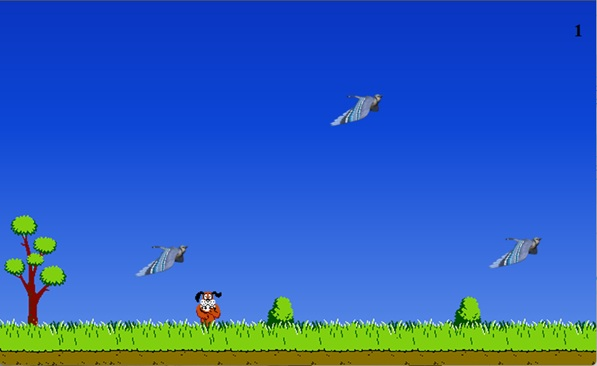

# Урок 6. Продвинутая работа с анимацией, создаем игру на HTML/CSS


### План урока

- Введение
- Счетчик кликов, на чистом html/css
- Добавляем внешний вид проекта
- Добавление Анимации
- Выводы


## Практическая работа ([решение](https://github.com/olgashenkel/GeekBrains-technological_specialization/tree/main/05.%20Advanced%20HTML%20%2B%20CSS/Lesson_06))


### **Результат выполнения работы:**

***Создание анимированной игры***

*HTML*
```
<div class="duck duck_1">
    <input id="duck1" class="duck-check" type="checkbox">
    <label for="duck1">
    </label>
</div>

<div class="duck duck_2">
    <input id="duck2" class="duck-check" type="checkbox">
    <label for="duck2">
    </label>
</div>

<div class="duck duck_3">
    <input id="duck3" class="duck-check" type="checkbox">
    <label for="duck3">
    </label>
</div>


<div class="duck duck_4">
    <input id="duck4" class="duck-check" type="checkbox">
    <label for="duck4">
    </label>
</div>


    <h1 class="counter-info"></h1>
```

*CSS*
```
// html {
//     /* Определение счетчика в CSS для всего HTML*/

//     /* Свойство counter-reset в CSS используется для создания, сброса или инициализации счетчиков, позволяя автоматически нумеровать элементы (например, заголовки, списки, главы) через content и ::before/::after. Оно задает имя счетчика и начальное целое число (по умолчанию 0), поддерживая обратный отсчет и создание нескольких счетчиков одновременно.*/
//     counter-reset: count;
// }

$widthDuck: 105px;
$countDuck: 4;

/*@keyframes в CSS — это правило (директива), определяющее ключевые кадры анимации, которые задают промежуточные состояния элемента (стили: цвет, положение, размер, прозрачность) в конкретные моменты времени. Оно позволяет создавать сложные, пошаговые анимации, переходя от одного набора стилей к другому, а браузер автоматически рассчитывает плавные переходы между кадрами. */


@for $i from 1 through $countDuck {

    @keyframes duck-fly-#{$i} {
        0% {
            left: -$widthDuck;
            top: random(70)+vh;
        }

        25% {
            right: random(25)+vw;
            top: random(70)+vh;
        }

        50% {
            left: random(50)+vw;
            top: random(70)+vh;
        }

        75% {
            right: random(75)+vw;
            top: random(70)+vh;
        }

        100% {
            left: 100vw;
            top: random(90)+vh;
        }
    }
}

.body {
    position: relative;
    counter-reset: count;
    height: 100vh;
    margin: 0;
    background-image: url(img/duckhunt-laughitup.png);
    background-size: cover;
    background-position: center;
    background-repeat: no-repeat;
    overflow: hidden;
}

.counter-info {
    position: absolute;
    top: 14px;
    right: 24px;

    &::before {
        content: counter(count);
    }
}

.duck {
    position: absolute;

    &-check {

        /* !!! Для скрытия элемента иногда лучше использовать свойство "position: absolute" и параметр вынесения элемента далеко за пределы экрана (например, left: -999999999px;), т.к. свойство "display: none" в некоторых браузерах может не сработать! */
        position: absolute;

        visibility: hidden;
        /*visibility: hidden в CSS — это свойство, которое делает HTML-элемент невидимым, но сохраняет его место в макете. Элемент исчезает, но продолжает занимать свою геометрическую область, влияя на расположение соседних элементов. Он не виден, но существует в DOM.*/

        left: -9999px;

        &:checked {
            counter-increment: count; // Подсчет количества кликов на птицах

            &~label {
                display: none; // После клика по птице ее изображение (картинка) перестает отображаться
            }
        }
    }

    &_img {
        width: $widthDuck;
    }


    @for $i from 1 through $countDuck {
        &_#{$i} {
            animation: duck-fly-#{$i} 7s ease-in #{$i}s both;
        }
    }
}
```



