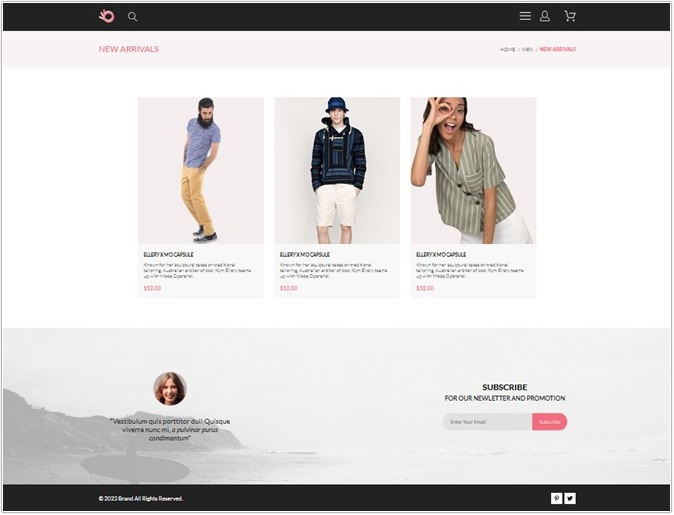
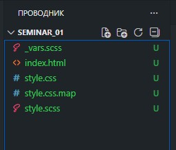
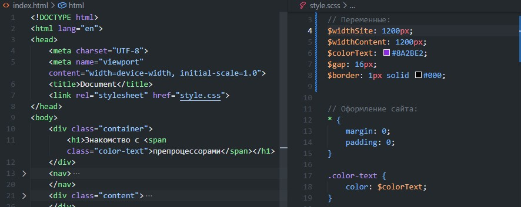
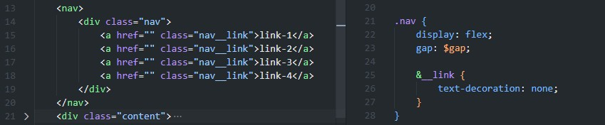
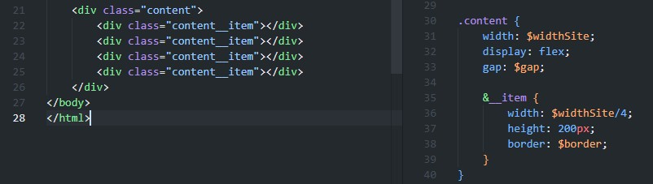
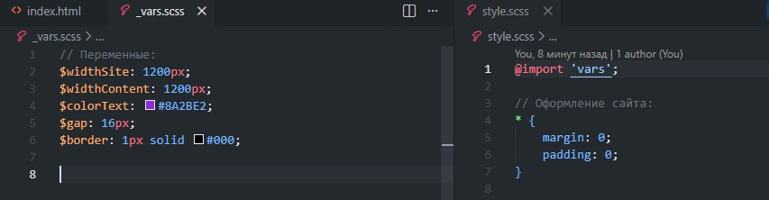
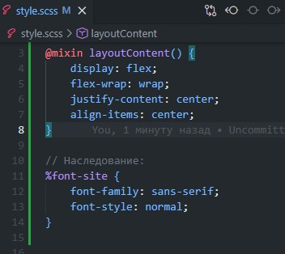
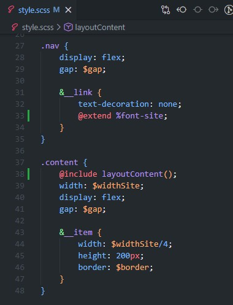
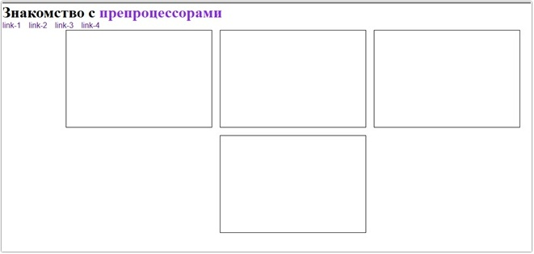

# Урок 1. Препроцессоры

## План урока

- Выполнение практических заданий в соответствии с [презентацией](https://gbcdn.mrgcdn.ru/uploads/asset/5034716/attachment/3dfa727a80be76b2cab74f219f985a89.pdf) к уроку


## Домашняя работа ([решение]())
**Задание:** 
1. В предыдущем курсе вам удалось реализовать [главную страницу интернет-магазина](https://www.figma.com/design/mnLY69cYE5cqWM5w6n5hXx/Seo---Digital-Marketing-Landing-Page?node-id=190-1194&p=f&t=narmaaP6rvxVdLC9-0). Вам необходимо открыть данный проект
2. Устанавливаем 3 расширения (Если вы этого не сделали на семинаре)    
a. Live Sass Compiler   
b. Sass   
c. Live Server
3. Перевести все стили из css в SCSS
4. Приступаем к созданию [страницы каталога](https://www.figma.com/file/TQaPa1gzsX6Qb4Gqj4fve7/Shop-(Copy)?node-id=68%3A2&t=IEptoEJXyB6cOyek-0)
5. Не забываем, что у вас уже готова шапка сайта и подвал страницы, плюс у вас уже есть блок из 3х товаров, осталось добавить изображение и под ним описание
6. Адаптив создавать не нужно, только десктопную версию

**Результат выполнения домашней работы:**




## Практическая работа с семинара ([решение](https://github.com/olgashenkel/GeekBrains-technological_specialization/tree/main/05.%20Advanced%20HTML%20%2B%20CSS/Seminar_01/seminar_01)):

**Настройка окружения**

Перед тем как начать работу необходимо настроить
редактор кода. Мы будем использовать [https://code.visualstudio.com/](https://code.visualstudio.com/) и
браузер [https://www.google.ru/chrome/](https://www.google.ru/chrome/)

### Задание 1 (тайминг 25 минут)
Текст задания
1. Устанавливаем 3 расширения   
    a) Live Sass Compiler   
    b) Sass   
    c) Live Server   
2. Создаём новый файл `index.html`, `style.scss`
3. Запускаем компиляцию препроцессора
4. Добавляем произвольный код в `style.scss` проверяем как
работает компиляция




### Задание 2 (тайминг 20 минут)
Текст задания
1. В html добавить блок `<div class="container"></div>`
2. Создайте переменную ширины сайта и присвоить ей значение 1200px
3. Создайте переменную значения цвета текста сайта, которая будет равна #8A2BE2
4. Внутри блока container добавить заголовок “Знакомство с препроцессорами” слово
препроцессорами необходимо выделить цветом из переменной пункт 3
5. Создайте комментарий в вашем коде scss, добавьте в него произвольный текст



### Задание 3 (тайминг 10 минут)
Текст задания
1. Создайте меню сайта
```
<nav>
 <div class="nav">
 <a href="" class="nav__link">link-1</a>
 <a href="" class="nav__link">link-2</a>
 <a href="" class="nav__link">link-3</a>
 <a href="" class="nav__link">link-4</a>
 </div>
</nav>
```

2. Используя вложенность препроцессоров, необходимо переписать код css в препроцессорный
```
.nav {
 display: flex;
 gap: 16px;
}
.nav__link {
 text-decoration: none;
}
```

3. Добавить переменную `gap`, и заменить ее у селектора `.nav`




### Задание 4 (тайминг 15 минут)

Текст задания
1. Дан код html
```
<div class="content">
 <div class="content__item"></div>
 <div class="content__item"></div>
 <div class="content__item"></div>
 <div class="content__item"></div>
</div>
```
2. Для блока content добавить стили `display: flex;`
3. Создать вложенность с использованием препроцессоров
4. Для блока `content__item` добавить значение ширины, равное ¼ от переменной ширины container
5. Для блока content добавить gap равный переменной из задания 3
6. Создать новую переменную, равную: 1px solid #000;
7. Добавить стили для `content__item` используя переменную из пункта 5
```
 height: 200px;
 border: 1px solid #000;
```




### Задание 5 (тайминг 5 минут)
Текст задания
1. Создать фрагмент vars
2. Добавить в него все созданные переменные
3. Подключить данный фрагмент к основному файлу style.scss.



### Задание 6 (тайминг 15 минут)
Текст задания

1. Создать примесь
```
 display: flex;
 flex-wrap: wrap;
 justify-content: center;
 align-items: center;
```
2. Добавить данную примесь к блоку `content`
3.  Создать наследование
```
 font-family: sans-serif;
 font-style: normal;
 ```
4. Добавить данное наследование для `nav__link`







**Результат выполнения практической работы:**


