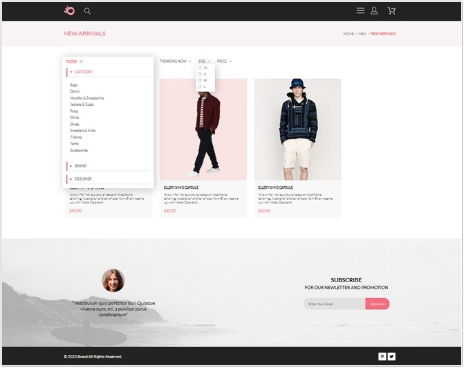
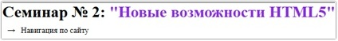
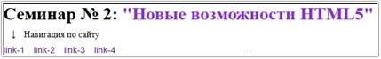
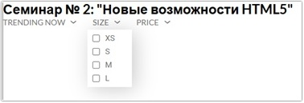
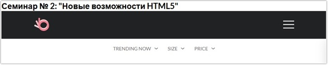
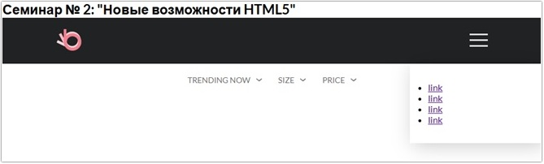

# Урок 2. Новые возможности HTML5

## План урока

- Выполнение практических заданий в соответствии с [презентацией](https://gbcdn.mrgcdn.ru/uploads/asset/5034722/attachment/fd2ebd7ab3a265c149b3b12e32952364.pdf) к уроку


## Домашняя работа ([решение](https://github.com/olgashenkel/GeekBrains-technological_specialization/tree/main/05.%20Advanced%20HTML%20%2B%20CSS/Seminar_02/homework))
**Задание:** 
1. Вам необходимо создать [страницу каталога](https://www.figma.com/design/TQaPa1gzsX6Qb4Gqj4fve7/Shop--Copy-?node-id=52-0&p=f&t=ICcI2bXoqW2CzOAx-0)
2. Обязательно использовать препроцессоры
3. Не забыть добавить выпадающие блоки сортировки
4. У вас уже есть созданные шапка и подвал сайта, данные элементы должны быть переиспользованы с главной страницы интернет-магазина
5. Адаптив создавать не нужно, только десктопную версию

**Результат выполнения домашней работы:**




## Практическая работа с семинара ([решение](https://github.com/olgashenkel/GeekBrains-technological_specialization/tree/main/05.%20Advanced%20HTML%20%2B%20CSS/Seminar_02/seminar_02)):


### Задание 1 (тайминг 20 минут)
Текст задания
1. Создать элемент details и добавить в него произвольный контент
2. Добавить элемент summary с произвольным текстом
```
<details class="details__menu"> 
    <summary>Навигация по сайту</summary>
        <nav>
        <div class="nav">
            <a href="" class="nav__link">link-1</a>
            <a href="" class="nav__link">link-2</a>
            <a href="" class="nav__link">link-3</a>
            <a href="" class="nav__link">link-4</a>
        </div>
    </nav>
</details>
```
3. Удалить стандартный треугольник у элемента details.
```
summary::marker {
  content: none;
}
```
4. Добавить стили для элемента summary
```
summary {
    display: flex;
    align-items: center;
    gap: 11px;
    padding: 10px 10px 10px;
    color: #c71818;
}
```
5. Заменить стандартный треугольник на стрелку вправо \2192
```
summary::before {
    content: '\2192';
    transition: transform 0.2s ease;
}
```
6. При открытии блока details заменить на стрелку вниз (данный код нужно найти в интернете)
```
details[open] summary::before {
    transform: rotate(90deg);
}
```
**Результат выполнения задания:**






### Задание 2 (тайминг 30 минут)
Текст задания
1. Дана [страница каталога](https://www.figma.com/design/SbfOi2i4S1pIs0G6uOLPCx/shop--Copy-?node-id=52-0&p=f&t=tYwig5mo4WPtIQC7-0)
2. Необходимо реализовать блок sort (данный блок находится в слоях figma)
3. Создать 3 элемента details (TRENDING NOW, SIZE, PRICE)
4. При клике на элемент SIZE появляется выпадающая сортировка.

#### HTML
```
                                   
    <div class="sort">
        <details class="sort__details">
            <summary class="sort__summary"><span class="sort__heading">TRENDING NOW</span>
                <svg width="11" height="5" viewBox="0 0 11 5" fill="none" xmlns="http://www.w3.org/2000/svg">
                    <path
                        d="M5.00214 5.00214C4.83521 5.00247 4.67343 4.94433 4.54488 4.83782L0.258102 1.2655C0.112196 1.14422 0.0204417 0.969958 0.00302325 0.781035C-0.0143952 0.592112 0.0439493 0.404007 0.165221 0.258101C0.286493 0.112196 0.460759 0.0204417 0.649682 0.00302327C0.838605 -0.0143952 1.02671 0.043949 1.17262 0.165221L5.00214 3.36602L8.83167 0.279536C8.90475 0.220188 8.98884 0.175869 9.0791 0.149125C9.16937 0.122382 9.26403 0.113741 9.35764 0.1237C9.45126 0.133659 9.54198 0.162021 9.6246 0.207156C9.70722 0.252292 9.7801 0.313311 9.83906 0.386705C9.90449 0.460167 9.95405 0.546351 9.98462 0.639855C10.0152 0.733359 10.0261 0.83217 10.0167 0.930097C10.0073 1.02802 9.97784 1.12296 9.93005 1.20895C9.88227 1.29494 9.81723 1.37013 9.73904 1.42982L5.45225 4.88068C5.32002 4.97036 5.16154 5.01312 5.00214 5.00214Z"
                        fill="#6F6E6E" />
                </svg>
            </summary>
        </details>

        <details class="sort__details">
            <summary class="sort__summary"><span class="sort__heading">SIZE</span>
                <svg width="11" height="5" viewBox="0 0 11 5" fill="none" xmlns="http://www.w3.org/2000/svg">
                    <path
                        d="M5.00214 5.00214C4.83521 5.00247 4.67343 4.94433 4.54488 4.83782L0.258102 1.2655C0.112196 1.14422 0.0204417 0.969958 0.00302325 0.781035C-0.0143952 0.592112 0.0439493 0.404007 0.165221 0.258101C0.286493 0.112196 0.460759 0.0204417 0.649682 0.00302327C0.838605 -0.0143952 1.02671 0.043949 1.17262 0.165221L5.00214 3.36602L8.83167 0.279536C8.90475 0.220188 8.98884 0.175869 9.0791 0.149125C9.16937 0.122382 9.26403 0.113741 9.35764 0.1237C9.45126 0.133659 9.54198 0.162021 9.6246 0.207156C9.70722 0.252292 9.7801 0.313311 9.83906 0.386705C9.90449 0.460167 9.95405 0.546351 9.98462 0.639855C10.0152 0.733359 10.0261 0.83217 10.0167 0.930097C10.0073 1.02802 9.97784 1.12296 9.93005 1.20895C9.88227 1.29494 9.81723 1.37013 9.73904 1.42982L5.45225 4.88068C5.32002 4.97036 5.16154 5.01312 5.00214 5.00214Z"
                        fill="#6F6E6E" />
                </svg>
            </summary>

            <div class="sort__box">
                <div class="sort__check">
                    <input id="sort__check1" type="checkbox"><label for="#">
                        XS</label>
                </div>
                <div class="sort__check">
                    <input id="sort__check2" type="checkbox"><label for="#">
                        S</label>
                </div>
                <div class="sort__check">
                    <input id="sort__check3" type="checkbox"><label for="#">
                        M</label>
                </div>
                <div class="sort__check">
                    <input id="sort__check4" type="checkbox"><label for="#">
                        L</label>
                </div>
            </div>
        </details>

        <details class="sort__details">
            <summary class="sort__summary"><span class="sort__heading">PRICE</span>
                <svg width="11" height="5" viewBox="0 0 11 5" fill="none" xmlns="http://www.w3.org/2000/svg">
                    <path
                        d="M5.00214 5.00214C4.83521 5.00247 4.67343 4.94433 4.54488 4.83782L0.258102 1.2655C0.112196 1.14422 0.0204417 0.969958 0.00302325 0.781035C-0.0143952 0.592112 0.0439493 0.404007 0.165221 0.258101C0.286493 0.112196 0.460759 0.0204417 0.649682 0.00302327C0.838605 -0.0143952 1.02671 0.043949 1.17262 0.165221L5.00214 3.36602L8.83167 0.279536C8.90475 0.220188 8.98884 0.175869 9.0791 0.149125C9.16937 0.122382 9.26403 0.113741 9.35764 0.1237C9.45126 0.133659 9.54198 0.162021 9.6246 0.207156C9.70722 0.252292 9.7801 0.313311 9.83906 0.386705C9.90449 0.460167 9.95405 0.546351 9.98462 0.639855C10.0152 0.733359 10.0261 0.83217 10.0167 0.930097C10.0073 1.02802 9.97784 1.12296 9.93005 1.20895C9.88227 1.29494 9.81723 1.37013 9.73904 1.42982L5.45225 4.88068C5.32002 4.97036 5.16154 5.01312 5.00214 5.00214Z"
                        fill="#6F6E6E" />
                </svg>
            </summary>
        </details>
```
#### CSS
```
.sort {
    // position: absolute;    
    display: flex;
    gap: 28px;
    margin-top: 20px;    
    justify-content: center;

    &__details {
        position: relative;
    }

    &__heading {
        font: normal;
        font-weight: 400;
        font-size: 14px;
        color: #6F6E6E;
    }

    &__summary {
        display: flex;
        gap: 10px;
        align-items: center;
    }

    &__box {
        position: absolute;
        background: #FFFFFF;
        box-shadow: 6px 4px 35px rgba(0, 0, 0, 0.21);
        padding: 7px 30px 0px 9px;
        margin-left: -9px;        
        margin-top: 5px;
    }

    &__check {
        display: flex;
        gap: 9px;
        font-family: Roboto;
        font-weight: 400;
        font-size: 14px;
        color: #6F6E6E;
        padding-bottom: 7px;
    }

}
```


**Результат выполнения задания:**



### Задание 3 (тайминг 45 минут)
Текст задания
1. На главной [странице интернет магазина](https://www.figma.com/design/SbfOi2i4S1pIs0G6uOLPCx/shop--Copy-?node-id=0-1&p=f&t=rtrjVt2bQ9jO7VDV-0) есть бургер-меню
2. Без использования элемента details необходимо реализовать клик на изображение бургера-меню
3. При клике должен появляться блок menu-burger, при повторном клике на данное изображение, данный блок должен пропадать
4. Выпадающий блок должен плавно появляться из правой части сайта.

#### HTML
```
<header class="header">
    <div class="header__left">
    <a href="index.html"></a> 
    </div>        
    
    <div class="burger__menu header__right">
        
        <label for="burger"></label>
        <input id="burger" type="checkbox">
        <nav class="nav">
            <ul>
                <li><a href="">link</a></li>
                <li><a href="">link</a></li>
                <li><a href="">link</a></li>
                <li><a href="">link</a></li>
            </ul>
        </nav>
    </div>

</header>

```

#### CSS

```
.header {
    position: relative;
    background-color: $backBlock;
    padding-top: 20px;
    padding-bottom: 20px;
    display: flex;
    align-items: center;
    flex-wrap: wrap;
    justify-content: space-between;

    &__left {
        display: flex;
        align-items: center;
        margin-left: 10%;
    }

    &__right {
        display: flex;
        align-items: center;
        margin-right: 10%;
    }
}

#burger {
    position: absolute;
    left: -9999999px;
    visibility: hidden;

    &:checked~.nav {
        right: -$widthBurgerMenu;
    }
}

.nav {
    position: absolute;
    background: #FFFFFF;
    box-shadow: 6px 4px 35px 0px #00000036;
    width: 232px;
    padding: 32px;
    box-sizing: border-box;
    top: 81px;
    right: 0;
    transition: right .3s;
}
```

**Результат выполнения задания:**





