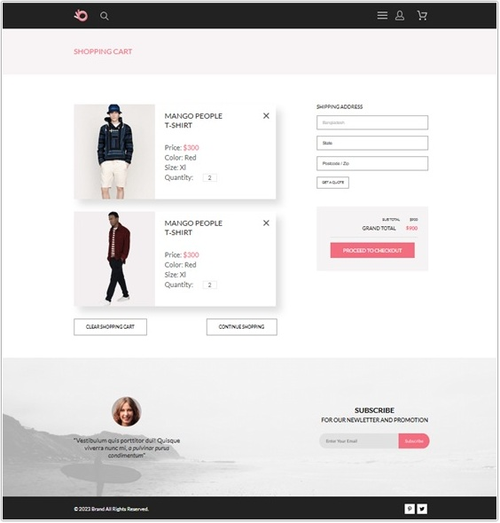
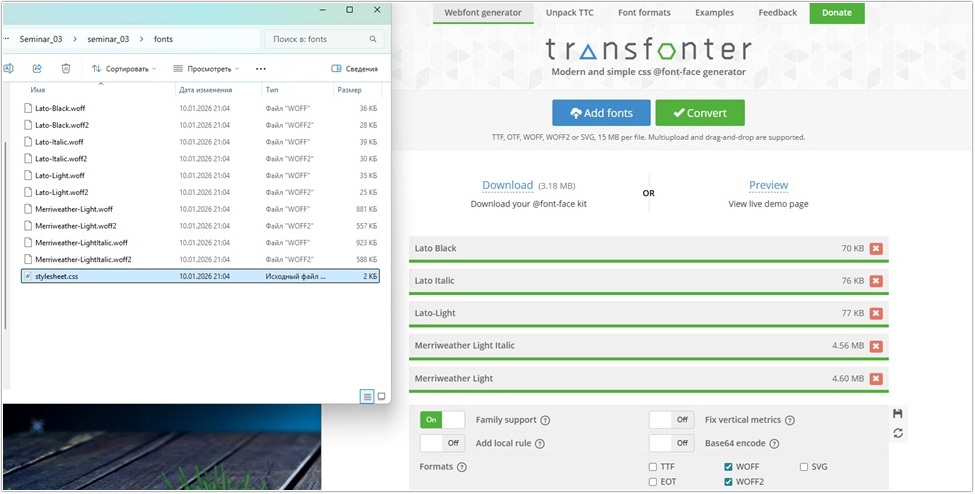
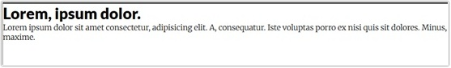
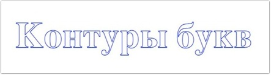
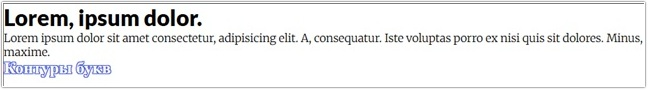
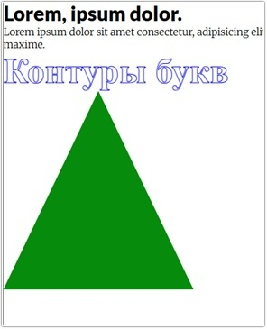
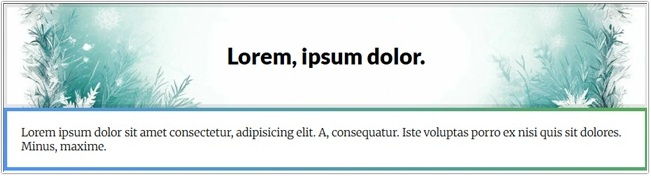
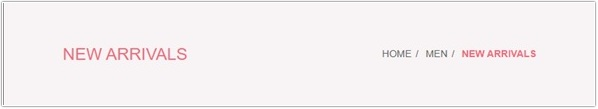

# Урок 3. Новые возможности CSS3

## План урока

- Выполнение практических заданий в соответствии с [презентацией](https://gbcdn.mrgcdn.ru/uploads/asset/5034734/attachment/20fd11ee067a1e6dab4892ca6a1cd1ba.pdf) к уроку


## Домашняя работа ([решение](https://github.com/olgashenkel/GeekBrains-technological_specialization/tree/main/05.%20Advanced%20HTML%20%2B%20CSS/Seminar_03/homework))
**Задание:** 
1. Создать страницу [корзины](https://www.figma.com/design/TQaPa1gzsX6Qb4Gqj4fve7/Shop--Copy-?node-id=73-140&p=f&t=I6LsZD2xsQ4W9PqZ-0)
2. Использовать препроцессоры
3. Добавить эффекты наведения, на все кнопки и ссылки на сайте
4. Добавить плавность перехода, при наведении на элементы
5. Адаптив создавать не нужно, только десктопную версию

**Результат выполнения домашней работы:**




## Практическая работа с семинара ([решение](https://github.com/olgashenkel/GeekBrains-technological_specialization/tree/main/05.%20Advanced%20HTML%20%2B%20CSS/Seminar_03/seminar_03)):


### Задание 1 (тайминг 30 минут)
Текст задания
1. Переходим на сайт https://fonts.google.com/
2. Выбираем любые 2 бесплатных шрифта или
https://fonts.google.com/specimen/Open+Sans и
https://fonts.google.com/specimen/Merriweather
3. Скачиваем данный шрифт себе
4. Создаем файл `index.html` и добавляем заголовок `h1` и параграф `p`, с произвольным текстом
 
#### HTML
```
<h1 class="title">Lorem, ipsum dolor.</h1>
<p class="paragraph">Lorem ipsum dolor sit amet consectetur, adipisicing elit. A, consequatur. Iste voluptas porro ex nisi quis sit dolores. Minus, maxime.</p>
```
5. С помощью генератора шрифтов подключаем один
шрифт для заголовка `h1` второй для параграфа `p`

#### CSS
```
.title {
    font-family: Lato;
}

.paragraph {
    font-family: Merriweather;
}
```

**Результат выполнения задания:**






### Задание 2 (тайминг 15 минут)
Текст задания
1. Создайте заголовок `h2` с произвольным текстом
2. Необходимо реализовать эффект рамки у текста как на скриншоте.



#### HTML
```
<h2 class="title_2">Контуры букв</h2>
```

#### CSS
```
.title_2 {
	color: #FFFFFF;
	text-shadow: 
		-0   -1px 0   #4456DD,
		 0   -1px 0   #4456DD,
		-0    1px 0   #4456DD,
		 0    1px 0   #4456DD,
		-1px -0   0   #4456DD,
		 1px -0   0   #4456DD,
		-1px  0   0   #4456DD,
		 1px  0   0   #4456DD,
		-1px -1px 0   #4456DD,
		 1px -1px 0   #4456DD,
		-1px  1px 0   #4456DD,
		 1px  1px 0   #4456DD,
		-1px -1px 0   #4456DD,
		 1px -1px 0   #4456DD,
		-1px  1px 0   #4456DD,
		 1px  1px 0   #4456DD;
}
```

#### CSS (решение с семинара)
```
.title_2 {
    color: transparent;
    font-size: 56px;
    -webkit-text-stroke: 1px blue;
}
```

**Результат выполнения задания:**




### Задание 3 (тайминг 15 минут)
Текст задания
1. С помощью свойства `border-radius` создать треугольник произвольных размеров

#### HTML
```
<div class="triangle"></div>
```

#### CSS
```
.triangle {
    width: 0px;
    height: 0px;
    border-style: solid;
    border-width: 0 151.5px 315px 151.5px;
    border-color: transparent transparent #068B0C transparent;
}
```

**Результат выполнения задания:**




### Задание 4 (тайминг 25 минут)
Текст задания
1. Найти произвольное изображение рамки в интернете
2. Для заголовка `h1` задать рамку изображение

#### HTML
```
<h1 class="title title_image">Lorem, ipsum dolor.</h1>
```

#### CSS
```
.title_image {
    padding: 50px 20px 50px;
    background: url(https://avatars.mds.yandex.net/get-shedevrum/13784947/img_1e3cc0f563af11efa7e472c6e9b961c5/orig) no-repeat center center;
    background-size: cover;
    border: 5px solid rgba(0, 0, 0, 0.1);
    text-align: center;
}
```
3. Для параграфа `p` задать градиентную рамку.

#### HTML
```
<p class="paragraph gradient_border">Lorem ipsum dolor sit amet consectetur, adipisicing elit. A, consequatur. Iste voluptas porro ex nisi quis sit dolores. Minus, maxime.</p>
```

#### CSS
```
.gradient_border {
    border: 5px solid transparent;
    border-image: linear-gradient(35deg, #5294f7, #59aa59) 1;
    padding: 20px;
    background-clip: padding-box;
}
```

**Результат выполнения задания:**




### Задание 5 (тайминг 25 минут)
Текст задания
1. В макете
https://www.figma.com/file/SbfOi2i4S1pIs0G6uOLPCx/shop-(Copy)?node-id=69%3A182&t=yqDGV1NUHY97IcQQ-0
2. Реализовать блок breadcrumbs ( HOME / MEN / NEW ARRIVALS )
3. Где / необходимо сделать с помощью псевдоэлемента
4. А стили для последнего блока ARRIVALS с помощью псевдокласса

#### HTML
```
<div class="breadcrumb center">
    <h2 class="breadcrumb__heading">NEW ARRIVALS</h2>
    <div class="breadcrumb__links">
        <a href="#" class="breadcrumb__link">HOME</a>
        <a href="#" class="breadcrumb__link">MEN</a>
        <a href="#" class="breadcrumb__link">NEW ARRIVALS</a>
    </div>
</div>
```

#### CSS
```
.center {
    padding-left: 10%;
    padding-right: 10%;
}

.breadcrumb {
    background: #F8F3F4;
    height: 148px;
    display: flex;
    justify-content: space-between;
    align-items: center;

    &__heading {
        font-style: normal;
        font-weight: 400;
        font-size: 24px;
        line-height: 29px;
        color: #F16D7F;
    }

    &__link {
        font-style: normal;
        font-weight: 300;
        font-size: 14px;
        line-height: 100%;
        color: #636363;
        text-decoration: none;

        &:hover {
            color: #F16D7F;
        }
    }

    &__link:not(:last-child)::after {
        content: "/";
        margin-left: 6px;
        margin-right: 6px;
        color: #636363;
    }

    &__link:last-of-type {
        font-style: normal;
        font-weight: 700;
        font-size: 14px;
        line-height: 100%;
        letter-spacing: 0%;
        color: #f16d7f;
    }
}
```

**Результат выполнения задания:**



