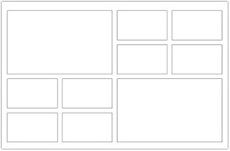
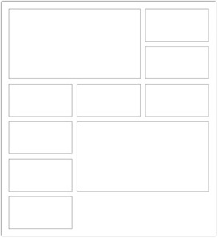
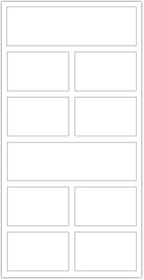
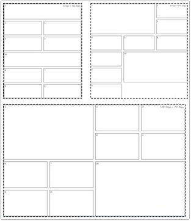

# Урок 5. Адаптивная вёрстка

## План урока

- Выполнение практических заданий в соответствии с [презентацией](https://gbcdn.mrgcdn.ru/uploads/asset/5034740/attachment/a36708d658b71a58204e44263f15ca07.pdf) к уроку


## Домашняя работа ([решение](https://github.com/olgashenkel/GeekBrains-technological_specialization/tree/main/05.%20Advanced%20HTML%20%2B%20CSS/Seminar_05/homework))
**Задание:** 
1. Создать планшетную версию для всех 5 страниц интернет-магазина
2. Проверить работу сайта на разрешении 768px
3. Проверить работу сайта на разрешении 1024 px

**Результат выполнения домашней работы (планшетная версия 5 страниц интернет-магазина):**


*[ссылка на папку со скриншотами]() созданных страниц с расширениями для Desktop, планшета и мобильного телефона*


## Практическая работа с семинара ([решение](https://github.com/olgashenkel/GeekBrains-technological_specialization/tree/main/05.%20Advanced%20HTML%20%2B%20CSS/Seminar_05/seminar_05)):


### Задание 1 (тайминг 25 минут)
Текст задания

1. Создать блок `content`
2. Добавить в блок 12 элементов `item`
3. можно использовать `flex/ grid` как вам будет удобней
4. Добавить сетку 4 на 3 элемента на десктопе
5. На планшете должно отображаться 3 на 4 элемента
занимая всю высоту экрана
6. На мобильном устройстве с разрешением `767` и ниже
должно отображаться 2 на 6 блоков, 3 строчки на всю
высоту экрана, остальные 3 строчки на втором экране
7. Отступ между блоками `16px`
8. Отступов слева и справа от блока быть не должно


*HTML*
```
<div class="content">
    <div class="item item_1">1</div>
    <div class="item item_2">2</div>
    <div class="item item_3">3</div>
    <div class="item item_4">4</div>
    <div class="item item_5">5</div>
    <div class="item item_6">6</div>
    <div class="item item_7">7</div>
    <div class="item item_8">8</div>
    <div class="item item_9">9</div>
    <div class="item item_10">10</div>
    <div class="item item_11">11</div>
    <div class="item item_12">12</div>
</div>
```

*CSS*
```
.content {
    display: grid;
    grid-template-columns: repeat(4, 1fr);
    gap: 16px;    
}

.item {
    border: 1px solid #000;
    text-align: center;
}

@media (max-width: 1024px) {
    .content {
        grid-template-columns: repeat(3, 1fr);
        min-height: 100vh;
    }
}

@media (max-width: 767px) {
    .content {
        grid-template-columns: repeat(2, 1fr);
        height: 200vh;
    }
}
```


### Задание 2 (тайминг 25 минут)
Текст задания
1. В `html` добавить заголовок `h1` с размером шрифта `64px`
2. В `html` добавить заголовок `h2` с размером шрифта `48px`
3. В `html` добавить параграф `p` с размером шрифта `32px`
4. Используя единицы измерения `rem` сделать так чтобы для планшета были значения   
a. `h1: 56px`   
b. `h2: 42px`   
c. `p: 28px`
5. Используя единицы измерения `rem` сделать так чтобы для мобильного были значения   
a. `h1: 48px`   
b. `h2: 36px`   
c. `p: 24px`

*HTML*
```
<h1 class="title">Lorem ipsum dolor sit amet.</h1>
<h2 class="subtitle">Lorem ipsum dolor sit amet.</h2>
<p class="text">Lorem ipsum dolor sit amet consectetur adipisicing elit. Voluptatum eius placeat ea modi, vel nobis amet saepe a
    fugit sequi animi quas nostrum voluptate minima cumque quibusdam neque nisi aut?</p>
```

*CSS*
```
html {
    font-size: 32px;
}

.title {
    font-size: 2rem;
}

.subtitle {
    font-size: 1.5rem;
}

.text {
    font-size: 1rem;
}

@media (max-width: 1024px) {
    html{
        font-size: 28px;
    }
}

@media (max-width: 767px) {
    html{
        font-size: 24px;
    }
}
```

### Задание 3 (тайминг 25 минут)
Текст задания
1. В `html` добавить 12 параграфов `p`
2. Добавить произвольный текст `lorem12` (12 произвольных слов)
3. Без использования `media` запросов необходимо реализовать адаптив этих 12 блоков, чтобы на
десктопе была сетка 4 на 3
4. На планшете 3 на 4
5. На мобильном телефоне 2 на 6
6. Использовать `flexbox`, нельзя использовать `grid` и `vw`, `vh`

*HTML*
```
<div class="block">
    <p class="text">Lorem ipsum dolor sit amet consectetur adipisicing elit. Quisquam nobis sed blanditiis!</p>
    <p class="text">Molestias ullam sapiente officiis explicabo consectetur optio dolores minima eos magni unde!</p>
    <p class="text">Voluptatem hic odit natus et eum quos architecto recusandae soluta nobis officiis?</p>
    <p class="text">Optio labore aliquam amet, vero odio aperiam rem laboriosam alias nisi delectus.</p>
    <p class="text">Corporis mollitia sapiente modi architecto necessitatibus dolore nostrum quae hic atque ducimus.
    </p>
    <p class="text">Libero explicabo ducimus minima ad. Error fugit architecto repellendus deleniti est quam!</p>
    <p class="text">Totam asperiores doloremque impedit fugiat culpa, necessitatibus tempora ipsa ullam natus iure.
    </p>
    <p class="text">Ab similique ipsam nam dicta quos, veritatis porro consectetur non ullam ad.</p>
    <p class="text">Et quos dolorum non accusantium fugit reprehenderit itaque ducimus voluptatum facilis labore.
    </p>
    <p class="text">Magnam saepe impedit iure qui temporibus? Eaque temporibus porro optio tempora sequi!</p>
    <p class="text">Maiores doloribus id at aperiam libero qui nihil ad placeat quis distinctio!</p>
    <p class="text">Quidem voluptas corporis impedit magni nisi repellat repudiandae repellendus porro voluptates
        aliquam.</p>
</div>
```

*CSS*
```
.block {
    display: flex;
    flex-wrap: wrap;
}

.text {
    display: flex;
    justify-content: center;
    align-items: center;
    border: 1px solid #000;
    flex-grow: 1;
    flex-shrink: 0;
    flex-basis: clamp(25%,
            calc((1024px - 100%) * 999), 
            250px);
}
```


### Задание 4 (тайминг 15 минут)
Текст задания
1. Реализовать фукнционал, как на изображении (версия для десктопа) высота блоков `100px`

*HTML*
```
<div class="content">
    <p class="block block_1">1</p>
    <p class="block block_2">2</p>
    <p class="block block_3">3</p>
    <p class="block block_4">4</p>
    <p class="block block_5">5</p>
    <p class="block block_6">6</p>
    <p class="block block_7">7</p>
    <p class="block block_8">8</p>
    <p class="block block_9">9</p>
    <p class="block block_10">10</p>
</div>
```




*CSS*
```
.content {
    display: grid;
    grid-template-columns: repeat(4, 1fr);
    gap: 16px;
    height: 100vh;
    grid-auto-flow: dense;
}

.block {
    border: 1px solid #000;
    padding: 5px;
    min-height: 100px;
}

.block_1 {
    grid-row: span 2;
    grid-column: span 2;
}

.block_10 {
    grid-column: 3 / span 2;
    grid-row: 3 / span 2;
}
```


2. Версия для планшета 



*CSS*
```
@media screen and (min-width: 769px) and (max-width: 1024px) {
    .content {
        grid-template-columns: repeat(3, 1fr);
    }

    .block_10 {
        grid-column: 2 / span 2;
        grid-row: 4 / span 2;
    }
}
```

3. Версия для мобильного телефона



*CSS*
```
@media screen and (max-width: 768px) {
    .content {
        grid-template-columns: repeat(2, 1fr);
    }

    .block_10 {
        grid-column: 1 / span 2;
        grid-row: 5;
    }
}
```

***Результат выполнения задания № 4:***



