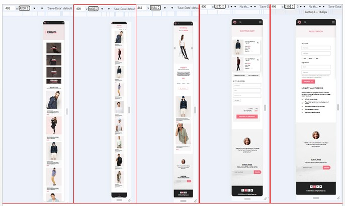
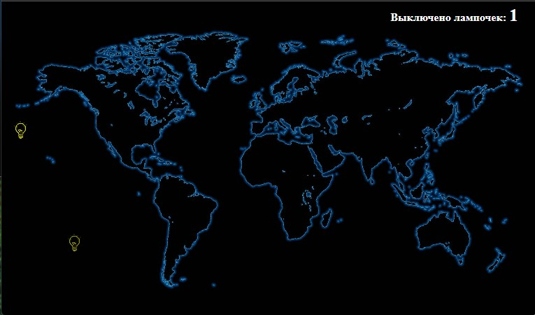

# Урок 6. Продвинутая работа с анимацией, создаем игру на HTML/CSS

## План урока

- Выполнение практических заданий в соответствии с [презентацией](https://gbcdn.mrgcdn.ru/uploads/asset/5034752/attachment/64191677dd7a4a008dba0285b1ba658f.pdf) к уроку


## Домашняя работа ([решение](https://github.com/olgashenkel/GeekBrains-technological_specialization/tree/main/05.%20Advanced%20HTML%20%2B%20CSS/Seminar_06/homework))
**Задание:** 
1. Создать мобильную версию для всех 5 страниц интернет-магазина.
2. Проверить работу сайта на разрешении 375px.
3. Проверить работу сайта на разрешении 425 px.
4. Проверить сайта на валидность.

**Данная промежуточная аттестация оценивается по системе `"зачет"` / `"не зачет"`**
- `"Зачет"` ставится, если слушатель успешно выполнил 3 задания из 4
- `"Незачет"` ставится, если слушатель успешно выполнил менее 3 заданий

**Критерии оценивания:**   
1 - Слушатель создал мобильную версию для всех 5 страниц интернет-магазина   
2 - Слушатель проверил работу сайта на разрешении 375px   
3- Слушатель проверил работу сайта на разрешении 425 px   
4- Слушатель проверил сайт на валидность


**Результат выполнения домашней работы (мобильная версия 5 страниц интернет-магазина):**




*[ссылка на папку со скриншотами]() созданных страниц с расширениями для Desktop, планшета и мобильного телефона*


## Практическая работа с семинара ([решение](https://github.com/olgashenkel/GeekBrains-technological_specialization/tree/main/05.%20Advanced%20HTML%20%2B%20CSS/Seminar_06/seminar_06)):


### Задание 1 (тайминг 30 минут)
Текст задания

1. Создать файл index.html, style.scss (можно использовать sass если вам так удобней)
2. в html Создать 3 чекбокса
3. К каждому чекбоксу с помощью тега label привязать изображение (изображение найти в интернете и добавить в svg формате (добавить изображение и выставить ширину 50px)
4. Скачать фоновое изображение планеты земля (с выключенным светом, и скачать по запросу карта ночной
земли)
5. Сделать фоновое изображение на всю ширину и высоту для body, добавить центрирование

*HTML*
```
    <div class="lamps lamps_1">
        <input class="lamp" type="checkbox" id="lamp_1">
        <label for="lamp_1">
            <svg class="lamp_img" version="1.1" id="Layer_1" xmlns="http://www.w3.org/2000/svg"
                xmlns:xlink="http://www.w3.org/1999/xlink" viewBox="0 0 311.633 311.633" xml:space="preserve">...
            </svg>
        </label>    
    </div>

    <div class="lamps lamps_2">
        <input class="lamp" type="checkbox" id="lamp_2">
        <label for="lamp_2">
            <svg class="lamp_img" version="1.1" id="Layer_1" xmlns="http://www.w3.org/2000/svg"
                xmlns:xlink="http://www.w3.org/1999/xlink" viewBox="0 0 311.633 311.633" xml:space="preserve">...
            </svg>
        </label>
    </div>

    <div class="lamps lamps_3">
        <input class="lamp" type="checkbox" id="lamp_3">
        <label for="lamp_3">
            <svg class="lamp_img" version="1.1" id="Layer_1" xmlns="http://www.w3.org/2000/svg"
                xmlns:xlink="http://www.w3.org/1999/xlink" viewBox="0 0 311.633 311.633" xml:space="preserve">...
            </svg>
        </label>
    </div>

```

*CSS*
```
.body {
    position: relative;
    background-image: url(img/world.jpg);
    height: 100vh;
    background-size: cover;
    background-position: center;
    overflow: hidden;
    background-repeat: no-repeat;
}

.lamps {
    &_img {
        width: 50px;
    }
}
```


### Задание 2 (тайминг 15 минут)
Текст задания
1. Добавить заголовок h1
2. Создать счётчик и привязать его к html
3. Увеличивать значение счетчика на 1, если чекбокс выбран
4. Добавить с помощью псевдоэлемента :before контент внутри h1
5. Проверить работу счетчика если отметить все лампочки
6. Скрыть стандартные checkbox


*HTML*
```
<h1 class="counter_info">Выключено лампочек: </h1>
```

*CSS*
```
.body {
    counter-reset: countLamp;
}


.lamp {
    position: absolute;
    left: -9999999px;
    visibility: hidden;

    &_img {
        position: absolute;
        height: 25px;
    }

    &:checked {
        counter-increment: countLamp;

        &~label {
            display: none;
        }
    }
}


.counter_info {
    position: absolute;
    top: 5px;
    right: 26px;

    font-size: 16px;
    color: #FFFFFF;

    &::after {
        font-size: 26px;
        content: counter(countLamp);
    }
}
```


### Задание 3 (тайминг 35 минут)
Текст задания
1. Создать анимацию появления лампочек
2. Рандомное расположение по координатам left и top (использовать функцию рандом
встроенную в препроцессоры) уже задано у лампочек
3. Изначально лампочка прозрачного цвета, за 3 секунды она должна стать желтого цвета и снова
прозрачной
4. При клике на лампочку пользователем, она пропадает
5. Как итог, лампочка появляется в произвольной точке на карте и за 3 секунды пользователь
должен нажать на нее чтобы увеличился счетчик


*CSS*
```
@for $i from 1 through $count-lamp {

    @keyframes animationLamps-#{$i} {
        0% {
            opacity: 0;
            // fill: transparent;
        }

        20% {
            opacity: 1;
            fill: yellow;
        }

        40% {
            opacity: 0;
            // fill: transparent;
        }

        60% {
            opacity: 1;
            fill: yellow;
        }

        80% {
            opacity: 0;
            // fill: transparent;
        }

        90% {
            opacity: 1;
            fill: yellow;
        }

        100% {
            opacity: 0;
            // fill: transparent;
        }

    }
}


.lamps {
    position: absolute;
    width: 25px;

    @for $i from 1 through $count-lamp {
        &_#{$i} {
            left: random(90)+vw;
            top: random(90)+vh;
            animation: animationLamps-#{$i} 7s linear;

            &:nth-child(#{$i}) {
                animation-delay: ($i - 1) * 1s; 
            }
        }
    }
}
```

***Результат выполнения практической работы***



