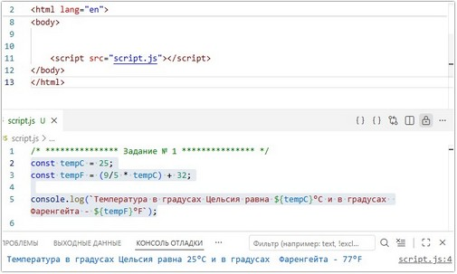
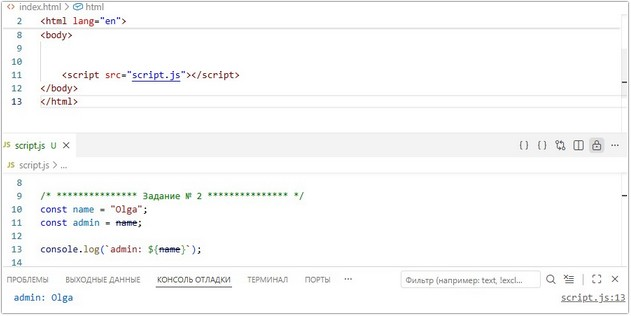
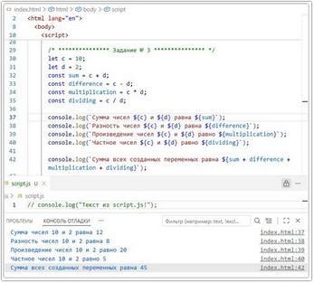
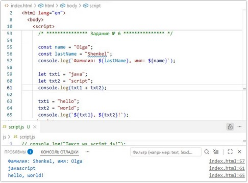

# Урок 2. Семинар. Знакомство с JavaScrip

## План урока

- Выполнение практических заданий в соответствии с [презентацией](https://gbcdn.mrgcdn.ru/uploads/asset/5038809/attachment/3d51ba57dccb7a897ba3e379e8865b42.pdf) к уроку


## Домашняя работа ([решение]())
**Задание 1:** 
1. Создайте переменную, в которой будет храниться температура в градусах Цельсия.
2. Преобразуйте значение температуры из градусов Цельсия в градусы Фаренгейта, используя следующую формулу:
```
градусы Фаренгейта = (9/5 * градусы Цельсия) + 32
```
3. Выведите в консоль как температуру в градусах Цельсия, так и в градусах
Фаренгейта.

**Результат выполнения Задания № 1:**

```
const tempC = 25;
const tempF = (9/5 * tempC) + 32;

console.log(`Температура в градусах Цельсия равна ${tempC}°C и в градусах  Фаренгейта - ${tempF}°F`);
```




**Задание 2:** 
1. Создайте переменную `name` и присвойте ей свое имя.
2. Создайте переменную `admin` и присвойте ей значение из переменной `name`.
3. Выведите значение переменной `admin` в консоль.

**Результат выполнения Задания № 2:**




## Практическая работа с семинара ([решение]()):

### Задание 1 (тайминг 20 минут)
Текст задания
1. Установить расширение форматирования кода
2. Установить расширение `“JavaScript Snippet Pack”`
3. Сделайте файл с вашей первой программой   
a. `index.html`   
b. `script.js`
4. Подключите файл `script.js` к `index.html`
5. В файле `index.html` создайте скрипт, который выводит в консоль текст `“Текст из index.html”`
6. В файле script.js вывести в консоль текст `“Текст из script.js!”`

***Результат выполнения Задания № 1:***


### Задание 2 (тайминг 25 минут)
Текст задания
1. Создайте переменную `num` и присвойте ей значение `123`. Выведите
значение этой переменной в консоль
2. Создайте переменную `а` и присвойте ей значение `5`, переопределите
переменную `а` на значение `7`, выведите переменную `а` в консоль
3. Создайте переменную `b`. Запишите в нее сумму чисел `1, 2 и 3`. С
помощью функции `console.log` выведите в консоль содержимое переменной `b`.
4. Создайте 2 вида комментариев в вашем коде, добавьте в них произвольный текст

***Результат выполнения Задания № 2:***

```
<script>
    let num = 123;
    console.log(num);

    let a = 5;
    console.log(a);

    a = 7;
    console.log(a);

    let b = (1 + 2 + 3);
    console.log(b);
    
</script>
```


### Задание  3 (тайминг 20 минут)
1. Создайте переменную `c` со значением `10` и переменную `d` со значением `2`:   
a. Все созданные переменные должны быть логично названы   
b. Создайте переменную суммы и присвойте сумму чисел `(c,d)`   
c. Создайте переменную разности и присвойте разность чисел `(c,d)`   
d. Создайте переменную произведения и присвойте произведение чисел `(c,d)`   
e. Создайте переменную частного и присвойте деление чисел `(c,d)`   
f. Выведите в консоль все созданные переменные   
g. Сложите все созданные переменные и выведите результат в консоль

***Результат выполнения Задания № 3:***

```
<script>
    let c = 10;
    let d = 2;
    const sum = c + d;
    const difference = c - d;
    const multiplication = c * d;
    const dividing = c / d;

    console.log(`Сумма чисел ${c} и ${d} равна ${sum}`);
    console.log(`Разность чисел ${c} и ${d} равна ${difference}`);
    console.log(`Произведение чисел ${c} и ${d} равно ${multiplication}`);
    console.log(`Частное чисел ${c} и ${d} равно ${dividing}`);

    console.log(`Сумма всех созданных переменных равна ${sum + difference + multiplication + dividing}`);
    
</script>
```



### Задание 4 (тайминг 10 минут)
1. Не запуская код, определите, что выведется в консоль:   
a. `let a = 5 + 5 * 3 + 3;  // 23`
2. Не запуская код, определите, что выведется в консоль:   
a. `let a = 8 / 2 + 2;  // 6`
3. Не запуская код, определите, что выведется в консоль:   
a. `let a = (2 + 3) * (2 + 3);  // 25`
4. Не запуская код, определите, что выведется в консоль:   
a. `let a = (2 + 3) * 2 + 3;    // 13`
5. Не запуская код, определите, что выведется в консоль:   
a. `let a = (2 * 8) / 4;    // 4`
6. Не запуская код, определите, что выведется в консоль:   
a. `let a = 2 * (8 / 4);    // 4`


### Задание 5 (тайминг 5 минут)
1. Запишите в переменную a число 1.5, а в переменную b - число 0.75.
Найдите сумму значений этих переменных и выведите ее на экран.
2. Создайте переменную a, запишите в нее какое-нибудь
положительное или отрицательное число. Выведите на экран это
число с обратным знаком.

***Результат выполнения Задания № 5:***

```
let a = 1.5;
let b = 0.75;

console.log(`Сумма чисел ${a} и ${b} равна ${a + b}`);

a = -10;
console.log(`Противоположное значение числа '${a}' равно '${-a}'`);
```


### Задание 6 (тайминг 15 минут)
1. Создайте строку с вашем именем и строку с вашей фамилией.   
Выведите эти данные в консоль
2. Создайте переменную с текстом `'java'` и переменную с текстом `'script'`. С помощью этих переменных и операции сложения строк выведите в консоль строку `'javascript'`.
3. Создайте переменную с текстом `'hello'` и переменную с текстом `'world'`. С помощью этих переменных и операции сложения строк выведите в консоль строку `'hello world'`.

***Результат выполнения Задания № 6:***

```
const name = "Olga";
const lastName = "Shenkel";
console.log(`Фамилия: ${lastName}, имя: ${name}`);

let txt1 = "java";
let txt2 = "script";
console.log(txt1 + txt2);

txt1 = "hello";
txt2 = "world";
console.log(`${txt1}, ${txt2}!`);
```


