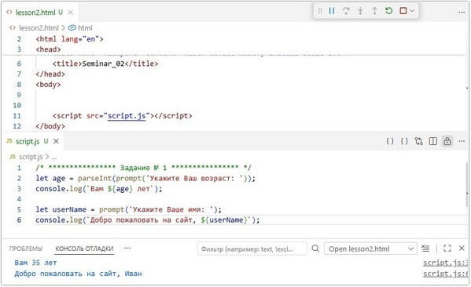
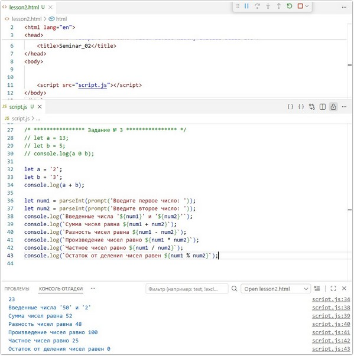

# Урок 2. Семинар. Знакомство с JavaScript

## План урока

- Выполнение практических заданий в соответствии с [презентацией](https://gbcdn.mrgcdn.ru/uploads/asset/5038818/attachment/9bdd111d51db781b790c0069a32efdb6.pdf) к уроку
- Сравнение значений
- Существует два типа сравнения значений:   
проверка равенства;   
проверка неравенства.
- Сравнивая значения, мы получаем булево значение — true, то есть «значения равны», или false — «значения не равны» — независимо от того, какие значения мы сравниваем. Причина в том, что JavaScript применяет приведение типов, когда они разные и напрямую их сравнивать нельзя.


## Домашняя работа ([решение]())
**Задание 1:** 

Описание задачи:
1. Создайте переменные `num1` и `num2`, значения которых пользователь вводит с клавиатуры.
2. Проверьте, что переменная `num1` меньше или равна `1`, а переменная `num2` больше или равна `3`.

**Результат выполнения Задания № 1:**
```
let num1 = parseInt(prompt('Введите число, которое меньше или равно 1: '));
let num2 = parseInt(prompt('Введите число, которое больше или равно 3: '));

if (num1 <= 1 && num2 >= 3) {
    console.log(`Введенные значения '${num1}' и '${num2}' удовлетворяют заданным условиям`);
} else {
    console.log(`Введенные значения '${num1}' и '${num2}' НЕ удовлетворяют заданным условиям`);
}
```


**Задание 2:** 

Описание задачи:  
Перепишите следующий код с использованием тернарного
оператора:
```
let test = true;
if (test === true) {
    console.log('+++');
} else {
    console.log('---');
}
```

**Результат выполнения Задания № 2:**

```
let test = true;
console.log((test === true) ? '+++' : '---');

test = false;
console.log((test === true) ? '+++' : '---');
```


**Задание 3:** 

Описание задачи:   
В переменной `day` хранится число от `1` до `31`. Определите, в какую декаду месяца попадает это число (первая, вторая или третья декада).


**Результат выполнения Задания № 3:**

```
let day = parseInt(prompt("Введите число от 1 до 31: "));
if (day >= 1 && day <= 10) {
  console.log(`Введенное число '${day}' соответствует первой декаде месяца`);
} else if (day >= 11 && day <= 20) {
  console.log(`Введенное число '${day}' соответствует второй декаде месяца`);
} else if (day >= 21 && day <= 31) {
  console.log(`Введенное число '${day}' соответствует третьей декаде месяца`);  
} else {
  console.log(`Введенное значение '${day}' НЕ удовлетворяет заданным условиям`);
}
```


**Задание 4\*:** 

Описание задачи:
1. Получите от пользователя число.
2. Выведите разряды числа: количество сотен, десятков и единиц.


**Результат выполнения Задания № 4\*:**

```
let number = parseInt(prompt("Введите любое число от 0 до 1000: "));
let finalNumber = Math.abs(number);

if (finalNumber >= 100 && finalNumber <= 1000) {
  console.log(
    `Введенное число '${number}' содержит: ${parseInt(finalNumber / 100)} сотен, ${parseInt((finalNumber % 100) / 10)} десятков, ${(finalNumber % 100) % 10} единиц`,
  );
} else if (finalNumber >= 10 && finalNumber <= 100) {
  console.log(
    `Введенное число '${number}' содержит: ${parseInt(finalNumber / 10)} десятков, ${finalNumber % 10} единиц`,
  );
} else if (finalNumber < 10) {
  console.log(`Введенное число '${number}' содержит: ${finalNumber} единиц`);
} else {
  console.log(
    "Введенное значение НЕ удовлетворяет заданным условиям или не поддается моему анализу",
  );
}
```


## Практическая работа с семинара ([решение]()):

### Задание 1 (тайминг 15 минут)
Текст задания
1. Создать новый файл `lesson2.html`
2. Создать переменную и спросить у пользователя `“Ваш
возраст”`
3. Вывести на экран текст. `Вам “возраст пользователя” лет`
4. Спросить у пользователя его имя
5. Вывести на экран `Добро пожаловать на сайт “Имя
пользователя”`

***Результат выполнения Задания № 1:***
```
let age = parseInt(prompt('Укажите Ваш возраст: '));
console.log(`Вам ${age} лет`);

let userName = prompt('Укажите Ваше имя: ');
console.log(`Добро пожаловать на сайт, ${userName}`);
```




### Задание 2 (тайминг 15 минут)
Текст задания
1. Найти остаток от деления двух переменных:   
a. `let a = 13;`  
b. `let b = 5;`
2. Что выведет на экран (Сначала проговорите, потом проверьте):  
a. `let a;`  
b. `alert(a);`
3. Что выведет на экран (Сначала проговорите, потом проверьте):  
a. `alert('abc' * 3);`
4. Что выведет на экран (Сначала проговорите, потом проверьте):   
a. ```alert( 1 / 0);```   
b. ```alert(-1 / 0);```
5. Что выведет на экран (Сначала проговорите, потом проверьте):   
a. ```alert('2' * '3');```

***Результат выполнения Задания № 2:***
```
// Задание № 2-1
// let a = 13;
// let b = 5;
// console.log(a % b);     //  3

// Задание № 2-2
// let c;
// alert(c);   // undefined

// Задание № 2-3
// alert('abc' * 3);   //NaN

// Задание № 2-4
// alert( 1 / 0);  // Infinity
// alert(-1 / 0);  // -Infinity

// Задание № 2-5
// alert('2' * '3');   // 6
```


### Задание  3 (тайминг 15 минут)
1. Сознательно допустите ошибку в вашем коде. Убедитесь, что
ошибка появляется в консоли. Определите, в какой строке кода
случилась ошибка.
2. Необходимо вывести в консоль результат суммы данных
переменных:   
a. `let a = '2';`   
b. `let b = '3';`
3. Пользователь с клавиатуры вводит 2 числа, необходимо в консоль вывести текст:
a. `Сумма чисел равна “результат”`
b. `Разность чисел равна “результат”`
c. `Произведение чисел равно “результат”`
d. `Частное чисел равно “результат”`
e. `Остаток от деления чисел равен “результат”`

```
// Задание № 3-1
// let a = 13;
// let b = 5;
// console.log(a 0 b);

// Задание № 3-2
let a = '2';
let b = '3';
console.log(a + b);

// Задание № 3-3
let num1 = parseInt(prompt('Введите первое число: '));
let num2 = parseInt(prompt('Введите второе число: '));
console.log(`Введенные числа '${num1}' и '${num2}'`);
console.log(`Сумма чисел равна ${num1 + num2}`);
console.log(`Разность чисел равна ${num1 - num2}`);
console.log(`Произведение чисел равно ${num1 * num2}`);
console.log(`Частное чисел равно ${num1 / num2}`);
console.log(`Остаток от деления чисел равен ${num1 % num2}`);
```

***Результат выполнения Задания № 3:***




### Задание 4 (тайминг 15 минут)
1. Не запуская код, определите, что выведется в консоль:   
a. `console.log(String(true));  // true`
2. Не запуская код, определите, что выведется в консоль:  
a. `console.log('a' + true);  // atrue`
3. Не запуская код, определите, что выведется в консоль:   
a. `console.log(Number(true));  // 1`
4. Не запуская код, определите, что выведется в консоль:   
a. `console.log(true + 1);  // 2`
5. Не запуская код, определите, что выведется в консоль:   
a. `console.log(true + true);  // 2`
6. Не запуская код, определите, что выведется в консоль:   
a. `console.log(true - true);  // 0`
7. Не запуская код, определите, что выведется в консоль:   
a. `console.log( String(true) + Number(true));  // true1`


### Задание 5 (тайминг 25 минут)
1. Пользователь с клавиатуры вводит число, Необходимо создать
условный оператор который:  
a. `Выводит в консоль “Число больше 5”`  
b. `Выводит в консоль “Число меньше 5”`  
c. `Выводит в консоль “Число равно 5”`
2. Даны переменные test1 и test2. Проверьте, равны ли их значения и выведите соответствующее сообщение.
3. Пользовать с клавиатуры вводит 2 числа   
a. Необходимо найти какое из двух чисел минимальное
4. Пользователь с клавиатуры вводит число. Проверьте, что данная переменная больше нуля и меньше 15.

***Результат выполнения Задания № 5:***

```
let num = parseInt(prompt('Введите любое число: '));
if (num > 5) {
    console.log('Введенное число больше 5');
} else if (num < 5) {
    console.log('Введенное число меньше 5');
} else if (num === 5) {
    console.log('Введенное число равно 5');
} else {
    console.log('Введенное значение мне не известно ');
}


// Задание № 5-2
let test1 = prompt('Введите любое значение для переменной "test1": ');
let test2 = prompt('Введите любое значение для переменной "test2": ');

if (test1 === test2) {
    console.log('Введенные значения переменных равны между собой');
    console.log(`test1 = ${test1}`);
    console.log(`test2 = ${test2}`);
} else if (test1 !== test2) {
    console.log('Введенные значения переменных между собой НЕ равны');
    console.log(`test1 = ${test1}`);
    console.log(`test2 = ${test2}`);
} else {
    console.log('Введенные значения мне не известны ');
}


// Задание № 5-3
let numbr1 = parseInt(prompt('Введите любое число: '));
let numbr2 = parseInt(prompt('Введите любое число: '));

if (numbr1 < numbr2) {
    console.log(`Первое число = ${numbr1} - является минимальным`);
    console.log(`Второе число = ${numbr2}`);
} else if (numbr2 < numbr1) {
    console.log(`Первое число = ${numbr1}`);
    console.log(`Второе число = ${numbr2} - является минимальным`);
} else if (numbr2 === numbr1) {
    console.log(`Введенные числа '${numbr1}' и '${numbr2}' между собой равны`);
} else {
    console.log('Введенные значения мне не известны ');
}


// Задание № 5-4
let numb = parseInt(prompt('Введите любое число: '));

if (numb < 15 && numb > 0) {
    console.log(`Введенное число "${numb}" - больше 0 и меньше 15`);
} else if (numb >= 15) {
    console.log(`Введенное число "${numb}" - больше или равно 15`);
} else if (numb <= 0) {
    console.log(`Введенное число "${numb}" - меньше или равно 0`);
} else {
    console.log('Введенное значение мне не известно ');
}
```