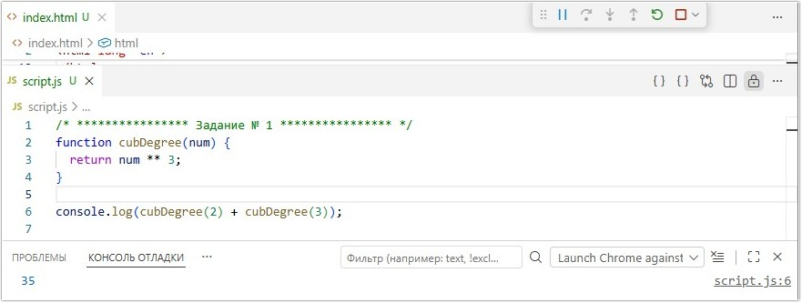
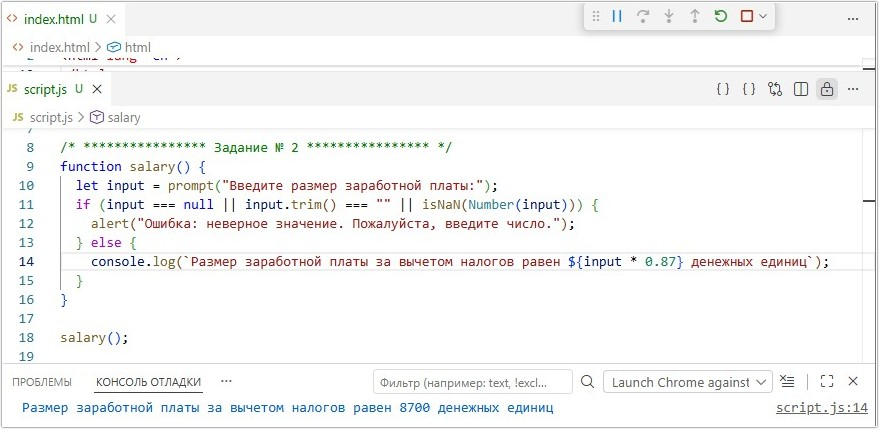
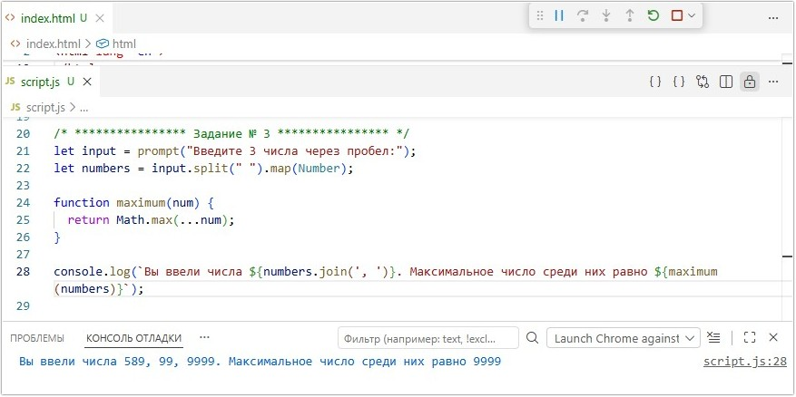
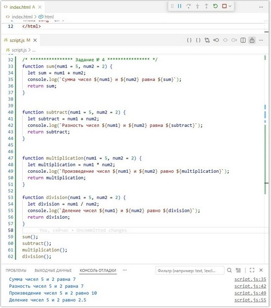

# Урок 6. Семинар. Знакомство с функциями в JavaScript

## План урока

- Выполнение практических заданий в соответствии с [презентацией](https://gbcdn.mrgcdn.ru/uploads/asset/5038858/attachment/cbd1f4b361e3adcf3da0936205573637.pdf) к уроку
- Давайте начнем с небольшого примера, например мы хотим написать алгоритм для вычисления стипендии студента. В качестве исходных данных у нас есть три переменных, названных по фамилии студента, которые содержат среднюю успеваемость за семестр, а сама стипендия будет рассчитываться по формуле.


## Домашняя работа ([решение]())
**Задание 1:** 

Описание задачи:   
Создайте функцию, которая возводит переданное число в куб. Необходимо использовать эту функцию для вычисления и вывода в консоль результата `2^3 + 3^3`

***Результат выполнения Задания № 1:***
```
function cubDegree(num) {
  return num ** 3;
}

console.log(cubDegree(2) + cubDegree(3));
```


**Задание 2:** 

Описание задачи:   
1. Пользователь вводит с клавиатуры число. Если введён текст, необходимо вывести сообщение о неверном значении.
2. Создайте функцию, которая вычисляет 13% от данного числа и выводит в консоль текст: `"Размер заработной платы за вычетом налогов равен “значение”"`.


***Результат выполнения Задания № 2:***
```
function salary() {
  let input = prompt("Введите размер заработной платы:");
  if (input === null || input.trim() === "" || isNaN(Number(input))) {
    alert("Ошибка: неверное значение. Пожалуйста, введите число.");
  } else {
    console.log(`Размер заработной платы за вычетом налогов равен ${input * 0.87} денежных единиц`);
  }
}

salary();
```




**Задание 3:** 

Описание задачи:   
Пользователь вводит с клавиатуры 3 числа. Создайте функцию, которая определяет максимальное значение среди этих чисел.


***Результат выполнения Задания № 3:***
```
let input = prompt("Введите 3 числа через пробел:");
let numbers = input.split(" ").map(Number);

function maximum(num) {
  return Math.max(...num);
}

console.log(`Вы ввели числа ${numbers.join(', ')}. Максимальное число среди них равно ${maximum(numbers)}`);
```




**Задание 4:** 

Описание задачи:   
Реализуйте четыре функции, каждая из которых выполняет одну из
следующих операций с двумя числами:
1. Сложение
2. Вычитание
3. Умножение
4. Деление   

Функции должны возвращать результат операции.


***Результат выполнения Задания № 4:***
```
function sum(num1 = 5, num2 = 2) {
  let sum = num1 + num2;
  console.log(`Сумма чисел ${num1} и ${num2} равна ${sum}`);
  return sum;
}


function subtract(num1 = 5, num2 = 2) {
  let subtract = num1 + num2;
  console.log(`Разность чисел ${num1} и ${num2} равна ${subtract}`);
  return subtract;
}


function multiplication(num1 = 5, num2 = 2) {
  let multiplication = num1 * num2;
  console.log(`Произведение чисел ${num1} и ${num2} равно ${multiplication}`);
  return multiplication;
}

function division(num1 = 5, num2 = 2) {
  let division = num1 / num2;
  console.log(`Деление чисел ${num1} и ${num2} равно ${division}`);
  return division;
}

sum();
subtract();
multiplication();
division();
```




## Практическая работа с семинара ([решение](https://github.com/olgashenkel/GeekBrains-technological_specialization/tree/main/06.%20JavaScript%20Basics/04.%20Seminar_03/seminar_03)):

### Задание 1 (тайминг 20 минут)
Текст задания
1. Написать функцию, которой передаем `имя`, `фамилия` и `возраст`, и получаем строку `"Привет Иван Петров` с возрастом `17` (только здесь данные, которые были переданы в функцию)
2. Создайте функцию которая возводит переданное число в квадрат
3. Сделайте функцию, которая параметром принимает
число и проверяет, положительное это число или
отрицательное. В первом случае пусть функция выводит
в консоль текст `+++`, а во втором `---`.

***Результат выполнения Задания № 1:***
```
// ************* Задание № 1-1 ************* 

function userName(name, lastName, age) {
    console.log(`Привет, ${name} ${lastName} с возрастом ${age}`);
}

userName(prompt('Ваше имя?'), prompt('Ваша фамилия?'), parseInt(prompt('Укажите возраст')));


// ************* Задание № 1-2 ************* 

function square(num) {
    num = num ** 2;
    return num;
}

console.log(square(prompt('Введите любое число:')));


// ************* Задание № 1-3 ************* 
function number(num) {
    
    if (num > 0)    return '+++'
    else if (num < 0)   return '---'
    return 'Введено значение, не удовлетворяющее условию' 
}

console.log(number(prompt('Введите любое число кроме 0:')));
```


### Задание 2 (тайминг 15 минут)
Текст задания
1. Сделайте функцию, которая параметрами принимает 3 числа и выводит в консоль сумму этих чисел.
2. С помощью созданной вами функции выведите в консоль сумму значений этих переменных:
```
let param1 = 1;
let param2 = 2;
let param3 = 3;
```
3. Дана фукнция 
```
function func(num = 5) {
console.log(num * num);
}
```
Расскажите, каким будет результат каждого из вызовов функции:
```
func(2);
func(3);
func();
```

***Результат выполнения Задания № 2:***
```
// ************* Задание № 2-1 ************* 

let input = prompt("Введите три числа через пробел:");
let nums = input.split(" ").map(Number);

function sumNumber(num) {
  let sum = 0;
  let value = [];

  if (nums.length === 3) {
    for (const item of num) {
      sum += item;
      value.push(item);
    }
    console.log(`Сумма чисел (${value.join(" + ")}) равна ${sum}`);
  } else {
    console.log('Ошибка! Не выполнены условия ввода данных');
  }
}
sumNumber(nums);


// ************* Задание № 2-2 ************* 

let param1 = 1;
let param2 = 2;
let param3 = 3;

function sum(a, b, c) {
  let sum = a + b + c;
  console.log(`Сумма чисел ${a}, ${b}, ${c} равна ${sum}`);
}

sum(param1, param2, param3);


// ************* Задание № 2-3 *************
function func(num = 5) {
  console.log(num * num);
}

func(2);    // 4
func(3);    // 9
func();     // 25
```


### Задание 3 (тайминг 15 минут)
Текст задания
1. Сделайте функцию, которая параметром принимает число, а возвращает квадратный корень из этого числа. С помощью этой функции найдите корень числа `3`, затем найдите корень числа `4`.
Просуммируйте полученные результаты и выведите их в консоль.
2. Создайте функцию, которая находит минимальное число из 2-х передаваемых аргументов функции.

***Результат выполнения Задания № 3:***
```
// ************* Задание № 3-1 ************* 
function square(num) {
    
  // 1-ый вариант
  // let numSqrt = Math.sqrt(num);

  // 2-ой (альтернативный) вариант
  let numSqrt = num ** 0.5;

  return numSqrt;
}

let num1 = 3;
let num2 = 4;

console.log(`Корень числа ${num1} = ${square(num1)}`);
console.log(`Корень числа ${num2} = ${square(num2)}`);
console.log(
  `Сумма полученных значений '${square(num1)}' и '${square(num2)}' равна ${square(num1) + square(num2)}`,
);


// ************* Задание № 3-2 ************* 
let input = prompt("Введите два числа через пробел:");
let nums = input.split(" ").map(Number);

function minimum(num) {
  if (num.length === 2) {    
      if (num[0] > num[1]) {
        console.log(`Число ${num[0]} больше ${num[1]}`);
      } else if (num[0] < num[1]) {
        console.log(`Число ${num[0]} меньше ${num[1]}`);
      } else if (num[0] === num[1]) {
        console.log(`Числа ${num[0]} и ${num[1]} равны`);
      } else {
        console.log("Ошибка! Не выполнены условия ввода данных");
      }    
  } else {
    console.log("Ошибка! Не выполнены условия ввода данных");
  }
}

minimum(nums);
```


### Задание 4 (тайминг 25 минут)
Текст задания
1. Сделайте функцию, которая принимает параметром число от `1` до `7`, а возвращает день недели на русском языке.
2. Написать функцию, которой передаем имя и она возвращает приветствие в зависимости от времени суток `(Доброе утро\день\вечер\ночи Иван)`

***Результат выполнения Задания № 4:***
```
// ************* Задание № 4-1 ************* 

let nums = parseInt(prompt("Введите число от 1 до 7:"));

function dayWeek(num) {
  switch (num) {
    case 1:
      console.log("Понедельник");
      break;
    case 2:
      console.log("Вторник");
      break;
    case 3:
      console.log("Среда");
      break;
    case 4:
      console.log("Четверг");
      break;
    case 5:
      console.log("Пятница");
      break;
    case 6:
      console.log("Суббота");
      break;
    case 7:
      console.log("Воскресенье");
      break;
    default:
      console.log("Ошибка! Не выполнены условия ввода данных");
      break;
  }
}

dayWeek(nums);


// ************* Задание № 4-2 ************* 
const nameUser = prompt("Как Вас зовут?");
const hour = new Date().getHours();
let greetings;

function timesOfDay(name) {
  if (hour < 6) {
    greetings = "Доброй ночи";
  } else if (hour < 12) {
    greetings = "Доброе утро";
  } else if (hour < 18) {
    greetings = "Добрый день";
  } else {
    greetings = "Добрый вечер";
  }

  return `${greetings}, ${name}!`;
}

console.log(timesOfDay(nameUser));
```