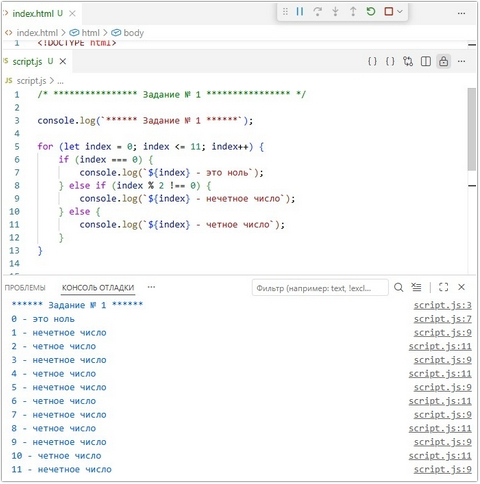
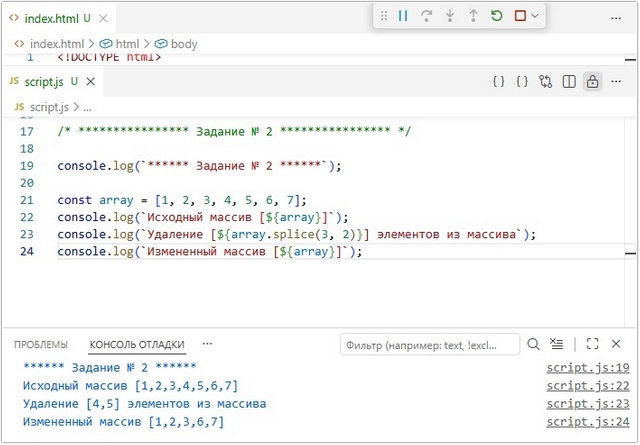
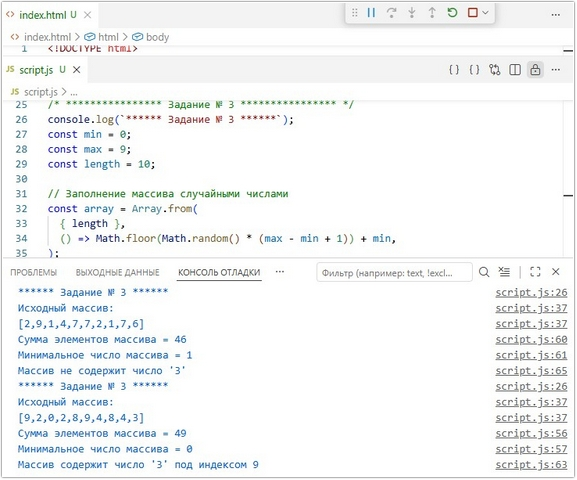
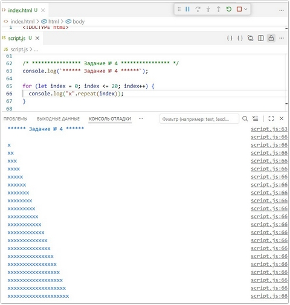
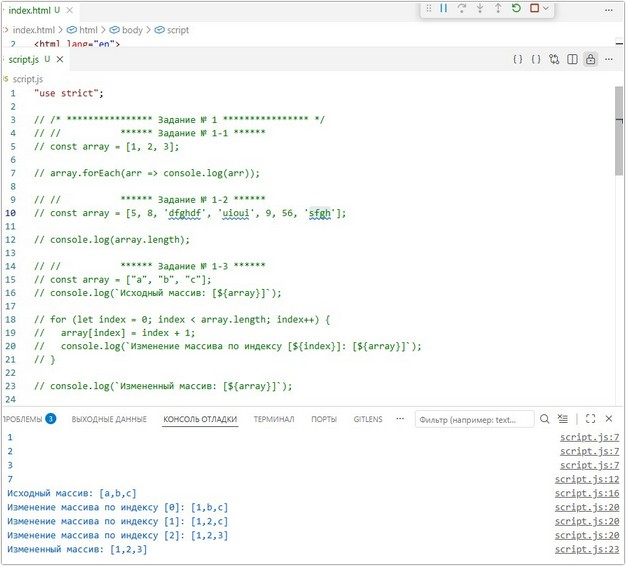
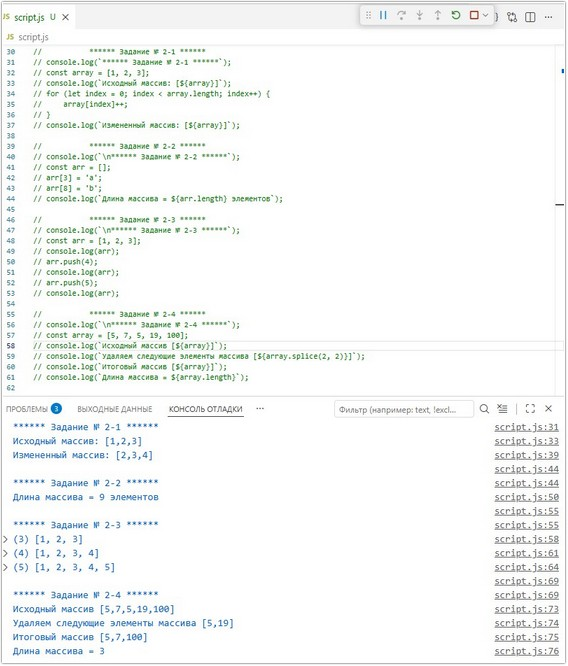
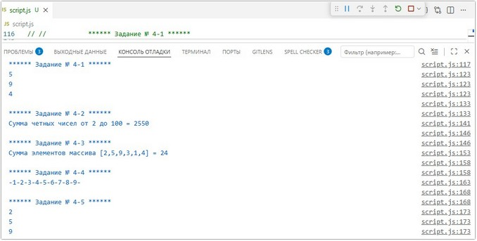
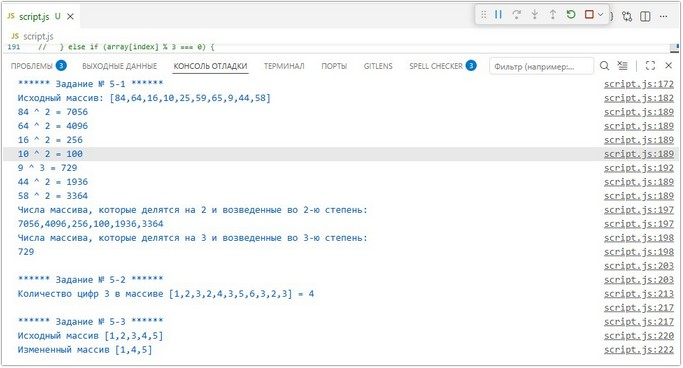

# Урок 8. Семинар. Циклы и массивы

## План урока

- Выполнение практических заданий в соответствии с [презентацией](https://gbcdn.mrgcdn.ru/uploads/asset/5038896/attachment/d267f8bfd82133e08c774dcf18a11684.pdf) к уроку
- Давайте начнем с небольшого примера, например мы хотим написать алгоритм для вычисления стипендии студента. В качестве исходных данных у нас есть три переменных, названных по фамилии студента, которые содержат среднюю успеваемость за семестр, а сама стипендия будет рассчитываться по формуле.


## Домашняя работа ([решение](https://github.com/olgashenkel/GeekBrains-technological_specialization/tree/main/06.%20JavaScript%20Basics/08.%20Seminar_04/homework))
**Задание 1:** 

Описание задачи:   
 Используя цикл `for`, выведите в консоль 11 строк, где каждая
строка содержит индекс и описание числа (0 - это ноль, 1 - нечетное число, 2 - четное
число и т.д.).

***Результат выполнения Задания № 1:***
```
console.log(`****** Задание № 1 ******`);

for (let index = 0; index <= 11; index++) {
    if (index === 0) {
        console.log(`${index} - это ноль`);
    } else if (index % 2 !== 0) {
        console.log(`${index} - нечетное число`);
    } else {
        console.log(`${index} - четное число`);
    }    
}
```


**Задание 2:** 

Описание задачи:   
Имеется массив `[1, 2, 3, 4, 5, 6, 7]`. Необходимо удалить элементы `4 и 5`, чтобы получить массив `[1, 2, 3, 6, 7]`.

***Результат выполнения Задания № 2:***
```
console.log(`****** Задание № 2 ******`);

const array = [1, 2, 3, 4, 5, 6, 7];
console.log(`Исходный массив [${array}]`);
console.log(`Удаление [${array.splice(3, 2)}] элементов из массива`);
console.log(`Измененный массив [${array}]`);
```




**Задание 3:** 

Описание задачи:   
1. Сгенерируйте массив из 5 случайных цифр от 0 до 9.
2. Рассчитайте сумму элементов массива.
3. Найдите минимальное число в массиве.
4. Определите, есть ли в массиве число 3.


***Результат выполнения Задания № 3:***
```
console.log(`****** Задание № 3 ******`);
const min = 0;
const max = 9;
const length = 10;

// Заполнение массива случайными числами
const array = Array.from(
  { length },
  () => Math.floor(Math.random() * (max - min + 1)) + min,
);
console.log(`Исходный массив: \n[${array}]`);


let sum = 0;
let count = 0;
let arrayMinNum = Math.min(...array);
let arrayThreeIndex = [];

for (let index = 0; index < array.length; index++) {
  sum += array[index];

  // Определить, есть ли в массиве число 3
  if (array[index] === 3) {
    arrayThreeIndex.push(index);
    count++;
  }  
}

console.log(`Сумма элементов массива = ${sum}`);
console.log(`Минимальное число массива = ${arrayMinNum}`);

// сообщение для вывода в консоль о нахождении/отсутствии числа "3" в массиве
if (count === 0) {
  console.log("Массив не содержит число '3'");
} else {
    console.log(`Массив содержит число '3' под индексом ${arrayThreeIndex}`);
}
```




**Задание 4:** 

Описание задачи:   
Используя цикл `for`, выведите в консоль `"горку"` из символов `x` с `20
рядами`.


***Результат выполнения Задания № 4:***
```
console.log(`****** Задание № 4 ******`);

for (let index = 0; index <= 20; index++) {
  console.log("x".repeat(index));
}
```




## Практическая работа с семинара ([решение](https://github.com/olgashenkel/GeekBrains-technological_specialization/tree/main/06.%20JavaScript%20Basics/08.%20Seminar_04/seminar_04)):

### Задание 1 (тайминг 20 минут)
Текст задания
1. Создайте массив с элементами `1, 2, 3`. Выведите на экран каждый из этих элементов.
2. Создайте массив с произвольными элементами.
Выведите на экран количество элементов в этом массиве.
3. Создайте массив с элементами `'a', 'b', 'c'`. Запишите вместо
первого элемента число `1`, вместо второго - `2`, вместо
третьего - `3`.

***Результат выполнения Задания № 1:***
```
/* **************** Задание № 1 **************** */
//           ****** Задание № 1-1 ******
const array = [1, 2, 3];

array.forEach(arr => console.log(arr));


//           ****** Задание № 1-2 ******
const array = [5, 8, 'dfghdf', 'uioui', 9, 56, 'sfgh'];

console.log(array.length);


//           ****** Задание № 1-3 ******
const array = ["a", "b", "c"];
console.log(`Исходный массив: [${array}]`);

for (let index = 0; index < array.length; index++) {
  array[index] = index + 1;
  console.log(`Изменение массива по индексу [${index}]: [${array}]`);
}

console.log(`Измененный массив: [${array}]`);
```



### Задание 2 (тайминг 15 минут)
Текст задания
1. Создайте массив с элементами `1, 2 и 3`. С помощью оператора `++`
увеличьте каждый элемент массива на единицу.
2. Узнайте длину следующего массива:
```
const arr = [];
arr[3] = 'a';
arr[8] = 'b';
```
3. Пусть дан такой массив: `const arr = [1, 2, 3];`   
Добавьте ему в конец элементы `4 и 5`.
4. Создайте произвольный массив из 5 элементов. Удалите из него два
элемента. Проверьте, какое станет значение свойства `length` после
этого.

***Результат выполнения Задания № 2:***
```

/* **************** Задание № 2 **************** */

//           ****** Задание № 2-1 ******
// console.log(`****** Задание № 2-1 ******`);
// const array = [1, 2, 3];
// console.log(`Исходный массив: [${array}]`);
// for (let index = 0; index < array.length; index++) {
//     array[index]++;    
// }
// console.log(`Измененный массив: [${array}]`);

//           ****** Задание № 2-2 ******
// console.log(`\n****** Задание № 2-2 ******`);
// const arr = [];
// arr[3] = 'a';
// arr[8] = 'b';
// console.log(`Длина массива = ${arr.length} элементов`);

//           ****** Задание № 2-3 ******
// console.log(`\n****** Задание № 2-3 ******`);
// const arr = [1, 2, 3];
// console.log(arr);
// arr.push(4);
// console.log(arr);
// arr.push(5);
// console.log(arr);

//           ****** Задание № 2-4 ******
// console.log(`\n****** Задание № 2-4 ******`);
// const array = [5, 7, 5, 19, 100];
// console.log(`Исходный массив [${array}]`);
// console.log(`Удаляем следующие элементы массива [${array.splice(2, 2)}]`);
// console.log(`Итоговый массив [${array}]`);
// console.log(`Длина массива = ${array.length}`);
```



### Задание 3 (тайминг 25 минут)
Текст задания
1. С помощью цикла `for` выведите в консоль числа `от 11 до 33`.
2. С помощью цикла `for` выведите в консоль `нечетные числа в
промежутке от 1 до 99`.
3. С помощью цикла `for` выведите в консоль `числа от 100 до 0`.
4. Дано число `num` с неким начальным значением. Умножайте его на 3
столько раз, пока результат умножения не станет больше 1000.
Какое число получится? Посчитайте количество итераций,
необходимых для этого.

***Результат выполнения Задания № 3:***
```
/* **************** Задание № 3 **************** */

//           ****** Задание № 3-1 ******
// console.log(`****** Задание № 3-1 ******`);
// const array = [];

// for (let index = 11; index < 33; index++) {
//     array.push(index);
// }

// console.log(array);


//           ****** Задание № 3-2 ******
// console.log(`\n****** Задание № 3-2 ******`);
// const array = [];

// for (let index = 1; index < 99; index++) {
//     if (index % 2 !== 0) {
//         array.push(index);
//     }    
// }

// console.log(array);


//           ****** Задание № 3-3 ******
// console.log(`\n****** Задание № 3-3 ******`);
// const array = [];

// for (let index = 100; index > 0; index--) {    
//         array.push(index);
// }

// console.log(array);


//           ****** Задание № 3-4 ******
console.log(`\n****** Задание № 3-4 ******`);

let num = parseInt(prompt('Введите любое число от 1 до 1000'));
let count = 0;

if (num > 0 && num < 1000) {
    for (let index = num; index <= 1000; index *= 3) {
        count++;

    }
} else {
    alert(`Ошибка! Введено значение "${num}", не удовлетворяющее условию!`)    
}

console.log(`При значении "${num}" количество итераций = ${count}`);
```

### Задание 4 (тайминг 25 минут)
Текст задания
1. Дан массив `const arr = [2, 5, 9, 15, 1, 4];`.   
Выведите в консоль те элементы массива, которые больше 3-х, но
меньше 10.
2. Найдите сумму `четных чисел от 2 до 100`.
3. Дан массив `const = [2, 5, 9, 3, 1, 4];`.   
Найдите сумму элементов этого массива.
4. С помощью цикла сформируйте строку `'-1-2-3-4-5-6-7-8-9-'`.
5. Дан массив с числами. `const = [2, 5, 9, 0, 3, 1, 4];`.   
Запустите цикл,
который будет по очереди выводить элементы этого массива в
консоль до тех пор, пока не встретится элемент `со значением 0`.
После этого цикл должен завершить свою работу.

***Результат выполнения Задания № 4:***
```
//           ****** Задание № 4-1 ******
console.log(`****** Задание № 4-1 ******`);
const arr = [2, 5, 9, 15, 1, 4];
let count = 0;

for (let index = 0; index < arr.length; index++) {
  if (arr[index] > 3 && arr[index] < 10) {
    console.log(arr[index]);
    count++;
  }
}
if (count === 0) {
  console.log("Элементов массива, удовлетворяющих условию, нет");
}


//           ****** Задание № 4-2 ******
console.log(`\n****** Задание № 4-2 ******`);
let sum = 0;
  
for (let index = 2; index <= 100; index++) {
  if (index % 2 === 0) {
    sum += index;
  }
}
console.log(`Сумма четных чисел от 2 до 100 = ${sum}`);


//           ****** Задание № 4-3 ******
console.log(`\n****** Задание № 4-3 ******`);
const array = [2, 5, 9, 3, 1, 4];
let sum = 0;

for (let index = 0; index < array.length; index++) {
      sum += array[index];  
}
console.log(`Сумма элементов массива [${array}] = ${sum}`);


//           ****** Задание № 4-4 ******
console.log(`\n****** Задание № 4-4 ******`);
let str = '-';
for (let index = 1; index <= 9; index++) {
       str += index + '-';
}
console.log(str);


//           ****** Задание № 4-5 ******
console.log(`\n****** Задание № 4-5 ******`);
const array = [2, 5, 9, 0, 3, 1, 4];

for (let index = 0; index < array.length; index++) {
    if (array[index] !== 0) {
        console.log(array[index]);
    } else {
        break;
    }    
}
```



### Задание 5 (тайминг 25 минут)
Текст задания
1. Пусть у нас дан массив состоящий из `10 элементов` с произвольными числами. Давайте переберем его циклом и числа, которые `делятся на 2`, возведем в квадрат и выведем в консоль, а
числа, которые `делятся на 3`, возведем в куб и выведем в консоль.
2. Дан массив const `arr = [1, 2, 3, 2, 4, 3, 5, 6, 3, 2, 3];`   
Подсчитайте `количество цифр 3` в этом массиве.
3. Дан следующий массив: `[1, 2, 3, 4, 5]`.   
С помощью метода `splice` преобразуйте массив в следующий: `[1, 4, 5]`

***Результат выполнения Задания № 5:***
```
/* **************** Задание № 5 **************** */

//           ****** Задание № 5-1 ******
console.log(`****** Задание № 5-1 ******`);
const min = 1;
const max = 100;
const length = 10;

const array = Array.from(
  { length },
  () => Math.floor(Math.random() * (max - min + 1)) + min,
);

console.log(`Исходный массив: [${array}]`);

const arraySquare = [];
const arrayCube = [];

for (let index = 0; index < array.length; index++) {
  if (array[index] % 2 === 0) {
    console.log(`${array[index]} ^ 2 = ${array[index] ** 2}`);
    arraySquare.push(array[index] ** 2);
  } else if (array[index] % 3 === 0) {
    console.log(`${array[index]} ^ 3 = ${array[index] ** 3}`);
    arrayCube.push(array[index] ** 3);
  }
}

console.log(`Числа массива, которые делятся на 2 и возведенные во 2-ю степень:\n${arraySquare}`);
console.log(`Числа массива, которые делятся на 3 и возведенные во 3-ю степень:\n${arrayCube}`);


//           ****** Задание № 5-2 ******
console.log(`\n****** Задание № 5-2 ******`);
const arr = [1, 2, 3, 2, 4, 3, 5, 6, 3, 2, 3];
let count = 0;

for (let index = 0; index < arr.length; index++) {
    if (arr[index] === 3) {
        count++;
    }    
}

console.log(`Количество цифр 3 в массиве [${arr}] = ${count}`);


//           ****** Задание № 5-3 ******
console.log(`\n****** Задание № 5-3 ******`);
const array = [1, 2, 3, 4, 5];

console.log(`Исходный массив [${array}]`);
array.splice(1, 2);
console.log(`Измененный массив [${array}]`);
```

