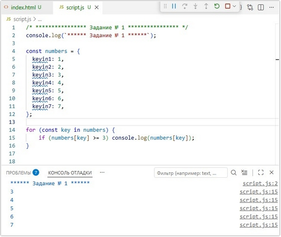
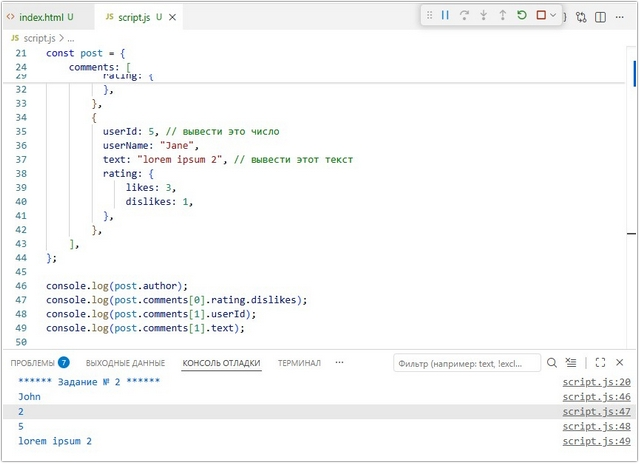
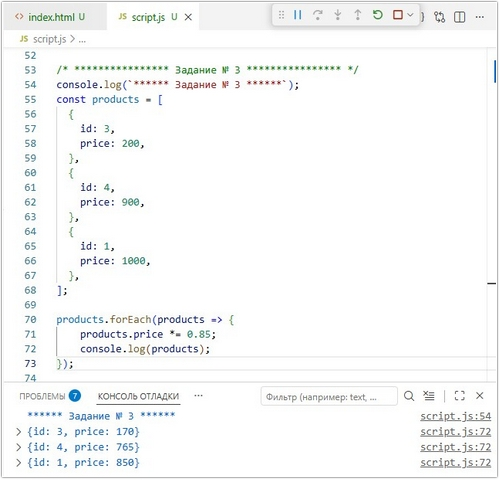
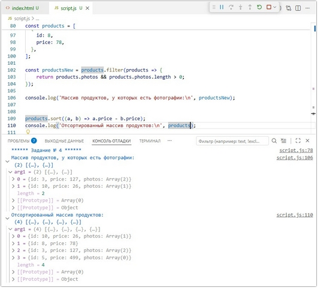
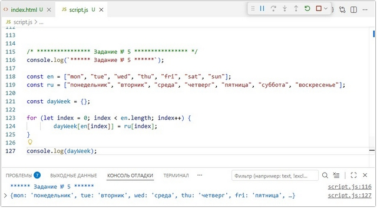
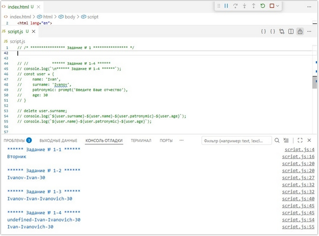
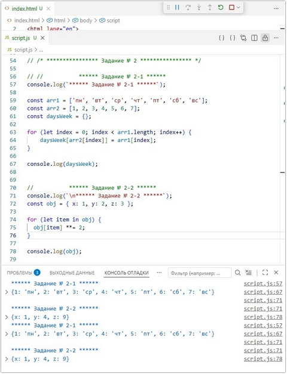

# Урок 10. Семинар. Объекты в JavaScript

## План урока

- Выполнение практических заданий в соответствии с [презентацией](https://gbcdn.mrgcdn.ru/uploads/asset/5039005/attachment/431eddf77ef474faf96001c62bfdcad5.pdf) к уроку
- Введение
- На предыдущих занятиях мы программировали на базе простых данных и структур. Такой тип программирования называется процедурным. Но в JavaScript мы уже использовали совершенно чуждую для этого подхода сущность – объект. При этом, мы пока даже не догадывались, что используем объекты. Но на этом уроке мы научимся осознанно создавать и применять объекты. Вполне вероятно, что, привыкнув к ним, Вы уже не захотите снова писать процедурный код!


## Домашняя работа ([решение](https://github.com/olgashenkel/GeekBrains-technological_specialization/tree/main/06.%20JavaScript%20Basics/10.%20Seminar_05/homework))

**Задание 1:** 

Описание задачи:   
Дан объект `numbers`. Необходимо вывести в консоль все значения, которые больше или равны 3.
```
const numbers = {
    keyin1: 1,
    keyin2: 2,
    keyin3: 3,
    keyin4: 4,
    keyin5: 5,
    keyin6: 6,
    keyin7: 7,
};
```

***Результат выполнения Задания № 1:***
```
console.log(`****** Задание № 1 ******`);

const numbers = {
  keyin1: 1,
  keyin2: 2,
  keyin3: 3,
  keyin4: 4,
  keyin5: 5,
  keyin6: 6,
  keyin7: 7,
};

for (const key in numbers) {
    if (numbers[key] >= 3) console.log(numbers[key]);        
}

```



**Задание 2:** 

Описание задачи:   
Из объекта `post`, который задан в константе, выведите значения с комментариями в консоль.
```
const post = {
    author: "John", // вывести этот текст
    postId: 23,
    comments: [
        {
          userId: 10,
          userName: "Alex",
          text: "lorem ipsum",
          rating: {
              likes: 10,
              dislikes: 2, // вывести это число
          },
        },
        {
          userId: 5, // вывести это число
          userName: "Jane",
          text: "lorem ipsum 2", // вывести этот текст
          rating: {
              likes: 3,
              dislikes: 1,
          },
        },
    ],
};

```
***Результат выполнения Задания № 2:***
```
console.log(`****** Задание № 2 ******`);
const post = {
    author: "John", // вывести этот текст
    postId: 23,
    comments: [
        {
          userId: 10,
          userName: "Alex",
          text: "lorem ipsum",
          rating: {
              likes: 10,
              dislikes: 2, // вывести это число
          },
        },
        {
          userId: 5, // вывести это число
          userName: "Jane",
          text: "lorem ipsum 2", // вывести этот текст
          rating: {
              likes: 3,
              dislikes: 1,
          },
        },
    ],
};

console.log(post.author);
console.log(post.comments[0].rating.dislikes);
console.log(post.comments[1].userId);
console.log(post.comments[1].text);
```




**Задание 3:** 

Описание задачи:   
Дан массив `products`. Уменьшите цену каждого продукта `на 15%` с использованием метода `forEach`.
```
const products = [
  {
    id: 3,
    price: 200,
  },
  {
    id: 4,
    price: 900,
  },
  {
    id: 1,
    price: 1000,
  },
];
```

***Результат выполнения Задания № 3:***
```
console.log(`****** Задание № 3 ******`);
const products = [
  {
    id: 3,
    price: 200,
  },
  {
    id: 4,
    price: 900,
  },
  {
    id: 1,
    price: 1000,
  },
];

products.forEach(products => {
    products.price *= 0.85;
    console.log(products);
});
```




**Задание 4:** 

Описание задачи:   
1. Выведите в консоль массив продуктов, у которых есть хотя бы одна фотография, используя метод `filter`.
2. Отсортируйте массив `products` по цене в порядке возрастания и выведите отсортированный массив в консоль.
```
const products = [
  {
    id: 3,
    price: 127,
    photos: ["1.jpg", "2.jpg"],
  },
  {
    id: 5,
    price: 499,
    photos: [],
  },
  {
    id: 10,
    price: 26,
    photos: ["3.jpg"],
  },
  {
    id: 8,
    price: 78,
  },
];
```

***Результат выполнения Задания № 4:***
```
console.log(`****** Задание № 4 ******`);

const products = [
  {
    id: 3,
    price: 127,
    photos: ["1.jpg", "2.jpg"],
  },
  {
    id: 5,
    price: 499,
    photos: [],
  },
  {
    id: 10,
    price: 26,
    photos: ["3.jpg"],
  },
  {
    id: 8,
    price: 78,
  },
];

const productsNew = products.filter(products => {
    return products.photos && products.photos.length > 0;
});

console.log('Массив продуктов, у которых есть фотографии:\n', productsNew);


products.sort((a, b) => a.price - b.price);
console.log('Отсортированный массив продуктов:\n', products);
```




**Задание 5\*:** 

Описание задачи:   
Есть два массива `en` и `ru`. Объедините их в объект, где значения из первого массива будут ключами, а значения из второго массива — значениями.
```
const en = ["mon", "tue", "wed", "thu", "fri", "sat", "sun"];

const ru = ["понедельник", "вторник", "среда", "четверг", "пятница", "суббота", "воскресенье"];
```

***Результат выполнения Задания № 5\*:***
```
console.log(`****** Задание № 5 ******`);

const en = ["mon", "tue", "wed", "thu", "fri", "sat", "sun"];
const ru = ["понедельник", "вторник", "среда", "четверг", "пятница", "суббота", "воскресенье"];

const dayWeek = {};

for (let index = 0; index < en.length; index++) {
        dayWeek[en[index]] = ru[index];
}

console.log(dayWeek);
```



## Практическая работа с семинара ([решение](https://github.com/olgashenkel/GeekBrains-technological_specialization/tree/main/06.%20JavaScript%20Basics/10.%20Seminar_05/seminar_05)):


### Задание 1 (тайминг 20 минут)
Текст задания
1. Создайте объект с ключами `от 1 до 7`, в качестве значений содержащий `имена дней недели`. Выведите на экран `“Вторник”`
2. Создайте объект `user` с ключами `'name', 'surname', ‘age’`.
Выведите на экран фамилию, имя и возраст через дефис.
3. Добавьте в объект `user` свойство отчество, которое пользователь должен ввести с клавиатуры
4. Удалите свойство `surname`

***Результат выполнения Задания № 1:***
```

//           ****** Задание № 1-1 ******
console.log(`****** Задание № 1-1 ******`);

const daysWeek = {
  1: "Понедельник",
  2: "Вторник",
  3: "Среда",
  4: "Четверг",
  5: "Пятница",
  6: "Суббота",
  7: "Воскресенье",
};

console.log(daysWeek[2]);


//           ****** Задание № 1-2 ******
console.log(`****** Задание № 1-2 ******`);
const user = {
    name: 'Ivan',
    surname: 'Ivanov', 
    age: 30
}

console.log(`${user.surname}-${user.name}-${user.age}`);


//           ****** Задание № 1-3 ******
console.log(`****** Задание № 1-3 ******`);
const user = {
    name: 'Ivan',
    surname: 'Ivanov',
    patronymic: prompt('Введите Ваше отчество'),
    age: 30
}

console.log(`${user.surname}-${user.name}-${user.patronymic}-${user.age}`);


//           ****** Задание № 1-4 ******
console.log(`****** Задание № 1-4 ******`);
const user = {
    name: 'Ivan',
    surname: 'Ivanov',
    patronymic: prompt('Введите Ваше отчество'),
    age: 30
}

delete user.surname;
console.log(`${user.surname}-${user.name}-${user.patronymic}-${user.age}`);
console.log(`${user.name}-${user.patronymic}-${user.age}`);
```




### Задание 2 (тайминг 25 минут)
Текст задания
1. Даны два массива: первый с названиями дней недели, а второй - с их порядковыми номерами:
```
const arr1 = ['пн', 'вт', 'ср', 'чт', 'пт', 'сб', 'вс'];

const arr2 = [1, 2, 3, 4, 5, 6, 7];
```
С помощью цикла создайте объект, ключами которого будут названия дней, а значениями - их номера.

2. `const obj = {x: 1, y: 2, z: 3};`
Переберите этот объект циклом и возведите каждый элемент этого объекта в квадрат

***Результат выполнения Задания № 2:***
```
//           ****** Задание № 2-1 ******
console.log(`****** Задание № 2-1 ******`);

const arr1 = ['пн', 'вт', 'ср', 'чт', 'пт', 'сб', 'вс'];
const arr2 = [1, 2, 3, 4, 5, 6, 7];
const daysWeek = {};

for (let index = 0; index < arr1.length; index++) {
    daysWeek[arr2[index]] = arr1[index];
}

console.log(daysWeek);


//           ****** Задание № 2-2 ******
console.log(`\n****** Задание № 2-2 ******`);
const obj = { x: 1, y: 2, z: 3 };

for (let item in obj) {
  obj[item] **= 2;
}

console.log(obj);
```




### Задание 3 (тайминг 15 минут)
Текст задания
```
const obj = {
  key1: {
    key1: 1,
    key2: 2,
    key3: 3,
  },
  key2: {
    key1: 4,
    key2: 5,
    key3: 6,
  },
  key3: {
    key1: 7,
    key2: 8,
    key3: 9,
  },
}
```
Найдите сумму элементов приведенного объекта.

***Результат выполнения Задания № 3:***
```

/* **************** Задание № 3 **************** */
/* **************** Задание № 3 **************** */
const obj = {
  key1: {
    key1: 1,
    key2: 2,
    key3: 3,
  },
  key2: {
    key1: 4,
    key2: 5,
    key3: 6,
  },
  key3: {
    key1: 7,
    key2: 8,
    key3: 9,
  },
};

function sumObject(obj) {
  let sum = 0;

  for (let key in obj) {
    if (typeof obj[key] === "object" && obj[key] !== null) {
      // Если это объект, вызываем функцию рекурсивно
      sum += sumObject(obj[key]);
    } else if (typeof obj[key] === "number") {
      // Если это число, прибавляем к сумме
      sum += obj[key];
    }
  }
  return sum;
}

console.log(sumObject(obj));


// !!!!!!! Решение с семинара:
let sum = 0;
for (const key1 in obj) {
    for (const key2 in obj[key1]) {
        sum += obj[key1][key2];       
            }        
}
console.log(sumObject(obj));
```


### Задание 4 (тайминг 30 минут)
Текст задания
1. Создайте объект `riddles`
2. Добавьте свойства `question`, answer
3. Создайте метод `askQuestion` который спрашивает у пользователя вопрос `question` и сравнивает ответ с `answer`
4. Если ответил неверно, то в консоль выводится текст: `“вы проиграли”`
5. ***\* По желанию, создать 2 подсказки, если пользователь ответил неверно***

***Результат выполнения Задания № 4:***
```
console.log(`****** Задание № 4 ******`);

const riddles = {
  question: "Летит, а не птица, шумит, а не ветер",
  answer: ["самолет", "самолёт"],
  askQuestion: function () {
    let userAnswer = prompt(
      `Отгадайте загадку: \n"${this.question}" \nВаш ответ:`,
    );

    if (this.answer.includes(userAnswer.toLowerCase().trim()) === true) {
      alert("Поздравляем! Вы выиграли!");
      console.log("Поздравляем! Вы выиграли!");
    } else {
      prompt(`Увы! Ответ неверный!\nПодсказка № 1: С крыльями, а не птица.\n${userAnswer}`);
      if (this.answer.includes(userAnswer.toLowerCase().trim()) === true) {
        alert("Поздравляем! Вы выиграли!");
        console.log("Поздравляем! Вы выиграли!");
      } else {
        prompt(
          `Увы! Ответ неверный!\nПодсказка № 2: В слове 7 букв, первая буква "С".\n${userAnswer}`,
        );
        if (this.answer.includes(userAnswer.toLowerCase().trim()) === true) {
          alert("Поздравляем! Вы выиграли!");
          console.log("Поздравляем! Вы выиграли!");
        } else {
          alert("К сожалению, Вы проиграли!");
          console.log("К сожалению, Вы проиграли!");
        }
      }
    }
  },
};

console.log(riddles.askQuestion());
```