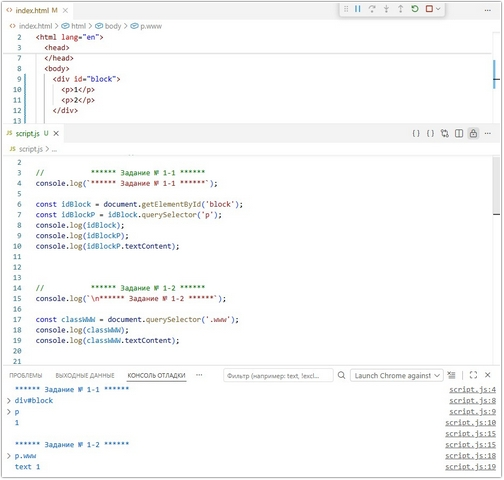
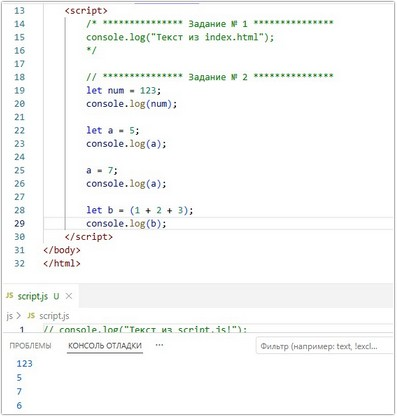
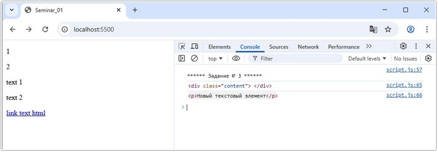
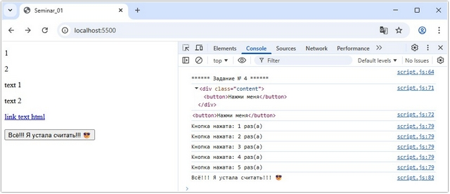
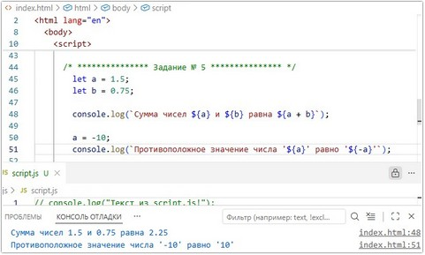

# Урок 2. Семинар. Введение в DOM (Document Object Model)

## План урока

- Выполнение практических заданий в соответствии с [презентацией](https://gbcdn.mrgcdn.ru/uploads/asset/5092931/attachment/ed55442dea7252d22b42500da3336be4.pptx) к уроку
- Вводная информация   
В современном мире JavaScript имеет много сфер применения. На нём пишутся серверная и клиентская части веб-приложений, он используется для создания мобильных приложений, майнинга криптовалют и даже программирования микроконтроллеров.


## Домашняя работа ([решение]())

В этом задании вам предстоит работать с элементами на веб-странице, используя JavaScript. Вам нужно выполнить несколько действий, связанных с изменением и извлечением информации из элементов HTML. Ниже приводится список задач:

**Дан HTML:**
```
<!doctype html>
<html lang="en">
  <head>
    <meta charset="UTF-8" />
    <title>Homework</title>
  </head>
  <body>
    <a href="#" class="card-link">Card link</a>
    <a href="#" class="card-link">Another link</a>
    <div class="card" style="width: 18rem">
      <div class="card-body">
        <h5 class="card-title" data-number="100">Card title</h5>
        <h6 class="card-subtitle mb-2 text-muted">Card subtitle</h6>
        <p class="card-text" data-number="50">
          Some quick example text to build on the card title and make up the
          bulk of the card's content.
        </p>
        <a href="#" id="super_link" class="card-link">Card link</a>
        <a href="#" class="card-link" data-number="50">Another link</a>
      </div>
    </div>
  </body>
</html>
```


**Задачи:** 
1. Найдите элемент по `id`, используя `getElementById`, элемент с `id` равным `"super_link"` и выведите этот элемент в консоль.
2. Внутри всех элементов на странице, которые имеют класс `card-link`, поменяйте текст внутри элемента на `"ссылка"`.
3. Найдите все элементы на странице с классом `card-link`, которые лежат в элементе с классом `card-body`, и выведите полученную коллекцию в консоль.
4. Найдите первый попавшийся элемент на странице, у которого есть атрибут `data-number` со значением `50`, и выведите его в консоль.
5. Выведите содержимое тега `title` в консоль.
6. Получите элемент с классом `card-title` и выведите его родительский узел в консоль.
7. Создайте тег `<p>`, запишите внутри него текст `"Привет"` и добавьте созданный тег в начало элемента, который имеет класс `card`.
8. Удалите тег `h6` на странице.


**Результат выполнения Задания № 1:**

```
console.log(`****** Задание № 1 ******`);

const idElement = document.getElementById('super_link');
console.log(idElement);
```


**Результат выполнения Задания № 2:**
```
/* *************** Задание № 2 *************** */
console.log(`****** Задание № 2 ******`);

const idElement = document.querySelectorAll('.card-link');
console.log(idElement);

idElement.forEach(element => {
    // console.log(element.textContent);
    element.textContent = 'Ссылка';
    console.log(element.textContent);
});
```


**Результат выполнения Задания № 3:**
```
console.log(`****** Задание № 2 ******`);

const cardBodyElement = document.querySelector('.card-body');
console.log(cardBodyElement);
const cardLinkElement = cardBodyElement.querySelectorAll('.card-link');
console.log(cardLinkElement);
```


**Результат выполнения Задания № 4:**
```
console.log(`****** Задание № 4 ******`);

const dataNumberElem = document.querySelector('[data-number="50"]');
console.log(dataNumberElem);
```


**Результат выполнения Задания № 5:**
```
console.log(`****** Задание № 5 ******`);

const titleTeg = document.querySelector('title');
console.log(titleTeg);
```


**Результат выполнения Задания № 6:**
```
console.log(`****** Задание № 6 ******`);

const cardTitleElem = document.querySelector('.card-title');
console.log(cardTitleElem.nodeName);
console.log(cardTitleElem.parentNode);
```


**Результат выполнения Задания № 7:**
```
console.log(`****** Задание № 6 ******`);

const cardTitleElem = document.querySelector('.card-title');
console.log(cardTitleElem.nodeName);
console.log(cardTitleElem.parentNode);
```


**Результат выполнения Задания № 8:**
```
console.log(`****** Задание № 8 ******`);

const h6Element = document.querySelectorAll('h6');
console.log(h6Element);
h6Element.forEach(element => {
    element.remove();
});
```


## Практическая работа с семинара ([решение]()):

### Задание 1 (тайминг 10 минут)
Текст задания:
```
<div id="block">
    <p>1</p>
    <p>2</p>
</div>
```
1. Получите ссылку на первый абзац из дива с `id`, равным `block`, выведите его в консоль
2. Получите ссылку на первый абзац с классом `www` и вывести его в консоль
```
<p class="www">text 1</p>
<p class="www">text 2</p>
```
***Результат выполнения Задания № 1:***
```
console.log(`****** Задание № 1-1 ******`);

const idBlock = document.getElementById('block');
const idBlockP = idBlock.querySelector('p');
console.log(idBlock);
console.log(idBlockP);
console.log(idBlockP.textContent);

// Решение с семинара:
const p1El = document.querySelector('#block p:first-child');
console.log(p1El);


console.log(`\n****** Задание № 1-2 ******`);

const classWWW = document.querySelector('.www');
console.log(classWWW);
console.log(classWWW.textContent);

// Решение с семинара:
const wwwClass = document.querySelector('.www:first-of-type');
console.log(wwwClass);

```




### Задание 2 (тайминг 15 минут)
Текст задания:
Дан тег `<a class="link" href="#">link text html</a>`.
Вам необходимо поменять текст внутри ссылки на `“link text js”`
Заменить `href`, на значение `https://developer.mozilla.org/ru/` 
Дан тег  
Вам необходимо с помощью js поменять значение src на любое изображение из интернета


***Результат выполнения Задания № 2:***
```
//           ****** Задание № 2-1 ******
console.log(`\n****** Задание № 2-1 ******`);
const linkClass = document.querySelector('.link');
linkClass.textContent = 'link text js';
linkClass.href = 'https://share.google/SCbylEcn05zxXUO9i';
console.log(linkClass);


//           ****** Задание № 2-2 ******
console.log(`\n****** Задание № 2-2 ******`);

const photoClass = document.querySelector('.photo');
photoClass.src = 'https://img.freepik.com/free-photo/beautiful-spring-landscape_23-2151917219.jpg?semt=ais_hybrid&w=740&q=80';
photoClass.alt = 'Долгожданная весна';
photoClass.width = 400;
console.log(photoClass);
```



### Задание  3 (тайминг 20 минут)
Текст задания:
1. Дан тег `<div class="content"></div>` 
2. Создайте новый элемент `p`
3. Добавьте в него текст `“Новый текстовый элемент”`
4. Добавьте созданный элемент внутри `<div class="content"></div>`
5. Удалите добавленный узел.


***Результат выполнения Задания № 3:***

```
console.log(`\n****** Задание № 3 ******`);

const elemP = document.createElement('p');
elemP.textContent = 'Новый текстовый элемент';

const elemDivContent = document.querySelector('.content');

elemDivContent.appendChild(elemP);
console.log(elemDivContent);
console.log(elemP);

// elemDivContent.removeChild(elemP);
elemP.remove();
console.log(elemP);
```





### Задание 4 (тайминг 10 минут)
Текст задания:
1. Создать элемент button, добавить в блок `<div class="content"></div>`
2. При клике на который в консоль выводится сколько раз пользователь нажал на данную кнопку


***Результат выполнения Задания № 4:***

```
console.log(`\n****** Задание № 4 ******`);

const elemDivCont = document.querySelector(".content");
const buttonDivContent = document.createElement("button");
buttonDivContent.textContent = "Нажми меня";

elemDivCont.appendChild(buttonDivContent);
console.log(elemDivCont);
console.log(buttonDivContent);

let count = 0;

buttonDivContent.addEventListener("click", () => {
  count++;
  buttonDivContent.textContent = 'На меня нажали ' + count + ' раз(а)';
  console.log(`Кнопка нажата: ${count} раз(а)`);
  if (count === 5) {
    buttonDivContent.textContent = 'Всё!!! Я устала считать!!! 😎';
    console.log('Всё!!! Я устала считать!!! 😎');
    count = 0;
  }
});
```



### Задание 5 (тайминг 20 минут)
Текст задания:
1. Дан тег `<div class="content"></div>` 
2. Создайте с помощью javascript новый элемент `button`
3. Добавьте текст для кнопки `“Отправить”`
4. При клике на данную кнопку необходимо чтобы текст поменялся на `“Текст отправлен”`


***Результат выполнения Задания № 5:***

```
console.log(`\n****** Задание № 5 ******`);

const elemDivContent = document.querySelector('.content');
const buttonDivContent = document.createElement('button');
buttonDivContent.textContent = 'Отправить';

elemDivContent.appendChild(buttonDivContent);
console.log(elemDivContent);
console.log(buttonDivContent);

buttonDivContent.addEventListener('click', () => {
    buttonDivContent.textContent = 'Текст отправлен';
    console.log(buttonDivContent.textContent);
});

```
