# Урок 4. Семинар. Работа с DOM

## План урока

- Выполнение практических заданий в соответствии с [презентацией](https://gbcdn.mrgcdn.ru/uploads/asset/5092932/attachment/fc43c8da5a0457b9d6d6434febc5191d.pptx) к уроку
- Управление стилями   
Есть несколько способов управления стилями при использовании JavaScript.
Можно получить список всех таблиц стилей, прикреплённых к документу, через Document.stylesheets, который возвращает массив объектов CSSStyleSheet. Стили добавляются или удаляются по желанию. Однако эти функции несколько архаичны и считаются трудным способом манипулирования стилями. Есть более простые способы.


## Домашняя работа ([решение](https://github.com/olgashenkel/GeekBrains-technological_specialization/tree/main/07.%20JavaScript%20Continued/04.%20Seminar_02/homework))


В этом задании вам предстоит выполнять различные манипуляции с элементами на
веб-странице, используя `JavaScript` и `Document Object Model (DOM)`. Ниже приводится
список задач.

***Дан HTML:***

```
<!doctype html>
<html lang="en">
  <head>
    <meta charset="UTF-8" />
    <title>Homework_02</title>
  </head>
  <body>
    <p class="dropdown">Привет :)</p>
    <div class="dropdown">
      <button
        class="btn btn-secondary dropdown-toggle"
        type="button"
        id="dropdownMenuButton"
        data-toggle="dropdown"
        aria-haspopup="true"
        aria-expanded="false"
      >
        Dropdown button
      </button>
      <div class="menu dropdown-menu" aria-labelledby="dropdownMenuButton">
        <a class="dropdown-item" href="#">Action</a>
        <a class="dropdown-item" href="#">Another action</a>
        <a class="dropdown-item" href="#">Something else here</a>
      </div>
    </div>
  </body>
</html>
```

**Задачи:**
1. Ко всем элементам, имеющим класс `dropdown-item`, добавьте еще один класс
`super-dropdown`. Используйте методы `forEach` и `querySelectorAll`, а также свойство `classList` у элементов.
2. У элемента с классом btn необходимо убрать класс `btn-secondary`, если он присутствует у этого элемента, либо добавить, если такого класса у элемента не было.
3. Необходимо удалить класс `dropdown-menu` у элемента, у которого присутствует класс `menu`.
4. Используя метод `insertAdjacentHTML`, добавьте после `div` с классом
`dropdown` следующую разметку: `<a href="#">link</a>`.
5. У элемента с `id="dropdownMenuButton"` замените `id` на `superDropdown`.
6. Добавьте атрибут `data-dd` со значением `3` элементу, у которого существует атрибут `aria-labelledby`, равный `dropdownMenuButton`, используя `dataset`.
7. Удалите атрибут `type` у элемента с классом `dropdown-toggle`.


**Результат выполнения Задания № 1:**

```
console.log(`****** Задание № 1 ******`);

const dropdownItemEl = document.querySelectorAll('.dropdown-item');
console.log(dropdownItemEl);

dropdownItemEl.forEach(element => {
    element.classList.add('super-dropdown');
});
```

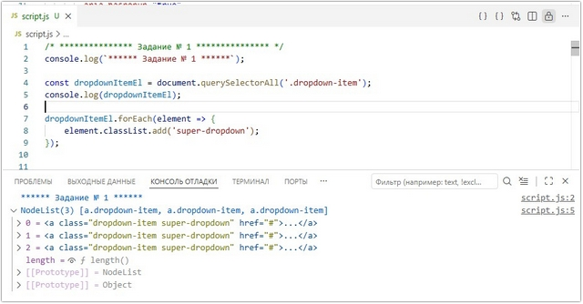


**Результат выполнения Задания № 2:**

```
console.log(`****** Задание № 2 ******`);

const btnElement = document.querySelector(".btn");
console.log(btnElement.classList);

for (btnSecondEl of btnElement.classList) {

  if (btnSecondEl === "btn-secondary") {
    btnElement.classList.remove("btn-secondary");
  } else {
    btnElement.classList.add("btn-secondary");
  }
}
console.log(btnElement.classList);
```

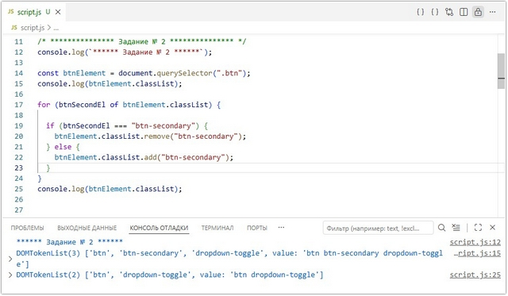


**Результат выполнения Задания № 3:**

```
console.log(`****** Задание № 3 ******`);

const menuElement = document.querySelector('.menu');
console.log(menuElement);

if (menuElement !== null) {
    menuElement.classList.remove('dropdown-menu');
    console.log(menuElement.classList);
} else {
    console.log('Элемент, содержащий класс "menu", отсутствует');
}
```

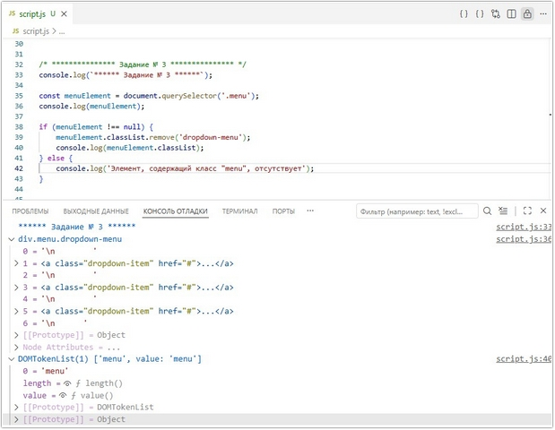


**Результат выполнения Задания № 4:**

```
console.log(`****** Задание № 4 ******`);

const divDropDownEl = document.querySelector("div.dropdown");
console.log(divDropDownEl);

divDropDownEl.insertAdjacentHTML('afterend', '<a href="#">link</a>')
console.log(divDropDownEl.nextElementSibling);
```

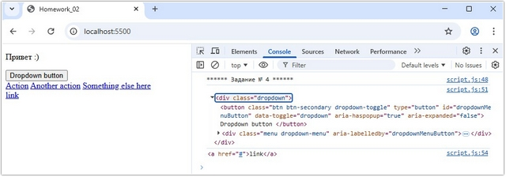


**Результат выполнения Задания № 5:**

```
console.log(`****** Задание № 5 ******`);

const idElement = document.querySelector('#dropdownMenuButton');
console.log(idElement);

idElement.setAttribute('id', 'superDropdown');
console.log(idElement);
```

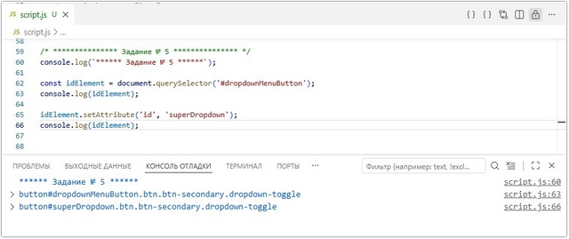


**Результат выполнения Задания № 6:**

```
console.log(`****** Задание № 6 ******`);

const  ariaLabelledbyAtr = document.querySelector('[aria-labelledby="dropdownMenuButton"]');
console.log(ariaLabelledbyAtr);

ariaLabelledbyAtr.setAttribute('data-dd', '3');
```

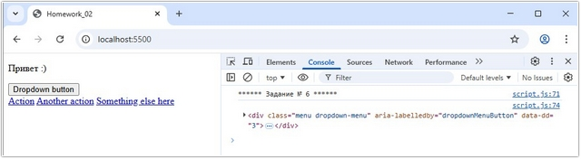


**Результат выполнения Задания № 7:**

```
console.log(`****** Задание № 7 ******`);

const  dropdownToggleClass = document.querySelector('.dropdown-toggle');
console.log(dropdownToggleClass);

dropdownToggleClass.removeAttribute('type');
```

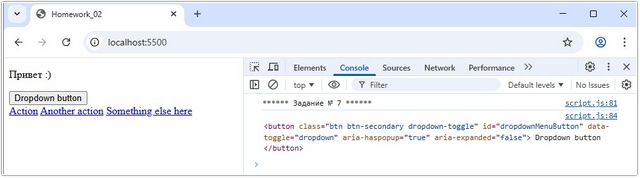


## Практическая работа с семинара ([решение](https://github.com/olgashenkel/GeekBrains-technological_specialization/tree/main/07.%20JavaScript%20Continued/04.%20Seminar_02/seminar_02)):

### Задание 1 (тайминг 25 минут)
Текст задания:
```
<div class="block">

</div>
```
1. Дан блок, внутри него необходимо создать элемент `div` с классом `item`, разместить текст `“Элемент внутри”` и задать стили:
   - Цвет текста синий
   - Рамка сплошная черная
   - Цвет фона #f8f8f8
   - Внутренний отступ 16px
2. Добавить данному блоку класс `item_1` (использовать `setAttribute`)

***Результат выполнения Задания № 1:***
```
console.log(`****** Задание № 1 ******`);

const divBlockEl = document.querySelector('.block');

const divItemEl = document.createElement('div');
divItemEl.className = 'item';
divItemEl.textContent = 'Элемент внутри';

divItemEl.style.color = 'blue';
divItemEl.style.border = '1px solid black';
divItemEl.style.backgroundColor = '#f8f8f8';
divItemEl.style.padding = '16px';
divItemEl.setAttribute('class', 'item item_1');

divBlockEl.appendChild(divItemEl);
console.log(divBlockEl);
```

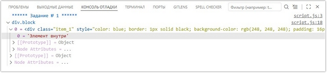


### Задание 2 (тайминг 25 минут)
Текст задания:

Дан код
```
<div class="elem">
  
  <div class="content">
    <h2 class="heading">Lorem, ipsum dolor.</h2>
    <p class="text">Lorem ipsum, dolor sit amet consectetur adipisicing elit. Recusandae, ea!</p>
  </div>
</div>
```

1. Необходимо с помощью `querySelector` найти параграф с классом `text`
2. Вывести в консоль соседний элемент `h2`
3. Вывести в консоль родительский элемент `content`
4. Вывести в консоль картинку
5. Вывести в консоль родительский элемент `elem`


***Результат выполнения Задания № 2:***
```
console.log(`\n****** Задание № 2 ******`);

const pElText = document.querySelector('.text');
const imgEl = document.querySelector('img');
const parentContentEl = document.querySelector('.content');
const parentElemEl = document.querySelector('.elem');

console.log(pElText);
console.log(pElText.previousElementSibling);

console.log(pElText.parentNode);
// или
console.log(parentContentEl);

console.log(imgEl);
// Решение с семинара:
console.log(pElText.parentElement.previousElementSibling);

console.log(parentContentEl.parentElement);
```
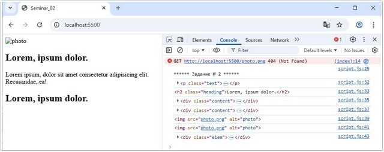


### Задание  3 (тайминг 20 минут)
Текст задания:
```
<div class="item">
  <div class="elem">
    <div class="info">
      <h2 class="subtitle">Lorem, ipsum dolor.</h2>
    </div>
  </div>
</div>
```
С помощью `querySelector` найти элемент `h2`  и вывести в консоль всех его родителей


***Результат выполнения Задания № 3:***

```
console.log(`\n****** Задание № 3 ******`);

const h2El = document.querySelector('h2');

if (h2El) {
    let parentEl = h2El.parentElement;

    while (parentEl) {
        console.log(parentEl);
        parentEl = parentEl.parentElement;
    }
} else {
    console.log('Элемент h2 не найден');
}
```

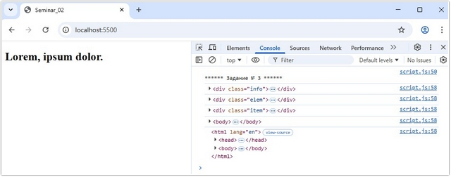


### Задание 4 (тайминг 25 минут)
Текст задания:
```
<form action="#">
  <input type="text">
  <button class="btn">Отправить</button>
</form>
```
1. Дано поле ввода и кнопка отправить, необходимо реализовать функционал, если пользователь нажимает на кнопку отправить, а поле ввода пустое, то под полем ввода и кнопкой должен появиться заголовок `h2` с текстом вы не заполнили поле ввода
2. Цвет у рамки сделать красным


***Результат выполнения Задания № 4:***

```
console.log(`\n****** Задание № 4 ******`);

const btn = document.querySelector(".btn");
const inputEl = document.querySelector("input");

const errorHeader = document.createElement("h2");
errorHeader.textContent = "Вы не заполнили поле ввода";

btn.addEventListener("click", () => {
  if (inputEl.value.trim() === "") {
    inputEl.classList.add("error-border");
    document.body.appendChild(errorHeader);
  } else {
    inputEl.classList.remove("error-border");
    errorHeader.remove();
  }
}); 
```
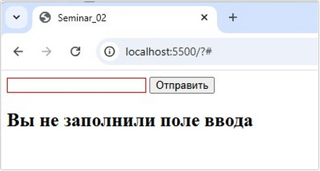


### Задание 5 (тайминг 20 минут)
Текст задания:

1. Дан тег `<div class="content"></div>` 
2. Создайте с помощью javascript новый элемент `button`
3. Добавьте текст для кнопки `“Отправить”`
4. При клике на данную кнопку необходимо чтобы текст поменялся на `“Текст отправлен”`


***Результат выполнения Задания № 5:***

```
console.log(`\n****** Задание № 5 ******`);

const elemDivContent = document.querySelector('.content');
const buttonDivContent = document.createElement('button');
buttonDivContent.textContent = 'Отправить';

elemDivContent.appendChild(buttonDivContent);
console.log(elemDivContent);
console.log(buttonDivContent);

buttonDivContent.addEventListener('click', () => {
    buttonDivContent.textContent = 'Текст отправлен';
    console.log(buttonDivContent.textContent);
});

```
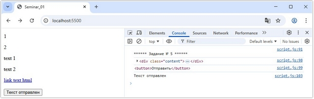