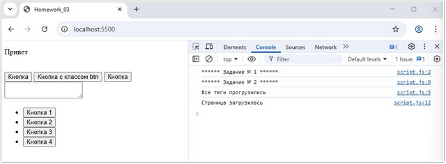
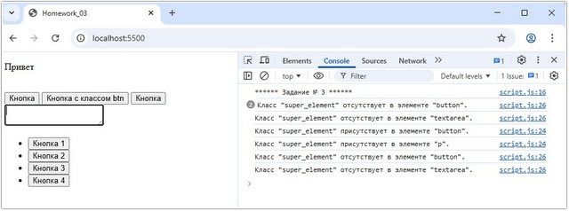
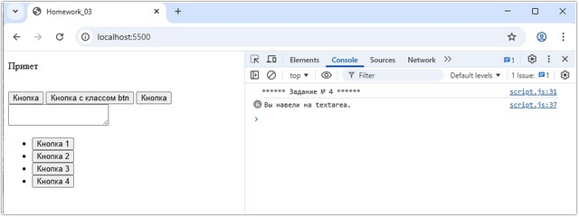
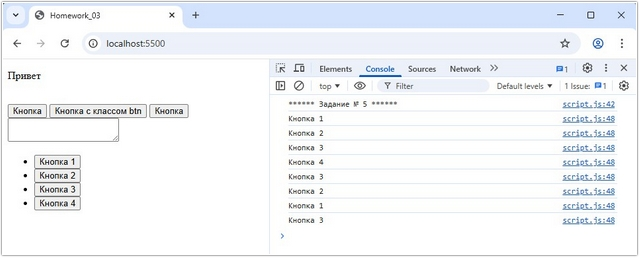
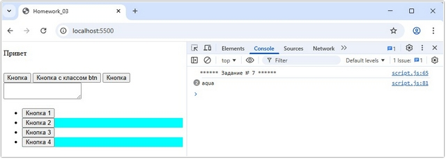
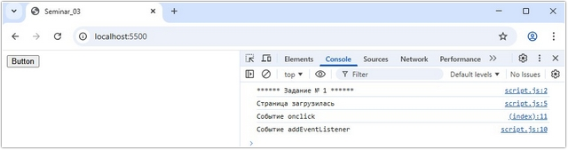
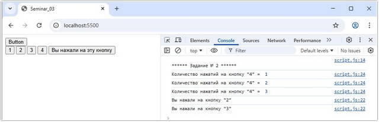
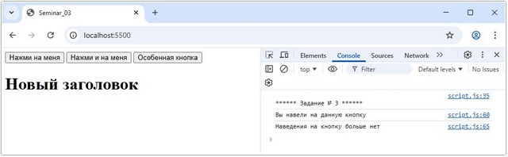
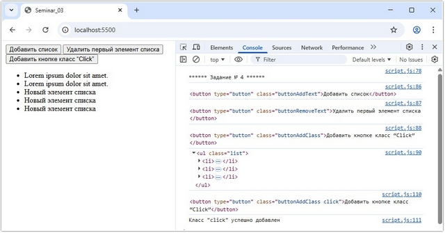

# Урок 6. Семинар. Основы событий в JavaScript

## План урока

- Выполнение практических заданий в соответствии с [презентацией](https://gbcdn.mrgcdn.ru/uploads/asset/5092936/attachment/45db9c090a5b06009a674dc185073bca.pptx) к уроку
- События в DOM   
События — это сигналы от браузера или другой среды исполнения JavaScript. Эти сигналы используются в DOM, чтобы уведомить JavaScript-код, что интересующие его действия произошли. События возникают в результате действий пользователя (заполнение и отправка формы, нажатие на кнопку, движение мыши, изменение размера окна) или потому, что изменилось


## Домашняя работа ([решение](https://github.com/olgashenkel/GeekBrains-technological_specialization/tree/main/07.%20JavaScript%20Continued/06.%20Seminar_03/homework))

В этом задании вы будете работать с различными типами событий и обработчиков в
JavaScript.

Все задачи решайте внутри тега `<script>`.

**Дан HTML:**
```
<!doctype html>
<html lang="en">
  <head>
    <meta charset="UTF-8" />
    <title>Homework_03</title>
  </head>
  <body>
    <p class="super_element">Привет</p>
    
    
    
    
    
    
    
    <br />
    <button>Кнопка</button>
    <button class="super_element">Кнопка с классом btn</button>
    <button>Кнопка</button>
    <br />
    <textarea></textarea>
    <br />
    <ul>
      <li>
        <button>Кнопка 1</button>
      </li>
      <li>
        <button>Кнопка 2</button>
      </li>
      <li>
        <button>Кнопка 3</button>
      </li>
      <li>
        <button>Кнопка 4</button>
      </li>
    </ul>
  </body>
</html>
```

**Задачи:**
1. Необходимо вывести сообщение в консоль `"все теги прогрузились"`, когда все теги будут созданы браузером.
2. Необходимо вывести сообщение в консоль `"страница загрузилась"`, когда все ресурсы страницы будут загружены.
3. При клике на какой-либо тег на странице в консоль должно выводиться сообщение следующего вида: 
   - Класс `"super_element"` присутствует в элементе `"div"`
   - Сообщение должно определять присутствует ли класс `"super_element"` у элемента и выводить в нижнем регистре верный тег в данной строке, по которому был совершен клик.
   - Необходимо использовать делегирование.
4. Сделайте так, чтобы при наведении на `<textarea>` в консоли появлялось
сообщение: `"Вы навели на textarea."`
5. Необходимо повесить событие клика на тег `<ul>`. В обработчике события в консоль выводите текст, который записан внутри элемента кнопки, по которой был произведен клик. Если клик был не по кнопке, то ничего выводить не нужно. Необходимо использовать делегирование.
6. Вопрос: Почему в `console.log` сначала пишется текст из 5 задания и только потом текст из 3 задания, если мы кликаем по кнопкам в `<ul>`? Ответ необходимо написать здесь же, под этим комментарием, своими словами.
7. С помощью `JS` необходимо изменить цвет заднего фона каждого второго тега `<li>`.


**Результат выполнения Задания № 1:**
```
console.log(`****** Задание № 1 ******`);

window.addEventListener('DOMContentLoaded', function (e) {
    console.log('Все теги прогрузились');
});
```


**Результат выполнения Задания № 2:**
```
console.log(`****** Задание № 2 ******`);

window.addEventListener('load', function (e) {
    console.log('Страница загрузилась');
});
```




**Результат выполнения Задания № 3:**
```
console.log(`****** Задание № 3 ******`);

document.body.addEventListener("click", (event) => {
  const target = event.target;
  const tagName = target.tagName.toLowerCase();
  const hasSuperClass = target.classList.contains("super_element");
  
  if (hasSuperClass) {
    console.log(`Класс "super_element" присутствует в элементе "${tagName}".`);
  } else {
    console.log(`Класс "super_element" отсутствует в элементе "${tagName}".`);
  }
});
```




**Результат выполнения Задания № 4:**
```
console.log(`****** Задание № 4 ******`);

const textAreaEl = document.querySelector('textarea');

document.addEventListener('mouseenter', function (e) {
   
        console.log('Вы навели на textarea.');
    
});
```




**Результат выполнения Задания № 5:**
```
console.log(`****** Задание № 5 ******`);

const ulElem = document.querySelector('ul');

ulElem.addEventListener('click', function (e) {
    if (e.target.tagName === 'BUTTON') {
        console.log(e.target.textContent);
    }
});
```




**Результат выполнения Задания № 6:**
```
Когда мы нажимаем на какой-либо элемент на странице и генерируется событие нажатия, то это событие может распространяться от элемента к элементу, т.е. происходит распространение события.

Виды форм распространения событий:
  1) Восходящие (bubbling) - событие распространяется вверх по дереву DOM от дочерних узлов к родительским.
    В JavaScript обработчики событий по умолчанию работают именно в таком порядке    
  2) Нисходящие (capturing) - событие распространяется низ по дереву DOM от родительских узлов к дочерним, пока не достигнет того элемента, на котором это событие и возникло.

В данном случае используется форма - ВОСХОДЯЩЕГО события (bubbling).
```


**Результат выполнения Задания № 7:**
```
console.log(`****** Задание № 7 ******`);

// // 1-ый способ:
// const liElem = document.querySelectorAll("li");

// for (let index = 1; index < liElem.length; index += 2) {
//   liElem[index].style.backgroundColor = 'aqua';
//   console.log(liElem[index].style.backgroundColor);
// }


// 2-ой способ:
const liElem = document.querySelectorAll("li:nth-child(even)");

liElem.forEach(element => {
    element.style.backgroundColor = 'aqua';
    console.log(element.style.backgroundColor);
});
```




## Практическая работа с семинара ([решение](https://github.com/olgashenkel/GeekBrains-technological_specialization/tree/main/07.%20JavaScript%20Continued/06.%20Seminar_03/seminar_03)):

### Задание 1 (тайминг 15 минут)

Текст задания:

1. В `html` создать кнопку `button`
2. После загрузки страницы вывести в консоль текст `“страница загрузилась”`
3. Добавить событие `onclick` которое выводит в консоль текст `“событие onclick”`
4. Добавить событие `addEventListener`, которое выводит в консоль текст `“событие addEventListener”`


***Результат выполнения Задания № 1:***

*HTML*
```
<button
  class="button"
  type="button"
  onclick="console.log('Событие onclick')"
>
  Button
</button>
```

*JavaScript*
```
console.log(`****** Задание № 1 ******`);

window.addEventListener("load", () =>
  console.log("Страница загрузилась"),
);

const buttonEl = document.querySelector(".button");
buttonEl.addEventListener("click", function () {
  console.log("Событие addEventListener");
});
```




### Задание 2 (тайминг 30 минут)
Текст задания:
1. Создать в `html` три кнопки `button` с нумерацией (1, 2, 3 соответственно)
2. Добавить клик на кнопку, чтобы в консоль выводилась именно та кнопка на которую мы нажали
3. Добавить кнопку `button` с текстом `4`, которая считает сколько раз на нее нажали и количество нажатий на эту кнопку выводит в консоль
4. Создать кнопку `button` с текстом `5`, При клике на которую, меняется текст данной кнопки на `“Вы нажали на эту кнопку”`


***Результат выполнения Задания № 2:***

*HTML*
```
<div>
  <button class="buttons" type="button">1</button>
  <button class="buttons" type="button">2</button>
  <button class="buttons" type="button">3</button>
  <button class="buttons" type="button">4</button>
  <button class="buttons" type="button">5</button>
</div>
```

*JavaScript*
```
console.log(`\n****** Задание № 2 ******`);

const buttonsEl = document.querySelectorAll(".buttons");

let countClick = 0;

function btnClickName(e) {
  if (Number(e.target.innerText) < buttonsEl.length - 1) {
    console.log(`Вы нажали на кнопку "${e.target.innerText}"`);
  } else if (Number(e.target.innerText) === buttonsEl.length - 1) {
    console.log(`Количество нажатий на кнопку "${buttonsEl.length - 1}" = ${++countClick}`);
  } else if (Number(e.target.innerText) === buttonsEl.length) {
    e.target.innerText = "Вы нажали на эту кнопку";
  }
}

buttonsEl.forEach((btn) => {
  btn.addEventListener("click", btnClickName);
});
```




### Задание  3 (тайминг 30 минут)
Текст задания:
1. Создать кнопку, которая добавляем заголовок `h1` с текстом, `Новый заголовок`, данный элемент нужно расположить после кнопки
2. Создать вторую кнопку, которая будет удалять созданный заголовок `h1`
3. Создать третью кнопку, при наведении на которую в консоль будет выводиться текст `“вы навели на данную кнопку”`, как только вы убираем курсор мыши с кнопки, в консоли должен появиться текст `“Наведения на кнопку больше нет”`


***Результат выполнения Задания № 3:***

*HTML*
```
<button type="button" class="buttonThree1">Нажми на меня</button>

<button type="button" class="buttonThree2">Нажми и на меня</button>

<button type="button" class="buttonThree3">Особенная кнопка</button>
```

*JavaScript*
```
console.log(`\n****** Задание № 3 ******`);

const buttonThree1El = document.querySelector(".buttonThree1");
const buttonThree2El = document.querySelector(".buttonThree2");
const buttonThree3El = document.querySelector(".buttonThree3");

const header = document.createElement("h1");
header.textContent = "Новый заголовок";

let timer;

buttonThree1El.addEventListener("click", () => {
  document.body.appendChild(header);
});

buttonThree2El.addEventListener("click", () => {
  if (document.querySelector("h1")) {
    document.body.removeChild(header);
  } else {
    alert("Элемент уже удален или не существует!");
    console.log("Элемент уже удален или не существует!");
  }
});

buttonThree3El.addEventListener("mouseenter", () => {
  console.log("Вы навели на данную кнопку");
  buttonThree3El.textContent = "Вы навели на данную кнопку";
});

buttonThree3El.addEventListener("mouseleave", () => {
  console.log("Наведения на кнопку больше нет");
  buttonThree3El.textContent = "Наведения на кнопку больше нет";
  clearTimeout(timer);

  // Возвращаем текст через 2 секунды (2000 мс)
  timer = setTimeout(() => {
    buttonThree3El.textContent = "Особенная кнопка";
  }, 1500);
});
```




### Задание 4 (тайминг 30 минут)
Текст задания:
1. Создать в `html` список состоящий из 3-х произвольных элементов `li`
2. Нужно создать кнопку которая будет добавлять элементы списка с текстом `“новый элемент списка”`
3. Создать кнопку, которая будет удалять первый элемент из созданного списка
4. Создать кнопку, при клике на которую ей добавляется класс `“click”`


***Результат выполнения Задания № 4:***

*HTML*
```
<button type="button" class="buttonAddText">Добавить список</button>
<button type="button" class="buttonRemoveText">Удалить первый элемент списка</button>
<button type="button" class="buttonAddClass">Добавить кнопке класс “Click”</button>
<ul class="list">
  <li>Lorem ipsum dolor sit amet.</li>
  <li>Lorem ipsum dolor sit amet.</li>
  <li>Lorem ipsum dolor sit amet.</li>
</ul>
```

*JavaScript*
```
console.log(`\n****** Задание № 4 ******`);

const buttonAddTextEl = document.querySelector(".buttonAddText");
const buttonRemoveTextEl = document.querySelector(".buttonRemoveText");
const buttonAddClassEl = document.querySelector(".buttonAddClass");

const listEl = document.querySelector(".list");

console.log(buttonAddTextEl);
console.log(buttonRemoveTextEl);
console.log(buttonAddClassEl);

console.log(listEl);

buttonAddTextEl.addEventListener("click", () => {
  const liEl = document.createElement("li");
  liEl.textContent = "Новый элемент списка";
  listEl.appendChild(liEl);
});

buttonRemoveTextEl.addEventListener("click", () => {
  if (listEl.firstElementChild) {
    listEl.removeChild(listEl.firstElementChild);
  } else {
    alert("Все элементы уже удалены!");
    console.log("Все элементы удалены!");
  }
});

<!-- buttonAddClassEl.addEventListener("click", () => {
  if (!buttonAddClassEl.classList.contains('click')) {
    buttonAddClassEl.classList = buttonAddClassEl.classList + " click";
    console.log(buttonAddClassEl);
    console.log('Класс "click" успешно добавлен');
  } else {
    alert('Класс "click" уже добавлен');
    console.log('Класс "click" уже добавлен');
  }
}); -->


// Решение с семинара:
buttonAddClassEl.addEventListener('click', function (e) {
  const target = e.target;
  target.classList.add('click');
  console.log(buttonAddClassEl);
});
```

