# Урок 8. Семинар. Работа с событиями

## План урока

- Выполнение практических заданий в соответствии с [презентацией](https://gbcdn.mrgcdn.ru/uploads/asset/5092933/attachment/106cc62e5db39bdae17da766eceb9104.pptx) к уроку
- Прерывание распространения события   
В процессе разработки иногда возникает задача не вызывать часть слушателей событий при некотором условии. Конечно, можно добавить проверку условия в код каждого обработчика, но лучшим решением станет добавление ещё одного слушателя перед остальными или в более раннюю фазу захвата. В нём мы будем проверять условие и останавливать дальнейшее распространение события. Для этого у события есть два метода: Event.stopPropagation() и Event.stopImmediatePropagation().


## Домашняя работа ([решение](https://github.com/olgashenkel/GeekBrains-technological_specialization/tree/main/07.%20JavaScript%20Continued/08.%20Seminar_04/homework))

В этом задании вам предстоит работать с различными событиями и манипуляциями
DOM. Все задачи выполняйте внутри тега `<script>`.


**Дан код:**
```
<!doctype html>
<html lang="en">
  <head>
    <meta charset="UTF-8" />
    <title>Homework_04</title>
    <style>
      .error {
        border: 2px solid red;
        outline: none; /* Убираем стандартное выделение при
фокусе */
      }
      /* Анимация для появления */
      .animate_animated {
        animation-duration: 1s; /* Продолжительность анимации */
        animation-fill-mode: both; /* Держать финальное
состояние анимации */
      }
      .animate_fadeInLeftBig {
        @keyframes fadeInLeftBig {
          0% {
            opacity: 0;
            transform: translateX(-1000px);
          }
          100% {
            opacity: 1;
            transform: translateX(0);
          }
        }
        animation-name: fadeInLeftBig;
      }
    </style>
  </head>
  <body>
    <input id="from" type="text" />
    В инпуте написано: <span></span>
    <br />
    <button class="messageBtn">Показать блок</button>
    <div class="message">Привет :)</div>
    <br />
    <form>
      <label>
        Первый инпут:
        <input class="form-control" type="text" />
      </label>
      <br />
      <br />
      <label>
        Второй инпут:
        <select class="form-control">
          <option value=""></option>
          <option value="1">Один</option>
          <option value="2">Два</option>
        </select>
      </label>
      <br />
      <br />
      <button type="submit">Отправить</button>
    </form>
  </body>
</html>
```

**Задачи:**
1. При изменении значения в `<input>` с `id="from"`, значение, содержащееся в нем, должно моментально отображаться в `<span>`. 
   * Это значит, что при каждом изменении текста в `инпуте`, текст в `<span>` должен обновляться соответственно.

2. При клике на кнопку с классом `messageBtn` необходимо выполнить
следующие действия для элемента с классом `message`:
   * Добавить два класса: `animate_animated` и `animate_fadeInLeftBig`.
   * Установить стиль `visibility` в значение `'visible'`

3. При отправке формы проверьте, заполнены ли все поля.
    * Если какое-либо поле не заполнено, форма не должна отправляться.
    * Незаполненные поля должны быть подсвечены (добавлен класс `error`).
    * Как только пользователь начинает заполнять поле, выполните проверку:
      * Если поле пустое, подсветите его (добавьте класс `error`).
      * Если поле заполнено, уберите подсветку (удалите класс `error`).

**Результат выполнения Задания № 1:**
```
console.log(`****** Задание № 1 ******`);

const inputFromEl = document.getElementById("from");
const spanEl = document.querySelector("span");
console.log(inputFromEl);
console.log(spanEl);

inputFromEl.addEventListener("input", (e) => {
  spanEl.textContent = inputFromEl.value;
});
```

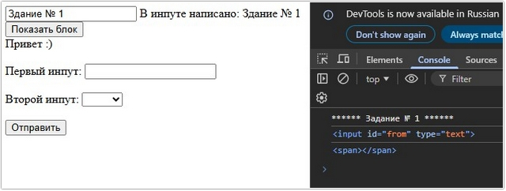


**Результат выполнения Задания № 2:**
```
console.log(`****** Задание № 2 ******`);

const messageBtnEl = document.querySelector(".messageBtn");
console.log(messageBtnEl);
const messageEl = document.querySelector(".message");
console.log(messageEl);

messageBtnEl.addEventListener("click", (e) => {
  messageEl.classList.add("animate_animated", "animate_fadeInLeftBig");
  messageEl.style.visibility = "visible";
  console.log(messageEl);
});
```

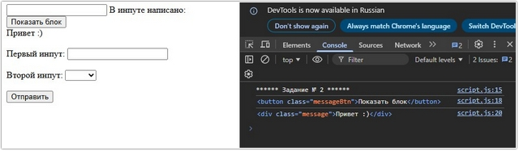

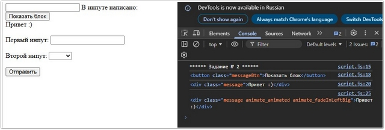


**Результат выполнения Задания № 3:**
```
console.log(`****** Задание № 3 ******`);

const formEl = document.querySelector("form");
console.log(formEl);

const inputEl = formEl.querySelectorAll(".form-control");
console.log(inputEl);

formEl.addEventListener("submit", (e) => {
  let valid = true;
  inputEl.forEach((input) => {
    if (input.value.trim() === "") {
      input.classList.add("error");
      valid = false;
    }
  });
  if (!valid) {
    e.preventDefault(); // Предотвращаем отправку формы, если есть ошибки
  }
});
inputEl.forEach((input) => {
  input.addEventListener("input", () => {
    if (input.value.trim() === "") {
      input.classList.add("error");
    } else {
      input.classList.remove("error");
    }
  });
});
```

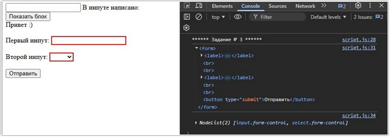


## Практическая работа с семинара ([решение](https://github.com/olgashenkel/GeekBrains-technological_specialization/tree/main/07.%20JavaScript%20Continued/08.%20Seminar_04/seminar_04)):

### Задание 1 (тайминг 20 минут)

Текст задания:

1. В html создать элемент `checkbox` и текст рядом с ним `“Согласен с условиями”`
2. Добавить кнопку `отправить`
3. При клике на кнопку `отправить` нужно проверять выбран ли активным элемент `checkbox`
4. Если элемент не выбран, добавить текст под чекбоксом `“Необходимо согласиться с условиями”`


***Результат выполнения Задания № 1:***

*HTML*
```
  <head>
    <style>
      .error {
        font-style: italic;
        font-weight: bold;
        color: #ff5733;
      }

      .error-check {
        appearance: none;
        border: 5px solid red;
        border-radius: 2px;
        margin: 3px 3px 0px 4px;
        border: 1px solid red;
        width: 13px;
        height: 13px;
        border-color: #ff5733;

        &:checked {
          appearance: auto;
          accent-color: #ff5733;
        }
      }
    </style>

  </head>

  <body>
<form class="form" action="#">
  <h1 class="headerForm">Форма отправки данных</h1>
  <p class="textForm">Lorem ipsum dolor sit, amet consectetur adipisicing elit. Officia nobis possimus tenetur voluptate facilis, in tempora! Iste, esse beatae. Atque repellat architecto doloribus in porro.</p>
  <input type="checkbox" class="inputCheck" name="inputCheck" id="inputCheck">
  <label for="inputCheck">Согласен с условиями</label>
  <div class="error"></div>
  <button class="buttonCheck" type="submit">Отправить</button>
</form>
</body>
```

*JavaScript*
```
console.log(`****** Задание № 1 ******`);

const formEl = document.querySelector(".form");
const inputCheckEl = formEl.querySelector(".inputCheck");
const errorDivEl = formEl.querySelector(".error");

inputCheckEl.addEventListener("click", function (e) {
  const target = e.target;
  console.log(target.value);
  console.log(target.checked);
});

formEl.addEventListener("submit", function (e) {
  if (inputCheckEl.checked) {
    console.log("Форма отправлена");
  } else {
    console.log('Необходимо выбрать "Согласен с условиями"');
    errorDivEl.textContent = 'Необходимо выбрать "Согласен с условиями"';
    formEl.classList.add("errorDivEl");
    inputCheckEl.classList.add("error-check");
    e.preventDefault();
  }
});
```

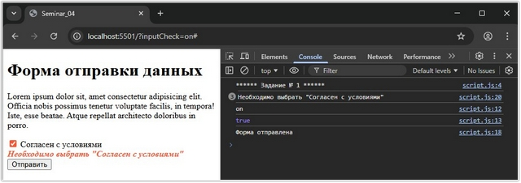


### Задание 2 (тайминг 30 минут)
Текст задания:
1. В `html` создать 2 элемента радио кнопки (`input type=”radio”`) и текст `“Чай”, “Кофе”` соответственно
2. Кнопка `отправить`
3. Если выбран чай, необходимо вывести сообщение `“Чай закончился”`
4. Если выбран кофе, необходимо вывести сообщение `“кофе закончился”`


***Результат выполнения Задания № 2:***

*HTML*
```
<form action="#" class="form">
  <div class="inputForm">
    <input class="radio" type="radio" name="hotDrinks" id="Tea" />Чай
    <label for="Tea"></label>

    <input class="radio" type="radio" name="hotDrinks" id="Coffee" />Кофе
    <label for="Coffee"></label>
  </div>
  
  <div class="buttonForm">
    <button class="button" type="submit">Отправить</button>
  </div>
</form>
```

*JavaScript*
```
console.log(`\n****** Задание № 2 ******`);

const formEl = document.querySelector(".form");
const buttonEl = formEl.querySelector(".button");

buttonEl.addEventListener("click", function (e) {
    e.preventDefault();
    
  const selectDrink = formEl.querySelector('input[name="hotDrinks"]:checked');

  if (!selectDrink) {
    alert("Вы ничего не выбрали");
    console.log("Вы ничего не выбрали");    
  } else if (selectDrink.id === "Coffee") {
    alert("Кофе закончился");
    console.log("Кофе закончился");
  } else if (selectDrink.id === "Tea") {
    alert("Чай закончился");
    console.log("Чай закончился");
  }
});
```

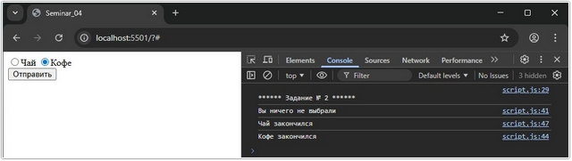


### Задание  3 (тайминг 30 минут)
Текст задания:
1. Создать `поле ввода (пароль)`
2. Кнопка `отправить`
3. Если пользователь вводит текст `“пароль”`, то поле ввода должно быть подсвечено зеленым цветом
4. Если пароль неверный, у поля ввода появляется красная обводка и текст `“пароль неверный”`


***Результат выполнения Задания № 3:***

*HTML*
```
<style>
  [aria-invalid]{
    border: 3px solid red;
  }

  [role="alert"]{
    background-color: #ffcccc;
    width: 200px;
    text-align: center;
    font-weight: bold;
    padding: 5px;
    border: 1px dashed #000;
  }

  div {
    margin: 10px 0;
    padding: 5px;
    width: 400px;
    background-color: #ffffff;
  }
  
</style>


<form action="#" id="passwordForm">
  <div>
  <input
    type="password"
    name="password"
    id="passwordInput"
    placeholder="Введите пароль"
    aria-required="true"             
    required
  />
<!-- 
aria-required="true"  => для экранного диктора. В рез-те будет выдаваться звуковое предупреждение           
required => атрибут, который требует обязательного внесения данных
-->

  
  <input id="passwordButton" type="submit" value="Отправить"/ >
</div>  
</form>

```

*JavaScript*
```

const passwordCode = "пароль";
document.getElementById("passwordInput").onchange = validateField;
document.getElementById("passwordForm").onsubmit = finalCheck;

function removeAlert() {
  // Функция для удаления всех предупреждений независимо от их значения
  var msg = document.getElementById("msg");
  if (msg) {
    document.body.removeChild(msg);
  }
}

function resetField(elem) {
  elem.parentNode.setAttribute("style", "background-color: #ffffff");
  var valid = elem.getAttribute("aria-invalid");
  if (valid) {
    elem.removeAttribute("aria-invalid");
  }
}

function badField(elem) {
  elem.setAttribute("aria-invalid", "true");
}

function goodField(elem) {
  elem.setAttribute("style", "border: 3px solid green");
}

function generateAlert(txt) {
  // Создаем новые текстовые элементы и элементы div,
  // присваиваем им значения атрибутов role, class и id

  var txtNd = document.createTextNode(txt);
  var msg = document.createElement("div");
  msg.setAttribute("role", "alert");
  msg.setAttribute("id", "msg");
  msg.setAttribute("class", "alert");

  // Прикрепляем текстовый элемент к div, а div - к document
  msg.appendChild(txtNd);
  document.body.appendChild(msg);
}

function validateField() {
  // Функция для проверки корректности введенных данных в поле ввода
  // Удаляем все предупреждения независимо от их значения с помощью функции:
  removeAlert();

  // Проверяем, является ли введенное значение верным:
  if (this.value === passwordCode) {
    resetField(this);
    this.setAttribute("style", "border: 3px solid green");
  } else {
    badField(this);
    generateAlert("Пароль неверный!");
  }
}

function finalCheck() {
  //Функция для проверки корректности введенных данных при отправке формы
  // Удаляем все предупреждения независимо от их значения с помощью функции:
  removeAlert();

  var fields = document.querySelectorAll("[aria-invalid='true']");
  if (fields.length > 0) {
    generateAlert("Пароль неверный!");
    return false;
  }
}
```

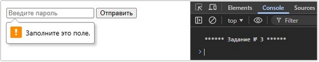

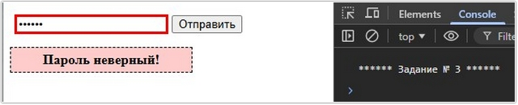

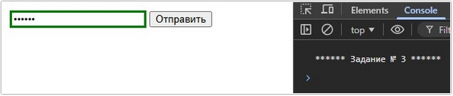


### Задание 4 (тайминг 30 минут)
Текст задания:
1. Создать `поле ввода` и под ним заголовок `h1` с текстом `“Заголовок”`
2. При вводе текста в `поле ввода` необходимо чтобы текст внутри заголовка меняется на введенный в `поле ввода`


***Результат выполнения Задания № 4:***

*HTML*
```
<form action="#" class="inputForm">
  <input type="text" id="input" placeholder="Введите текст..." />
  <h1 class="title">Lorem, ipsum dolor</h1>
</form>
```

*JavaScript*
```
console.log(`\n****** Задание № 4 ******`);

const inputEl = document.getElementById("input");
const h1El = document.querySelector(".title");


inputEl.addEventListener("input", (e) => {
  h1El.innerText = inputEl.value;
});
```

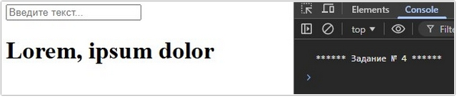

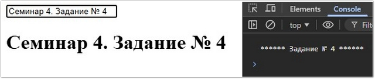