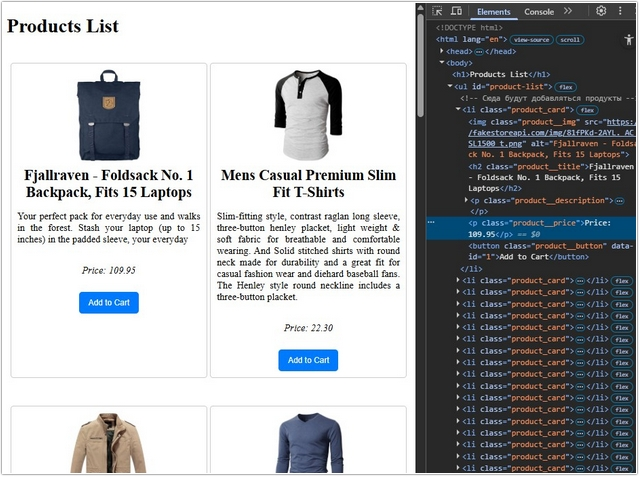
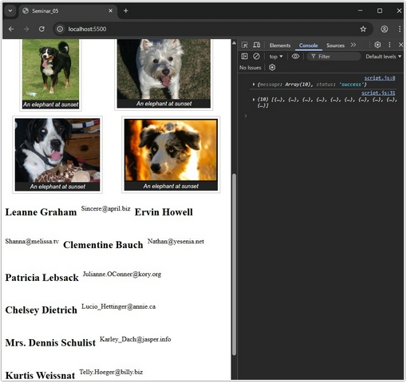

# Урок 10. Семинар. Работа с JSON

## План урока

- Выполнение практических заданий в соответствии с [презентацией](https://gbcdn.mrgcdn.ru/uploads/asset/5092934/attachment/7a54b5f9bcfccc68413367f69553ed8a.pdf) к уроку
- Введение в JSON
- JSON (сокращение от JavaScript Object Notation) — это формат передачи данных. Как можно понять из названия, JSON произошел из JavaScript, но он также доступен для использования во многих других языках, включая Python, Ruby, PHP и Java. В англоязычным странах название формата в основном произносят как имя Дже́йсон (Jason), а в русскоязычных — преимущественно с ударением на «о»: Джисо́н.


## Домашняя работа ([решение](https://github.com/olgashenkel/GeekBrains-technological_specialization/tree/main/07.%20JavaScript%20Continued/10.%20Seminar_05/homework))


**Файл index.html:**
```
<!doctype html>
<html lang="en">
  <head>
    <meta charset="UTF-8" />
    <meta
      name="viewport"
      content="width=device-width,
initial-scale=1.0"
    />
    <title>Products List (Homework_05)</title>
    <style>
      /* Стили по желанию */
      ul {
        display: flex;
        justify-content: center;
        flex-wrap: wrap;
        gap: 5px;
        list-style-type: none;
        padding: 0;
      }
      li {
        margin: 20px 0;
        padding: 10px;
        border: 1px solid #ccc;
        border-radius: 5px;
        display: flex;
        align-items: center;
        flex-direction: column;
        align-items: center;
        width: 300px;
      }
      img {
        margin-bottom: 10px;
        height: 150px;
      }
      h2 {
        margin: 0;
        font-size: 1.5rem;
        text-align: center;
      }
      button {
        margin-top: 10px;
        padding: 10px 15px;
        border: none;
        border-radius: 5px;
        background-color: #007bff;
        color: white;
        cursor: pointer;
      }
      button:hover {
        background-color: #0056b3;
      }
      .product__description {
        text-align: justify;
      }

      .product__price {
        font-style: italic;
        align-content:flex-start;
      }
    </style>
  </head>
  <body>
    <h1>Products List</h1>
    <ul id="product-list">
      <!-- Сюда будут добавляться продукты -->
    </ul>

    <!-- Подключение файла data.js -->
    <script src="data.js"></script>
    <!-- Подключение файла script.js -->
    <script src="script.js"></script>
  </body>
</html>
```

**Задание:**
1. Получите данные по адресу https://fakestoreapi.com/products.
2. Создайте файл `data.js`.
3. В файле `data.js` создайте переменную `dataJSON`, которая будет
хранить эти данные в формате `JSON`.
4. Создайте вторую переменную `data`, в которой сохраните данные в
формате массива на основе `dataJSON`.
5. Создайте файл `index.html`.
6. Подключите `data.js` в `index.html`.
7. Сформируйте контент из данных (картинка, заголовок, описание,
цена и кнопка `“Add to Cart”`).
8. Добавьте данный контент в верстку в виде списка `ul` и `li`.
9. Добавьте стили при необходимости (по желанию).

**Результат выполнения Домашней работы:**


*JavaScript*
```
// Функция для добавления данных в контент в список Ul и Li:
function addElementsToUl(containerID, dataJSON) {
  // Поиск элемента по ID
  const productListEl = document.getElementById(containerID);

  // Перебор данных, полученных из JSON  файла, создание и добавление новых данных для карточки товара:
  dataJSON.forEach((dataEl) => {
    // Создание элемента Li
    const productLiEl = document.createElement("li");
    productLiEl.classList.add("product_card");

    // Добавление рисунка в карточку
    const productImg = document.createElement("img");
    productImg.classList.add("product__img");
    productImg.src = dataEl.image;
    productImg.alt = dataEl.title;

    // Добавление заголовка в карточку
    const productTitle = document.createElement("h2");
    productTitle.classList.add("product__title");
    productTitle.textContent = dataEl.title;

    // Добавление описания в карточку
    const productDescription = document.createElement("p");
    productDescription.classList.add("product__description");
    productDescription.textContent = dataEl.description;

    // Добавление цены в карточку
    const productPrice = document.createElement("p");
    productPrice.classList.add("product__price");
    productPrice.textContent = `Price: ${dataEl.price.toFixed(2)}`;

    // Добавление кнопки “Add to Cart” в карточку
    const productButton = document.createElement("button");
    productButton.classList.add("product__button");
    productButton.setAttribute('data-id', dataEl.id);
    productButton.textContent = 'Add to Cart';

    // Добавление всех элементов в карточку товара Li
    productLiEl.append(productImg, productTitle, productDescription, productPrice, productButton);

    // Добавление карточки товара в основной раздел UL
    productListEl.append(productLiEl);
  });
}

addElementsToUl("product-list", data);
```




## Практическая работа с семинара ([решение](https://github.com/olgashenkel/GeekBrains-technological_specialization/tree/main/07.%20JavaScript%20Continued/09.%20Seminar_05/seminar_05)):


***Результат выполнения Практической работы:***

*HTML*
```
<!doctype html>
<html lang="en">
  <head>
    <meta charset="UTF-8" />
    <meta name="viewport" content="width=device-width, initial-scale=1.0" />
    <title>Seminar_05</title>
    <link rel="stylesheet" href="style.css">
  </head>
  <body>

    <!-- !!! Очередность чтения кода браузером идет сверху вниз! Поэтому подключенный файл data.js должен стоять первым для успешного чтения и загрузки данных из него!!! -->
    <script src="data.js"></script>
    <script src="script.js" type="module"></script>
  </body>
</html>
```

*JavaScript*
```
"use strict";

let divEl = document.createElement("div");
let bodyEl = document.querySelector("body");
let parseData = JSON.parse(data);

bodyEl.appendChild(divEl);
console.log(parseData);

parseData.message.forEach((element) => {
  divEl.insertAdjacentHTML(
    "beforeend",
    `
    <figure>
  
  <figcaption>An elephant at sunset</figcaption>
</figure>`,
  );
});

let urlEl = "https://jsonplaceholder.typicode.com/users";
async function getData(urlEl) {
  const response = await fetch(urlEl);
  const jsonEl = await response.json();
  return jsonEl;
}

try {
  const myData = await getData(urlEl);
  console.log(myData);
  myData.forEach(element => {
    divEl.insertAdjacentHTML("beforeend", `
      <h2>${element.name}</h2>
      <p>${element.email}</p>`)
  })
} catch (error) {
  console.log(error.message);
}
```

