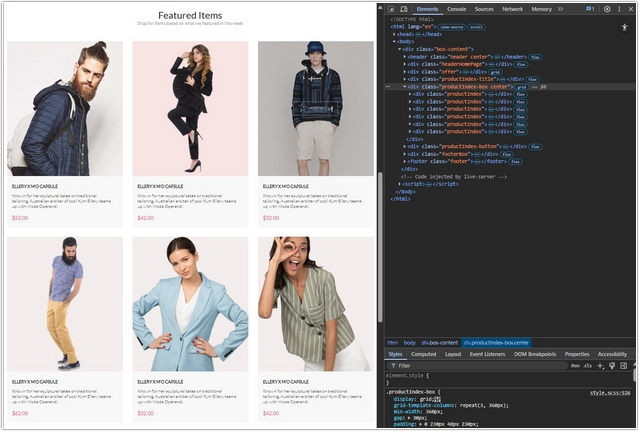
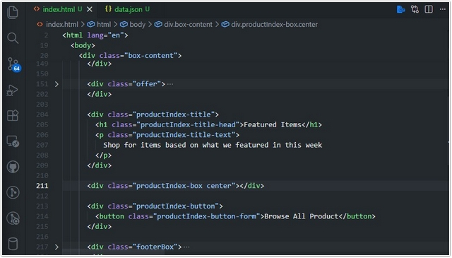
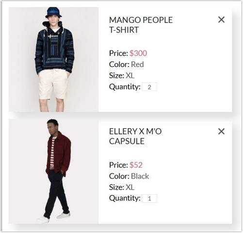

# Урок 11. Семинар. Шаблонизация

## План урока

- Выполнение практических заданий в соответствии с [презентацией](https://gbcdn.mrgcdn.ru/uploads/asset/5092937/attachment/c43b81b003492f4ac2f95ea810ce1bca.pdf) к уроку
- Интерфейс HTMLMediaElement
- Интерфейс HTMLMediaElement добавляет к HTMLElement свойства и методы, необходимые для поддержки базовых мультимедийных возможностей, общих для аудио и видео. Элементы HTMLVideoElement и HTMLAudioElement наследуют данный интерфейс.


## Домашняя работа ([решение](https://github.com/olgashenkel/GeekBrains-technological_specialization/tree/main/07.%20JavaScript%20Continued/11.%20Seminar_06/homework))


**Задание:**
1. Дан макет [сайта](https://www.figma.com/file/mnLY69cYE5cqWM5w6n5hXx/Seo-%26-Digital-Marketing-Landing-Page?node-id=190%3A1194&t=q4NMnXTnwyyTSGA6-0).
2. В блоке `Featured Items` необходимо реализовать шаблон товаров.
3. Для этого необходимо создать `json формат данных` по всем товарам.
4. Из этого файла сформировать блок `Featured Items`.
5. Всю вёрстку остальных частей реализовывать не нужно, если у вас она была сделана на `html/css` можно использовать, заново создавать не требуется.


**Результат выполнения Домашней работы:**

*HTML*
```
<!doctype html>
<html lang="en">
    <head>
        <meta charset="UTF-8" />
        <meta name="viewport" content="width=device-width, initial-scale=1.0" />
        <title>Homework_06. Products-Index</title>
        <link rel="stylesheet" href="style.css" />
        
        <!-- Шрифт -->
        <link rel="preconnect" href="https://fonts.googleapis.com" />
        <link rel="preconnect" href="https://fonts.gstatic.com" crossorigin />
        <link
        href="https://fonts.googleapis.com/css2?family=Lato:ital,wght@0,100;0,300;0,400;0,700;0,900;1,100;1,300;1,400;1,700;1,900&family=Merriweather:ital,opsz,wght@0,18..144,300..900;1,18..144,300..900&family=Open+Sans:ital,wdth,wght@0,75..100,300..800;1,75..100,300..800&family=Roboto:ital,wdth,wght@0,75..100,100..900;1,75..100,100..900&display=swap"
        rel="stylesheet"
        />
        <script src="script.js" defer type="module"></script>
    </head>

    <body>
        ...
        <div class="productIndex-box center"></div>
        ...

    </body>
</html>

```
*JSON*
```
[
  {
    "id": 1,
    "title": "ELLERY X M'O CAPSULE",
    "description": "Known for her sculptural takes on traditional tailoring, Australian arbiter of cool Kym Ellery teams up with Moda Operandi.",
    "price": 52.00,
    "image": "img/product/Index/product_1.jpg"
  },
  {
    "id": 2,
    "title": "ELLERY X M'O CAPSULE",
    "description": "Known for her sculptural takes on traditional tailoring, Australian arbiter of cool Kym Ellery teams up with Moda Operandi.",
    "price": 42.00,
    "image": "img/product/Index/product_2.jpg"
  },
  {
    "id": 3,
    "title": "ELLERY X M'O CAPSULE",
    "description": "Known for her sculptural takes on traditional tailoring, Australian arbiter of cool Kym Ellery teams up with Moda Operandi.",
    "price": 32.00,
    "image": "img/product/Index/product_3.jpg"
  },
  {
    "id": 4,
    "title": "ELLERY X M'O CAPSULE",
    "description": "Known for her sculptural takes on traditional tailoring, Australian arbiter of cool Kym Ellery teams up with Moda Operandi.",
    "price": 62.00,
    "image": "img/product/Index/product_4.jpg"
  },
  {
    "id": 5,
    "title": "ELLERY X M'O CAPSULE",
    "description": "Known for her sculptural takes on traditional tailoring, Australian arbiter of cool Kym Ellery teams up with Moda Operandi.",
    "price": 32.00,
    "image": "img/product/Index/product_5.jpg"
  },
  {
    "id": 6,
    "title": "ELLERY X M'O CAPSULE",
    "description": "Known for her sculptural takes on traditional tailoring, Australian arbiter of cool Kym Ellery teams up with Moda Operandi.",
    "price": 42.00,
    "image": "img/product/Index/product_6.jpg"
  }
]
```

*JavaScript*
```
"use strict";

const url = "./data.json";

async function getData(url) {
  try {
    const response = await fetch(url);
    const data = await response.json();
    return data;
  } catch (error) {
    console.log(error.message);
  }
}

// Получаем данные из JSON и отрисовываем карточки
document.addEventListener("DOMContentLoaded", async (e) => {
  const data = await getData(url);
  const productIndexClass = document.querySelector(".productIndex-box");
  data.forEach((element) => {
    productIndexClass.insertAdjacentHTML(
      "beforeend",
      `
      <div class="productIndex">
        
        <div class="productIndex__img_blackout">
          <button class="productIndex__img_blackout_button">
              
              <p class="productIndex__img_blackout_button_text">Add to Cart</p>
          </button>
        </div>

        <div class="productIndex__content">
          <a href="#" class="productIndex__name">${element.title}</a>
          <p class="productIndex__text">${element.description}</p>
          <p class="productIndex__price">$${element.price.toFixed(2)}</p>
        </div>
      </div>

    `,
    );
  });

  // Добавляем товар в корзину

  // Инициализация корзины из localStorage или создание пустого массива
  let cart = JSON.parse(localStorage.getItem("cart")) || [];

  // Находим все кнопки "Добавить в корзину"
  const buttons = document.querySelectorAll(
    ".productIndex__img_blackout_button",
  );

  buttons.forEach((button) => {
    button.addEventListener("click", (e) => {
      // Получаем родительский элемент товара
      const productElement = e.target.closest(".productIndex");

      // Формируем объект товара
      const product = {
        id: productElement.dataset.id,
        title: productElement.dataset.title,
        price: productElement.dataset.price,
        count: 1,
      };

      // Проверяем, есть ли товар уже в корзине
      const existingProduct = cart.find((item) => item.id === product.id);

      if (existingProduct) {
        existingProduct.count++; // Если есть, увеличиваем количество
        console.log(existingProduct.count);
      } else {
        cart.push(product); // Если нет, добавляем новый
      }

      // Сохраняем обновленную корзину в localStorage
      localStorage.setItem("cart", JSON.stringify(cart));

      alert("Товар добавлен в корзину!");
    });
  });
});

/*
Ключевые моменты:
e.target — указывает на элемент, по которому кликнули.
e.target.closest('.productIndex') — поднимается вверх по DOM-дереву от крестика, чтобы найти элемент с классом .card.
localStorage: позволяет сохранять состояние корзины даже после перезагрузки страницы.
*/
```







## Практическая работа с семинара ([решение](https://github.com/olgashenkel/GeekBrains-technological_specialization/tree/main/07.%20JavaScript%20Continued/11.%20Seminar_06/seminar_06)):


**Задание 1 (тайминг 25 минут)**
1. Дан [макет](https://www.figma.com/file/mZwLT9fKktsWuVyfQRoST1/shop-(Copy)-(Copy)?node-id=73%3A140), в котором
представлены товары на странице корзины
2. Необходимо создать файл `data.js` в котором создать переменную `dataProducts` в которую присвоить `JSON` данные по товарам.
3. Вам нужно самостоятельно создать `JSON` данные (не забыть про кавычки для ключей и значений)
4. Добавить все данные из макета, чтобы в дальнейшим по ним мы смогли создать вёрстку

**Задание 2 (тайминг 30 минут)**
1. Создаём вёрстку по данному макету
2. Добавляем все теги и стили для них, чтобы получилось один в один, как в макете
3. Пока данные для шаблонизации использовать не нужно

**Задание 3 (тайминг 40 минут)**
1. Создаём блоки с помощью `javascript` для этого используем данные
из `dataProducts`
2. Формируем товары на основе нашей вёрстки
3. Проверяем, как будет выглядеть сайт, если в `json-данные` добавить
еще один объект с товаром (в вёрстке должен появиться еще один
блок, на основе этих данных)


***Результат выполнения Практической работы:***

*HTML*
```
<!doctype html>
<html lang="en">
  <head>
    <meta charset="UTF-8" />
    <meta name="viewport" content="width=device-width, initial-scale=1.0" />
    <title>Seminar_06</title>
    <link rel="stylesheet" href="style.css" />
    <link rel="preconnect" href="https://fonts.googleapis.com" />
    <link rel="preconnect" href="https://fonts.gstatic.com" crossorigin />
    <link
      href="https://fonts.googleapis.com/css2?family=Lato&display=swap"
      rel="stylesheet"
    />
    <script src="script.js" defer type="module"></script>
  </head>
  <body>
    <div class="wrapper">
      <div class="cards">
        
      </div>
    </div>
  </body>
</html>
```


*JSON*
```
[
    {
        "id": 1,
        "price": 300,
        "count": 2,
        "color": "Red",
        "size": "XL",
        "img": "images/Photo_1.png",
        "title": "MANGO PEOPLE T-SHIRT"
    },

    {
        "id": 2,
        "price": 52,
        "count": 1,
        "color": "Black",
        "size": "XL",
        "img": "images/Photo_2.png",
        "title": "ELLERY X M'O CAPSULE"
    }
]
```

*JavaScript*
```
"use strict";

const url = "./data.json";

async function getData(url) {
  try {
    const response = await fetch(url);
    const data = await response.json();
    return data;
  } catch (error) {
    console.log(error.message);
  }
}

// Получаем данные из JSON и отрисовываем карточки
document.addEventListener("DOMContentLoaded", async (e) => {
  const data = await getData(url);
  const listClass = document.querySelector(".cards");
  data.forEach((element) => {
    listClass.insertAdjacentHTML(
      "beforeend",
      `
  <div class="card">
          
          <div class="description">
            <h2>${element.title}</h2>
            <div class="list">
              <p>Price: <span class="red">$${element.price}</span></p>
              <p>Color: <span class="grey">${element.color}</span></p>
              <p>Size: <span class="grey">${element.size}</span></p>
              <p>Quantity: <input id="inputCount" type="number" value="${element.count}" /></p>
            </div>
          </div>

          <button class="delete">
            <svg
              width="18"
              height="18"
              viewBox="0 0 18 18"
              fill="none"
              xmlns="http://www.w3.org/2000/svg"
            >
              <path
                d="M11.2453 9L17.5302 2.71516C17.8285 2.41741 17.9962 2.01336 17.9966 1.59191C17.997 1.17045 17.8299 0.76611 17.5322 0.467833C17.2344 0.169555 16.8304 0.00177586 16.4089 0.00140366C15.9875 0.00103146 15.5831 0.168097 15.2848 0.465848L9 6.75069L2.71516 0.465848C2.41688 0.167571 2.01233 0 1.5905 0C1.16868 0 0.764125 0.167571 0.465848 0.465848C0.167571 0.764125 0 1.16868 0 1.5905C0 2.01233 0.167571 2.41688 0.465848 2.71516L6.75069 9L0.465848 15.2848C0.167571 15.5831 0 15.9877 0 16.4095C0 16.8313 0.167571 17.2359 0.465848 17.5342C0.764125 17.8324 1.16868 18 1.5905 18C2.01233 18 2.41688 17.8324 2.71516 17.5342L9 11.2493L15.2848 17.5342C15.5831 17.8324 15.9877 18 16.4095 18C16.8313 18 17.2359 17.8324 17.5342 17.5342C17.8324 17.2359 18 16.8313 18 16.4095C18 15.9877 17.8324 15.5831 17.5342 15.2848L11.2453 9Z"
                fill="#575757"
              />
            </svg>
          </button>
        </div>
    `,
    );
  });

  // Удаляем карточку при клике на кнопку
  listClass.addEventListener("click", (e) => {
    if (e.target.closest(".delete")) {
      const card = e.target.closest(".card");
      if (card) {
        card.remove();
      }
    }
  });
});

/*
Ключевые моменты:
e.target — указывает на элемент, по которому кликнули (крестик).
e.target.closest('.card') — поднимается вверх по DOM-дереву от крестика, чтобы найти элемент с классом .card.
.remove() — удаляет найденный элемент из HTML.
*/

```


