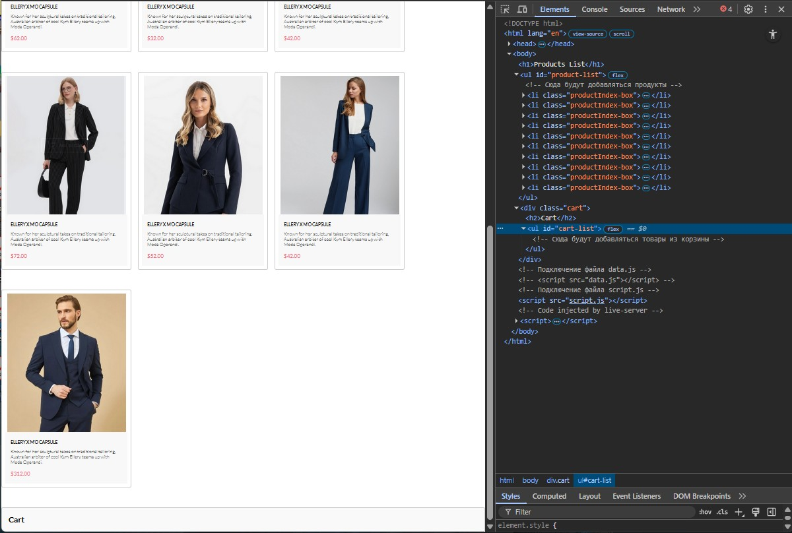
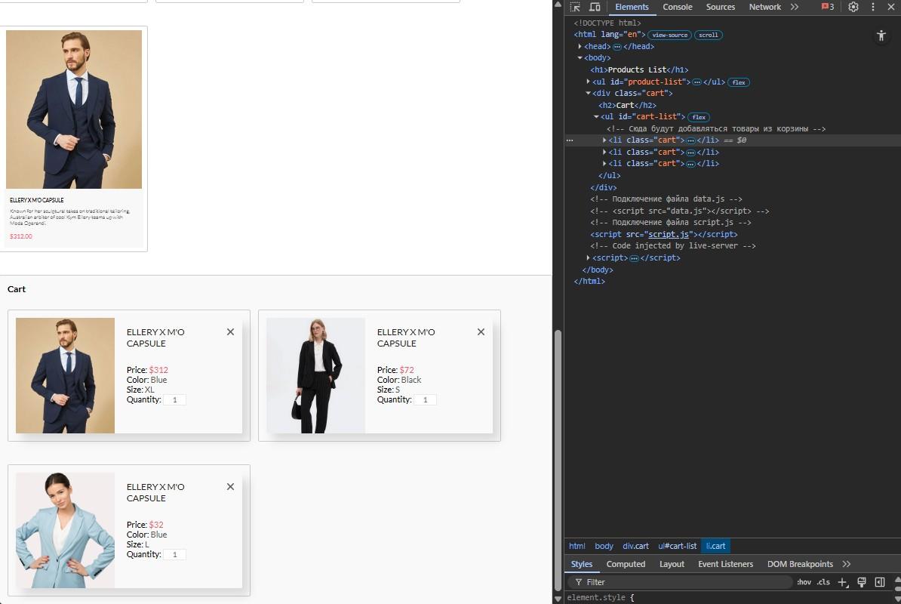
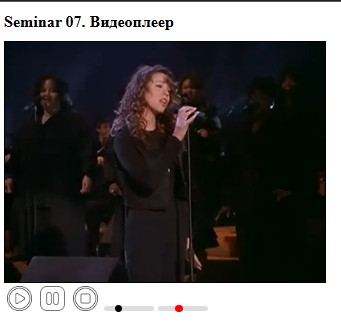

# Урок 13. Семинар. Работа с медиа

## План урока

1. Выполнение практических заданий в соответствии с [презентацией](https://gbcdn.mrgcdn.ru/uploads/asset/5092938/attachment/107e5b22297772408c4e54bac296c05b.pdf) к уроку

2. Выполнение практических заданий в соответствии с видео к уроку (повтор заданий с урока № 11. Семинар. Шаблонизация - в соответствии с [презентацией](https://gbcdn.mrgcdn.ru/uploads/asset/5092937/attachment/c43b81b003492f4ac2f95ea810ce1bca.pdf))


## Домашняя работа - Промежуточная аттестация ([решение](https://github.com/olgashenkel/GeekBrains-technological_specialization/tree/main/07.%20JavaScript%20Continued/13.%20Seminar_07/homework))


**Файл `index.html:`**

```
<!doctype html>
<html lang="en">
  <head>
    <meta charset="UTF-8" />
    <meta
      name="viewport"
      content="width=device-width,
initial-scale=1.0"
    />
    <title>Products List</title>
    <style>
      /* Стили по желанию */
      ul {
        list-style-type: none;
        padding: 0;
      }
      li {
        margin: 20px 0;
        padding: 10px;
        border: 1px solid #ccc;
        border-radius: 5px;
        display: flex;
        align-items: center;
        flex-direction: column;
      }
      img {
        margin-bottom: 10px;
      }
      h2 {
        margin: 0;
        font-size: 1.5rem;
      }
      button {
        margin-top: 10px;
        padding: 10px 15px;
        border: none;
        border-radius: 5px;
        background-color: #007bff;
        color: white;
        cursor: pointer;
      }
      button:hover {
        background-color: #0056b3;
      }
      .cart {
        margin-top: 40px;
        padding: 20px;
        border: 1px solid #ccc;
        border-radius: 5px;
        background-color: #f9f9f9;
      }
      .cart h2 {
        margin-top: 0;
      }
    </style>
  </head>
  <body>
    <h1>Products List</h1>
    <ul id="product-list">
      <!-- Сюда будут добавляться продукты -->
    </ul>
    <div class="cart">
      <h2>Cart</h2>
      <ul id="cart-list">
        <!-- Сюда будут добавляться товары из корзины -->
      </ul>
    </div>
    <!-- Подключение файла data.js -->
    <script src="data.js"></script>
    <!-- Подключение файла script.js -->
    <script src="script.js"></script>
  </body>
</html>
```

**Задание:**
1. Продолжите работу с проектом из прошлого задания.
2. В файле `index.html` добавьте блок для корзины с классом `cart`.
3. В файле `script.js` добавьте функциональность для добавления товара в корзину при клике на кнопку `"Add to Cart"`.
4. Реализуйте функциональность для удаления товаров из корзины при нажатии
на кнопку `"X"`.


**Результат выполнения Домашней работы:**

*HTML*
```
<!doctype html>
<html lang="en">
  <head>
    <meta charset="UTF-8" />
    <meta
      name="viewport"
      content="width=device-width,
initial-scale=1.0"
    />
    <title>Homework_07. Products List</title>
    <link rel="stylesheet" href="style.css" />
    <!-- Шрифт -->
    <link rel="preconnect" href="https://fonts.googleapis.com" />
    <link rel="preconnect" href="https://fonts.gstatic.com" crossorigin />
    <link
      href="https://fonts.googleapis.com/css2?family=Lato:ital,wght@0,100;0,300;0,400;0,700;0,900;1,100;1,300;1,400;1,700;1,900&family=Merriweather:ital,opsz,wght@0,18..144,300..900;1,18..144,300..900&family=Open+Sans:ital,wdth,wght@0,75..100,300..800;1,75..100,300..800&family=Roboto:ital,wdth,wght@0,75..100,100..900;1,75..100,100..900&display=swap"
      rel="stylesheet"
    />

    <style>
      /* Стили по желанию */
      ul {
        list-style-type: none;
        display: flex;
        flex-wrap: wrap;
        /* padding: 0; */
        align-items: center;
        gap: 20px;
      }


      .productIndex-box {
        margin: 20px 0;
        padding: 10px;
        border: 1px solid #ccc;
        border-radius: 5px;
        max-width: 370px;
      }

      /* img {
        margin-bottom: 10px;
      } */
      /* h2 {
        margin: 0;
        font-size: 1.5rem;
      } */
      /* button {
        margin-top: 10px;
        padding: 10px 15px;
        border: none;
        border-radius: 5px;
        background-color: #007bff;
        color: white;
        cursor: pointer;
      }
      button:hover {
        background-color: #0056b3;
      } */

      
      .cart {
        margin-top: 40px;
        padding: 20px;
        border: 1px solid #ccc;
        border-radius: 5px;
        background-color: #f9f9f9;
      }

      .cart h2 {
        margin-top: 0;
      }

      .cart li {
        width: 600px;
      }


    </style>
  </head>
  <body>
    <h1>Products List</h1>
    <ul id="product-list">
      <!-- Сюда будут добавляться продукты -->
    </ul>
    <div class="cart">
      <h2>Cart</h2>
      <ul id="cart-list">
        <!-- Сюда будут добавляться товары из корзины -->
      </ul>
    </div>
    <!-- Подключение файла data.js -->
    <!-- <script src="data.js"></script> -->

    <!-- Подключение файла script.js -->
    <script src="script.js"></script>
  </body>
</html>
```

*JSON*
```
[
  {
    "id": 1,
    "title": "ELLERY X M'O CAPSULE",
    "description": "Known for her sculptural takes on traditional tailoring, Australian arbiter of cool Kym Ellery teams up with Moda Operandi.",
    "price": 52.00,
    "count": 1,
    "color": "Blue",
    "size": "XL",
    "image": "img/product/Index/product_1.jpg"
  },
  {
    "id": 2,
    "title": "ELLERY X M'O CAPSULE",
    "description": "Known for her sculptural takes on traditional tailoring, Australian arbiter of cool Kym Ellery teams up with Moda Operandi.",
    "price": 42.00,
    "count": 1,
    "color": "Black",
    "size": "M",
    "image": "img/product/Index/product_2.jpg"
  },
  {
    "id": 3,
    "title": "ELLERY X M'O CAPSULE",
    "description": "Known for her sculptural takes on traditional tailoring, Australian arbiter of cool Kym Ellery teams up with Moda Operandi.",
    "price": 32.00,
    "count": 1,
    "color": "Blue",
    "size": "XL",
    "image": "img/product/Index/product_3.jpg"
  },
  {
    "id": 4,
    "title": "ELLERY X M'O CAPSULE",
    "description": "Known for her sculptural takes on traditional tailoring, Australian arbiter of cool Kym Ellery teams up with Moda Operandi.",
    "price": 62.00,
    "count": 1,
    "color": "Orange",
    "size": "XL",
    "image": "img/product/Index/product_4.jpg"
  },
  {
    "id": 5,
    "title": "ELLERY X M'O CAPSULE",
    "description": "Known for her sculptural takes on traditional tailoring, Australian arbiter of cool Kym Ellery teams up with Moda Operandi.",
    "price": 32.00,
    "count": 1,
    "color": "Blue",
    "size": "L",
    "image": "img/product/Index/product_5.jpg"
  },
  {
    "id": 6,
    "title": "ELLERY X M'O CAPSULE",
    "description": "Known for her sculptural takes on traditional tailoring, Australian arbiter of cool Kym Ellery teams up with Moda Operandi.",
    "price": 42.00,
    "count": 1,
    "color": "Green",
    "size": "L",
    "image": "img/product/Index/product_6.jpg"
  },
  {
    "id": 7,
    "title": "ELLERY X M'O CAPSULE",
    "description": "Known for her sculptural takes on traditional tailoring, Australian arbiter of cool Kym Ellery teams up with Moda Operandi.",
    "price": 72.00,
    "count": 1,
    "color": "Black",
    "size": "S",
    "image": "img/product/Index/product_7.jpg"
  },
  {
    "id": 8,
    "title": "ELLERY X M'O CAPSULE",
    "description": "Known for her sculptural takes on traditional tailoring, Australian arbiter of cool Kym Ellery teams up with Moda Operandi.",
    "price": 52.00,
    "count": 1,
    "color": "Dark Blue",
    "size": "L",
    "image": "img/product/Index/product_8.jpg"
  },
  {
    "id": 9,
    "title": "ELLERY X M'O CAPSULE",
    "description": "Known for her sculptural takes on traditional tailoring, Australian arbiter of cool Kym Ellery teams up with Moda Operandi.",
    "price": 42.00,
    "count": 1,
    "color": "Blue",
    "size": "L",
    "image": "img/product/Index/product_9.jpg"
  },
  {
    "id": 10,
    "title": "ELLERY X M'O CAPSULE",
    "description": "Known for her sculptural takes on traditional tailoring, Australian arbiter of cool Kym Ellery teams up with Moda Operandi.",
    "price": 312.00,
    "count": 1,
    "color": "Blue",
    "size": "XL",
    "image": "img/product/Index/product_10.jpg"
  }
]
```

*JavaScript*
```
"use strict";
const url = "./data.json";
const productListUlEl = document.getElementById("product-list");
const cartListEl = document.getElementById("cart-list");


// Получение данных из JSON-файла
async function getData(url) {
  try {
    const response = await fetch(url);
    const data = await response.json();
    return data
  } catch (error) {
    console.error('Ошибка загрузки:', error.message);
  }
};


document.addEventListener("DOMContentLoaded", async (e) => {
  const data = await getData(url);


  // Отрисовка товаров для основной страницы
  data.forEach((element) => {
    const productListLiEl = document.createElement("li");
    productListLiEl.classList.add("productIndex-box");
    productListLiEl.insertAdjacentHTML(
      "beforeend",
      `
      <div class="productIndex">
        
        <div class="productIndex__img_blackout">
          <button class="productIndex__img_blackout_button" data-id="${element.id}">
              
              <p class="productIndex__img_blackout_button_text">Add to Cart</p>
          </button>
        </div>

        <div class="productIndex__content">
          <a href="#" class="productIndex__name">${element.title}</a>
          <p class="productIndex__text">${element.description}</p>
          <p class="productIndex__price">$${element.price.toFixed(2)}</p>
        </div>
      </div>
    `);
    productListUlEl.appendChild(productListLiEl);
  });


  // Добавление товара в корзину при клике по кнопке
  productListUlEl.addEventListener('click', (e) => {
    // Проверяем, кликнули ли мы по кнопке или по тексту/иконке внутри неё
    const btn = e.target.closest('.productIndex__img_blackout_button');

    if (btn) {
      const productId = btn.dataset.id; // Получаем ID из атрибута data-id
      // Находим данные этого товара в массиве data
      const productData = data.find(item => item.id == productId);

      if (productData) {
        renderCartItem(productData);
      }
    }
  });


});


// Функция добавления товара в корзину и отрисовка карточки товара
function renderCartItem({
  title,
  image,
  price,
  color,
  size
}) {
  const cartItem = document.createElement("li");
  cartItem.classList.add("cart");

  cartItem.innerHTML = `
    <div class="card">
      
      <div class="description">
        <h2>${title}</h2>
        <div class="list">
          <p>Price: <span class="red">$${price}</span></p>
          <p>Color: <span class="grey">${color}</span></p>
          <p>Size: <span class="grey">${size}</span></p>
          <p>Quantity: <input id="inputIdCartItem" class="inputCount" type="number" value="1" /></p>
        </div>
      </div>

    <button class="delete">
      <svg
        width="18"
        height="18"
        viewBox="0 0 18 18"
        fill="none"
        xmlns="http://www.w3.org/2000/svg"
      >
        <path
          d="M11.2453 9L17.5302 2.71516C17.8285 2.41741 17.9962 2.01336 17.9966 1.59191C17.997 1.17045 17.8299 0.76611 17.5322 0.467833C17.2344 0.169555 16.8304 0.00177586 16.4089 0.00140366C15.9875 0.00103146 15.5831 0.168097 15.2848 0.465848L9 6.75069L2.71516 0.465848C2.41688 0.167571 2.01233 0 1.5905 0C1.16868 0 0.764125 0.167571 0.465848 0.465848C0.167571 0.764125 0 1.16868 0 1.5905C0 2.01233 0.167571 2.41688 0.465848 2.71516L6.75069 9L0.465848 15.2848C0.167571 15.5831 0 15.9877 0 16.4095C0 16.8313 0.167571 17.2359 0.465848 17.5342C0.764125 17.8324 1.16868 18 1.5905 18C2.01233 18 2.41688 17.8324 2.71516 17.5342L9 11.2493L15.2848 17.5342C15.5831 17.8324 15.9877 18 16.4095 18C16.8313 18 17.2359 17.8324 17.5342 17.5342C17.8324 17.2359 18 16.8313 18 16.4095C18 15.9877 17.8324 15.5831 17.5342 15.2848L11.2453 9Z"
          fill="#575757"
        />
      </svg>
    </button>

    </div>
  `;
  cartListEl.appendChild(cartItem);

  // Удаляем карточку при клике на кнопку
  cartItem.addEventListener("click", (e) => {
    if (e.target.closest(".delete")) {
      const card = e.target.closest(".card");
      if (card) {
        cartItem.remove(card);
      }
    }
  });
}
```







## Практическая работа № 1 с семинара ([решение](https://github.com/olgashenkel/GeekBrains-technological_specialization/tree/main/07.%20JavaScript%20Continued/13.%20Seminar_07/seminar_07)):

**Задание 1 (тайминг 125 минут)**
1. Создание медиа плеера
2. Создать файл index.html
3. Создать папку img в которую загрузить изображение
кнопок play, pause
4. Скачать произвольное видео из интернета
5. Добавить Тег видео в html
6. Продумать внешний вид progress и volume
7. Продумать время проигрывателя
8. Реализовать функционал своего собственного видеоплеера

**мини тайминги**
1. Скачать все картинки (найти макет по желанию)
2. Добавляете html добавляете все элементы для управления видео
3. Реализуем кнопки play, pause
4. время и ползунки
5. Собираем внешний вид


***Результат выполнения Практической работы:***

**HTML**
```
<!doctype html>
<html lang="en">
  <head>
    <meta charset="UTF-8" />
    <meta name="viewport" content="width=device-width, initial-scale=1.0" />
    <title>Seminar_07</title>
    <link rel="stylesheet" href="style.css" />
    <script src="script.js" defer type="module"></script>

    <style>
      video {
        border: 1px solid #000;
        min-width: 600px;
      }

      .buttonPlayer {
        width: 50px;
        height: 50px;
      }

      #play,
      #pause,
      #stop,
      #volume {
        border: none;
        background: none;
        cursor: pointer;
      }

      #volumeControl {
        -webkit-appearance: none; /* Убираем дефолтный стиль */
        width: 100px;
        height: 10px;
        background: #ddd;
        border-radius: 5px;
        outline: none;
      }

      #volumeControl::-webkit-slider-thumb {
        -webkit-appearance: none;
        width: 15px;
        height: 15px;
        background: #ff0000; /* Цвет ползунка */
        border-radius: 50%;
        cursor: pointer;
      }

      #progressControl {
        -webkit-appearance: none; /* Убираем дефолтный стиль */
        width: 100px;
        height: 10px;
        background: #ddd;
        border-radius: 5px;
        outline: none;
      }

      #progressControl::-webkit-slider-thumb {
        -webkit-appearance: none;
        width: 15px;
        height: 15px;
        background: #000000; /* Цвет ползунка */
        border-radius: 50%;
        cursor: pointer;
      }


    </style>
  </head>

  <body>
    <h1>Seminar 07. Видеоплеер</h1>

    <video id="videoPlayer">
      <source
        src="/img/Mariah Carey - Without You (From Mariah Carey (Live)).mp4"
        type="video/mp4"
      />
    </video>

    <div id="controls">
      <button id="play">
        
      </button>
      <button id="pause">
        
      </button>
      <button id="stop">
        
      </button>
      <input type="range" id="progressControl" value="0" max="100" />
      <input
        type="range"
        id="volumeControl"
        value="0.25"
        min="0"
        max="1"
        step="0.1"
      />
    </div>
  </body>
</html>
```

**JavaScript**
```
const videoPlayerElement = document.getElementById("videoPlayer");
const playElement = document.getElementById("play");
const pauseElement = document.getElementById("pause");
const stopElement = document.getElementById("stop");
const progressElement = document.getElementById("progressControl");
const volumeElement = document.getElementById("volumeControl");


// Запускаем видео, активация кнопки play и pause
// Отключение кнопки play
function playVideo() {
  videoPlayerElement.play();
  playElement.disabled = true;
  pauseElement.disabled = false;
  stopElement.disabled = false;
}

// Приостановка воспроизведения video,
// активация кнопки play и отключение кнопки stop и pause
function pauseVideo() {
  videoPlayerElement.pause();
  playElement.disabled = false;
  pauseElement.disabled = true;
  stopElement.disabled = false;
}

// Остановка воспроизведения видео, возврат к началу,
// активация кнопки play и отключение кнопки pause и stop
function stopVideo() {
  videoPlayerElement.pause();
  videoPlayerElement.currentTime = 0;
  playElement.disabled = false;
  pauseElement.disabled = false;
  stopElement.disabled = true;
}

// Обновление полосы прогресса
function reportProgress() {
  const progress =
    (videoPlayerElement.currentTime / videoPlayerElement.duration) * 100;
  progressElement.value = progress;
}

// Перемотка видео при клике на полосу прогресса
function seekVideo() {
  const seekTime = (progressElement.value * videoPlayerElement.duration) / 100;
  videoPlayerElement.currentTime = seekTime;
}

// Регулировка громкости видео
function adjustVolume(e) {
  videoPlayerElement.volume = e.target.value;
}


// Добавляем обработчики событий для кнопок и видео
playElement.addEventListener("click", playVideo);
pauseElement.addEventListener("click", pauseVideo);
stopElement.addEventListener("click", stopVideo);
videoPlayerElement.addEventListener("timeupdate", reportProgress);
progressElement.addEventListener("input", seekVideo);
volumeElement.addEventListener("input", adjustVolume);
```




## Практическая работа № 2 с семинара (в соответствии с видео лекцией к уроку (повтор урока № 11)) ([решение](https://github.com/olgashenkel/GeekBrains-technological_specialization/tree/main/07.%20JavaScript%20Continued/11.%20Seminar_06/seminar_06)):


**Задание 1 (тайминг 25 минут)**
1. Дан [макет](https://www.figma.com/file/mZwLT9fKktsWuVyfQRoST1/shop-(Copy)-(Copy)?node-id=73%3A140), в котором
представлены товары на странице корзины
2. Необходимо создать файл `data.js` в котором создать переменную `dataProducts` в которую присвоить `JSON` данные по товарам.
3. Вам нужно самостоятельно создать `JSON` данные (не забыть про кавычки для ключей и значений)
4. Добавить все данные из макета, чтобы в дальнейшим по ним мы смогли создать вёрстку

**Задание 2 (тайминг 30 минут)**
1. Создаём вёрстку по данному макету
2. Добавляем все теги и стили для них, чтобы получилось один в один, как в макете
3. Пока данные для шаблонизации использовать не нужно

**Задание 3 (тайминг 40 минут)**
1. Создаём блоки с помощью `javascript` для этого используем данные
из `dataProducts`
2. Формируем товары на основе нашей вёрстки
3. Проверяем, как будет выглядеть сайт, если в `json-данные` добавить
еще один объект с товаром (в вёрстке должен появиться еще один
блок, на основе этих данных)


***Результат выполнения Практической работы:***

*HTML*
```
<!doctype html>
<html lang="en">
  <head>
    <meta charset="UTF-8" />
    <meta name="viewport" content="width=device-width, initial-scale=1.0" />
    <title>Seminar_06</title>
    <link rel="stylesheet" href="style.css" />
    <link rel="preconnect" href="https://fonts.googleapis.com" />
    <link rel="preconnect" href="https://fonts.gstatic.com" crossorigin />
    <link
      href="https://fonts.googleapis.com/css2?family=Lato&display=swap"
      rel="stylesheet"
    />
    <script src="script.js" defer type="module"></script>
  </head>
  <body>
    <div class="wrapper">
      <div class="cards">
        
      </div>
    </div>
  </body>
</html>
```


*JSON*
```
[
    {
        "id": 1,
        "price": 300,
        "count": 2,
        "color": "Red",
        "size": "XL",
        "img": "images/Photo_1.png",
        "title": "MANGO PEOPLE T-SHIRT"
    },

    {
        "id": 2,
        "price": 52,
        "count": 1,
        "color": "Black",
        "size": "XL",
        "img": "images/Photo_2.png",
        "title": "ELLERY X M'O CAPSULE"
    }
]
```

*JavaScript*
```
"use strict";

const url = "./data.json";

async function getData(url) {
  try {
    const response = await fetch(url);
    const data = await response.json();
    return data;
  } catch (error) {
    console.log(error.message);
  }
}

// Получаем данные из JSON и отрисовываем карточки
document.addEventListener("DOMContentLoaded", async (e) => {
  const data = await getData(url);
  const listClass = document.querySelector(".cards");
  data.forEach((element) => {
    listClass.insertAdjacentHTML(
      "beforeend",
      `
  <div class="card">
          
          <div class="description">
            <h2>${element.title}</h2>
            <div class="list">
              <p>Price: <span class="red">$${element.price}</span></p>
              <p>Color: <span class="grey">${element.color}</span></p>
              <p>Size: <span class="grey">${element.size}</span></p>
              <p>Quantity: <input id="inputCount" type="number" value="${element.count}" /></p>
            </div>
          </div>

          <button class="delete">
            <svg
              width="18"
              height="18"
              viewBox="0 0 18 18"
              fill="none"
              xmlns="http://www.w3.org/2000/svg"
            >
              <path
                d="M11.2453 9L17.5302 2.71516C17.8285 2.41741 17.9962 2.01336 17.9966 1.59191C17.997 1.17045 17.8299 0.76611 17.5322 0.467833C17.2344 0.169555 16.8304 0.00177586 16.4089 0.00140366C15.9875 0.00103146 15.5831 0.168097 15.2848 0.465848L9 6.75069L2.71516 0.465848C2.41688 0.167571 2.01233 0 1.5905 0C1.16868 0 0.764125 0.167571 0.465848 0.465848C0.167571 0.764125 0 1.16868 0 1.5905C0 2.01233 0.167571 2.41688 0.465848 2.71516L6.75069 9L0.465848 15.2848C0.167571 15.5831 0 15.9877 0 16.4095C0 16.8313 0.167571 17.2359 0.465848 17.5342C0.764125 17.8324 1.16868 18 1.5905 18C2.01233 18 2.41688 17.8324 2.71516 17.5342L9 11.2493L15.2848 17.5342C15.5831 17.8324 15.9877 18 16.4095 18C16.8313 18 17.2359 17.8324 17.5342 17.5342C17.8324 17.2359 18 16.8313 18 16.4095C18 15.9877 17.8324 15.5831 17.5342 15.2848L11.2453 9Z"
                fill="#575757"
              />
            </svg>
          </button>
        </div>
    `,
    );
  });

  // Удаляем карточку при клике на кнопку
  listClass.addEventListener("click", (e) => {
    if (e.target.closest(".delete")) {
      const card = e.target.closest(".card");
      if (card) {
        card.remove();
      }
    }
  });
});

/*
Ключевые моменты:
e.target — указывает на элемент, по которому кликнули (крестик).
e.target.closest('.card') — поднимается вверх по DOM-дереву от крестика, чтобы найти элемент с классом .card.
.remove() — удаляет найденный элемент из HTML.
*/

```


