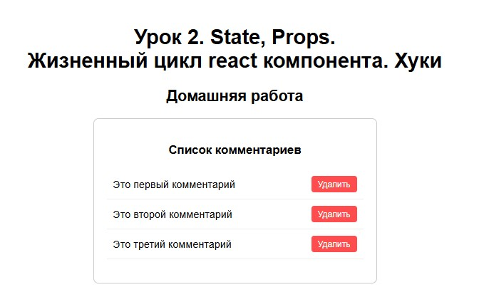
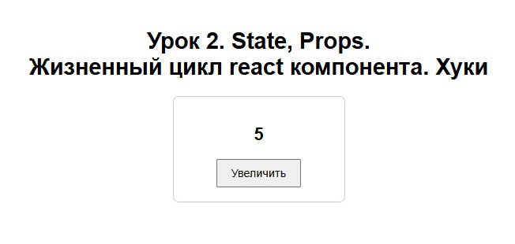
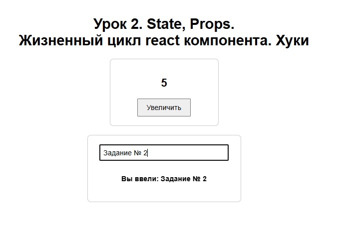
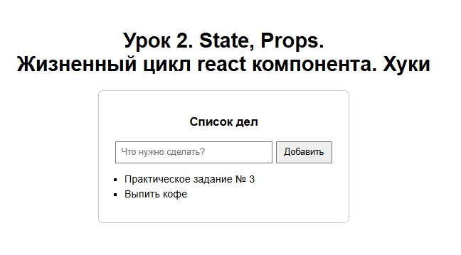
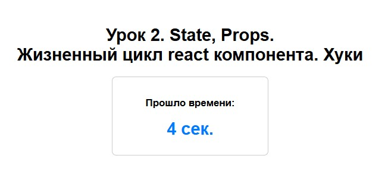

# Урок 2. State, Props. Жизненный цикл react компонента. Хуки


## План урока

- Выполнение практических заданий в соответствии с [презентацией](https://gbcdn.mrgcdn.ru/uploads/asset/6006243/attachment/81f2e3120ec237f19db2bfaa7e9945ff.pdf) к уроку


## Домашняя работа ([решение](https://github.com/olgashenkel/GeekBrains-technological_specialization/tree/main/12.%20React%20JS%20framework/Seminar_02/homework/src))

**Задание: Список комментариев с удалением.**

**Цель:** Комбинирование useState, рендеринга списков и обработки событий для создания интерактивного интерфейса.

**Задача:** Создать компонент CommentsList, который отображает список комментариев. Каждый комментарий должен иметь кнопку для его удаления. При нажатии на кнопку комментарий должен удаляться из списка.

*Можно использовать заготовку:*

```
const [comments, setComments] = useState([
{ id: 1, text: "Это первый комментарий" },
{ id: 2, text: "Это второй комментарий" },
{ id: 3, text: "Это третий комментарий" }
]);
```


**Результат выполнения Домашней работы:**

```
import React, { useState } from 'react';

function CommentsList() {
  // Инициализируем состояние начальным массивом комментариев
  const [comments, setComments] = useState([
    { id: 1, text: "Это первый комментарий" },
    { id: 2, text: "Это второй комментарий" },
    { id: 3, text: "Это третий комментарий" }
  ]);

  // Функция для удаления комментария по его id
  const handleDelete = (id) => {
    // Фильтруем массив, оставляя только те элементы, id которых не равен удаляемому
    const updatedComments = comments.filter(comment => comment.id !== id);
    // Обновляем состояние новым массивом
    setComments(updatedComments);
  };

  return (
    <div style={{ margin: '20px auto', padding: '20px', border: '1px solid #ccc', borderRadius: '8px', maxWidth: '400px' }}>
      <h3 style={{ textAlign: 'center' }}>Список комментариев</h3>
      
      {/* Проверка: если комментариев нет, выводим заглушку */}
      {comments.length === 0 ? (
        <p style={{ color: '#888', textAlign: 'center' }}>Комментариев пока нет</p>
      ) : (
        <ul style={{ listStyleType: 'none', padding: 0 }}>
          {comments.map((comment) => (
            <li 
              key={comment.id} 
              style={{ 
                display: 'flex', 
                justifyContent: 'space-between', 
                alignItems: 'center', 
                padding: '10px', 
                borderBottom: '1px solid #eee',
                gap: '10px'
              }}
            >
              <span style={{ wordBreak: 'break-word' }}>{comment.text}</span>
              {/* Передаем id комментария в функцию удаления при клике */}
              <button 
                onClick={() => handleDelete(comment.id)}
                style={{ 
                  backgroundColor: '#ff4d4f', 
                  color: 'white', 
                  border: 'none', 
                  borderRadius: '4px', 
                  padding: '5px 10px', 
                  cursor: 'pointer' 
                }}
              >
                Удалить
              </button>
            </li>
          ))}
        </ul>
      )}
    </div>
  );
}

export default CommentsList;
```

```
import React from 'react';
import CommentsList from './CommentsList'; 

function App() {
  return (
    <div style={{ fontFamily: 'Arial, sans-serif', padding: '40px' }}>
      <h1 style={{ textAlign: 'center' }}>Урок 2. State, Props. <br></br>Жизненный цикл react компонента. Хуки</h1>
            <h2 style={{ textAlign: 'center' }}>Домашняя работа</h2>
            
      {/* Компонент Списка комментариев с удалением */}
      <CommentsList />
    </div>
  );
}

export default App;
```




## Практическая работа на семинаре ([решение](https://github.com/olgashenkel/GeekBrains-technological_specialization/tree/main/12.%20React%20JS%20framework/Seminar_02/seminar/src))

**Задание 1 (тайминг 25 минут)** 

1. Создать компонент Counter, который отображает кнопку и число.
2. Число увеличивается на 1 каждый раз, когда пользователь нажимает на кнопку


**Результат выполнения Задания № 1:**

```
import React, { useState } from 'react';

function Counter() {
  const [count, setCount] = useState(0);

  return (
    <div style={{ textAlign: 'center', margin: '20px auto', padding: '20px', border: '1px solid #ccc', borderRadius: '8px', maxWidth: '200px' }}>
      <h2>{count}</h2>
      <button 
        style={{ padding: '10px 20px', fontSize: '16px', cursor: 'pointer' }} 
        onClick={() => setCount(count + 1)}
      >
        Увеличить
      </button>
    </div>
  );
}

export default Counter;
```

```
import React from 'react';
import Counter from './Counter'; 

function App() {
  return (
    <div style={{ fontFamily: 'Arial, sans-serif', padding: '40px' }}>
      <h1 style={{ textAlign: 'center' }}>Моё приложение на React</h1>
      <Counter /> 
    </div>
  );
}

export default App;
```



**Задание 2 (тайминг 20 минут)** 

Создать компонент TextInput, который содержит текстовое поле ввода и отображает введённый текст под ним в реальном времени.


**Результат выполнения Задания № 2:**

```
import React, { useState } from 'react';

function TextInput() {
  const [text, setText] = useState('');

  const handleChange = (event) => {
    setText(event.target.value); 
  };

  return (
    <div style={{ textAlign: 'center', margin: '20px auto', padding: '20px', border: '1px solid #ccc', borderRadius: '8px', maxWidth: '300px' }}>
      <input 
        type="text" 
        value={text} 
        onChange={handleChange} 
        placeholder="Введите текст..."
        style={{ padding: '8px', width: '90%', fontSize: '16px', marginBottom: '15px' }}
      />
      
      <p style={{ minHeight: '24px', fontWeight: 'bold', wordBreak: 'break-word' }}>
        Вы ввели: {text}
      </p>
    </div>
  );
}

export default TextInput;
```

```
import React from 'react';
import Counter from './Counter'; 
import TextInput from './TextInput';

function App() {
  return (
    <div style={{ fontFamily: 'Arial, sans-serif', padding: '40px' }}>
      <h1 style={{ textAlign: 'center' }}>Урок 2. State, Props. <br></br>Жизненный цикл react компонента. Хуки</h1>
        
      {/* Компонент Счетчика */}
      <Counter /> 
      
      {/* Компонент Текстового ввода */}
      <TextInput />
    </div>
  );
}

export default App;
```




**Задание 3 (тайминг 40 минут)** 

Создать компонент TodoList, который позволяет добавлять элементы в список дел через текстовое поле ввода. Список должен обновляться при добавлении нового дела.


**Результат выполнения Задания № 3:**

```
import React, { useState } from 'react';

function TodoList() {
  // Состояние для списка дел (массив)
  const [todos, setTodos] = useState([]);
  // Состояние для текущего текста в поле ввода
  const [inputValue, setInputValue] = useState('');

  // Функция добавления нового дела
  const handleAddTodo = (e) => {
    e.preventDefault(); // Предотвращаем перезагрузку страницы при отправке формы
    
    if (inputValue.trim() === '') return; // Проверка на пустую строку

    // Добавляем новое дело в массив и очищаем поле ввода
    setTodos([...todos, inputValue.trim()]);
    setInputValue('');
  };

  return (
    <div style={{ textAlign: 'center', margin: '20px auto', padding: '20px', border: '1px solid #ccc', borderRadius: '8px', maxWidth: '350px' }}>
      <h3>Список дел</h3>
      
      {/* Форма для ввода и отправки */}
      <form onSubmit={handleAddTodo} style={{ marginBottom: '15px' }}>
        <input 
          type="text" 
          value={inputValue}
          onChange={(e) => setInputValue(e.target.value)}
          placeholder="Что нужно сделать?"
          style={{ padding: '8px', width: '65%', marginRight: '5px', fontSize: '14px' }}
        />
        <button type="submit" style={{ padding: '8px 12px', fontSize: '14px', cursor: 'pointer' }}>
          Добавить
        </button>
      </form>

      {/* Вывод списка дел */}
      <ul style={{ textAlign: 'left', paddingLeft: '20px', listStyleType: 'square' }}>
        {todos.map((todo, index) => (
          <li key={index} style={{ margin: '5px 0', wordBreak: 'break-word' }}>
            {todo}
          </li>
        ))}
      </ul>

      {/* Сообщение, если список пуст */}
      {todos.length === 0 && <p style={{ color: '#888', fontSize: '14px' }}>Список пока пуст</p>}
    </div>
  );
}

export default TodoList;
```

```
...
import TodoList from './TodoList'; 

function App() {
  return (
    <div style={{ fontFamily: 'Arial, sans-serif', padding: '40px' }}>      
      
      ...

      {/* Компонент Списка дел */}
      <TodoList />
    </div>
  );
}

export default App;
```




**Задание 4\* (тайминг 20 минут)** 

Создать компонент Timer, который отображает таймер, увеличивающийся на 1 каждую секунду. Использовать useEffect для установки и очистки интервала.


**Результат выполнения Задания № 4:**

```
import React, { useState, useEffect } from 'react';

function Timer() {
  // Состояние для хранения количества секунд
  const [seconds, setSeconds] = useState(0);

  useEffect(() => {
    // Создаем интервал, который срабатывает каждую 1000 мс (1 секунду)
    const intervalId = setInterval(() => {
      // Используем функцию-колбэк, чтобы всегда работать с актуальным состоянием
      setSeconds((prevSeconds) => prevSeconds + 1);
    }, 1000);

    // ВАЖНО: Возвращаем функцию очистки
    // Она сработает, когда компонент удалится со страницы (размонтируется)
    return () => {
      clearInterval(intervalId);
    };
  }, []); // Пустой массив зависимостей означает, что эффект запустится только 1 раз при старте компонента

  return (
    <div style={{ textAlign: 'center', margin: '20px auto', padding: '20px', border: '1px solid #ccc', borderRadius: '8px', maxWidth: '250px' }}>
      <h3>Прошло времени:</h3>
      <h2 style={{ fontSize: '32px', margin: '10px 0', color: '#007bff' }}>
        {seconds} сек.
      </h2>
    </div>
  );
}

export default Timer;
```

```
...
import Timer from './Timer';


function App() {
  return (
    <div style={{ fontFamily: 'Arial, sans-serif', padding: '40px' }}>
      <h1 style={{ textAlign: 'center' }}>Урок 2. State, Props. <br></br>Жизненный цикл react компонента. Хуки</h1>
        
      ...

      {/* Компонент Таймера */}
      <Timer />
    </div>
  );
}

export default App;
```



