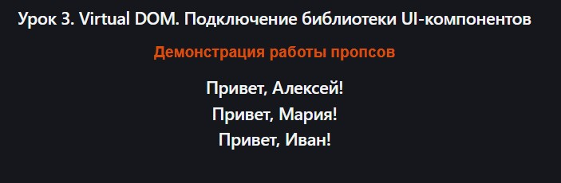
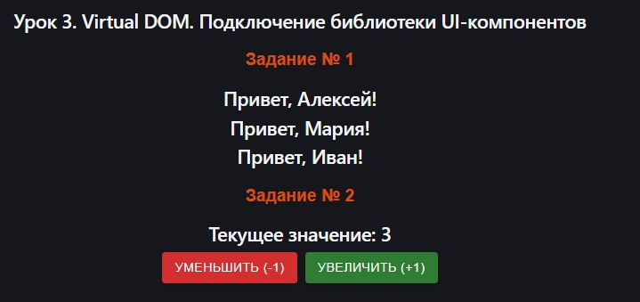
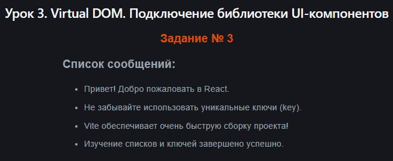
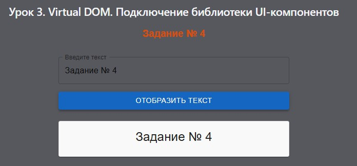

# Урок 3. Virtual DOM. Подключение библиотеки UI-компонентов


## План урока

- Выполнение практических заданий в соответствии с [презентацией](https://gbcdn.mrgcdn.ru/uploads/asset/6006239/attachment/190b1044d79b07d7005aca9f0e36fe31.pdf) к уроку


## Домашняя работа ([решение](https://github.com/olgashenkel/GeekBrains-technological_specialization/tree/main/12.%20React%20JS%20framework/Seminar_03/homework/src))

**Задание 1: Температурный конвертер с Material UI**

**Цель:** Создать компонент `TemperatureConverter`, используя компоненты `TextField` и `Button` из `Material UI` для ввода и отображения температур в градусах Цельсия и Фаренгейта.

**Компоненты:**
Используйте `TextField` для ввода значения температуры.
Добавьте `лейблы` к каждому `TextField`, указывая единицы измерения (Цельсия и Фаренгейта).

**Логика:**
При вводе значения в одно поле, автоматически конвертируйте его и отобразите в другом.
Реализуйте конвертацию температур в обоих направлениях.


**Задание 2: Список дел с Material UI**

**Цель:** Разработать компонент `TodoList` для управления задачами: добавление, отображение, и удаление задач.

**Компоненты:**
Используйте `TextField` для ввода новой задачи.
Добавьте `Button` для добавления задачи в список.
Для каждой задачи в списке используйте `Card` или `ListItem` из `Material UI`. Внутри каждого элемента списка разместите текст задачи и `IconButton` с иконкой удаления (например, `DeleteIcon`).

**Логика:**
При нажатии на кнопку добавления, новая задача должна добавляться в список.
Рядом с каждой задачей должна быть кнопка для её удаления.


**Результат выполнения Домашней работы:**
```
/* Установка пакета иконок MUI */

npm install @mui/icons-material
```

```
/* Задание 1: Температурный конвертер (TemperatureConverter.jsx) */

import { useState } from 'react';
import TextField from '@mui/material/TextField';
import Box from '@mui/material/Box';
import Typography from '@mui/material/Typography';

function TemperatureConverter() {
  const [celsius, setCelsius] = useState('');
  const [fahrenheit, setFahrenheit] = useState('');

  // Конвертация из Цельсия в Фаренгейт: (C * 9/5) + 32
  const handleCelsiusChange = (e) => {
    const value = e.target.value;
    setCelsius(value);
    
    if (value === '') {
      setFahrenheit('');
    } else {
      const converted = (parseFloat(value) * 9) / 5 + 32;
      setFahrenheit(isNaN(converted) ? '' : converted.toFixed(1));
    }
  };

  // Конвертация из Фаренгейта в Цельсий: (F - 32) * 5/9
  const handleFahrenheitChange = (e) => {
    const value = e.target.value;
    setFahrenheit(value);

    if (value === '') {
      setCelsius('');
    } else {
      const converted = ((parseFloat(value) - 32) * 5) / 9;
      setCelsius(isNaN(converted) ? '' : converted.toFixed(1));
    }
  };

  return (
    <Box sx={{ maxWidth: 400, margin: '30px auto', padding: 3, boxShadow: 2, borderRadius: 2, bgcolor: 'background.paper' }}>
      <Typography variant="h5" gutterBottom sx={{ textAlign: 'center', mb: 3 }}>
        Конвертер температур
      </Typography>
      
      <Box sx={{ display: 'flex', flexDirection: 'column', gap: 2 }}>
        <TextField
          label="Градусы Цельсия (°C)"
          type="number"
          fullWidth
          value={celsius}
          onChange={handleCelsiusChange}
        />
        <TextField
          label="Градусы Фаренгейта (°F)"
          type="number"
          fullWidth
          value={fahrenheit}
          onChange={handleFahrenheitChange}
        />
      </Box>
    </Box>
  );
}

export default TemperatureConverter;
```


```
/* Задание 2: Список дел (TodoList.jsx) */

import { useState } from 'react';
import TextField from '@mui/material/TextField';
import Button from '@mui/material/Button';
import List from '@mui/material/List';
import ListItem from '@mui/material/ListItem';
import ListItemText from '@mui/material/ListItemText';
import IconButton from '@mui/material/IconButton';
import DeleteIcon from '@mui/icons-material/Delete';
import Card from '@mui/material/Card';
import Box from '@mui/material/Box';
import Typography from '@mui/material/Typography';

function TodoList() {
  const [todos, setTodos] = useState([]);
  const [task, setTask] = useState('');

  // Функция добавления задачи
  const handleAddTask = () => {
    if (task.trim() === '') return; // Проверка на пустую строку

    const newTodo = {
      id: Date.now(), // Генерируем уникальный ID на основе времени
      text: task
    };

    setTodos([...todos, newTodo]);
    setTask(''); // Очищаем поле ввода
  };

  // Функция удаления задачи по ID
  const handleDeleteTask = (id) => {
    setTodos(todos.filter(todo => todo.id !== id));
  };

  return (
    <Box sx={{ maxWidth: 500, margin: '30px auto', padding: 2 }}>
      <Typography variant="h5" gutterBottom sx={{ textAlign: 'center', mb: 3 }}>
        Список задач (Todo)
      </Typography>

      {/* Форма ввода и кнопка добавления */}
      <Box sx={{ display: 'flex', gap: 1, mb: 3 }}>
        <TextField
          label="Новая задача"
          variant="outlined"
          fullWidth
          value={task}
          onChange={(e) => setTask(e.target.value)}
          onKeyDown={(e) => e.key === 'Enter' && handleAddTask()} // Добавление по Enter
        />
        <Button variant="contained" color="primary" onClick={handleAddTask}>
          Добавить
        </Button>
      </Box>

      {/* Список добавленных задач завернутых в Card */}
      <Card variant="outlined">
        <List dense>
          {todos.length === 0 ? (
            <ListItem sx={{ justifyContent: 'center', py: 2 }}>
              <Typography color="text.secondary">Список задач пуст</Typography>
            </ListItem>
          ) : (
            todos.map((todo) => (
              <ListItem
                key={todo.id}
                divider
                secondaryAction={
                  <IconButton edge="end" aria-label="delete" onClick={() => handleDeleteTask(todo.id)}>
                    <DeleteIcon color="error" />
                  </IconButton>
                }
              >
                <ListItemText primary={todo.text} />
              </ListItem>
            ))
          )}
        </List>
      </Card>
    </Box>
  );
}

export default TodoList;
```

```
import TemperatureConverter from './components/TemperatureConverter';
import TodoList from './components/TodoList';
import './App.css';

function App() {
  return (
    <div style={{ padding: '20px', fontFamily: 'sans-serif' }}>
      <h1 style={{ textAlign: 'center' }}>Домашнее задание № 3</h1>
      <h2 style={{ textAlign: 'center' }}>Урок 3. Virtual DOM. Подключение библиотеки UI-компонентов</h2>
      
      {/* Задание 1 */}
      <TemperatureConverter />
      
      <hr style={{ margin: '40px 0', borderColor: '#ccc' }} />
      
      {/* Задание 2 */}
      <TodoList />
    </div>
  );
}

export default App;
```


## Практическая работа на семинаре ([решение](https://github.com/olgashenkel/GeekBrains-technological_specialization/tree/main/12.%20React%20JS%20framework/Seminar_03/seminar/src))

**Задание 1 (тайминг 15 минут)** 

1. Создайте функциональный компонент `Greeting`, который принимает `проп` `name` и отображает сообщение `Привет, {name}!`.
2. Используйте компонент `Greeting` в вашем основном компоненте
`App`, передавая разные имена в качестве `пропсов`

**Результат выполнения Задания № 1:**

```
import 'react';

// Компонент принимает объект props, из которого мы деструктуризируем свойство name
function Greeting({ name }) {
  return (
    <h2>Привет, {name}!</h2>
  );
}

export default Greeting;
```

```
import 'react';
import Greeting from './components/Greeting'; 
import './App.css';

function App() {
  return (
    <div style={{ padding: '20px', fontFamily: 'sans-serif' }}>
      <h1>Демонстрация работы пропсов</h1>
      
      <Greeting name="Алексей" />
      <Greeting name="Мария" />
      <Greeting name="Иван" />
    </div>
  );
}

export default App;
```




**Задание 2 (тайминг 25 минут)** 
1. Разработайте компонент Counter, который отображает число и две кнопки: одна для увеличения значения на 1, а другая для уменьшения на 1.
2. Используйте хук useState для управления состоянием счётчика.
3. Кнопки можно сделать с помощью material ui


**Результат выполнения Задания № 2:**
```
/* Установка Material */
npm install @mui/material @emotion/react @emotion/styled
```

```
import { useState } from 'react';
// Импортируем компонент кнопки из Material UI
import Button from '@mui/material/Button'; 

function Counter() {
  // Инициализируем состояние счётчика со значением 0
  const [count, setCount] = useState(0);

  return (
    <div style={{ textAlign: 'center', marginTop: '20px' }}>
      {/* Отображаем текущее число */}
      <h2>Текущее значение: {count}</h2>

      {/* Кнопка уменьшения значения (минус) */}
      <Button 
        variant="contained" 
        color="error" 
        onClick={() => setCount(count - 1)}
        style={{ marginRight: '10px' }}
      >
        Уменьшить (-1)
      </Button>

      {/* Кнопка увеличения значения (плюс) */}
      <Button 
        variant="contained" 
        color="success" 
        onClick={() => setCount(count + 1)}
      >
        Увеличить (+1)
      </Button>
    </div>
  );
}

export default Counter;
```

```
...
import Counter from './components/Counter';
...

function App() {
  return (
    <div style={{ padding: '20px', fontFamily: 'sans-serif' }}>
      <h2>Урок 3. Virtual DOM. Подключение библиотеки UI-компонентов</h2>
      ...

      <h3 style={{ color: '#da4e0d', fontFamily: 'sans-serif' }}>Задание № 2</h3>
     
      <Counter />

    </div>
  );
}

export default App;
```


**Задание 3 (тайминг 25 минут)** 
1. Создайте компонент MessagesList, который отображает список сообщений. Каждое сообщение должно иметь уникальный id и текст.
2. Используйте проп key при рендеринге списка, чтобы обеспечить оптимальную производительность.

**Результат выполнения Задания № 3:**
```
import 'react';

function MessagesList() {
  // Массив объектов с сообщениями. У каждого есть уникальный id и текст.
  const messages = [
    { id: 1, text: 'Привет! Добро пожаловать в React.' },
    { id: 2, text: 'Не забывайте использовать уникальные ключи (key).' },
    { id: 3, text: 'Vite обеспечивает очень быструю сборку проекта!' },
    { id: 4, text: 'Изучение списков и ключей завершено успешно.' }
  ];

  return (
    <div style={{ maxWidth: '500px', margin: '20px auto', textAlign: 'left' }}>
      <h3>Список сообщений:</h3>
      <ul>
        {/* Перебираем массив с помощью метода map */}
        {messages.map((message) => (
          <li key={message.id} style={{ marginBottom: '8px', fontSize: '16px' }}>
            {message.text}
          </li>
        ))}
      </ul>
    </div>
  );
}

export default MessagesList;
```

```
import 'react';
...
import MessagesList from './components/MessagesList';
import './App.css';

function App() {
  return (
    <div style={{ padding: '20px', fontFamily: 'sans-serif' }}>
      ...

      <h3 style={{ color: '#da4e0d', fontFamily: 'sans-serif' }}>Задание № 3</h3>
      {/* Рендерим компонент списка сообщений */}
      <MessagesList />

    </div>
  );
}

export default App;
```




**Задание 4 (тайминг 25 минут)** 

Создать React компонент TextDisplayForm, который позволяет пользователю ввести текст в поле ввода и отобразить его на экране в стилизованном виде по нажатию кнопки.
1. Создание поля ввода (TextField)
    - Добавить TextField для ввода текста пользователем.
    - Установить метку (label) поля ввода на "Введите текст".
    - Сделать поле ввода на всю ширину (fullWidth).
2. Разместить кнопку под полем ввода.
    - Установить текст кнопки на "Отобразить текст".
    - При нажатии на кнопку введенный текст должен отображаться под кнопкой.
3. Отображение введенного текста
    - Использовать состояние для хранения введенного и отображаемого текста.
    - При нажатии на кнопку текст из поля ввода должен отображаться в стилизованной карточке (Card) под кнопкой.
4. Стилизация отображаемого текста
    - Для отображения текста использовать компонент Typography с вариантом
h5.


**Результат выполнения Задания № 4:**
```
import { useState } from 'react';
// Импортируем необходимые компоненты из Material UI
import TextField from '@mui/material/TextField';
import Button from '@mui/material/Button';
import Card from '@mui/material/Card';
import CardContent from '@mui/material/CardContent';
import Typography from '@mui/material/Typography';
import Box from '@mui/material/Box';

function TextDisplayForm() {
  // Состояние для хранения текущего значения в поле ввода
  const [inputText, setInputText] = useState('');
  
  // Состояние для хранения текста, который нужно отобразить в карточке
  const [displayedText, setDisplayedText] = useState('');

  // Обработчик нажатия на кнопку
  const handleDisplayClick = () => {
    setDisplayedText(inputText);
  };

  return (
    <Box sx={{ maxWidth: 500, margin: '20px auto', padding: 2 }}>
      {/* 1. Поле ввода на всю ширину с меткой */}
      <TextField
        label="Введите текст"
        fullWidth
        variant="outlined"
        value={inputText}
        onChange={(e) => setInputText(e.target.value)}
      />

      {/* 2. Кнопка под полем ввода */}
      <Button
        variant="contained"
        color="primary"
        fullWidth
        onClick={handleDisplayClick}
        sx={{ mt: 2, mb: 3 }} // Отступы сверху и снизу через систему стилей MUI
      >
        Отобразить текст
      </Button>

      {/* 3. Отображение текста в стилизованной карточке (только если текст не пустой) */}
      {displayedText && (
        <Card variant="outlined" sx={{ backgroundColor: '#f9f9f9', boxShadow: 1 }}>
          <CardContent>
            {/* Использование Typography с вариантом h5 */}
            <Typography variant="h5" component="div" sx={{ wordBreak: 'break-word' }}>
              {displayedText}
            </Typography>
          </CardContent>
        </Card>
      )}
    </Box>
  );
}

export default TextDisplayForm;
```

```
import 'react';
import TextDisplayForm from './components/TextDisplayForm';

import './App.css';

function App() {
  return (
    <div style={{ padding: '20px', fontFamily: 'sans-serif' }}>
      <h2>Урок 3. Virtual DOM. Подключение библиотеки UI-компонентов</h2>
      <h3 style={{ color: '#da4e0d', fontFamily: 'sans-serif' }}>Задание № 4</h3>
      <TextDisplayForm />

    </div>
  );
}

export default App;
```




**Задание 5\* (тайминг 20 минут)** 

1. Создайте компонент ThemeSwitcher. Этот компонент будет содержать кнопку, при нажатии на которую будет меняться тема интерфейса (светлая/темная).
2. Используйте useState для управления текущей темой. Храните состояние текущей темы в компоненте ThemeSwitcher. Состояние может быть простой строкой, например, "light" или "dark".
3. Передайте текущую тему в виде пропса в другой компонент, который изменит свой стиль в зависимости от полученной темы. Например, создайте компонент Content, который изменяет свой фоновый цвет в зависимости от темы.
4. Добавьте логику для переключения темы в ThemeSwitcher. При нажатии на кнопку должно происходить переключение между "light" и "dark" состояниями, и это изменение должно отражаться в компоненте Content.


**Результат выполнения Задания № 5:**
```
/* Content.jsx */
import 'react';

function Content({ theme }) {
  // Определяем стили в зависимости от текущей темы
  const isDark = theme === 'dark';
  
  const contentStyle = {
    backgroundColor: isDark ? '#222222' : '#ffffff',
    color: isDark ? '#ffffff' : '#000000',
    padding: '30px',
    borderRadius: '8px',
    marginTop: '20px',
    boxShadow: '0 4px 6px rgba(0,0,0,0.1)',
    transition: 'all 0.3s ease', // Плавный переход при смене темы
    textAlign: 'center'
  };

  return (
    <div style={contentStyle}>
      <h2>Компонент Content</h2>
      <p>Сейчас активна <b>{isDark ? 'Тёмная' : 'Светлая'}</b> тема интерфейса.</p>
      <p>Этот блок динамически меняет цвет фона и текста через пропсы.</p>
    </div>
  );
}

export default Content;
```

```
/* ThemeSwitcher.jsx */
import { useState } from 'react';
import Content from './Content';
// Button можно импортировать из Material UI:
import Button from '@mui/material/Button';

function ThemeSwitcher() {
  // Храним состояние текущей темы (по умолчанию "light")
  const [theme, setTheme] = useState('light');

  // Логика переключения между light и dark
  const toggleTheme = () => {
    setTheme((prevTheme) => (prevTheme === 'light' ? 'dark' : 'light'));
  };

  return (
    <div style={{ maxWidth: '500px', margin: '20px auto', textAlign: 'center' }}>
      {/* Кнопка переключения темы */}
      <Button 
        variant="contained" 
        color={theme === 'light' ? 'secondary' : 'default'} 
        onClick={toggleTheme}
      >
        Переключить на {theme === 'light' ? 'тёмную' : 'светлую'} тему
      </Button>

      {/* Передаем текущую тему в виде пропса в компонент Content */}
      <Content theme={theme} />
    </div>
  );
}

export default ThemeSwitcher;
```

```
import 'react';
import ThemeSwitcher from './components/ThemeSwitcher';

import './App.css';

function App() {
  return (
    <div style={{ padding: '20px', fontFamily: 'sans-serif' }}>
      <h2>Урок 3. Virtual DOM. Подключение библиотеки UI-компонентов</h2>
      
      <h3 style={{ color: '#da4e0d', fontFamily: 'sans-serif' }}>Задание № 5*</h3>
      <ThemeSwitcher />

    </div>
  );
}

export default App;
```
