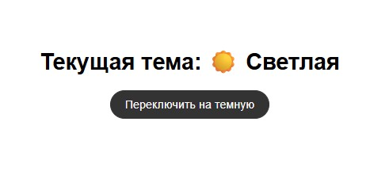
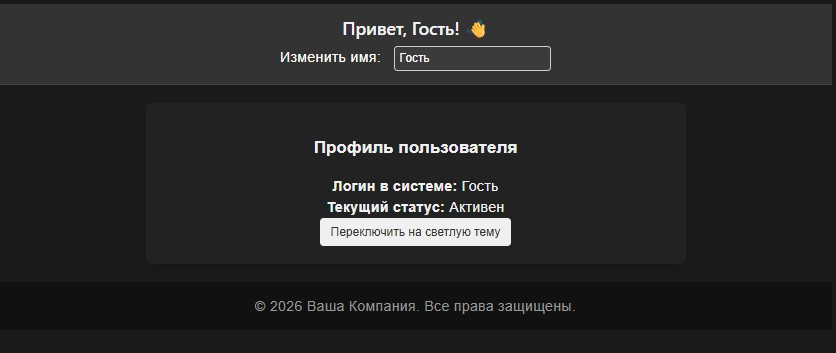
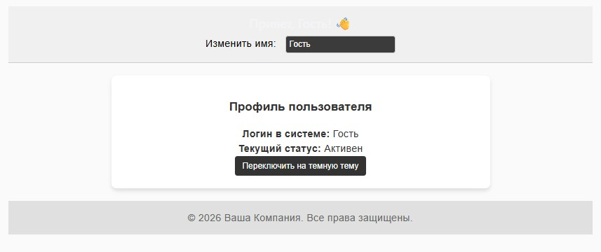

# Урок 5. Компоненты высшего порядка знакомство с Redux

## План урока

- Выполнение практических заданий в соответствии с [презентацией](https://gbcdn.mrgcdn.ru/uploads/asset/6006231/attachment/84435ed0714d1216803b389f02a9cc64.pdf) к уроку


## Домашняя работа ([решение](https://github.com/olgashenkel/GeekBrains-technological_specialization/tree/main/12.%20React%20JS%20framework/Seminar_05/homework/src))

### Приложение для переключения темы сайта

Создать приложение, позволяющее пользователю переключать между светлой и темной темой сайта.

### Функционал:

**Action types:** TOGGLE_THEME.

**Actions:** Создайте действие для переключения темы.

**Reducer:** Реализуйте редьюсер, который обрабатывает это действие и изменяет тему в состоянии приложения.

**Component:** Создайте компонент, который отображает переключатель для изменения темы сайта.


### Описание:

**Состояние:** Для хранения текущей темы можно использовать логическую переменную (true для темной темы и false для светлой) или строку ("dark" или "light").

**Интерфейс:** Ваш интерфейс может состоять из переключателя, который изменяет тему с светлой на темную и обратно.


**Результат выполнения Домашней работы:**

```
/* 1. Файлы архитектуры Redux */

/* store/actionTypes.js */
export const TOGGLE_THEME = 'TOGGLE_THEME';
```


```
/* store/actions.js */
import { TOGGLE_THEME } from './actionTypes';

export const toggleTheme = () => ({
  type: TOGGLE_THEME,
});
```


```
/* themeReducer.js */
import { TOGGLE_THEME } from './actionTypes';

// Начальное состояние приложения — светлая тема
const initialState = {
  mode: 'light', 
};

export const themeReducer = (state = initialState, action) => {
  switch (action.type) {
    case TOGGLE_THEME:
      return {
        ...state,
        // Если была светлая — ставим темную, и наоборот
        mode: state.mode === 'light' ? 'dark' : 'light',
      };
    default:
      return state;
  }
};
```


```
/* store/index.js */

import { createStore } from 'redux';
import { themeReducer } from './themeReducer';

const store = createStore(themeReducer);

export default store;
```

```
/* 2. Компоненты интерфейса (React) */

/* components/ThemeToggler.jsx */

import 'react';
import { useSelector, useDispatch } from 'react-redux';
import { toggleTheme } from '../store/actions';

export default function ThemeToggler() {
  const theme = useSelector((state) => state.mode);
  const dispatch = useDispatch();

  const buttonStyle = {
    padding: '10px 20px',
    fontSize: '16px',
    cursor: 'pointer',
    borderRadius: '20px',
    border: '2px solid',
    transition: 'all 0.3s ease',
    backgroundColor: theme === 'light' ? '#333' : '#fff',
    color: theme === 'light' ? '#fff' : '#333',
    borderColor: theme === 'light' ? '#333' : '#fff',
  };

  return (
    <div style={{ textAlign: 'center', marginTop: '40px' }}>
      <h1>Текущая тема: {theme === 'light' ? '☀️ Светлая' : '🌙 Темная'}</h1>
      <button style={buttonStyle} onClick={() => dispatch(toggleTheme())}>
        Переключить на {theme === 'light' ? 'темную' : 'светлую'}
      </button>
    </div>
  );
}
```

```
/* App.jsx */
import 'react';
import { useSelector } from 'react-redux';
import ThemeToggler from './components/ThemeToggler';

export default function App() {
  // Подписываемся на состояние темы в Redux
  const theme = useSelector((state) => state.mode);

  const appStyle = {
    fontFamily: 'Arial, sans-serif',
    minHeight: '100vh',
    display: 'flex',
    justifyContent: 'center',
    alignItems: 'center',
    transition: 'background-color 0.3s ease, color 0.3s ease',
    // Динамические стили на основе состояния
    backgroundColor: theme === 'light' ? '#ffffff' : '#121212',
    color: theme === 'light' ? '#000000' : '#ffffff',
  };

  return (
    <div style={appStyle}>
      <ThemeToggler />
    </div>
  );
}
```

```
/* main.jsx */

import React from 'react';
import ReactDOM from 'react-dom/client';
import { Provider } from 'react-redux';
import store from './store';
import App from './App';

ReactDOM.createRoot(document.getElementById('root')).render(
  <React.StrictMode>
    <Provider store={store}>
      <App />
    </Provider>
  </React.StrictMode>
);
```





## Практическая работа на семинаре ([решение](https://github.com/olgashenkel/GeekBrains-technological_specialization/tree/main/12.%20React%20JS%20framework/Seminar_05/seminar/src))


**Задание 1 (тайминг 25 минут)** 

1. Создайте контексты UserContext и ThemeContext с начальными значениями (например, имя пользователя: "Гость", тема: "светлая").
2. Реализуйте компонент App:
    - Оберните дочерние компоненты в UserContext.Provider и ThemeContext.Provider.
    - Добавьте возможность изменения имени пользователя и темы через интерфейс пользователя.
3. Создайте компоненты, использующие эти контексты:
    - Header должен отображать приветствие с именем пользователя.
    - Profile может показывать более детальную информацию о пользователе или просто использовать тему для стилизации.
    - Footer должен использовать тему для стилизации и, возможно, отображать копирайт с текущим годом.
4. Добавьте возможность изменения темы и имени пользователя в интерфейсе, используя состояние в компоненте App и передавая функции для изменения через контекст


**Результат выполнения Задания № 1:**
```
/* src/context/UserContext.js */

import { createContext, useState, useContext } from 'react';

const UserContext = createContext(null);

export function UserProvider({ children }) {
  const [username, setUsername] = useState('Гость');

  return (
    <UserContext.Provider value={{ username, setUsername }}>
      {children}
    </UserContext.Provider>
  );
}

// Кастомный хук для быстрого и безопасного доступа к контексту пользователя
export function useUser() {
  const context = useContext(UserContext);
  if (!context) {
    throw new Error('useUser должен использоваться внутри UserProvider');
  }
  return context;
}
```

```
/* src/context/ThemeContext.js */

import { createContext, useState, useContext } from 'react';

const ThemeContext = createContext(null);

export function ThemeProvider({ children }) {
  const [theme, setTheme] = useState('светлая');

  const toggleTheme = () => {
    setTheme((prev) => (prev === 'светлая' ? 'темная' : 'светлая'));
  };

  return (
    <ThemeContext.Provider value={{ theme, toggleTheme }}>
      {children}
    </ThemeContext.Provider>
  );
}

// Кастомный хук для быстрого и безопасного доступа к контексту темы
export function useTheme() {
  const context = useContext(ThemeContext);
  if (!context) {
    throw new Error('useTheme должен использоваться внутри ThemeProvider');
  }
  return context;
}
```

```
/* src/components/Header.jsx */

import 'react';
import { useUser } from '../context/UserContext';
import { useTheme } from '../context/ThemeContext';

export default function Header() {
  const { username, setUsername } = useUser();
  const { theme } = useTheme();

  const headerStyle = {
    padding: '15px',
    borderBottom: '2px solid',
    backgroundColor: theme === 'светлая' ? '#f0f0f0' : '#333',
    color: theme === 'светлая' ? '#000' : '#fff',
    borderColor: theme === 'светлая' ? '#ccc' : '#444',
  };

  return (
    <header style={headerStyle}>
      <h2>Привет, {username}! 👋</h2>
      <label style={{ marginRight: '10px' }}>Изменить имя: </label>
      <input
        type="text"
        value={username}
        onChange={(e) => setUsername(e.target.value)}
        style={{ padding: '5px', borderRadius: '4px', border: '1px solid #ccc' }}
      />
    </header>
  );
}
```

```
/* src/components/Profile.jsx */

import 'react';
import { useUser } from '../context/UserContext';
import { useTheme } from '../context/ThemeContext';

export default function Profile() {
  const { username } = useUser();
  const { theme, toggleTheme } = useTheme();

  const profileStyle = {
    padding: '20px',
    margin: '20px 0',
    borderRadius: '8px',
    backgroundColor: theme === 'светлая' ? '#ffffff' : '#222222',
    color: theme === 'светлая' ? '#333' : '#f0f0f0',
    boxShadow: '0 4px 6px rgba(0,0,0,0.1)',
  };

  return (
    <div style={profileStyle}>
      <h3>Профиль пользователя</h3>
      <p><strong>Логин в системе:</strong> {username}</p>
      <p><strong>Текущий статус:</strong> Активен</p>
      <button 
        onClick={toggleTheme}
        style={{
          padding: '8px 12px',
          cursor: 'pointer',
          backgroundColor: theme === 'светлая' ? '#333' : '#f0f0f0',
          color: theme === 'светлая' ? '#fff' : '#333',
          border: 'none',
          borderRadius: '4px'
        }}
      >
        Переключить на {theme === 'светлая' ? 'темную' : 'светлую'} тему
      </button>
    </div>
  );
}
```

```
/* src/components/Footer.jsx */

import 'react';
import { useTheme } from '../context/ThemeContext';

export default function Footer() {
  const { theme } = useTheme();
  const currentYear = new Date().getFullYear();

  const footerStyle = {
    padding: '15px',
    textAlign: 'center',
    marginTop: '20px',
    backgroundColor: theme === 'светлая' ? '#e0e0e0' : '#111',
    color: theme === 'светлая' ? '#666' : '#999',
  };

  return (
    <footer style={footerStyle}>
      <p>&copy; {currentYear} Ваша Компания. Все права защищены.</p>
    </footer>
  );
}
```

```
import 'react';
import { UserProvider } from './context/UserContext';
import { ThemeProvider, useTheme } from './context/ThemeContext';
import Header from './components/Header';
import Profile from './components/Profile';
import Footer from './components/Footer';

// Внутренний макет, который имеет доступ к ThemeProvider
function AppContent() {
  const { theme } = useTheme();

  const appStyle = {
    fontFamily: 'Arial, sans-serif',
    minHeight: '100vh',
    padding: '20px',
    transition: 'background-color 0.3s ease',
    backgroundColor: theme === 'светлая' ? '#fafafa' : '#1a1a1a',
  };

  return (
    <div style={appStyle}>
      <Header />
      <main style={{ maxWidth: '600px', margin: '0 auto' }}>
        <Profile />
      </main>
      <Footer />
    </div>
  );
}

// Главный компонент оборачивает всё приложение в провайдеры контекста
export default function App() {
  return (
    <UserProvider>
      <ThemeProvider>
        <AppContent />
      </ThemeProvider>
    </UserProvider>
  );
}
```






