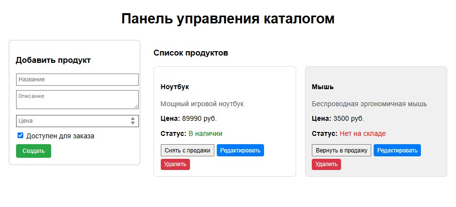
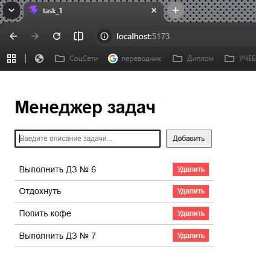
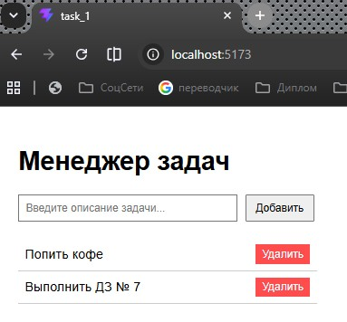
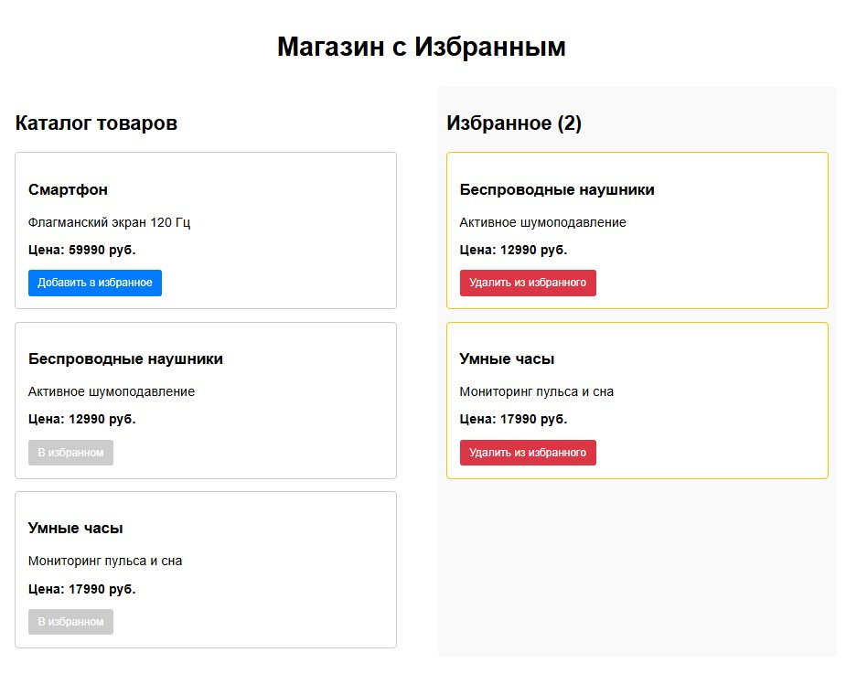

# Урок 6. Погружение в Redux. Connect


## План урока

- Выполнение практических заданий в соответствии с [презентацией](https://gbcdn.mrgcdn.ru/uploads/asset/6006227/attachment/a8d244f212f708c5ba5e1a79d8ca525a.pdf) к уроку


## Домашняя работа - дублирует Задание № 3\* с семинара ([решение](https://github.com/olgashenkel/GeekBrains-technological_specialization/tree/main/12.%20React%20JS%20framework/Seminar_06/task_3/src))

**Задание:**

Разработать приложение для управления каталогом продуктов, позволяющее добавлять, удалять, отображать и редактировать продукты.
1. Настройка `Redux Store`:
    - Используйте `configureStore` из `@reduxjs/toolkit` для создания хранилища.
    - Определите начальное состояние и создайте слайс с использованием `createSlice` для продуктов. Каждый продукт должен иметь `id`, `name`, `description`, `price`, и `available`.
    - В слайсе определите редьюсеры и действия для добавления нового продукта, удаления продукта по `ID`, обновления продукта и изменения его доступности.
2. Компоненты `React`:
    - Компонент для добавления продукта: 
      - Создайте форму, позволяющую пользователям вводить данные нового продукта (имя, описание, цена, доступность) и добавлять его в каталог.
    - Компонент для отображения продуктов: 
      - Разработайте компонент, который отображает список всех продуктов с их атрибутами, а также кнопки для удаления продукта из каталога и переключения его доступности.
    - Компонент для редактирования продукта: 
      - Опционально, предоставьте возможность редактирования существующих продуктов, чтобы можно было изменять их имя описание, цену и доступность.


**Результат выполнения Задания № 3:**

```
/* store/productsSlice.js */

import { createSlice } from '@reduxjs/toolkit';

const initialState = {
  items: [
    { id: 1, name: 'Ноутбук', description: 'Мощный игровой ноутбук', price: 89990, available: true },
    { id: 2, name: 'Мышь', description: 'Беспроводная эргономичная мышь', price: 3500, available: false }
  ],
};

const productsSlice = createSlice({
  name: 'products',
  initialState,
  reducers: {
    // Добавление нового продукта
    addProduct: (state, action) => {
      state.items.push({
        id: Date.now(),
        ...action.payload,
        price: Number(action.payload.price) // Гарантируем тип number
      });
    },
    // Удаление по ID
    deleteProduct: (state, action) => {
      state.items = state.items.filter(item => item.id !== action.payload);
    },
    // Изменение доступности (переключатель)
    toggleAvailability: (state, action) => {
      const product = state.items.find(item => item.id === action.payload);
      if (product) {
        product.available = !product.available;
      }
    },
    // Обновление всех полей продукта
    updateProduct: (state, action) => {
      const index = state.items.findIndex(item => item.id === action.payload.id);
      if (index !== -1) {
        state.items[index] = {
          ...action.payload,
          price: Number(action.payload.price)
        };
      }
    }
  },
});

export const { addProduct, deleteProduct, toggleAvailability, updateProduct } = productsSlice.actions;
export default productsSlice.reducer;
```

```
/* store/store.js */

import { configureStore } from '@reduxjs/toolkit';
import productsReducer from './productsSlice';

export const store = configureStore({
  reducer: {
    products: productsReducer,
  },
});
```

```
/* components/AddProductForm.jsx */

import { useState } from 'react';
import { useDispatch } from 'react-redux';
import { addProduct } from '../store/productsSlice';

export const AddProductForm = () => {
  const dispatch = useDispatch();
  const [formData, setFormData] = useState({ name: '', description: '', price: '', available: true });

  const handleSubmit = (e) => {
    e.preventDefault();
    if (!formData.name || !formData.price) return alert('Заполните название и цену!');
    
    dispatch(addProduct(formData));
    setFormData({ name: '', description: '', price: '', available: true }); // Сброс
  };

  return (
    <form onSubmit={handleSubmit} style={{ border: '1px solid #ccc', padding: '15px', borderRadius: '8px', marginBottom: '20px' }}>
      <h3>Добавить продукт</h3>
      <div style={{ marginBottom: '10px' }}>
        <input type="text" placeholder="Название" value={formData.name} onChange={e => setFormData({...formData, name: e.target.value})} style={{ width: '100%', padding: '5px' }} />
      </div>
      <div style={{ marginBottom: '10px' }}>
        <textarea placeholder="Описание" value={formData.description} onChange={e => setFormData({...formData, description: e.target.value})} style={{ width: '100%', padding: '5px' }} />
      </div>
      <div style={{ marginBottom: '10px' }}>
        <input type="number" placeholder="Цена" value={formData.price} onChange={e => setFormData({...formData, price: e.target.value})} style={{ width: '100%', padding: '5px' }} />
      </div>
      <div style={{ marginBottom: '10px' }}>
        <label>
          <input type="checkbox" checked={formData.available} onChange={e => setFormData({...formData, available: e.target.checked})} /> Доступен для заказа
        </label>
      </div>
      <button type="submit" style={{ padding: '8px 15px', backgroundColor: '#28a745', color: '#fff', border: 'none', borderRadius: '4px', cursor: 'pointer' }}>Создать</button>
    </form>
  );
};
```

```
/* components/EditProductForm.jsx */

import { useState } from 'react';
import { useDispatch } from 'react-redux';
import { updateProduct } from '../store/productsSlice';

export const EditProductForm = ({ product, onCancel }) => {
  const dispatch = useDispatch();
  const [formData, setFormData] = useState({ ...product });

  const handleSubmit = (e) => {
    e.preventDefault();
    dispatch(updateProduct(formData));
    onCancel(); // Закрываем режим редактирования
  };

  return (
    <form onSubmit={handleSubmit} style={{ border: '1px solid #ffc107', padding: '15px', borderRadius: '8px', backgroundColor: '#fff9e6' }}>
      <h4>Редактирование: {product.name}</h4>
      <div style={{ marginBottom: '10px' }}>
        <input type="text" value={formData.name} onChange={e => setFormData({...formData, name: e.target.value})} style={{ width: '100%', padding: '5px' }} />
      </div>
      <div style={{ marginBottom: '10px' }}>
        <textarea value={formData.description} onChange={e => setFormData({...formData, description: e.target.value})} style={{ width: '100%', padding: '5px' }} />
      </div>
      <div style={{ marginBottom: '10px' }}>
        <input type="number" value={formData.price} onChange={e => setFormData({...formData, price: e.target.value})} style={{ width: '100%', padding: '5px' }} />
      </div>
      <div style={{ marginBottom: '10px' }}>
        <label>
          <input type="checkbox" checked={formData.available} onChange={e => setFormData({...formData, available: e.target.checked})} /> Доступен
        </label>
      </div>
      <button type="submit" style={{ marginRight: '10px', padding: '5px 10px', backgroundColor: '#ffc107', border: 'none', borderRadius: '4px', cursor: 'pointer' }}>Сохранить</button>
      <button type="button" onClick={onCancel} style={{ padding: '5px 10px', backgroundColor: '#6c757d', color: '#fff', border: 'none', borderRadius: '4px', cursor: 'pointer' }}>Отмена</button>
    </form>
  );
};
```

```
/* components/ProductList.jsx */

import { useState } from 'react';
import { useSelector, useDispatch } from 'react-redux';
import { deleteProduct, toggleAvailability } from '../store/productsSlice';
import { EditProductForm } from './EditProductForm';

export const ProductList = () => {
  const products = useSelector((state) => state.products.items);
  const dispatch = useDispatch();
  
  // Локальный стейт для отслеживания редактируемого продукта
  const [editingId, setEditingId] = useState(null);

  return (
    <div>
      <h3>Список продуктов</h3>
      {products.length === 0 ? <p>Каталог пуст</p> : (
        <div style={{ display: 'grid', gridTemplateColumns: 'repeat(auto-fill, minmax(280px, 1fr))', gap: '20px' }}>
          {products.map((product) => (
            <div key={product.id} style={{ border: '1px solid #ddd', padding: '15px', borderRadius: '8px', backgroundColor: product.available ? '#fff' : '#f0f0f0' }}>
              {editingId === product.id ? (
                <EditProductForm product={product} onCancel={() => setEditingId(null)} />
              ) : (
                <>
                  <h4>{product.name}</h4>
                  <p style={{ color: '#555' }}>{product.description}</p>
                  <p><b>Цена:</b> {product.price} руб.</p>
                  <p><b>Статус:</b> {product.available ? <span style={{ color: 'green' }}>В наличии</span> : <span style={{ color: 'red' }}>Нет на складе</span>}</p>
                  
                  <div style={{ display: 'flex', gap: '5px', flexWrap: 'wrap', marginTop: '10px' }}>
                    <button onClick={() => dispatch(toggleAvailability(product.id))} style={{ padding: '5px 8px', cursor: 'pointer' }}>
                      {product.available ? 'Снять с продажи' : 'Вернуть в продажу'}
                    </button>
                    <button onClick={() => setEditingId(product.id)} style={{ padding: '5px 8px', backgroundColor: '#007bff', color: '#fff', border: 'none', borderRadius: '4px', cursor: 'pointer' }}>
                      Редактировать
                    </button>
                    <button onClick={() => dispatch(deleteProduct(product.id))} style={{ padding: '5px 8px', backgroundColor: '#dc3545', color: '#fff', border: 'none', borderRadius: '4px', cursor: 'pointer' }}>
                      Удалить
                    </button>
                  </div>
                </>
              )}
            </div>
          ))}
        </div>
      )}
    </div>
  );
};
```

```
/* App.jsx */

import 'react';
import { AddProductForm } from './components/AddProductForm';
import { ProductList } from './components/ProductList';

function App() {
  return (
    <div style={{ padding: '20px', fontFamily: 'Arial, sans-serif', maxWidth: '1000px', margin: '0 auto' }}>
      <h1 style={{ textAlign: 'center', marginBottom: '30px' }}>Панель управления каталогом</h1>
      <div style={{ display: 'grid', gridTemplateColumns: '300px 1fr', gap: '30px' }}>
        <div>
          <AddProductForm />
        </div>
        <div>
          <ProductList />
        </div>
      </div>
    </div>
  );
}

export default App;
```

```
/* main.jsx */

import React from 'react';
import ReactDOM from 'react-dom/client';
import { Provider } from 'react-redux';
import { store } from './store/store';
import App from './App';

ReactDOM.createRoot(document.getElementById('root')).render(
  <React.StrictMode>
    <Provider store={store}>
      <App />
    </Provider>
  </React.StrictMode>
);
```




## Практическая работа на семинаре ([решение](https://github.com/olgashenkel/GeekBrains-technological_specialization/tree/main/12.%20React%20JS%20framework/Seminar_05/seminar/src))


**Задание 1 (тайминг 50 минут)** 

Разработайте функционал для управления списком дел, который позволит пользователям добавлять новые задачи и удалять их из списка.

Настройка `Redux Store`:
1. Определите начальное состояние для списка задач в вашем `Redux store`. Каждая задача должна иметь следующие атрибуты:
    - `id`: Уникальный идентификатор (например, можно использовать Date.now() для его генерации).
    - `description` : Описание задачи, введенное пользователем.
    - `isCompleted` : Статус выполнения задачи (изначально false).
2. Создайте два действия:
    - Для добавления новой задачи в список.
    - Для удаления задачи из списка по `id`.

Компонент для добавления задачи:
  - Реализуйте компонент с текстовым полем для ввода описания задачи и кнопкой `"Добавить"`, которая будет диспатчить `action` для добавления задачи в store.

Компонент для отображения списка задач:
  - Создайте компонент, который будет отображать список всех
текущих задач. Для каждой задачи отобразите описание и
кнопку `"Удалить"`, которая будет диспатчить `action` для удаления
этой задачи из store.


**Результат выполнения Задания № 1:**

```
/* store/todoSlice.js */

import { createSlice } from '@reduxjs/toolkit';

const initialState = {
  tasks: [],
};

const todoSlice = createSlice({
  name: 'todos',
  initialState,
  reducers: {
    // Действие для добавления новой задачи
    addTask: (state, action) => {
      state.tasks.push({
        id: Date.now(), // Уникальный идентификатор
        description: action.payload, // Описание от пользователя
        isCompleted: false, // Изначальный статус
      });
    },
    // Действие для удаления задачи по id
    deleteTask: (state, action) => {
      state.tasks = state.tasks.filter(task => task.id !== action.payload);
    },
  },
});

export const { addTask, deleteTask } = todoSlice.actions;
export default todoSlice.reducer;
```

```
/* store/store.js */

import { configureStore } from '@reduxjs/toolkit';
import todoReducer from './todoSlice';

export const store = configureStore({
  reducer: {
    todos: todoReducer,
  },
});
```

```
/* components/AddTask.jsx */
import { useState } from 'react';
import { useDispatch } from 'react-redux';
import { addTask } from '../store/todoSlice';

export const AddTask = () => {
  const [text, setText] = useState('');
  const dispatch = useDispatch();

  const handleAdd = (e) => {
    e.preventDefault();
    if (text.trim() === '') return; // Защита от пустых задач

    dispatch(addTask(text));
    setText(''); // Очистка поля ввода
  };

  return (
    <form onSubmit={handleAdd} style={{ marginBottom: '20px' }}>
      <input
        type="text"
        value={text}
        onChange={(e) => setText(e.target.value)}
        placeholder="Введите описание задачи..."
        style={{ padding: '8px', marginRight: '10px', width: '250px' }}
      />
      <button type="submit" style={{ padding: '8px 12px' }}>
        Добавить
      </button>
    </form>
  );
};
```

```
/* components/TodoList.jsx */

import 'react';
import { useSelector, useDispatch } from 'react-redux';
import { deleteTask } from '../store/todoSlice';

export const TodoList = () => {
  const tasks = useSelector((state) => state.todos.tasks);
  const dispatch = useDispatch();

  if (tasks.length === 0) {
    return <p>Список задач пуст.</p>;
  }

  return (
    <ul style={{ listStyleType: 'none', padding: 0 }}>
      {tasks.map((task) => (
        <li
          key={task.id}
          style={{
            display: 'flex',
            justifyContent: 'space-between',
            alignItems: 'center',
            width: '350px',
            padding: '8px',
            borderBottom: '1px solid #ccc',
          }}
        >
          <span>{task.description}</span>
          <button
            onClick={() => dispatch(deleteTask(task.id))}
            style={{
              padding: '4px 8px',
              backgroundColor: '#ff4d4d',
              color: 'white',
              border: 'none',
              cursor: 'pointer',
            }}
          >
            Удалить
          </button>
        </li>
      ))}
    </ul>
  );
};
```

```
/* App.jsx */

import 'react';
import { AddTask } from './components/AddTask';
import { TodoList } from './components/TodoList';

function App() {
  return (
    <div style={{ padding: '20px', fontFamily: 'Arial, sans-serif' }}>
      <h1>Менеджер задач</h1>
      <AddTask />
      <TodoList />
    </div>
  );
}

export default App;
```


```
/* main.jsx */

import React from 'react';
import ReactDOM from 'react-dom/client';
import { Provider } from 'react-redux';
import { store } from './store/store';
import App from './App';

ReactDOM.createRoot(document.getElementById('root')).render(
  <React.StrictMode>
    <Provider store={store}>
      <App />
    </Provider>
  </React.StrictMode>
);
```






**Задание 2 (тайминг 25 минут)** 

Создать приложение, которое позволяет пользователям добавлять товары в список `"Избранное"` и управлять этим списком (добавлять новые товары и удалять их).
1. Настройка `Redux Store`:
    - Создайте `favoritesSlice` с использованием `createSlice`. Определите начальное состояние, которое будет содержать массив избранных товаров. Каждый товар должен иметь `id`, `name`, `description`, и `price`.
    - Определите `редьюсеры` для добавления товара в избранное и удаления товара из избранного.
2. Компоненты `React`:
    - Создайте компонент, который отображает список всех товаров. Для каждого товара предусмотрите кнопку `"Добавить в избранное"`, которая будет добавлять товар в список избранных.
    - Разработайте компонент, который отображает список товаров, добавленных в избранное. Для каждого товара в этом списке должна быть кнопка `"Удалить из избранного"`, позволяющая удалять товар из списка.


**Результат выполнения Задания № 2:**

```
/* store/favoritesSlice.js */

import { createSlice } from '@reduxjs/toolkit';

const initialState = {
  items: [], // Массив для хранения избранных товаров
};

const favoritesSlice = createSlice({
  name: 'favorites',
  initialState,
  reducers: {
    // Добавление товара в избранное
    addToFavorites: (state, action) => {
      const itemExists = state.items.some(item => item.id === action.payload.id);
      // Добавляем товар только если его еще нет в списке
      if (!itemExists) {
        state.items.push(action.payload);
      }
    },
    // Удаление товара по id
    removeFromFavorites: (state, action) => {
      state.items = state.items.filter(item => item.id !== action.payload);
    },
  },
});

export const { addToFavorites, removeFromFavorites } = favoritesSlice.actions;
export default favoritesSlice.reducer;
```

```
/* store/store.js */

import { configureStore } from '@reduxjs/toolkit';
import favoritesReducer from './favoritesSlice';

export const store = configureStore({
  reducer: {
    favorites: favoritesReducer,
  },
});
```

```
/* components/ProductList.jsx */

import 'react';
import { useDispatch, useSelector } from 'react-redux';
import { addToFavorites } from '../store/favoritesSlice';

// Имитация базы данных товаров
const DUMMY_PRODUCTS = [
  { id: 1, name: 'Смартфон', description: 'Флагманский экран 120 Гц', price: 59990 },
  { id: 2, name: 'Беспроводные наушники', description: 'Активное шумоподавление', price: 12990 },
  { id: 3, name: 'Умные часы', description: 'Мониторинг пульса и сна', price: 17990 },
];

export const ProductList = () => {
  const dispatch = useDispatch();
  // Получаем текущие избранные товары для проверки дубликатов в UI
  const favoriteItems = useSelector((state) => state.favorites.items);

  return (
    <div style={{ flex: 1, padding: '10px' }}>
      <h2>Каталог товаров</h2>
      <div style={{ display: 'flex', flexDirection: 'column', gap: '15px' }}>
        {DUMMY_PRODUCTS.map((product) => {
          const isFavorite = favoriteItems.some((item) => item.id === product.id);

          return (
            <div key={product.id} style={{ border: '1px solid #ccc', padding: '15px', borderRadius: '5px' }}>
              <h3>{product.name}</h3>
              <p>{product.description}</p>
              <p style={{ fontWeight: 'bold' }}>Цена: {product.price} руб.</p>
              <button
                onClick={() => dispatch(addToFavorites(product))}
                disabled={isFavorite}
                style={{
                  padding: '8px 12px',
                  backgroundColor: isFavorite ? '#ccc' : '#007bff',
                  color: 'white',
                  border: 'none',
                  borderRadius: '3px',
                  cursor: isFavorite ? 'not-allowed' : 'pointer',
                }}
              >
                {isFavorite ? 'В избранном' : 'Добавить в избранное'}
              </button>
            </div>
          );
        })}
      </div>
    </div>
  );
};
```

```
/* components/FavoritesList.jsx */

import 'react';
import { useSelector, useDispatch } from 'react-redux';
import { removeFromFavorites } from '../store/favoritesSlice';

export const FavoritesList = () => {
  const favoriteItems = useSelector((state) => state.favorites.items);
  const dispatch = useDispatch();

  return (
    <div style={{ flex: 1, padding: '10px', backgroundColor: '#f9f9f9', borderRadius: '5px' }}>
      <h2>Избранное ({favoriteItems.length})</h2>
      {favoriteItems.length === 0 ? (
        <p>Список избранного пуст.</p>
      ) : (
        <div style={{ display: 'flex', flexDirection: 'column', gap: '15px' }}>
          {favoriteItems.map((item) => (
            <div key={item.id} style={{ border: '1px solid #ffc107', padding: '15px', borderRadius: '5px', backgroundColor: '#fff' }}>
              <h3>{item.name}</h3>
              <p>{item.description}</p>
              <p style={{ fontWeight: 'bold' }}>Цена: {item.price} руб.</p>
              <button
                onClick={() => dispatch(removeFromFavorites(item.id))}
                style={{
                  padding: '8px 12px',
                  backgroundColor: '#dc3545',
                  color: 'white',
                  border: 'none',
                  borderRadius: '3px',
                  cursor: 'pointer',
                }}
              >
                Удалить из избранного
              </button>
            </div>
          ))}
        </div>
      )}
    </div>
  );
};
```

```
/* App.jsx */

import 'react';
import { ProductList } from './components/ProductList';
import { FavoritesList } from './components/FavoritesList';

function App() {
  return (
    <div style={{ padding: '20px', fontFamily: 'Arial, sans-serif', maxWidth: '1200px', margin: '0 auto' }}>
      <h1 style={{ textAlign: 'center' }}>Магазин с Избранным</h1>
      <div style={{ display: 'flex', gap: '40px', marginTop: '30px' }}>
        <ProductList />
        <FavoritesList />
      </div>
    </div>
  );
}

export default App;
```

```
/* main.jsx */

import React from 'react';
import ReactDOM from 'react-dom/client';
import { Provider } from 'react-redux';
import { store } from './store/store';
import App from './App';

ReactDOM.createRoot(document.getElementById('root')).render(
  <React.StrictMode>
    <Provider store={store}>
      <App />
    </Provider>
  </React.StrictMode>
);
```




**Задание 3\* (тайминг 55 минут)** 

Разработать приложение для управления каталогом продуктов, позволяющее добавлять, удалять, отображать и редактировать продукты.
1. Настройка `Redux Store`:
    - Используйте `configureStore` из `@reduxjs/toolkit` для создания хранилища.
    - Определите начальное состояние и создайте слайс с использованием `createSlice` для продуктов. Каждый продукт должен иметь `id`, `name`, `description`, `price`, и `available`.
    - В слайсе определите редьюсеры и действия для добавления нового продукта, удаления продукта по `ID`, обновления продукта и изменения его доступности.
2. Компоненты `React`:
    - Компонент для добавления продукта: 
      - Создайте форму, позволяющую пользователям вводить данные нового продукта (имя, описание, цена, доступность) и добавлять его в каталог.
    - Компонент для отображения продуктов: 
      - Разработайте компонент, который отображает список всех продуктов с их атрибутами, а также кнопки для удаления продукта из каталога и переключения его доступности.
    - Компонент для редактирования продукта: 
      - Опционально, предоставьте возможность редактирования существующих продуктов, чтобы можно было изменять их имя описание, цену и доступность.


**Результат выполнения Задания № 3:**

```
/* store/productsSlice.js */

import { createSlice } from '@reduxjs/toolkit';

const initialState = {
  items: [
    { id: 1, name: 'Ноутбук', description: 'Мощный игровой ноутбук', price: 89990, available: true },
    { id: 2, name: 'Мышь', description: 'Беспроводная эргономичная мышь', price: 3500, available: false }
  ],
};

const productsSlice = createSlice({
  name: 'products',
  initialState,
  reducers: {
    // Добавление нового продукта
    addProduct: (state, action) => {
      state.items.push({
        id: Date.now(),
        ...action.payload,
        price: Number(action.payload.price) // Гарантируем тип number
      });
    },
    // Удаление по ID
    deleteProduct: (state, action) => {
      state.items = state.items.filter(item => item.id !== action.payload);
    },
    // Изменение доступности (переключатель)
    toggleAvailability: (state, action) => {
      const product = state.items.find(item => item.id === action.payload);
      if (product) {
        product.available = !product.available;
      }
    },
    // Обновление всех полей продукта
    updateProduct: (state, action) => {
      const index = state.items.findIndex(item => item.id === action.payload.id);
      if (index !== -1) {
        state.items[index] = {
          ...action.payload,
          price: Number(action.payload.price)
        };
      }
    }
  },
});

export const { addProduct, deleteProduct, toggleAvailability, updateProduct } = productsSlice.actions;
export default productsSlice.reducer;
```

```
/* store/store.js */

import { configureStore } from '@reduxjs/toolkit';
import productsReducer from './productsSlice';

export const store = configureStore({
  reducer: {
    products: productsReducer,
  },
});
```

```
/* components/AddProductForm.jsx */

import { useState } from 'react';
import { useDispatch } from 'react-redux';
import { addProduct } from '../store/productsSlice';

export const AddProductForm = () => {
  const dispatch = useDispatch();
  const [formData, setFormData] = useState({ name: '', description: '', price: '', available: true });

  const handleSubmit = (e) => {
    e.preventDefault();
    if (!formData.name || !formData.price) return alert('Заполните название и цену!');
    
    dispatch(addProduct(formData));
    setFormData({ name: '', description: '', price: '', available: true }); // Сброс
  };

  return (
    <form onSubmit={handleSubmit} style={{ border: '1px solid #ccc', padding: '15px', borderRadius: '8px', marginBottom: '20px' }}>
      <h3>Добавить продукт</h3>
      <div style={{ marginBottom: '10px' }}>
        <input type="text" placeholder="Название" value={formData.name} onChange={e => setFormData({...formData, name: e.target.value})} style={{ width: '100%', padding: '5px' }} />
      </div>
      <div style={{ marginBottom: '10px' }}>
        <textarea placeholder="Описание" value={formData.description} onChange={e => setFormData({...formData, description: e.target.value})} style={{ width: '100%', padding: '5px' }} />
      </div>
      <div style={{ marginBottom: '10px' }}>
        <input type="number" placeholder="Цена" value={formData.price} onChange={e => setFormData({...formData, price: e.target.value})} style={{ width: '100%', padding: '5px' }} />
      </div>
      <div style={{ marginBottom: '10px' }}>
        <label>
          <input type="checkbox" checked={formData.available} onChange={e => setFormData({...formData, available: e.target.checked})} /> Доступен для заказа
        </label>
      </div>
      <button type="submit" style={{ padding: '8px 15px', backgroundColor: '#28a745', color: '#fff', border: 'none', borderRadius: '4px', cursor: 'pointer' }}>Создать</button>
    </form>
  );
};
```

```
/* components/EditProductForm.jsx */

import { useState } from 'react';
import { useDispatch } from 'react-redux';
import { updateProduct } from '../store/productsSlice';

export const EditProductForm = ({ product, onCancel }) => {
  const dispatch = useDispatch();
  const [formData, setFormData] = useState({ ...product });

  const handleSubmit = (e) => {
    e.preventDefault();
    dispatch(updateProduct(formData));
    onCancel(); // Закрываем режим редактирования
  };

  return (
    <form onSubmit={handleSubmit} style={{ border: '1px solid #ffc107', padding: '15px', borderRadius: '8px', backgroundColor: '#fff9e6' }}>
      <h4>Редактирование: {product.name}</h4>
      <div style={{ marginBottom: '10px' }}>
        <input type="text" value={formData.name} onChange={e => setFormData({...formData, name: e.target.value})} style={{ width: '100%', padding: '5px' }} />
      </div>
      <div style={{ marginBottom: '10px' }}>
        <textarea value={formData.description} onChange={e => setFormData({...formData, description: e.target.value})} style={{ width: '100%', padding: '5px' }} />
      </div>
      <div style={{ marginBottom: '10px' }}>
        <input type="number" value={formData.price} onChange={e => setFormData({...formData, price: e.target.value})} style={{ width: '100%', padding: '5px' }} />
      </div>
      <div style={{ marginBottom: '10px' }}>
        <label>
          <input type="checkbox" checked={formData.available} onChange={e => setFormData({...formData, available: e.target.checked})} /> Доступен
        </label>
      </div>
      <button type="submit" style={{ marginRight: '10px', padding: '5px 10px', backgroundColor: '#ffc107', border: 'none', borderRadius: '4px', cursor: 'pointer' }}>Сохранить</button>
      <button type="button" onClick={onCancel} style={{ padding: '5px 10px', backgroundColor: '#6c757d', color: '#fff', border: 'none', borderRadius: '4px', cursor: 'pointer' }}>Отмена</button>
    </form>
  );
};
```

```
/* components/ProductList.jsx */

import { useState } from 'react';
import { useSelector, useDispatch } from 'react-redux';
import { deleteProduct, toggleAvailability } from '../store/productsSlice';
import { EditProductForm } from './EditProductForm';

export const ProductList = () => {
  const products = useSelector((state) => state.products.items);
  const dispatch = useDispatch();
  
  // Локальный стейт для отслеживания редактируемого продукта
  const [editingId, setEditingId] = useState(null);

  return (
    <div>
      <h3>Список продуктов</h3>
      {products.length === 0 ? <p>Каталог пуст</p> : (
        <div style={{ display: 'grid', gridTemplateColumns: 'repeat(auto-fill, minmax(280px, 1fr))', gap: '20px' }}>
          {products.map((product) => (
            <div key={product.id} style={{ border: '1px solid #ddd', padding: '15px', borderRadius: '8px', backgroundColor: product.available ? '#fff' : '#f0f0f0' }}>
              {editingId === product.id ? (
                <EditProductForm product={product} onCancel={() => setEditingId(null)} />
              ) : (
                <>
                  <h4>{product.name}</h4>
                  <p style={{ color: '#555' }}>{product.description}</p>
                  <p><b>Цена:</b> {product.price} руб.</p>
                  <p><b>Статус:</b> {product.available ? <span style={{ color: 'green' }}>В наличии</span> : <span style={{ color: 'red' }}>Нет на складе</span>}</p>
                  
                  <div style={{ display: 'flex', gap: '5px', flexWrap: 'wrap', marginTop: '10px' }}>
                    <button onClick={() => dispatch(toggleAvailability(product.id))} style={{ padding: '5px 8px', cursor: 'pointer' }}>
                      {product.available ? 'Снять с продажи' : 'Вернуть в продажу'}
                    </button>
                    <button onClick={() => setEditingId(product.id)} style={{ padding: '5px 8px', backgroundColor: '#007bff', color: '#fff', border: 'none', borderRadius: '4px', cursor: 'pointer' }}>
                      Редактировать
                    </button>
                    <button onClick={() => dispatch(deleteProduct(product.id))} style={{ padding: '5px 8px', backgroundColor: '#dc3545', color: '#fff', border: 'none', borderRadius: '4px', cursor: 'pointer' }}>
                      Удалить
                    </button>
                  </div>
                </>
              )}
            </div>
          ))}
        </div>
      )}
    </div>
  );
};
```

```
/* App.jsx */

import 'react';
import { AddProductForm } from './components/AddProductForm';
import { ProductList } from './components/ProductList';

function App() {
  return (
    <div style={{ padding: '20px', fontFamily: 'Arial, sans-serif', maxWidth: '1000px', margin: '0 auto' }}>
      <h1 style={{ textAlign: 'center', marginBottom: '30px' }}>Панель управления каталогом</h1>
      <div style={{ display: 'grid', gridTemplateColumns: '300px 1fr', gap: '30px' }}>
        <div>
          <AddProductForm />
        </div>
        <div>
          <ProductList />
        </div>
      </div>
    </div>
  );
}

export default App;
```

```
/* main.jsx */

import React from 'react';
import ReactDOM from 'react-dom/client';
import { Provider } from 'react-redux';
import { store } from './store/store';
import App from './App';

ReactDOM.createRoot(document.getElementById('root')).render(
  <React.StrictMode>
    <Provider store={store}>
      <App />
    </Provider>
  </React.StrictMode>
);
```


