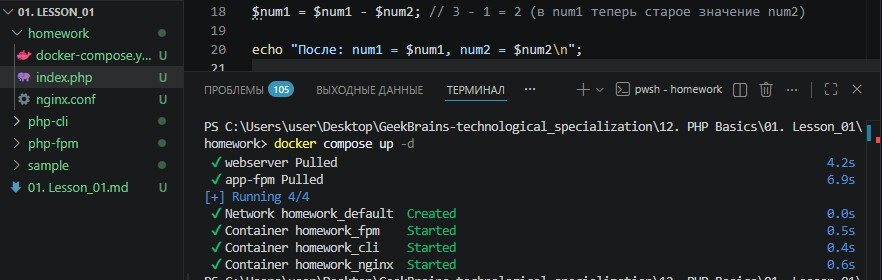
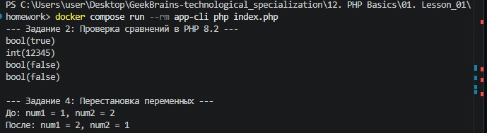
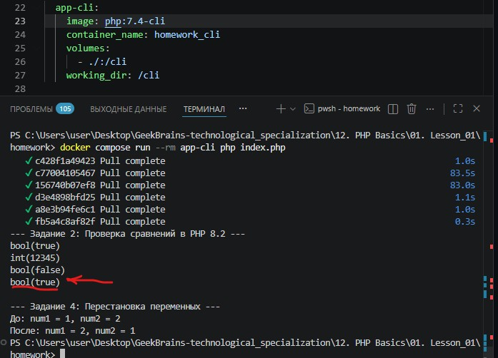
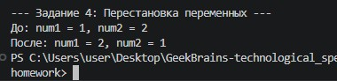

# Урок 1. Лекция. Введение в PHP

## План урока

- Знакомство с языком
- Инфраструктура для работы веб-приложения
- Отличия cli от web
- Собираем контейнеры для web и для cli
- Пишем простой скрипт с применением различных переменных.
- Знакомимся с типами и их приведением

---

## Домашняя работа ([решение]())

1. Собрать для себя окружение из `Nginx` + `PHP-FPM` и `PHP CLI`
2. Выполните код в контейнере `PHP CLI` и объясните, что выведет данный код и почему:
```
<?php
 $a = 5;
 $b = '05';
 var_dump($a == $b);
 var_dump((int)'012345');
 var_dump((float)123.0 === (int)123.0);
 var_dump(0 == 'hello, world');
?>
```

3. В контейнере с `PHP CLI` поменяйте версию `PHP` с `8.2` на `7.4`. Изменится ли вывод?
4. Используя только две числовые переменные, поменяйте их значение местами.

    Например, если `a = 1`,` b = 2`, надо, чтобы получилось: `b = 1`, `a = 2`. Дополнительные переменные, функции и конструкции типа `list()` использовать нельзя


***Результат выполнения Домашней работы:***

**Задание № 1:**




**Задание № 2:**



```
echo "--- Задание 2: Проверка сравнений в PHP 8.2 ---\n";
$a = 5;
$b = '05';
var_dump($a == $b);
var_dump((int)'012345');
var_dump((float)123.0 === (int)123.0);
var_dump(0 == 'hello, world');
```

1. `var_dump($a == $b);` -> `bool(true)`   
   Оператор `==` (нестрогое сравнение) приводит типы к общему знаменателю. Так как строка `'05'` состоит из цифр, PHP приравнивает её к числу `5`. Число `5` равно числу `5`, поэтому результат — `true`.
2. `var_dump((int)'012345');` -> `int(12345)`   
   При явном приведении строки к целому числу `(int)` ведущий ноль отбрасывается, так как в десятичной системе счисления числа не начинаются с нуля. Строка превращается в обычное число `12345`.
3. `var_dump((float)123.0 === (int)123.0);` -> `bool(false)`   
   Оператор `===` (строгое сравнение) проверяет не только значения, но и типы данных. Слева у нас тип `float` (дробное число), справа — `int` (целое число). Значения одинаковы (`123`), но типы разные. Поэтому результат — `false`.
4. `var_dump(0 == 'hello, world');` -> `bool(false)`   
   Это важная особенность `PHP 8.x`! При нестрогом сравнении числа со строкой, если строка не является числовой (не начинается с цифр), `PHP 8.x` приводит число `0` к строке `'0'`. Строка `'0'` не равна строке `'hello, world'`, поэтому результат — `false`.


**Задание № 3:**



В `PHP 7.4` и более старых версиях логика нестрогого сравнения `==` была другой. При сравнении числа со строкой `PHP` пытался привести строку к числу. Строка `'hello, world'` не содержит цифр, поэтому `PHP 7.4` превращал её в число `0`. В итоге происходило сравнение `0 == 0`, что давало `bool(true)`.

Это рождало огромное количество багов и уязвимостей, поэтому в `PHP 8.0` поведение изменили на более логичное (число приводится к строке, вывод стал `false`).


**Задание № 4:**



```
echo "\n--- Задание 4: Перестановка переменных ---\n";
$num1 = 1;
$num2 = 2;
echo "До: num1 = $num1, num2 = $num2\n";

// Алгоритм без третьей переменной
$num1 = $num1 + $num2; // 1 + 2 = 3
$num2 = $num1 - $num2; // 3 - 2 = 1 (в num2 теперь старое значение num1)
$num1 = $num1 - $num2; // 3 - 1 = 2 (в num1 теперь старое значение num2)

echo "После: num1 = $num1, num2 = $num2\n";
```