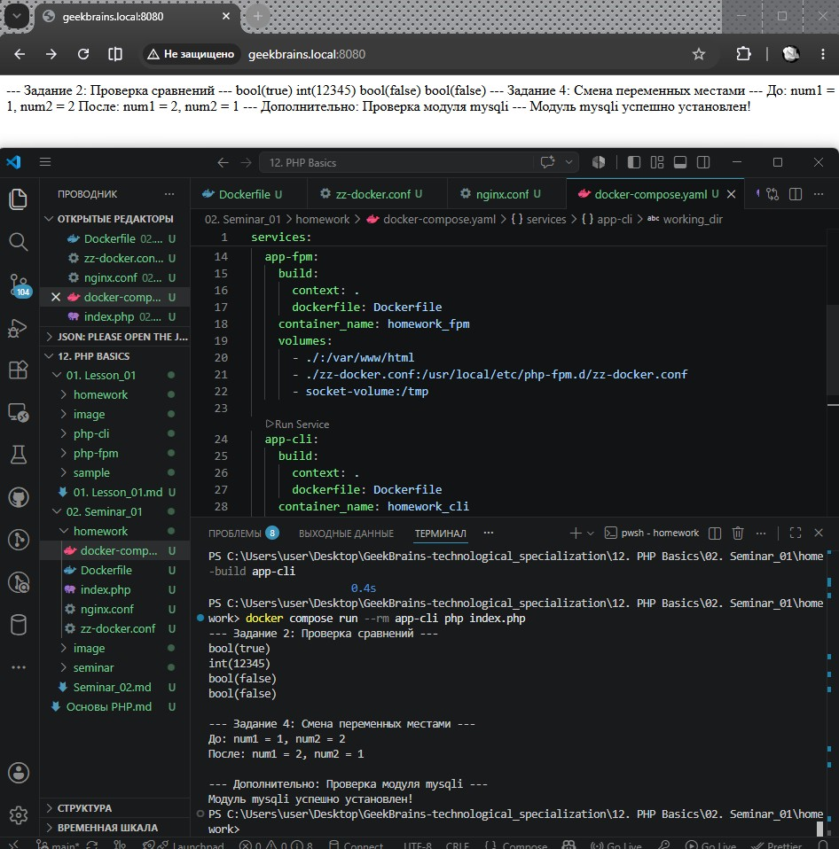
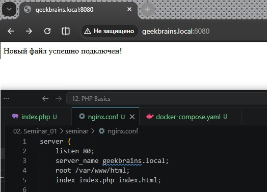
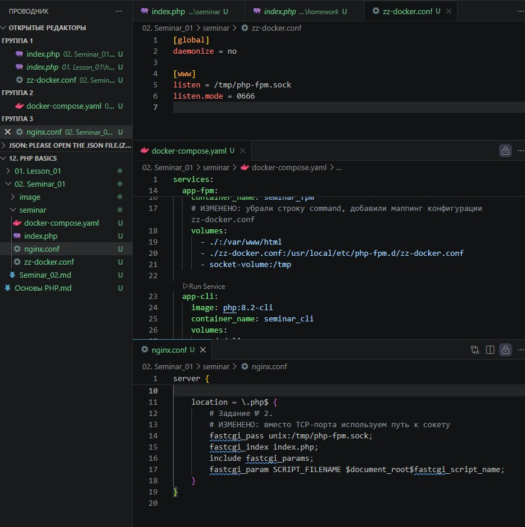
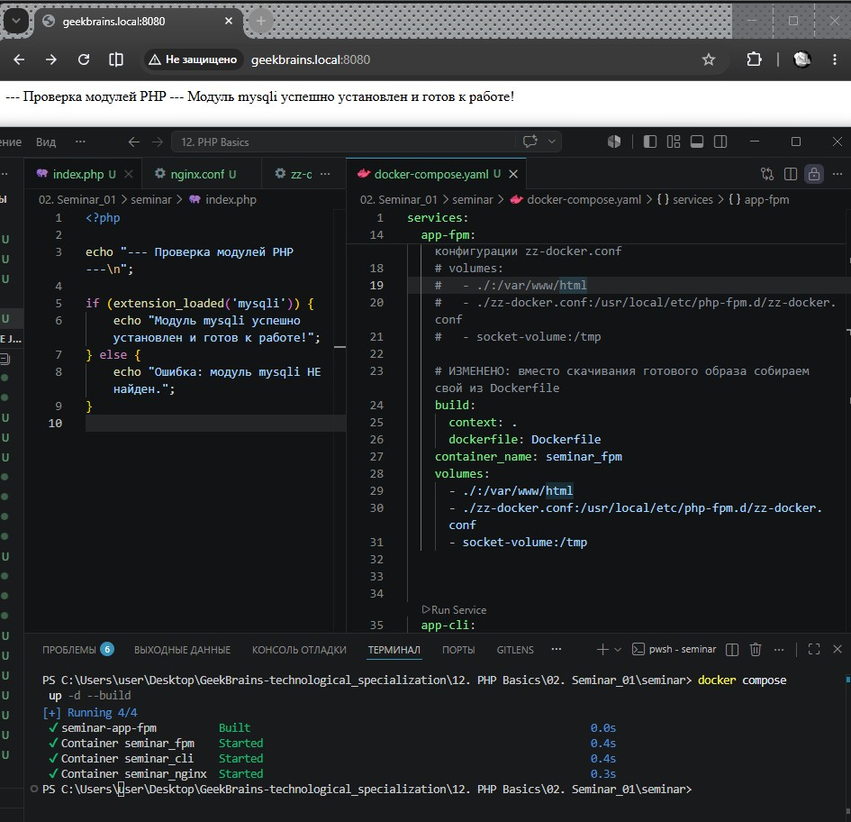

# Урок 2. Семинар. Введение в PHP

## План урока

- Выполнение практических заданий в соответствии с [презентацией](https://gbcdn.mrgcdn.ru/uploads/asset/6109153/attachment/3e5bd541b8452b82148489a46627a554.pdf) к уроку


## Домашняя работа ([решение]())

**Задание:**

Собрать для себя окружение из Nginx + PHP-FPM и PHP CLI
Выполните код в контейнере PHP CLI и объясните, что выведет данный код и почему:

```
<?php
$a = 5;
$b = '05';
var_dump($a == $b);
var_dump((int)'012345');
var_dump((float)123.0 === (int)123.0);
var_dump(0 == 'hello, world');
?>
```

В контейнере с `PHP CLI` поменяйте версию `PHP` с `8.2` на `7.4`. Изменится ли вывод?

Используя только две числовые переменные, поменяйте их значение местами. Например, если `a = 1`, `b = 2`, надо, чтобы получилось: `b = 1`, `a = 2`. Дополнительные переменные, функции и конструкции типа `list()` использовать нельзя.


**Результат выполнения Домашней работы:**





## Практическая работа на семинаре ([решение]())

**Задание 1. Реконфигурация окружения.** 

Настроим наше окружение так, чтобы оно стало отвечать на доменное имя `geekbrains.local` вместо `mysite.local`


**Результат выполнения Задания № 1:**



---

**Задание 2** 

**Реконфигурация окружения.**

Нужно реконфигурировать свою сборку так, чтобы Nginx и PHP-FPM стали
общаться через сокет

**Результат выполнения Задания № 2:**



---

**Задание 3** 

**Реконфигурация окружения.**

Установить модуль php-mysqli в сборку

**Результат выполнения Задания № 3:**



