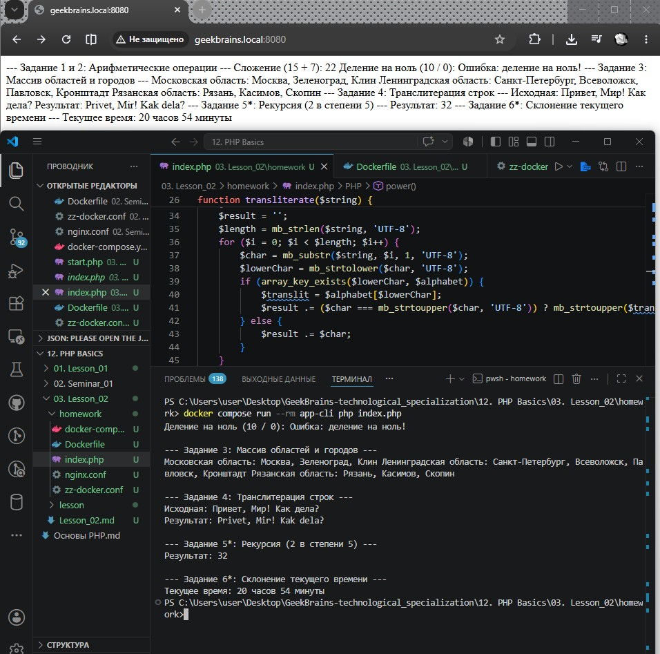

# Урок 3. Лекция. Условия, Массивы, циклы, функции

## План урока

- Ветвления
- Массивы
- Циклы
- Функции

---

## Домашняя работа ([решение](https://github.com/olgashenkel/GeekBrains-technological_specialization/tree/main/12.%20PHP%20Basics/03.%20Lesson_02/homework))

**Задание:**

1. Реализовать основные 4 арифметические операции в виде функции с тремя параметрами – два параметра это числа, третий – операция. Обязательно использовать оператор `return`.
2. Реализовать функцию с тремя параметрами: `function mathOperation($arg1, $arg2, $operation)`, где `$arg1`, `$arg2` – значения аргументов, `$operation` – строка с названием операции. В зависимости от переданного значения операции выполнить одну из арифметических операций (использовать функции из пункта 3) и вернуть полученное значение (использовать `switch`).
3. Объявить массив, в котором в качестве ключей будут использоваться названия областей, а в качестве значений – массивы с названиями городов из соответствующей области. Вывести в цикле значения массива, чтобы результат был таким:    
   Московская область: Москва, Зеленоград, Клин   
   Ленинградская область: Санкт-Петербург, Всеволожск, Павловск, Кронштадт Рязанская область … (названия городов можно найти на `maps.yandex.ru`)
4. Объявить массив, индексами которого являются буквы русского языка, а
значениями – соответствующие латинские буквосочетания (`‘а’=> ’a’, ‘б’ => ‘b’, ‘в’ => ‘v’, ‘г’ => ‘g’, …, ‘э’ => ‘e’, ‘ю’ => ‘yu’, ‘я’ => ‘ya`’). Написать функцию транслитерации строк.
5. \*С помощью рекурсии организовать функцию возведения числа в степень. Формат: `function power($val, $pow)`, где `$val` – заданное число, `$pow` – степень.
6. \*Написать функцию, которая вычисляет текущее время и возвращает его в формате с правильными склонениями, например:   
```
   22 часа 15 минут   
   21 час 43 минуты
```

***Результат выполнения Домашней работы:***

```
<?php
// ==========================================
// БЛОК ФУНКЦИЙ (ЗАДАНИЯ 1, 2, 4, 5, 6)
// ==========================================

// Задание 1: Базовые арифметические операции
function add($num1, $num2) { return $num1 + $num2; }
function subtract($num1, $num2) { return $num1 - $num2; }
function multiply($num1, $num2) { return $num1 * $num2; }
function divide($num1, $num2) { 
    return ($num2 == 0) ? "Ошибка: деление на ноль!" : $num1 / $num2; 
}

// Задание 2: Функция-диспетчер с оператором switch
function mathOperation($arg1, $arg2, $operation) {
    switch ($operation) {
        case "+": case "сложение": return add($arg1, $arg2);
        case "-": case "вычитание": return subtract($arg1, $arg2);
        case "*": case "умножение": return multiply($arg1, $arg2);
        case "/": case "деление": return divide($arg1, $arg2);
        default: return "Неизвестная операция";
    }
}

// Задание 4: Функция транслитерации строк (поддержка UTF-8)
function transliterate($string) {
    $alphabet = [
        'а'=>'a', 'б'=>'b', 'в'=>'v', 'г'=>'g', 'д'=>'d', 'е'=>'e', 'ё'=>'yo',
        'ж'=>'zh', 'з'=>'z', 'и'=>'i', 'й'=>'j', 'к'=>'k', 'л'=>'l', 'м'=>'m',
        'н'=>'n', 'о'=>'o', 'п'=>'p', 'р'=>'r', 'с'=>'s', 'т'=>'t', 'у'=>'u',
        'ф'=>'f', 'х'=>'kh', 'ц'=>'ts', 'ч'=>'ch', 'ш'=>'sh', 'щ'=>'shch',
        'ы'=>'y', 'э'=>'e', 'ю'=>'yu', 'я'=>'ya', 'ъ'=>'', 'ь'=>''
    ];
    $result = '';
    $length = mb_strlen($string, 'UTF-8');
    for ($i = 0; $i < $length; $i++) {
        $char = mb_substr($string, $i, 1, 'UTF-8');
        $lowerChar = mb_strtolower($char, 'UTF-8');
        if (array_key_exists($lowerChar, $alphabet)) {
            $translit = $alphabet[$lowerChar];
            $result .= ($char === mb_strtoupper($char, 'UTF-8')) ? mb_strtoupper($translit, 'UTF-8') : $translit;
        } else {
            $result .= $char;
        }
    }
    return $result;
}

// Задание 5*: Рекурсивное возведение в степень
function power($val, $pow) {
    if ($pow === 0) return 1;
    if ($pow < 0) return 1 / power($val, -$pow);
    return $val * power($val, $pow - 1);
}

// Задание 6*: Склонение числительных и времени
function getWordDeclension($number, $one, $two, $five) {
    $number = abs($number) % 100;
    $subNumber = $number % 10;
    if ($number > 10 && $number < 20) return $five;
    if ($subNumber > 1 && $subNumber < 5) return $two;
    if ($subNumber == 1) return $one;
    return $five;
}
function getFormattedTime() {
    $hours = (int)date('G');
    $minutes = (int)date('i');
    $hoursWord = getWordDeclension($hours, 'час', 'часа', 'часов');
    $minutesWord = getWordDeclension($minutes, 'минута', 'минуты', 'минут');
    return "$hours $hoursWord $minutes $minutesWord";
}

// ==========================================
// БЛОК ДЕМОНСТРАЦИИ И ВЫВОДА РЕЗУЛЬТАТОВ
// ==========================================

echo "--- Задание 1 и 2: Арифметические операции ---\n";
echo "Сложение (15 + 7): " . mathOperation(15, 7, '+') . "\n";
echo "Деление на ноль (10 / 0): " . mathOperation(10, 0, 'деление') . "\n";

echo "\n--- Задание 3: Массив областей и городов ---\n";
$regions = [
    "Московская область" => ["Москва", "Зеленоград", "Клин"],
    "Ленинградская область" => ["Санкт-Петербург", "Всеволожск", "Павловск", "Кронштадт"],
    "Рязанская область" => ["Рязань", "Касимов", "Скопин"]
];
foreach ($regions as $region => $cities) {
    echo $region . ": " . implode(", ", $cities) . " ";
}
echo "\n";

echo "\n--- Задание 4: Транслитерация строк ---\n";
echo "Исходная: Привет, Мир! Как дела?\n";
echo "Результат: " . transliterate("Привет, Мир! Как дела?") . "\n";

echo "\n--- Задание 5*: Рекурсия (2 в степени 5) ---\n";
echo "Результат: " . power(2, 5) . "\n";

echo "\n--- Задание 6*: Склонение текущего времени ---\n";
echo "Текущее время: " . getFormattedTime() . "\n";
```




## Практическая работа на лекции ([решение](https://github.com/olgashenkel/GeekBrains-technological_specialization/tree/main/12.%20PHP%20Basics/03.%20Lesson_02/lesson))
