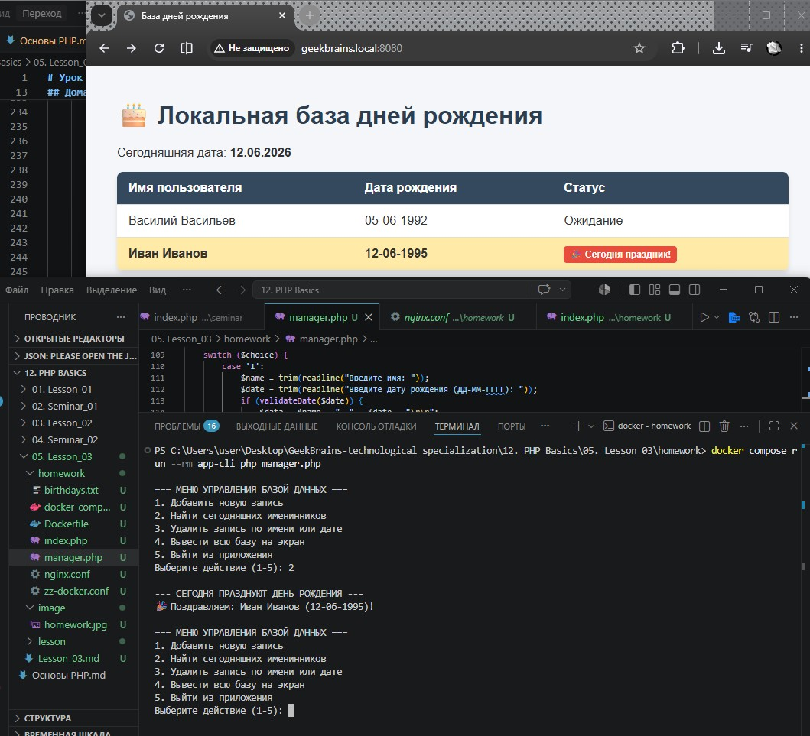

# Урок 6. Семинар. Файлы, подключение кода, Composer

## План урока

- Выполнение практических заданий в соответствии с [презентацией](https://gbcdn.mrgcdn.ru/uploads/asset/6109156/attachment/2f33fd87f78c8e7e108c009f93891706.pdf) к уроку
- Подключим файлы
- Управляем автозагрузкой


## Домашняя работа ([решение](https://github.com/olgashenkel/GeekBrains-technological_specialization/tree/main/12.%20PHP%20Basics/06.%20Seminar_03/homework))


**Задание:**

1. Обработка ошибок. Посмотрите на реализацию функции в файле `fwrite-cli.php` в исходниках. Может ли пользователь ввести некорректную информацию (например, дату в виде `12-50-1548`)? Какие еще некорректные данные могут быть введены? Исправьте это, добавив соответствующие обработки ошибок.
2. Поиск по файлу. Когда мы научились сохранять в файле данные, нам может быть интересно не только чтение, но и поиск по нему. Например, нам надо проверить,кого нужно поздравить сегодня с днем рождения среди пользователей, хранящихся в формате `Василий Васильев, 05-06-1992`.
И здесь нам на помощь снова приходят циклы. Понадобится цикл, который будет построчно читать файл и искать совпадения в дате. Для обработки строки пригодится функция explode, а для получения текущей даты – `date`.
3. Удаление строки. Когда мы научились искать, надо научиться удалять конкретную строку. Запросите у пользователя имя или дату для удаляемой строки. После ввода либо удалите строку, оповестив пользователя, либо сообщите о том, что строка не найдена.
4. Добавьте новые функции в итоговое приложение работы с файловым хранилищем.


***Результат выполнения Домашней работы:***

```
// ЗАДАНИЕ № 1

1. Критический баг в проверке месяца (p. 1):
В строке if(isset($dateBlocks[1]) && $dateBlocks[0] > 12) допущена опечатка. Вместо элемента месяца $dateBlocks[1] проверяется элемент дня $dateBlocks[0]. Из-за этого дата 12-50-1548 спокойно пройдет валидацию, так как день 12 не больше 12.

2. Отсутствие проверки на нечисловые значения:
Пользователь может ввести текст вместо цифр, например день-май-год. Операторы сравнения > отработают некорректно.

3. Отсутствие проверки на логику календаря:
Код не защищает от ввода несуществующих дат, таких как 31-02-2023 (31 февраля) или 31-11-2023 (в ноябре 30 дней).

4. Слишком старый год или отрицательные числа:
Пользователь может ввести год 0001 или отрицательные числа (-5), что сломает логику работы приложения.

Исправление: Использовать встроенную функцию PHP checkdate(int $month, int $day, int $year), которая автоматически учитывает високосные года, количество дней в конкретном месяце и типы данных.
```

```
// ЗАДАНИЕ № 2-4
// консольный скрипт - manager.php

<?php

$address = '/cli/birthdays.txt';

// Создаем файл, если его еще нет в контейнере
if (!file_exists($address)) {
    file_put_contents($address, "Василий Васильев, 05-06-1992\r\nИван Иванов, " . date('d-m') . "-1995\r\n");
}

// Надежная функция валидации даты (Задание 1)
function validateDate(string $date): bool {
    $dateBlocks = explode("-", $date);
    if (count($dateBlocks) !== 3) {
        return false;
    }
    
    // Проверяем, что все элементы состоят строго из цифр
    if (!ctype_digit($dateBlocks[0]) || !ctype_digit($dateBlocks[1]) || !ctype_digit($dateBlocks[2])) {
        return false;
    }

    $day = (int)$dateBlocks[0];
    $month = (int)$dateBlocks[1];
    $year = (int)$dateBlocks[2];

    // Проверяем реальность года (не из будущего и не древнее 1900)
    if ($year > (int)date('Y') || $year < 1900) {
        return false;
    }

    // Встроенная проверка календаря PHP (месяц, день, год)
    return checkdate($month, $day, $year);
}

// Функция поиска именинников на сегодняшний день (Задание 2)
function searchTodayBirthdays(string $filePath): void {
    if (!file_exists($filePath) || filesize($filePath) === 0) {
        echo "Файл базы данных пуст.\n";
        return;
    }

    $today = date('d-m'); // Текущий день и месяц, например "13-06"
    $fileHandler = fopen($filePath, 'r');
    $found = false;

    echo "\n--- СЕГОДНЯ ПРАЗДНУЮТ ДЕНЬ РОЖДЕНИЯ ---\n";
    while (($line = fgets($fileHandler)) !== false) {
        $line = trim($line);
        if (empty($line)) continue;

        $parts = explode(", ", $line);
        if (count($parts) === 2) {
            $name = $parts[0];
            $birthday = $parts[1]; // "ДД-ММ-ГГГГ"
            
            // Выделяем день и месяц из записи в файле
            $birthdayMD = substr($birthday, 0, 5); // Получаем первые 5 символов "ДД-ММ"

            if ($birthdayMD === $today) {
                echo "🎉 Поздравляем: $name ($birthday)!\n";
                $found = true;
            }
        }
    }
    fclose($fileHandler);

    if (!$found) {
        echo "Сегодня именинников не обнаружено.\n";
    }
}

// Функция удаления строки по имени или дате (Задание 3)
function deleteRecord(string $filePath, string $searchQuery): void {
    if (!file_exists($filePath)) return;

    $lines = file($filePath, FILE_IGNORE_NEW_LINES | FILE_SKIP_EMPTY_LINES);
    $newLines = [];
    $deleted = false;

    foreach ($lines as $line) {
        // Если в строке содержится поисковый запрос (имя или дата), мы её пропускаем
        if (str_contains($line, $searchQuery)) {
            $deleted = true;
            echo "Строка успешно удалена: \"$line\"\n";
            continue;
        }
        $newLines[] = $line;
    }

    if ($deleted) {
        // Перезаписываем файл обновленным массивом строк
        file_put_contents($filePath, implode("\r\n", $newLines) . "\r\n");
    } else {
        echo "Запись с поисковым запросом \"$searchQuery\" не найдена в файле.\n";
    }
}

// Главный цикл меню консольного приложения (Задание 4)
while (true) {
    echo "\n=== МЕНЮ УПРАВЛЕНИЯ БАЗОЙ ДАННЫХ ===\n";
    echo "1. Добавить новую запись\n";
    echo "2. Найти сегодняшних именинников\n";
    echo "3. Удалить запись по имени или дате\n";
    echo "4. Вывести всю базу на экран\n";
    echo "5. Выйти из приложения\n";
    
    $choice = trim(readline("Выберите действие (1-5): "));

    switch ($choice) {
        case '1':
            $name = trim(readline("Введите имя: "));
            $date = trim(readline("Введите дату рождения (ДД-ММ-ГГГГ): "));
            if (validateDate($date)) {
                $data = $name . ", " . $date . "\r\n";
                file_put_contents($address, $data, FILE_APPEND);
                echo "Успешно: Запись $name добавлена.\n";
            } else {
                echo "Ошибка: Введена некорректная дата!\n";
            }
            break;

        case '2':
            searchTodayBirthdays($address);
            break;

        case '3':
            $query = trim(readline("Введите Имя или Дату для удаления: "));
            if (!empty($query)) {
                deleteRecord($address, $query);
            } else {
                echo "Запрос не может быть пустым.\n";
            }
            break;

        case '4':
            echo "\n--- СОДЕРЖИМОЕ ФАЙЛА ---\n";
            echo file_get_contents($address);
            break;

        case '5':
            echo "Работа завершена. До свидания!\n";
            exit;

        default:
            echo "Неверный выбор, попробуйте снова.\n";
    }
}
```

```
// ЗАДАНИЕ № 2-4
// веб-скрипт - index.php

<?php
$address = 'birthdays.txt'; // Внутри контейнера FPM корень папки привязан к /var/www/html
$today = date('d-m');
?>
<!DOCTYPE html>
<html lang="ru">
<head>
    <meta charset="UTF-8">
    <title>База дней рождения</title>
    <style>
        body { font-family: Arial, sans-serif; background: #f4f6f9; margin: 40px; color: #333; }
        h1 { color: #2c3e50; }
        table { width: 100%; border-collapse: collapse; background: white; box-shadow: 0 4px 6px rgba(0,0,0,0.1); border-radius: 8px; overflow: hidden; }
        th, td { padding: 12px 15px; text-align: left; border-bottom: 1px solid #ddd; }
        th { background: #34495e; color: white; }
        tr:hover { background: #f1f2f6; }
        .birthday-today { background: #ffeaa7 !important; font-weight: bold; }
        .badge { background: #e74c3c; color: white; padding: 4px 8px; border-radius: 4px; font-size: 12px; }
    </style>
</head>
<body>

    <h1>🎂 Локальная база дней рождения</h1>
    <p>Сегодняшняя дата: <strong><?= date('d.m.Y'); ?></strong></p>

    <table>
        <thead>
            <tr>
                <th>Имя пользователя</th>
                <th>Дата рождения</th>
                <th>Статус</th>
            </tr>
        </thead>
        <tbody>
            <?php
            if (file_exists($address) && filesize($address) > 0) {
                $lines = file($address, FILE_IGNORE_NEW_LINES | FILE_SKIP_EMPTY_LINES);
                foreach ($lines as $line) {
                    $parts = explode(", ", $line);
                    if (count($parts) === 2) {
                        $name = htmlspecialchars($parts[0]);
                        $birthday = htmlspecialchars($parts[1]);
                        $birthdayMD = substr($birthday, 0, 5);

                        // Проверяем, сегодня ли день рождения
                        $isToday = ($birthdayMD === $today);
                        $rowClass = $isToday ? 'class="birthday-today"' : '';
                        
                        echo "<tr $rowClass>";
                        echo "<td>$name</td>";
                        echo "<td>$birthday</td>";
                        echo "<td>" . ($isToday ? "<span class='badge'>🎉 Сегодня праздник!</span>" : "Ожидание") . "</td>";
                        echo "</tr>";
                    }
                }
            } else {
                echo "<tr><td colspan='3'>База данных пуста или файл не найден.</td></tr>";
            }
            ?>
        </tbody>
    </table>

</body>
</html>
```




