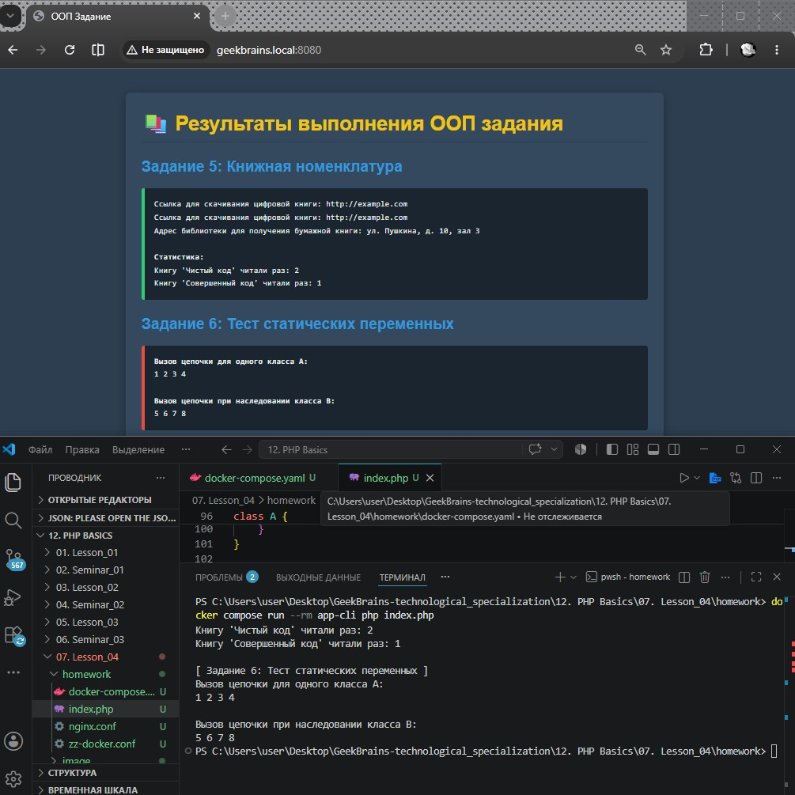
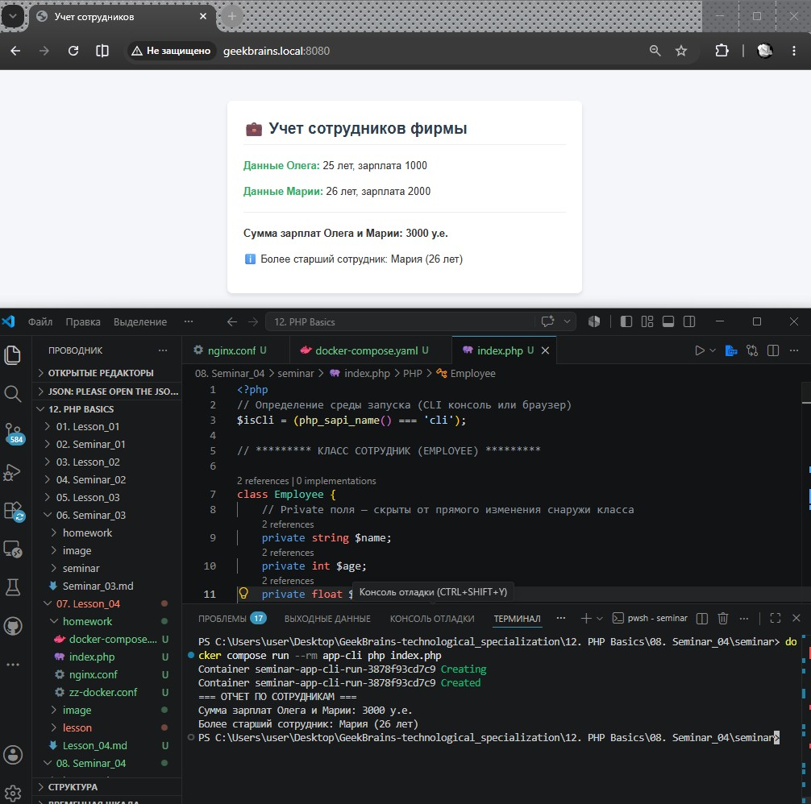
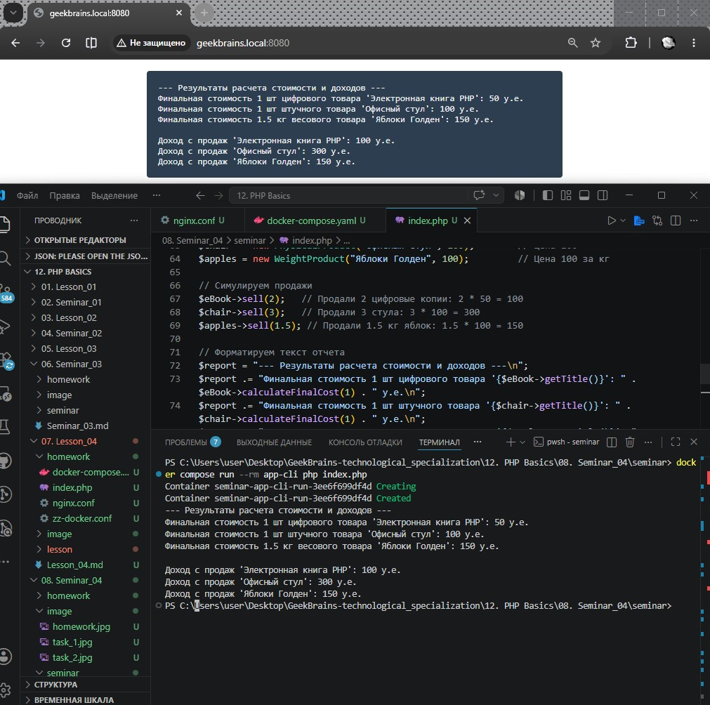

# Урок 8. Семинар. ООП

## План урока

- Выполнение практических заданий в соответствии с [презентацией](https://gbcdn.mrgcdn.ru/uploads/asset/6109157/attachment/efc0c5eb7a2d4e5b91a0034bb756b476.pdf) к уроку
- Закрепляем понимание ООП
- Переходим от ФП к ООП
- Формируем классы и связи между ними


## Домашняя работа ([решение](https://github.com/olgashenkel/GeekBrains-technological_specialization/tree/main/12.%20PHP%20Basics/08.%20Seminar_04/homework))


1. Придумайте класс, который описывает любую сущность из предметной области библиотеки: книга, шкаф, комната и т.п.
2. Опишите свойства классов из п.1 (состояние).
3. Опишите поведение классов из п.1 (методы).
4. Придумайте наследников классов из п.1. Чем они будут отличаться?
5. Создайте структуру классов ведения книжной номенклатуры.
    - Есть абстрактная книга.
    - Есть цифровая книга, бумажная книга.
    - У каждой книги есть метод получения на руки.
    - У цифровой книги надо вернуть ссылку на скачивание, а у физической – адрес библиотеки, где ее можно получить. У всех книг формируется в конечном итоге статистика по кол-ву прочтений.

    Что можно вынести в абстрактный класс, а что надо унаследовать?

6. Дан код:
```
class A {
    public function foo() {
        static $x = 0;
        echo ++$x;
    }
}
$a1 = new A();
$a2 = new A();
$a1->foo();
$a2->foo();
$a1->foo();
$a2->foo();
```

Что он выведет на каждом шаге? Почему?

Немного изменим п.5
```
class A {
    public function foo() {
        static $x = 0;
        echo ++$x;
    }
}
class B extends A {
}
$a1 = new A();
$b1 = new B();
$a1->foo();
$b1->foo();
$a1->foo();
$b1->foo();
```
Что он выведет теперь?


***Результат выполнения Домашней работы:***

```
Теоретический часть для Заданий №№ 1, 2, 3, 4.

Сущность: Книга (Book)
    - Свойства (Состояние): Название (title), автор (author), уникальный номер (isbn), доступность (isAvailable).
    - Поведение (Методы): Выдать книгу (borrowBook), вернуть книгу (returnBook), получить информацию (getInfo).
    - Наследники:
        - AudioBook (Аудиокнига) — добавляется свойство "длительность в минутах" (duration) и метод "воспроизвести фрагмент" (playPreview).
        - RareBook (Редкая/Архивная книга) — переопределяется метод borrowBook (ее нельзя выносить из читального зала, доступен только просмотр на месте).
```

```
// ************** Файл index.php **************

<?php

// БЛОК ОПРЕДЕЛЕНИЯ СРЕДЫ И ФОРМАТИРОВАНИЯ

$isCli = (php_sapi_name() === 'cli');

function printHeader(): void {
    global $isCli;
    if ($isCli) {
        echo "=== РЕЗУЛЬТАТЫ ВЫПОЛНЕНИЯ ООП ЗАДАНИЯ ===\n\n";
    } else {
        echo "<!DOCTYPE html><html lang='ru'><head><meta charset='UTF-8'><title>ООП Задание</title></head>";
        echo "<body style='font-family: Arial, sans-serif; background: #2c3e50; color: #ecf0f1; padding: 30px;'>";
        echo "<div style='max-width: 800px; margin: 0 auto; background: #34495e; padding: 25px; border-radius: 8px; box-shadow: 0 4px 15px rgba(0,0,0,0.3);'>";
        echo "<h1 style='color: #f1c40f; border-bottom: 2px solid #2c3e50; padding-bottom: 10px; margin-top: 0;'>📚 Результаты выполнения ООП задания</h1>";
    }
}

function printSectionTitle(string $title): void {
    global $isCli;
    if ($isCli) {
        echo "\n[ $title ]\n";
    } else {
        echo "<h2 style='color: #3498db; margin-top: 25px;'>$title</h2>";
    }
}

function printContentBlock(string $cliText, string $htmlText, string $type = 'green'): void {
    global $isCli;
    if ($isCli) {
        echo $cliText . "\n";
    } else {
        $borderColor = ($type === 'green') ? '#2ecc71' : '#e74c3c';
        echo "<div style='background: #1a252f; padding: 15px; border-left: 5px solid $borderColor; border-radius: 4px; font-family: monospace; color: #ecf0f1; line-height: 1.6;'>$htmlText</div>";
    }
}

function printFooter(): void {
    global $isCli;
    if (!$isCli) {
        echo "</div></body></html>";
    }
}

// СТРУКТУРА КЛАССОВ (Объявлены строго один раз)

abstract class AbstractBook {
    protected string $title;
    protected string $author;
    protected int $readCount = 0;

    public function __construct(string $title, string $author) {
        $this->title = $title;
        $this->author = $author;
    }

    public function incrementReadCount(): void {
        $this->readCount++;
    }

    public function getStatistics(): string {
        return "Книгу '{$this->title}' читали раз: {$this->readCount}";
    }

    abstract public function getAccessMethod(): string;
}

class DigitalBook extends AbstractBook {
    private string $downloadUrl;

    public function __construct(string $title, string $author, string $downloadUrl) {
        parent::__construct($title, $author);
        $this->downloadUrl = $downloadUrl;
    }

    public function getAccessMethod(): string {
        $this->incrementReadCount();
        return "Ссылка для скачивания цифровой книги: {$this->downloadUrl}";
    }
}

class PaperBook extends AbstractBook {
    private string $libraryAddress;

    public function __construct(string $title, string $author, string $libraryAddress) {
        parent::__construct($title, $author);
        $this->libraryAddress = $libraryAddress;
    }

    public function getAccessMethod(): string {
        $this->incrementReadCount();
        return "Адрес библиотеки для получения бумажной книги: {$this->libraryAddress}";
    }
}

class A {
    public function foo() {
        static $x = 0;
        echo ++$x . " ";
    }
}

class B extends A {}

// ИСПОЛНЕНИЕ И ВЫВОД

printHeader();

// ---- Задание 5 ----
printSectionTitle("Задание 5: Книжная номенклатура");

$eBook = new DigitalBook("Чистый код", "Роберт Мартин", "http://example.com");
$pBook = new PaperBook("Совершенный код", "Стив Макконнелл", "ул. Пушкина, д. 10, зал 3");

$m1 = $eBook->getAccessMethod();
$m2 = $eBook->getAccessMethod();
$m3 = $pBook->getAccessMethod();
$s1 = $eBook->getStatistics();
$s2 = $pBook->getStatistics();

$cli5 = "$m1\n$m2\n$m3\n\nСтатистика:\n$s1\n$s2";
$html5 = "$m1<br>$m2<br>$m3<br><br><strong>Статистика:</strong><br>$s1<br>$s2";

printContentBlock($cli5, $html5, 'green');

// ---- Задание 6 ----
printSectionTitle("Задание 6: Тест статических переменных");

// Выполняем тесты и перехватываем вывод foo()
ob_start();
$a1 = new A(); $a2 = new A();
$a1->foo(); $a2->foo(); $a1->foo(); $a2->foo();
$resA = ob_get_clean();

ob_start();
$a1_new = new A(); $b1 = new B();
$a1_new->foo(); $b1->foo(); $a1_new->foo(); $b1->foo();
$resB = ob_get_clean();

$cli6 = "Вызов цепочки для одного класса A:\n$resA\n\nВызов цепочки при наследовании класса B:\n$resB";
$html6 = "<strong>Вызов цепочки для одного класса A:</strong><br>$resA<br><br><strong>Вызов цепочки при наследовании класса B:</strong><br>$resB";

printContentBlock($cli6, $html6, 'red');

printFooter();
```

```
Разбор Задания № 6 (Почему такой вывод?)
Анализ Части 1: 
    Вывод: 1 2 3 4

Ключевое слово static внутри метода объявляет статическую переменную, которая принадлежит самому методу класса, а не конкретному объекту ($a1 или $a2). Память под $x выделяется один раз для класса A. Сколько бы объектов мы ни создавали, они вызывают один и тот же метод A::foo(), изменяя одну и subdivision общую переменную $x.

Анализ Части 2:
    Вывод: 5 1 6 2

В PHP при наследовании (class B extends A), если дочерний класс вызывает статический контекст родителя, компилятор динамически связывает область видимости статических переменных.Для класса A существует своя переменная $x (она продолжила увеличиваться: 5, 6).Для класса B создается своя изолированная копия статической переменной $x, которая начинает свой отсчет с нуля (1, 2).
```




## Практическая работа на семинаре ([решение](https://github.com/olgashenkel/GeekBrains-technological_specialization/tree/main/12.%20PHP%20Basics/08.%20Seminar_04/seminar))

**Задание 1** 

Сделайте класс Сотрудник, в котором будут следующие private поля:
- name (имя),
- age (возраст),
- salary (зарплата)

и следующие public методы:
- setName,
- getName,
- setAge,
- getAge,
- setSalary,
- getSalary.

Создайте 2 объекта этого класса: `'Олег'`, возраст `25`, зарплата `1000` и `'Мария'`, возраст `26`, зарплата `2000`.

1. Выведите на экран сумму зарплат Олега и Марии. 
2. Выведите на экран более старшего сотрудника из двух.


**Результат выполнения Задания № 1:**
```
<?php
// Определение среды запуска (CLI консоль или браузер)
$isCli = (php_sapi_name() === 'cli');

// ********* КЛАСС СОТРУДНИК (EMPLOYEE) *********

class Employee {
    // Private поля — скрыты от прямого изменения снаружи класса
    private string $name;
    private int $age;
    private float $salary;

    // Геттеры и сеттеры для имени
    public function setName(string $name): void {
        $this->name = $name;
    }
    public function getName(): string {
        return $this->name;
    }

    // Геттеры и сеттеры для возраста
    public function setAge(int $age): void {
        // Базовая валидация данных внутри сеттера
        if ($age > 0 && $age < 120) {
            $this->age = $age;
        }
    }
    public function getAge(): int {
        return $this->age;
    }

    // Геттеры и сеттеры для зарплаты
    public function setSalary(float $salary): void {
        if ($salary >= 0) {
            $this->salary = $salary;
        }
    }
    public function getSalary(): float {
        return $this->salary;
    }
}

// ********* ИНИЦИАЛИЗАЦИЯ ОБЪЕКТОВ *********

// Создаем сотрудника Олега
$oleg = new Employee();
$oleg->setName('Олег');
$oleg->setAge(25);
$oleg->setSalary(1000);

// Создаем сотрудника Марию
$maria = new Employee();
$maria->setName('Мария');
$maria->setAge(26);
$maria->setSalary(2000);


// ********* ЛОГИКА И ВЫЧИСЛЕНИЯ *********

// 1. Подсчет суммы зарплат
$totalSalary = $oleg->getSalary() + $maria->getSalary();

// 2. Определение более старшего сотрудника
if ($oleg->getAge() > $maria->getAge()) {
    $olderEmployee = "Более старший сотрудник: " . $oleg->getName() . " (" . $oleg->getAge() . " лет)";
} elseif ($maria->getAge() > $oleg->getAge()) {
    $olderEmployee = "Более старший сотрудник: " . $maria->getName() . " (" . $maria->getAge() . " лет)";
} else {
    $olderEmployee = "Сотрудники " . $oleg->getName() . " и " . $maria->getName() . " ровесники.";
}

// ********* ФОРМАТИРОВАНИЕ И ВЫВОД РЕЗУЛЬТАТОВ *********

$outputSalary = "Сумма зарплат Олега и Марии: " . $totalSalary . " у.е.";
$outputOlder  = $olderEmployee;

if ($isCli) {
    // Вывод в консоль Docker
    echo "=== ОТЧЕТ ПО СОТРУДНИКАМ ===\n";
    echo $outputSalary . "\n";
    echo $outputOlder . "\n";
} else {
    // Вывод в браузер
    ?>
    <!DOCTYPE html>
    <html lang="ru">
    <head>
        <meta charset="UTF-8">
        <title>Учет сотрудников</title>
        <style>
            body { font-family: Arial, sans-serif; background: #f4f6f9; color: #333; padding: 40px; }
            .card { background: white; padding: 25px; border-radius: 8px; box-shadow: 0 4px 6px rgba(0,0,0,0.1); max-width: 500px; margin: 0 auto; }
            h2 { color: #2c3e50; border-bottom: 2px solid #eee; padding-bottom: 10px; margin-top: 0; }
            p { font-size: 16px; line-height: 1.5; }
            .highlight { font-weight: bold; color: #27ae60; }
        </style>
    </head>
    <body>
        <div class="card">
            <h2>💼 Учет сотрудников фирмы</h2>
            <p><span class="highlight">Данные Олега:</span> 25 лет, зарплата 1000</p>
            <p><span class="highlight">Данные Марии:</span> 26 лет, зарплата 2000</p>
            <hr style="border: 0; border-top: 1px solid #eee; margin: 20px 0;">
            <p><strong><?= $outputSalary; ?></strong></p>
            <p>ℹ️ <?= $outputOlder; ?></p>
        </div>
    </body>
    </html>
    <?php
}
```




---

**Задание 2** 

Есть абстрактный товар.

Есть цифровой товар, штучный физический товар и товар на вес.

У каждого есть метод подсчёта финальной стоимости.

У цифрового товара стоимость постоянная и дешевле штучного товара в два раза, у штучного товара обычная стоимость, у весового – в зависимости от продаваемого количества в килограммах. У всех формируется в конечном итоге доход с продаж.

Что можно вынести в абстрактный класс, наследование?


**Результат выполнения Задания № 2:**

```
/* **************** Архитектурный разбор **************** */
1. В базовый абстрактный класс AbstractProduct выносим:
    - Общие свойства (состояние): Название товара ($title) и его базовая базовая цена ($price).
    - Глобальную статистику: Общую сумму дохода с продаж этого товара ($totalRevenue), так как доход считается для всех типов товаров одинаково (сумма всех успешных продаж).
    - Общие методы: Конструктор для записи названия/цены, метод получения дохода $totalRevenue, а также метод регистрации продажи registerSale().
    - Абстрактный метод: Метод подсчета финальной стоимости calculateFinalCost($quantity). У него нет реализации в абстрактном классе, так как каждый тип товара считает цену по своей уникальной формуле.
    
2. В дочерние классы (наследники) выносим:
    - DigitalProduct (Цифровой товар): Переопределяет расчет стоимости. Метод calculateFinalCost всегда делит базовую цену на 2 и игнорирует количество (или считает поштучно, но со скидкой 50%).
    - PhysicalProduct (Штучный физический товар): Имеет стандартный расчет. Финальная стоимость — это базовая цена, умноженная на количество штук.
    - WeightProduct (Весовой товар): Финальная стоимость — это базовая цена за 1 кг, умноженная на переданный вес в килограммах (число с плавающей точкой float).
```

```
/* **************** Практическая реализация в коде **************** */
<?php

// ************* АБСТРАКТНЫЙ КЛАСС ТОВАР *************

abstract class AbstractProduct {
    protected string $title;
    protected float $price; // Базовая цена товара
    protected float $totalRevenue = 0; // Доход с продаж этого товара

    public function __construct(string $title, float $price) {
        $this->title = $title;
        $this->price = $price;
    }

    public function getTitle(): string { return $this->title; }
    public function getRevenue(): float { return $this->totalRevenue; }

    // Универсальный метод фиксации продажи товара
    public function sell(float $quantity): void {
        $cost = $this->calculateFinalCost($quantity);
        $this->totalRevenue += $cost;
    }

    // Абстрактный метод: каждый наследник реализует его сам
    abstract public function calculateFinalCost(float $quantity): float;
}

// ************* КЛАССЫ-НАСЛЕДНИКИ *************

/**
 * Цифровой товар (цена в 2 раза дешевле физического поштучно)
 */
class DigitalProduct extends AbstractProduct {
    public function calculateFinalCost(float $quantity): float {
        // Стоимость фиксированная за единицу, но дешевле базовой в 2 раза
        return ($this->price / 2) * $quantity;
    }
}

/**
 * Штучный физический товар (обычная цена за штуку)
 */
class PhysicalProduct extends AbstractProduct {
    public function calculateFinalCost(float $quantity): float {
        return $this->price * $quantity;
    }
}

/**
 * Товар на вес (цена зависит от дробного количества кг)
 */
class WeightProduct extends AbstractProduct {
    public function calculateFinalCost(float $quantity): float {
        // $quantity здесь выступает как вес в килограммах (например, 1.5 кг)
        return $this->price * $quantity;
    }
}

// ************* ТЕСТИРОВАНИЕ И ВЫВОД РЕЗУЛЬТАТОВ *************

// Создаем три разных типа товара с базовой ценой 100 у.е.
$eBook  = new DigitalProduct("Электронная книга PHP", 100); // Цена со скидкой будет 50
$chair  = new PhysicalProduct("Офисный стул", 100);        // Цена 100
$apples = new WeightProduct("Яблоки Голден", 100);         // Цена 100 за кг

// Симулируем продажи
$eBook->sell(2);   // Продали 2 цифровые копии: 2 * 50 = 100
$chair->sell(3);   // Продали 3 стула: 3 * 100 = 300
$apples->sell(1.5); // Продали 1.5 кг яблок: 1.5 * 100 = 150

// Форматируем текст отчета
$report = "--- Результаты расчета стоимости и доходов ---\n";
$report .= "Финальная стоимость 1 шт цифрового товара '{$eBook->getTitle()}': " . $eBook->calculateFinalCost(1) . " у.е.\n";
$report .= "Финальная стоимость 1 шт штучного товара '{$chair->getTitle()}': " . $chair->calculateFinalCost(1) . " у.е.\n";
$report .= "Финальная стоимость 1.5 кг весового товара '{$apples->getTitle()}': " . $apples->calculateFinalCost(1.5) . " у.е.\n\n";

$report .= "Доход с продаж '{$eBook->getTitle()}': " . $eBook->getRevenue() . " у.е.\n";
$report .= "Доход с продаж '{$chair->getTitle()}': " . $chair->getRevenue() . " у.е.\n";
$report .= "Доход с продаж '{$apples->getTitle()}': " . $apples->getRevenue() . " у.е.\n";

// Проверяем среду для вывода (консоль или браузер)
if (php_sapi_name() === 'cli') {
    echo $report;
} else {
    echo "<pre style='font-size:16px; background:#2c3e50; color:#ecf0f1; padding:20px; border-radius:5px; max-width:700px; margin:20px auto;'>";
    echo htmlspecialchars($report);
    echo "</pre>";
}
```



