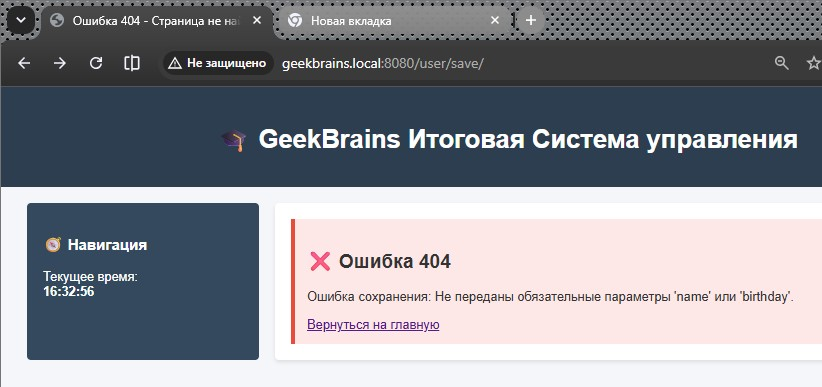
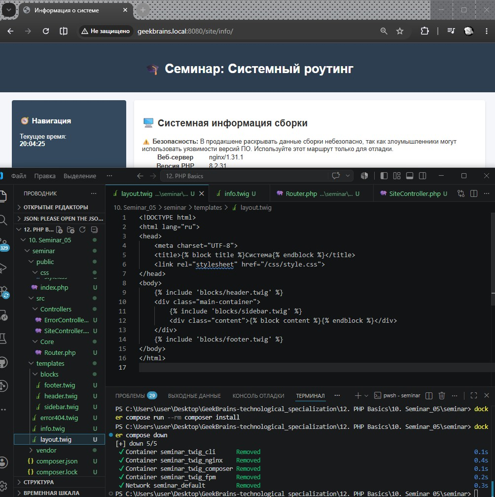
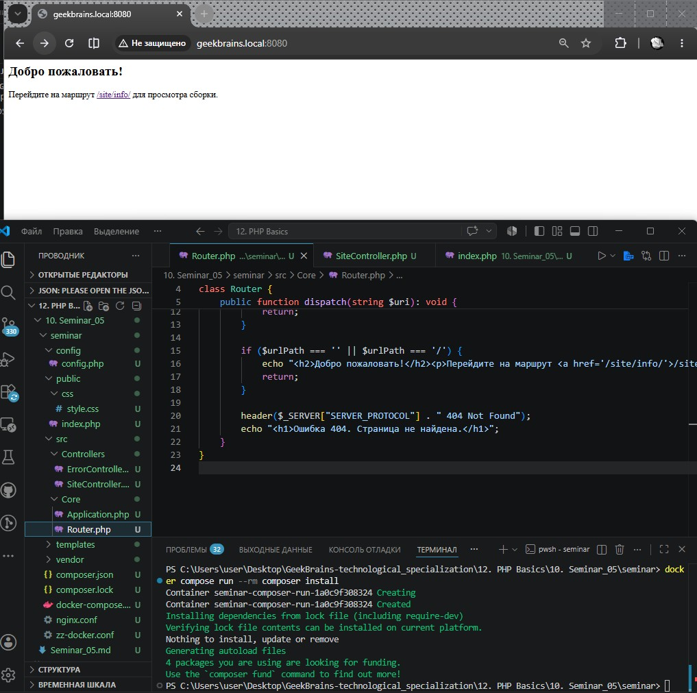

# Урок 10. Семинар. Разработка каркаса приложения

## План урока

- Выполнение практических заданий в соответствии с [презентацией](https://gbcdn.mrgcdn.ru/uploads/asset/6109158/attachment/067bf020f666779ece252e3c7482701b.pdf) к уроку
- Формируем ООП приложение
- Модифицируем скелет приложения под свои нужды


---

## Домашняя работа ([решение](https://github.com/olgashenkel/GeekBrains-technological_specialization/tree/main/12.%20PHP%20Basics/09.%20Lesson_05/homework))

**Задание:**

1. Добавьте к шаблону подключение файлов стилей так, чтобы в дальнейшем
можно было дорабатывать внешний вид системы
2. Сформируйте еще три подключаемых к скелету блока – шапку сайта (она всегда будет одинаковой по стилю и располагаться в самой верхней части), подвал сайта (также одинаковый, но в нижней части) и sidebar (боковая колонка, которую можно наполнять новыми элементами).
3. Средствами TWIG выводите на экран текущее время.
4. Создайте обработку страницы ошибки. Например, если контроллер не найден, то нужно вызывать специальный метод рендеринга, который сформирует специальную страницу ошибок.
5. Для страницы ошибок формируйте HTTP-ответ 404. Это можно сделать при помощи функции header.
6. Реализуйте функционал сохранения пользователя в хранилище. Сохранение будет происходить при помощи GET-запроса.
`/user/save/?name=Иван&birthday=05-05-1991`


***Результат выполнения Домашней работы:***





## Практическая работа на семинаре ([решение](https://github.com/olgashenkel/GeekBrains-technological_specialization/tree/main/12.%20PHP%20Basics/08.%20Seminar_04/seminar))

**Задание 1** 

Cоздать маршрут `/site/info/`, который будет отдавать информацию об
используемой в системе сборке (веб-сервер, версия интерпретатора,
информации о браузере пользователя)
```
$_SERVER
```


**Результат выполнения Задания № 1:**




---

**Задание 2** 

Подключить к сайту файл конфигурации. Задача нам уже знакома, так как мы делали это в приложении без ООП. Но надо понять, куда именно подключать конфигурацию.

Стоит хранить её в самом приложении как свойство.


**Результат выполнения Задания № 2:**




