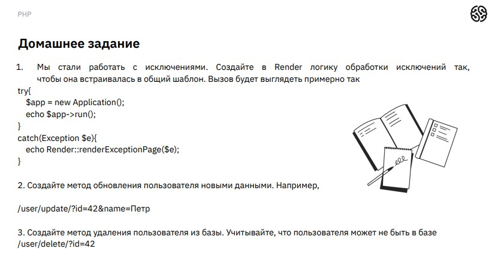
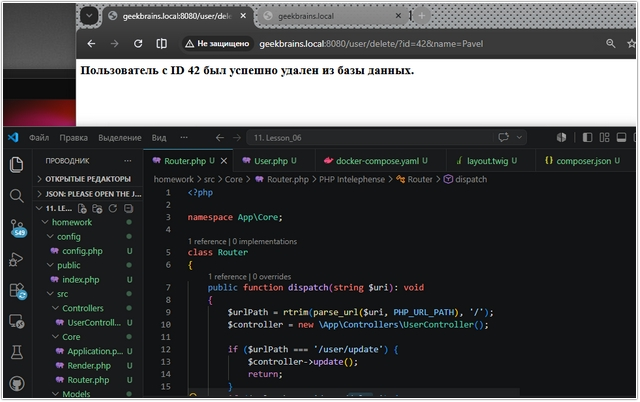

# Урок 11. Лекция. Работа с БД

## План урока

- научиться работать с более надежными хранилищами
- внедрить новые слои в наше приложение
- научиться обеспечивать безопасность работы с хранилищем

---

## Домашняя работа ([решение](https://github.com/olgashenkel/GeekBrains-technological_specialization/tree/main/12.%20PHP%20Basics/11.%20Lesson_06/homework))

**Задание:**

***Результат выполнения Домашней работы:***

## Практическая работа на лекции ([решение](https://github.com/olgashenkel/GeekBrains-technological_specialization/tree/main/12.%20PHP%20Basics/11.%20Lesson_06/lesson))
