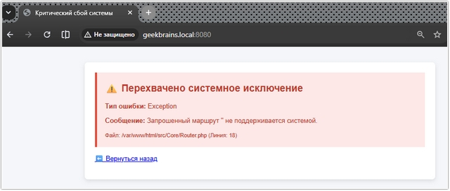
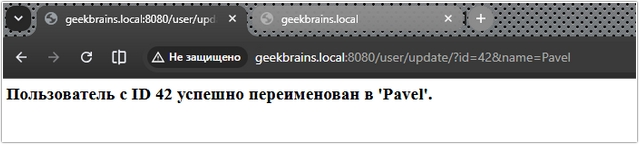
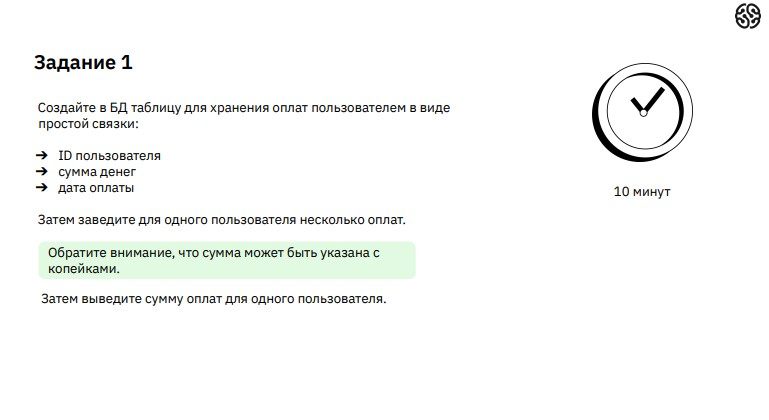
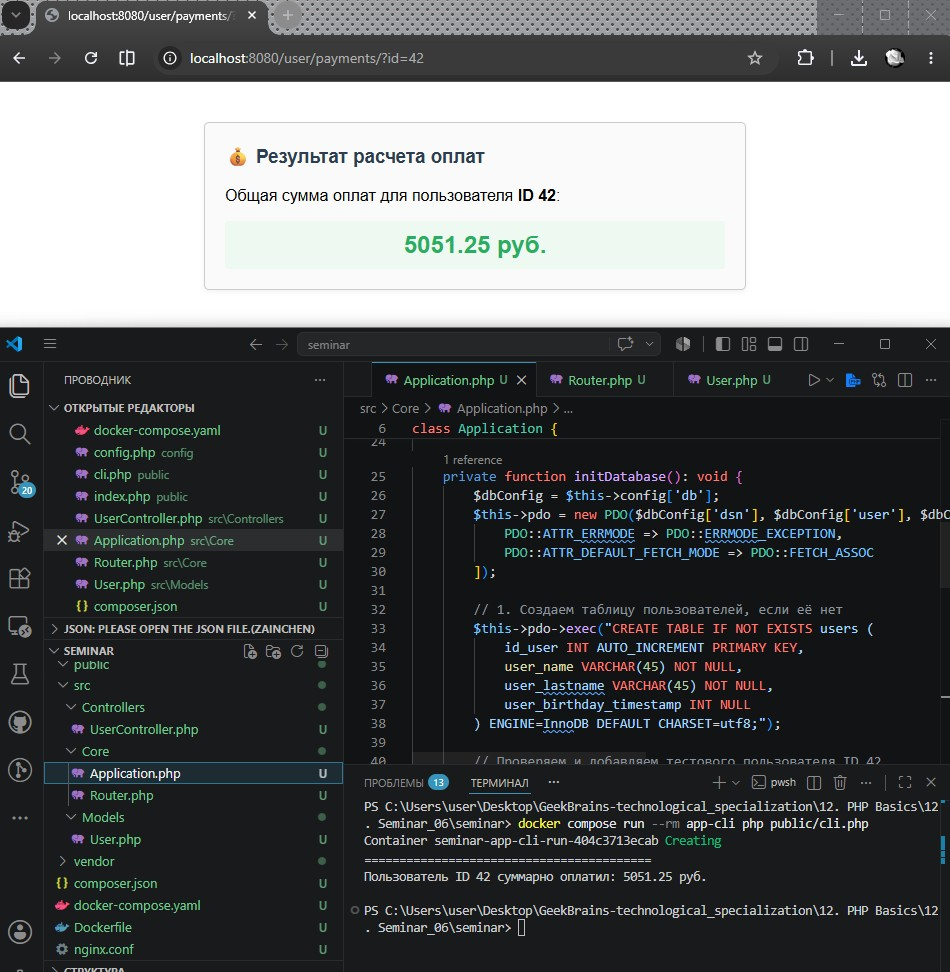
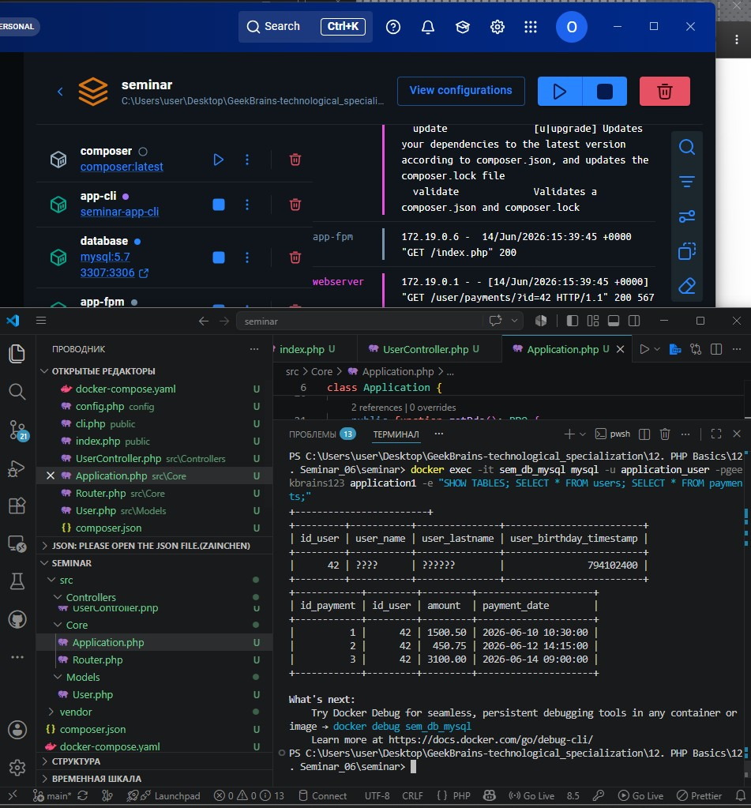
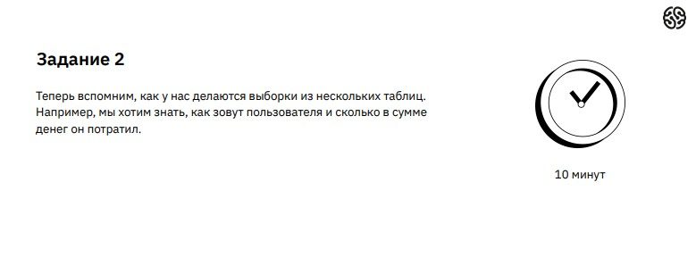
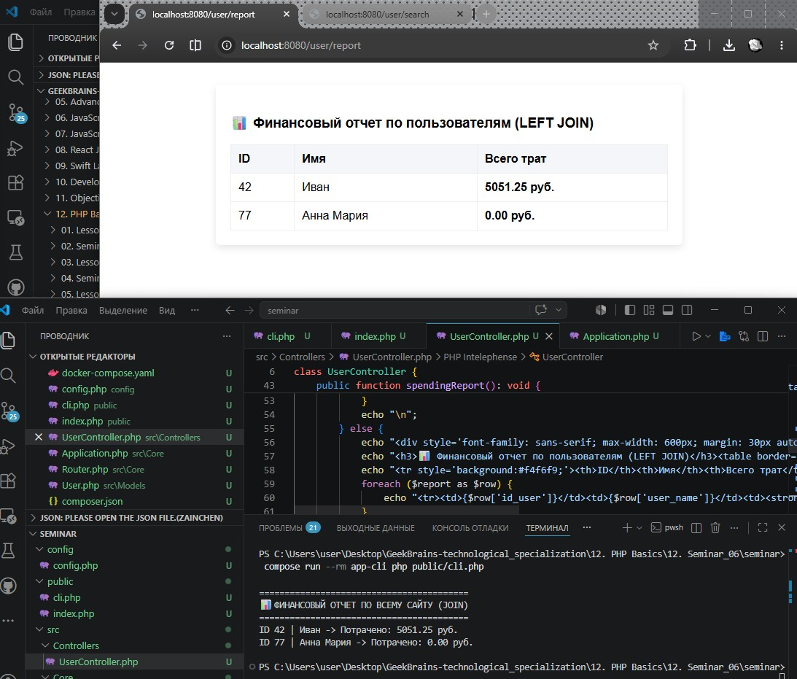
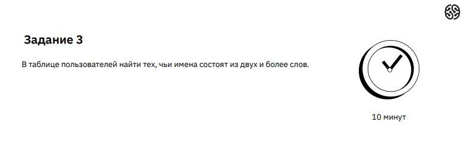
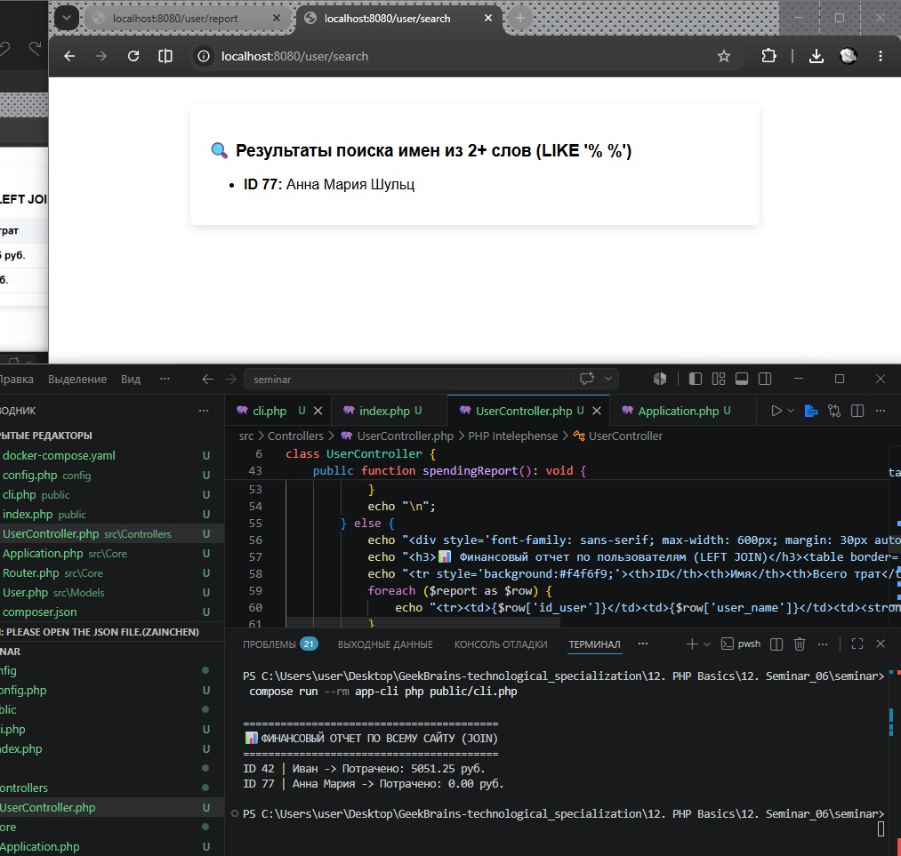

# Урок 12. Семинар. Работа с БД

## План урока

- Выполнение практических заданий в соответствии с [презентацией](https://gbcdn.mrgcdn.ru/uploads/asset/6109159/attachment/7833836872d46f5148b44ce58a35db50.pdf) к уроку
- Организуем работу с новым хранилищем
- Обеспечим безопасность данных


---

## Домашняя работа ([решение](https://github.com/olgashenkel/GeekBrains-technological_specialization/tree/main/12.%20PHP%20Basics/12.%20Seminar_06/homework))

**Задание:**


***Результат выполнения Домашней работы:***







## Практическая работа на семинаре ([решение](https://github.com/olgashenkel/GeekBrains-technological_specialization/tree/main/12.%20PHP%20Basics/12.%20Seminar_06/seminar))

**Задание 1** 




**Результат выполнения Задания № 1:**






---

**Задание 2** 




**Результат выполнения Задания № 2:**
```
/* src/Models/User.php */

/**
* Задание 2: Получение списка пользователей и их суммарных трат
*/

    public static function getUsersSpendingReport(): array {
        $pdo = \App\Core\Application::getInstance()->getPdo();
        
        // Берём только имя u.user_name и сумму оплат, заменяя NULL на 0
        $sql = "SELECT u.id_user, u.user_name, COALESCE(SUM(p.amount), 0) AS total_spent 
                FROM users AS u 
                LEFT JOIN payments AS p ON u.id_user = p.id_user 
                GROUP BY u.id_user;";
                
        return $pdo->query($sql)->fetchAll();
    }
```

```
/* src/Controllers/UserController.php */

/**
* Контроллер Задания 2 (Отчет по JOIN)
*/

public function spendingReport(): void {
    $report = \App\Models\User::getUsersSpendingReport();
    $isCli = (php_sapi_name() === 'cli');

    if ($isCli) {
        echo "\n=========================================\n";
        echo "📊 ФИНАНСОВЫЙ ОТЧЕТ ПО ВСЕМУ САЙТУ (JOIN)\n";
        echo "=========================================\n";
        foreach ($report as $row) {
            echo "ID {$row['id_user']} | {$row['user_name']} -> Потрачено: {$row['total_spent']} руб.\n";
        }
        echo "\n";
    } else {
        echo "<div style='font-family: sans-serif; max-width: 600px; margin: 30px auto; padding: 20px; background: white; border-radius: 6px; box-shadow: 0 4px 10px rgba(0,0,0,0.1);'>";
        echo "<h3>📊 Финансовый отчет по пользователям (LEFT JOIN)</h3><table border='1' cellpadding='10' style='border-collapse:collapse; width:100%; text-align:left;'>";
        echo "<tr style='background:#f4f6f9;'><th>ID</th><th>Имя</th><th>Всего трат</th></tr>";
        foreach ($report as $row) {
            echo "<tr><td>{$row['id_user']}</td><td>{$row['user_name']}</td><td><strong>{$row['total_spent']} руб.</strong></td></tr>";
        }
        echo "</table></div>";
    }
}
```




---

**Задание 3** 




**Результат выполнения Задания № 3:**
```
/* src/Models/User.php */

/**
* Задание 3: Поиск пользователей с составными именами (2 и более слов)
*/

public static function getCompositeNames(): array {
    $pdo = \App\Core\Application::getInstance()->getPdo();
    
    $stmt = $pdo->prepare("SELECT id_user, user_name, user_lastname FROM users WHERE user_name LIKE :pattern");
    $stmt->execute(['pattern' => '% %']);
    
    return $stmt->fetchAll();
}
```

```
/* src/Controllers/UserController.php */

/**
* Контроллер Задания 3 (Поиск LIKE)
*/

public function searchCompositeNames(): void {
    $users = \App\Models\User::getCompositeNames();
    $isCli = (php_sapi_name() === 'cli');

    if ($isCli) {
        echo "\n=========================================\n";
        echo "🔍 ПОЛЬЗОВАТЕЛИ С ДВОЙНЫМИ ИМЕНАМИ (LIKE)\n";
        echo "=========================================\n";
        if (empty($users)) echo "Совпадений не найдено.\n";
        foreach ($users as $user) {
            echo "ID {$user['id_user']} | {$user['user_name']} {$user['user_lastname']}\n";
        }
        echo "\n";
    } else {
        echo "<div style='font-family: sans-serif; max-width: 600px; margin: 30px auto; padding: 20px; background: white; border-radius: 6px; box-shadow: 0 4px 10px rgba(0,0,0,0.1);'>";
        echo "<h3>🔍 Результаты поиска имен из 2+ слов (LIKE '% %')</h3><ul>";
        if (empty($users)) echo "<li>Пользователи с двойными именами отсутствуют.</li>";
        foreach ($users as $user) {
            echo "<li><strong>ID {$user['id_user']}:</strong> {$user['user_name']} {$user['user_lastname']}</li>";
        }
        echo "</ul></div>";
    }
}
```

```
/* src/Core/Application.php */

// Добавляем пользователя с двойным именем для проверки Задания

$checkDoubleName = $this->pdo->query("SELECT 1 FROM users WHERE id_user = 77");
if (!$checkDoubleName->fetchColumn()) {
    $this->pdo->exec("INSERT INTO users (id_user, user_name, user_lastname, user_birthday_timestamp) VALUES (77, 'Анна Мария', 'Шульц', 855102400);");
}
```



