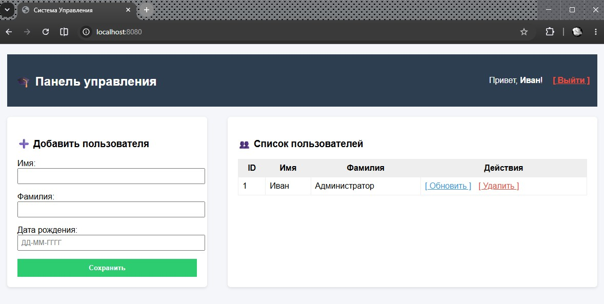
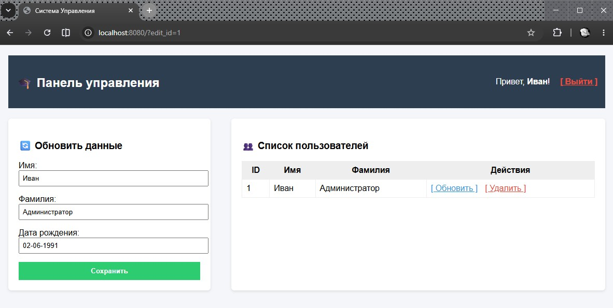
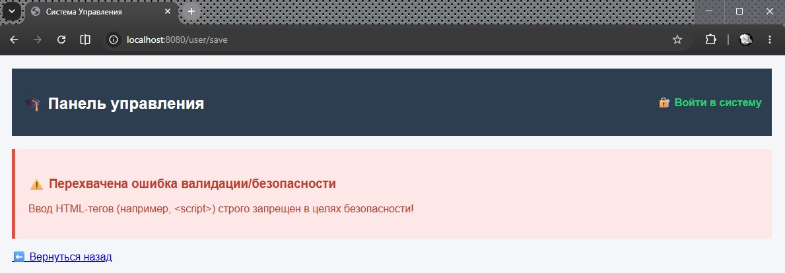
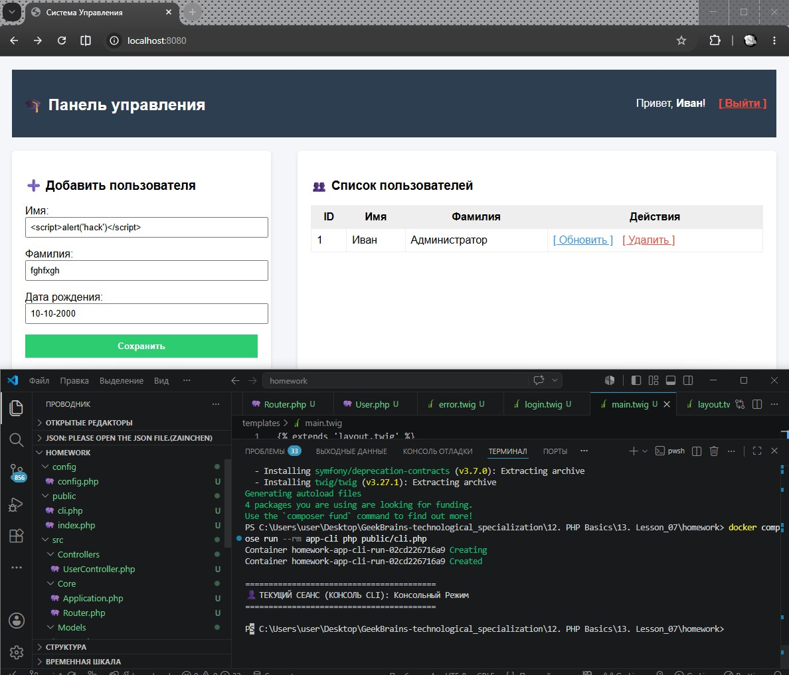
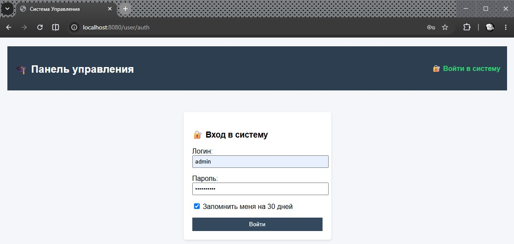
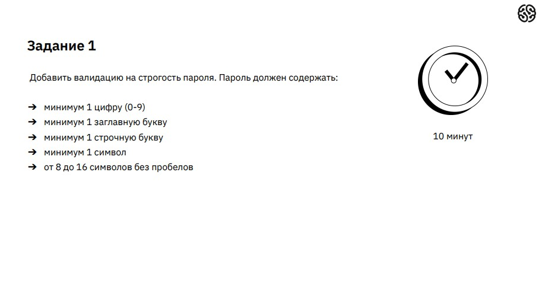
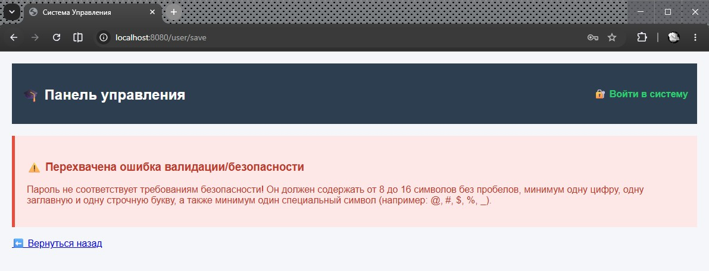
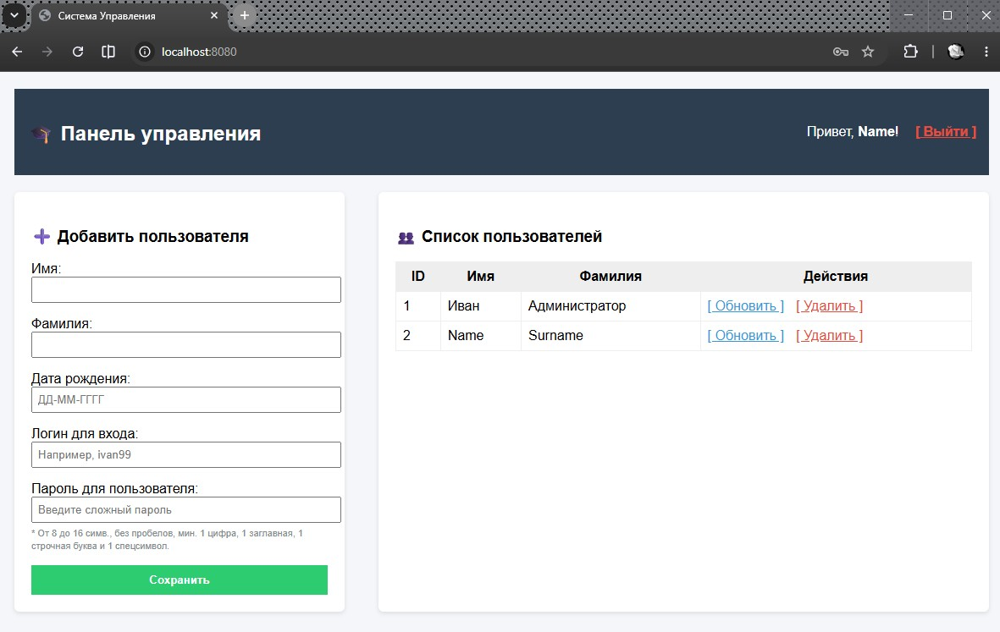
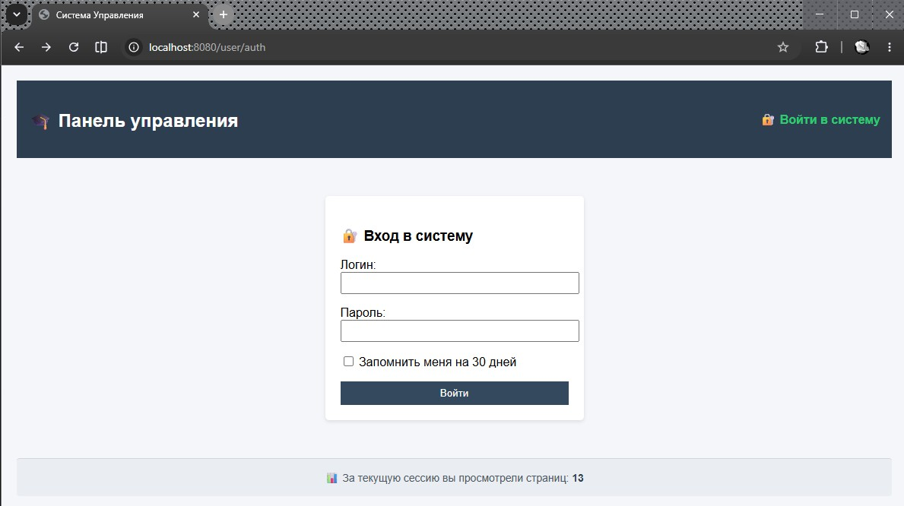

# Урок 14. Семинар. Пишем личный кабинет и хранилище файлов

## План урока

- Выполнение практических заданий в соответствии с [презентацией](https://gbcdn.mrgcdn.ru/uploads/asset/6109160/attachment/f0901656eea582f933513a0a9ac2b499.pdf) к уроку
- Применим регулярные выражения
- Поработаем с формами


---

## Домашняя работа ([решение](https://github.com/olgashenkel/GeekBrains-technological_specialization/tree/main/12.%20PHP%20Basics/14.%20Seminar_07/homework))


**Задание:**

1. При помощи регулярных выражений усильте проверку данных в validateRequestData так, чтобы пользователь не смог передать на обработку любую строку, содержащую HTML-теги (например, `<script>`).
2. Доработайте шаблон аутентификации. В нем нужно добавить две вещи:
    - В приветствии нужно выводить имя залогинившегося пользователя;
    - Также надо выводить ссылку `«Выйти из системы»`, которая будет уничтожать сессию пользователя.
3. Переработайте имеющийся функционал приложения на формы:
    - Создание, обновление и удаление пользователя теперь должно производиться через формы;
    - Если пользователь обновляется, в форму должны быть выведены текущие значения. Это может быть сделано ссылкой из списка пользователей (рядом с каждым из них будет своя ссылка `“Обновить данные”`).
4. * Создайте функцию `“Запомнить меня”` в форме логина:
    - В форме должен появиться `checkbox “Запомнить меня”`;
    - При нажатии на него в процессе логина пользователю выдается `cookie`, по которому происходит автоматическая авторизация, даже если сессия закончилась;
    - При логине нужно будет генерировать токен из `random_bytes()`, размещая его в `cookies` и БД, чтобы сравнивать их;
    - При выходе из системы токен надо деактивировать.
5. Исправьте потолстевший Абстрактный контроллер.


***Результат выполнения Домашней работы:***
```
/* Модель данных src/Models/User.php (Задание 1 — Регулярное выражение от тегов) */

<?php
namespace App\Models;

class User {
    public static function validate(array $data): bool {
        if (empty($data['name']) || empty($data['lastname']) || empty($data['birthday'])) {
            throw new \Exception("Все поля формы обязательны для заполнения.");
        }

        // Задание 1: Проверка на отсутствие HTML-тегов с помощью регулярных выражений
        if (preg_match('/<[^>]*>/', $data['name']) || preg_match('/<[^>]*>/', $data['lastname'])) {
            throw new \Exception("Ввод HTML-тегов (например, <script>) строго запрещен в целях безопасности!");
        }

        // Проверка формата даты ДД-ММ-ГГГГ
        if (!preg_match('/^(\d{2}-\d{2}-\d{4})$/', $data['birthday'])) {
            throw new \Exception("Неверный формат даты. Используйте ДД-ММ-ГГГГ.");
        }

        // Проверка CSRF токена безопасности
        if (!isset($_SESSION['csrf_token']) || $_SESSION['csrf_token'] !== ($data['csrf_token'] ?? '')) {
            throw new \Exception("Ошибка безопасности: невалидный CSRF токен.");
        }

        return true;
    }
}
```

```
/* Универсальный Контроллер src/Controllers/UserController.php (Задание 2, 3) */

<?php
namespace App\Controllers;

use App\Core\Application;
use App\Models\User;
use Twig\Loader\FilesystemLoader;
use Twig\Environment;

class UserController {
    private Environment $twig;

    public function __construct() {
        $loader = new FilesystemLoader(__DIR__ . '/../../templates');
        $this->twig = new Environment($loader);
    }

    private function render(string $template, array $data = []): void {
        if (empty($_SESSION['csrf_token'])) {
            $_SESSION['csrf_token'] = bin2hex(random_bytes(32));
        }
        $data['csrf_token'] = $_SESSION['csrf_token'];
        $data['user_authorized'] = isset($_SESSION['user_name']);
        // Задание 2: Передаем имя авторизованного пользователя в шаблон
        $data['logged_user_name'] = $_SESSION['user_name'] ?? '';
        
        echo $this->twig->render($template, $data);
    }

    public function index(): void {
        $pdo = Application::getInstance()->getPdo();
        $users = $pdo->query("SELECT * FROM users")->fetchAll();
        
        // Задание 3: Если передан ID для обновления, подгружаем его данные прямо в форму на главной
        $editUser = null;
        $birthdayStr = '';
        if (isset($_GET['edit_id'])) {
            $stmt = $pdo->prepare("SELECT * FROM users WHERE id_user = :id");
            $stmt->execute(['id' => (int)$_GET['edit_id']]);
            $editUser = $stmt->fetch();
            if ($editUser && $editUser['user_birthday_timestamp']) {
                $birthdayStr = date('d-m-Y', $editUser['user_birthday_timestamp']);
            }
        }

        $this->render('main.twig', ['users' => $users, 'edit_user' => $editUser, 'birthday_str' => $birthdayStr]);
    }

    public function auth(): void {
        $this->render('login.twig');
    }

    public function login(): void {
        $login = $_POST['login'] ?? '';
        $password = $_POST['password'] ?? '';

        $stmt = Application::getInstance()->getPdo()->prepare("SELECT * FROM users WHERE login = :login");
        $stmt->execute(['login' => $login]);
        $user = $stmt->fetch();

        if ($user && password_verify($password, $user['password_hash'])) {
            $_SESSION['user_name'] = $user['user_name'];
            header('Location: /');
            return;
        }
        $this->render('login.twig', ['error' => 'Неверный логин или пароль']);
    }

    // Задание 2: Метод уничтожения сессии (Выход)
    public function logout(): void {
        session_destroy();
        header('Location: /');
    }

    // Задание 3: Универсальное сохранение/обновление через форму
    public function save(): void {
        User::validate($_POST);
        $pdo = Application::getInstance()->getPdo();
        
        $name = htmlspecialchars($_POST['name']);
        $lastname = htmlspecialchars($_POST['lastname']);
        $ts = strtotime($_POST['birthday']);

        if (!empty($_POST['id'])) {
            $stmt = $pdo->prepare("UPDATE users SET user_name = :n, user_lastname = :l, user_birthday_timestamp = :ts WHERE id_user = :id");
            $stmt->execute(['n' => $name, 'l' => $lastname, 'ts' => $ts, 'id' => (int)$_POST['id']]);
        } else {
            $stmt = $pdo->prepare("INSERT INTO users (user_name, user_lastname, user_birthday_timestamp) VALUES (:n, :l, :ts)");
            $stmt->execute(['n' => $name, 'l' => $lastname, 'ts' => $ts]);
        }
        header('Location: /');
    }

    // Задание 3: Удаление через форму/ссылку
    public function delete(): void {
        $id = (int)($_GET['id'] ?? 0);
        if ($id > 0) {
            $stmt = Application::getInstance()->getPdo()->prepare("DELETE FROM users WHERE id_user = :id");
            $stmt->execute(['id' => $id]);
        }
        header('Location: /');
    }
}
```

```
/*  Базовый каркас templates/layout.twig (Задание 2 — Шапка и Ссылка Выхода) */

<!DOCTYPE html>
<html lang="ru">
<head>
    <meta charset="UTF-8">
    <title>Система Управления</title>
</head>
<body style="font-family: Arial, sans-serif; margin: 0; padding: 20px; background: #f4f6f9;">
    <!-- ШАПКА САЙТА И БЛОК АУТЕНТИФИКАЦИИ -->
    <div style="background: #2c3e50; color: white; padding: 15px; margin-bottom: 20px; display: flex; justify-content: space-between; align-items: center;">
        <h2>🎓 Панель управления</h2>
        <div>
            
                <span>Привет, <strong>{{ logged_user_name }}</strong>!</span>
                <a href="/user/logout" style="color: #e74c3c; margin-left: 15px; font-weight: bold;">[ Выйти ]</a>
            
                <a href="/user/auth" style="color: #2ecc71; font-weight: bold; text-decoration: none;">🔐 Войти в систему</a>
            
        </div>
    </div>

    
</body>
</html>
```

```
/* Главная страница templates/main.twig (Задание 3 — Форма Создания/Обновления) */



    <div style="display: flex; gap: 40px;">
        <!-- ФОРМА УПРАВЛЕНИЯ -->
        <div style="background: white; padding: 20px; border-radius: 6px; width: 350px; box-shadow: 0 2px 5px rgba(0,0,0,0.1);">
            <h3>{{ edit_user ? '🔄 Обновить данные' : '➕ Добавить пользователя' }}</h3>
            <form action="/user/save" method="POST">
                <input type="hidden" name="csrf_token" value="{{ csrf_token }}">
                {% if edit_user %<input type="hidden" name="id" value="{{ edit_user.id_user }}">

                <p>Имя:<br><input type="text" name="name" value="{{ edit_user.user_name }}" required style="width:100%; padding:6px;"></p>
                <p>Фамилия:<br><input type="text" name="lastname" value="{{ edit_user.user_lastname }}" required style="width:100%; padding:6px;"></p>
                <p>Дата рождения:<br><input type="text" name="birthday" value="{{ birthday_str }}" placeholder="ДД-ММ-ГГГГ" required style="width:100%; padding:6px;"></p>
                
                <button type="submit" style="background:#2ecc71; color:white; border:none; padding:10px; width:100%; cursor:pointer; font-weight:bold;">Сохранить</button>
            </form>
        </div>

        <!-- ТАБЛИЦА ПОЛЬЗОВАТЕЛЕЙ -->
        <div style="flex: 1; background: white; padding: 20px; border-radius: 6px; box-shadow: 0 2px 5px rgba(0,0,0,0.1);">
            <h3>👥 Список пользователей</h3>
            <table border="1" cellpadding="8" style="width: 100%; border-collapse: collapse;">
                <tr style="background: #eee;"><th>ID</th><th>Имя</th><th>Фамилия</th><th>Действия</th></tr>
                
                    <tr>
                        <td>{{ user.id_user }}</td>
                        <td>{{ user.user_name }}</td>
                        <td>{{ user.user_lastname }}</td>
                        <td>
                            <a href="/?edit_id={{ user.id_user }}" style="color: #3498db;">[ Обновить ]</a>
                            <a href="/user/delete/?id={{ user.id_user }}" onclick="return confirm('Удалить?')" style="color: #e74c3c; margin-left: 10px;">[ Удалить ]</a>
                        </td>
                    </tr>
                
            </table>
        </div>
    </div>

```

```
/* Форма входа templates/login.twig */



    <div style="max-width: 300px; margin: 50px auto; background: white; padding: 20px; border-radius: 5px; box-shadow: 0 2px 5px rgba(0,0,0,0.1);">
        <h3>🔐 Вход в систему</h3>
        <p style="color: red;">{{ error }}</p>
        <form action="/user/login" method="POST">
            <input type="hidden" name="csrf_token" value="{{ csrf_token }}">
            <p>Логин:<br><input type="text" name="login" required style="width:100%; padding:5px;"></p>
            <p>Пароль:<br><input type="password" name="password" required style="width:100%; padding:5px;"></p>
            <button type="submit" style="background:#34495e; color:white; border:none; padding:8px; width:100%; cursor:pointer;">Войти</button>
        </form>
    </div>

```

```
/* Ошибки templates/error.twig */



    <div style="background: #fde8e7; border-left: 5px solid #e74c3c; padding: 20px; color: #c0392b;">
        <h3>⚠️ Перехвачена ошибка валидации/безопасности</h3>
        <p>{{ message }}</p>
    </div>
    <p><a href="javascript:history.back()">⬅️ Вернуться назад</a></p>

```

```
/* Задание 4: функция «Запомнить меня» на долговечных Cookie */

/* 1. Обновление таблицы в БД */

$this->pdo->exec("CREATE TABLE IF NOT EXISTS users (
    id_user INT AUTO_INCREMENT PRIMARY KEY,
    user_name VARCHAR(45) NOT NULL,
    user_lastname VARCHAR(45) NOT NULL,
    user_birthday_timestamp INT NULL,
    login VARCHAR(45) NULL UNIQUE,
    password_hash VARCHAR(255) NULL,
    remember_token VARCHAR(64) NULL -- ДОБАВИЛИ ПОЛЕ ДЛЯ COOKIE ТОКЕНА
) ENGINE=InnoDB DEFAULT CHARSET=utf8;");


/* 2. Автоматический вход по Cookie в Ядре */
public function run(): void {
    if (session_status() === PHP_SESSION_NONE) {
        session_start();
    }

    // ЗАДАНИЕ 4: Автоматический вход по Cookie, если сессия пуста
    if (!isset($_SESSION['user_name']) && isset($_COOKIE['remember_me'])) {
        $token = $_COOKIE['remember_me'];
        
        $stmt = $this->pdo->prepare("SELECT * FROM users WHERE remember_token = :token");
        $stmt->execute(['token' => $token]);
        $user = $stmt->fetch();

        if ($user) {
            // Автоматически восстанавливаем сессию
            $_SESSION['user_name'] = $user['user_name'];
        }
    }

    $router = new Router();
    $router->dispatch($_SERVER['REQUEST_URI'] ?? '/');
}


/* 3. Изменение формы входа templates/login.twig */


    <div style="max-width: 300px; margin: 50px auto; background: white; padding: 20px; border-radius: 5px; box-shadow: 0 2px 5px rgba(0,0,0,0.1);">
        <h3>🔐 Вход в систему</h3>
        <p style="color: red;">{{ error }}</p>
        <form action="/user/login" method="POST">
            <input type="hidden" name="csrf_token" value="{{ csrf_token }}">
            <p>Логин:<br><input type="text" name="login" required style="width:100%; padding:5px;"></p>
            <p>Пароль:<br><input type="password" name="password" required style="width:100%; padding:5px;"></p>
            
            <!-- ЗАДАНИЕ 4: ЧЕКБОКС ЗАПОМНИТЬ МЕНЯ -->
            <p><label><input type="checkbox" name="remember"> Запомнить меня на 30 дней</label></p>
            
            <button type="submit" style="background:#34495e; color:white; border:none; padding:8px; width:100%; cursor:pointer;">Войти</button>
        </form>
    </div>



/* 4. Обработка токенов в UserController.php */
public function login(): void {
    $login = $_POST['login'] ?? '';
    $password = $_POST['password'] ?? '';
    $remember = isset($_POST['remember']); // Проверяем, нажат ли чекбокс

    $pdo = Application::getInstance()->getPdo();
    $stmt = $pdo->prepare("SELECT * FROM users WHERE login = :login");
    $stmt->execute(['login' => $login]);
    $user = $stmt->fetch();

    if ($user && password_verify($password, $user['password_hash'])) {
        $_SESSION['user_name'] = $user['user_name'];

        // ЗАДАНИЕ 4: Реализация логики "Запомнить меня"
        if ($remember) {
            // Генерируем случайный безопасный токен
            $token = bin2hex(random_bytes(32));
            
            // Сохраняем токен в базу данных пользователю
            $updateStmt = $pdo->prepare("UPDATE users SET remember_token = :token WHERE id_user = :id");
            $updateStmt->execute(['token' => $token, 'id' => $user['id_user']]);
            
            // Записываем Cookie в браузер на 30 дней (30 * 24 * 60 * 60 секунд)
            setcookie('remember_me', $token, time() + 2592000, '/', '', false, true);
        }

        header('Location: /');
        return;
    }
    $this->render('login.twig', ['error' => 'Неверный логин или пароль']);
}

public function logout(): void {
    $pdo = Application::getInstance()->getPdo();
    
    // ЗАДАНИЕ 4: Очищаем токен в базе данных и стираем Cookie при выходе
    if (isset($_COOKIE['remember_me'])) {
        $updateStmt = $pdo->prepare("UPDATE users SET remember_token = NULL WHERE remember_token = :token");
        $updateStmt->execute(['token' => $_COOKIE['remember_me']]);
        
        // Стираем Cookie из браузера, ставя время в прошлое
        setcookie('remember_me', '', time() - 3600, '/');
    }

    session_destroy();
    header('Location: /');
}
```

















## Практическая работа на семинаре ([решение](https://github.com/olgashenkel/GeekBrains-technological_specialization/tree/main/12.%20PHP%20Basics/14.%20Seminar_07/seminar))

**Задание 1** 




**Результат выполнения Задания № 1:**

```
/* 1. Создание метода валидации пароля в модели User.php */

/**
* Валидация строгости пароля с помощью регулярного выражения
*/
public static function validatePasswordStrength(string $password): bool {
// Регулярное выражение, проверяющее все условия методички:
// (?=.*[0-9])       - минимум 1 цифра
// (?=.*[A-Z])       - минимум 1 заглавная буква (латиница)
// (?=.*[a-z])       - минимум 1 строчная буква (латиница)
// (?=.*[\W_])       - минимум 1 спецсимвол (знаки препинания, подчеркивания и т.д.)
// \S{8,16}          - от 8 до 16 символов СТРОГО без пробелов (\S означает non-whitespace)
$pattern = '/^(?=.*[0-9])(?=.*[A-Z])(?=.*[a-z])(?=.*[\W_])\S{8,16}$/';

if (!preg_match($pattern, $password)) {
    throw new \Exception(
        "Пароль не соответствует требованиям безопасности! " .
        "Он должен содержать от 8 до 16 символов без пробелов, " .
        "минимум одну цифру, одну заглавную и одну строчную букву, " .
        "а также минимум один специальный символ (например: @, #, $, %, _)."
    );
}

return true;
}
```

```
/* 2. Интеграция проверки в Контроллер UserController.php */

// Пример интеграции при сохранении/регистрации пользователя с паролем
public function register(): void {
    $password = $_POST['password'] ?? '';

    // Запускаем созданную нами строгую валидацию
    \App\Models\User::validatePasswordStrength($password);

    // Если исключение не выбросилось — шифруем и сохраняем
    $hash = password_hash($password, PASSWORD_BCRYPT);
    
    // ... далее стандартный INSERT в базу данных ...
    echo "<h2>Регистрация завершена, пароль успешно прошел проверку на строгость!</h2>";
}
```






---

**Задание 2** 

Счетчик посещенных страниц. Нужно знать, сколько страниц посетил пользователь за свою сессию.


**Результат выполнения Задания № 2:**

```
/* 1. Добавление логики подсчета в src/Core/Application.php */

public function run(): void {
    if (session_status() === PHP_SESSION_NONE) {
        session_start();
    }

    // --- КЛЮЧЕВОЙ БЛОК: СЧЕТЧИК ПОСЕЩЕНИЙ ---
    if (!isset($_SESSION['page_views'])) {
        $_SESSION['page_views'] = 1; // Первый заход
    } else {
        $_SESSION['page_views']++; // Каждый следующий просмотр страницы
    }

    // Логика автоматического входа по Cookie (из прошлых ДЗ)
    if (!isset($_SESSION['user_name']) && isset($_COOKIE['remember_me'])) {
        $token = $_COOKIE['remember_me'];
        $stmt = $this->pdo->prepare("SELECT * FROM users WHERE remember_token = :token");
        $stmt->execute(['token' => $token]);
        $user = $stmt->fetch();
        if ($user) {
            $_SESSION['user_name'] = $user['user_name'];
        }
    }

    $router = new Router();
    $router->dispatch($_SERVER['REQUEST_URI'] ?? '/');
}
```

```
/* 2. Передача переменной в Twig в UserController.php */

private function render(string $template, array $data = []): void {
    if (empty($_SESSION['csrf_token'])) {
        $_SESSION['csrf_token'] = bin2hex(random_bytes(32));
    }
    $data['csrf_token'] = $_SESSION['csrf_token'];
    $data['user_authorized'] = isset($_SESSION['user_name']);
    $data['logged_user_name'] = $_SESSION['user_name'] ?? '';
    
    // ПЕРЕДАЕМ ЗНАЧЕНИЕ СЧЕТЧИКА В ШАБЛОН Twig
    $data['page_views'] = $_SESSION['page_views'] ?? 0;
    
    echo $this->twig->render($template, $data);
}
```

```
/* 3. Вывод счетчика в макет templates/layout.twig */

    <!-- КОНТЕНТ СТРАНИЦЫ -->
    <div style="margin-top: 20px;">
        
    </div>

    <!-- ПОДВАЛ СО СЧЕТЧИКОМ ПОСЕЩЕНИЙ -->
    <div style="margin-top: 40px; padding: 15px; background: #eaedf1; border-top: 1px solid #d1d5db; text-align: center; color: #4b5563; font-size: 14px; border-radius: 4px;">
        📊 За текущую сессию вы просмотрели страниц: <strong style="color: #2c3e50;">{{ page_views }}</strong>
    </div>

</body>
</html>
```




