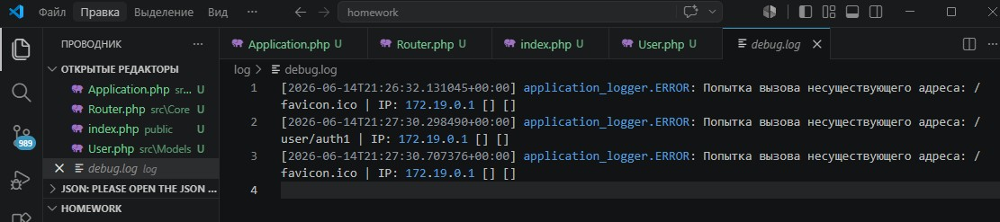

# Урок 15. Лекция. Логи, профилирование и исключения

## План урока

- научимся отслеживать работу нашего приложения в реальном времени
- познакомимся с принципами отладки приложений
- сформируем возможности для журналирования работы приложения

---

## Домашняя работа ([решение](https://github.com/olgashenkel/GeekBrains-technological_specialization/tree/main/12.%20PHP%20Basics/15.%20Lesson_08/homework))

**Задание:**

В уже созданных маршрутах попробуйте вызывать их с некорректными данными.

Что будет происходить? Будут ли появляться ошибки?

При появлении ошибок, произведите их анализ. Обязательно зафиксируйте шаги своих размышлений.

На основании анализа произведите устранение.


***Результат выполнения Домашней работы:***

```
/* Передача пустых строк в форму сохранения */

Если отправить форму добавления пользователя абсолютно пустой, функция strtotime() вернет ошибку или запишет некорректный timestamp в базу данных MySQL, ломая логику отображения дат.

Анализ: Метод save() доверяет входящему массиву $_POST. Необходимо встроить жесткую блокировку на уровне модели, если данные не прошли первичную проверку на пустоту.

Устранение: в файле src/Models/User.php метод validate() выбрасывает исключение при обнаружении пустых значений, а также записывает это событие в логгер как предупреждение (WARNING):

php    public static function validate(array $data): bool {
        if (empty($data['name']) || empty($data['lastname']) || empty($data['birthday'])) {
            // Записываем предупреждение в журнал Monolog
            \App\Core\Application::$logger->warning("Пользователь отправил пустые поля формы.");
            throw new \Exception("Все поля формы обязательны для заполнения!");
        }
        ... 
    }
```





## Практическая работа на лекции ([решение](https://github.com/olgashenkel/GeekBrains-technological_specialization/tree/main/12.%20PHP%20Basics/15.%20Lesson_08/lesson))
