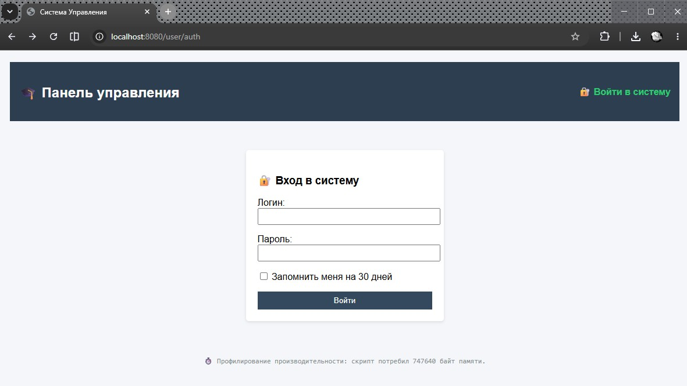
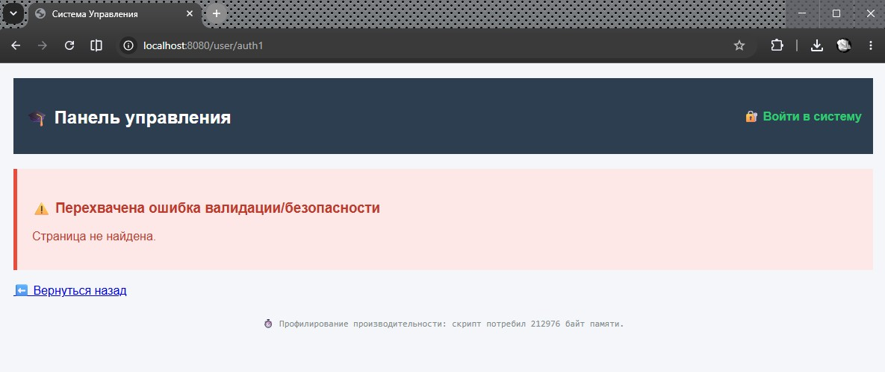
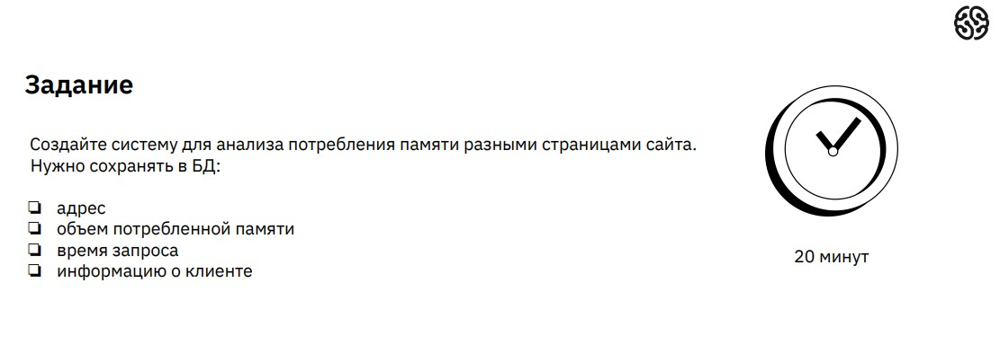
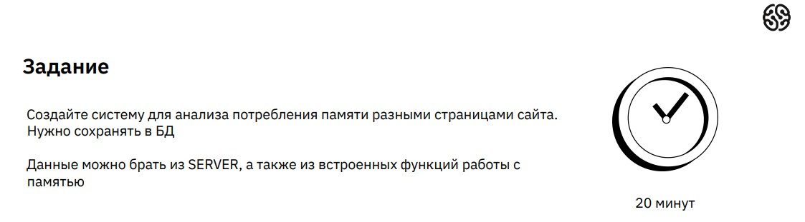
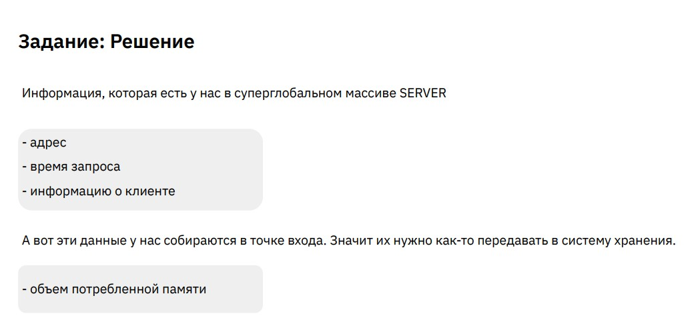
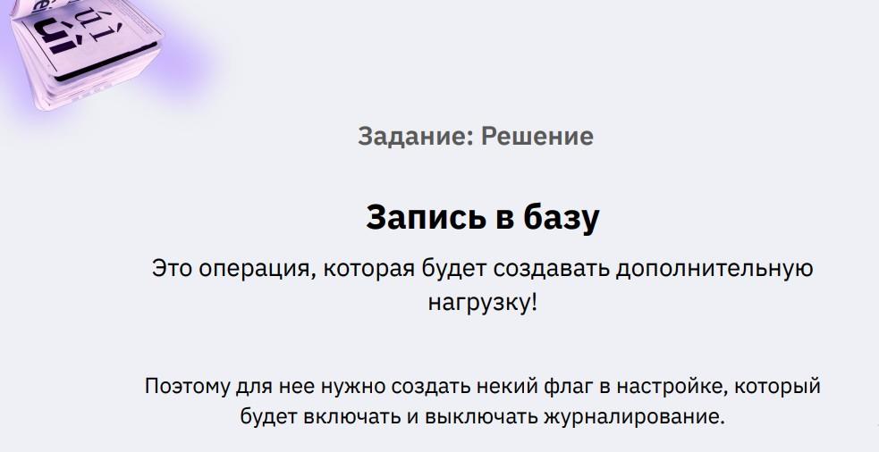
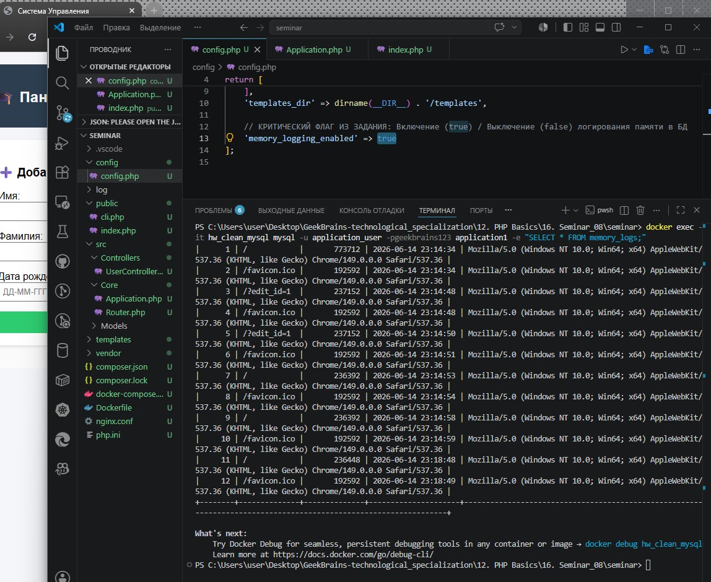
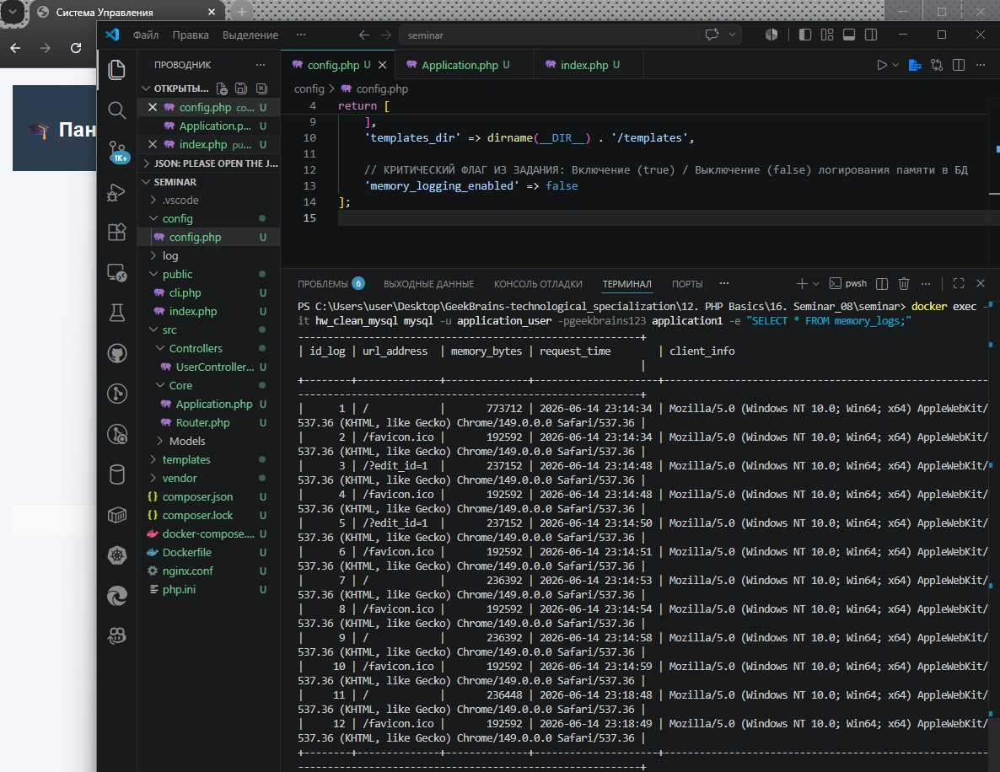

# Урок 16. Семинар. Учимся собирать логи, дебажим приложение

## План урока

- Выполнение практических заданий в соответствии с [презентацией](https://gbcdn.mrgcdn.ru/uploads/asset/6109161/attachment/f2712788f2ce1781d7a3984dd2c3bf48.pdf) к уроку
- Собирать необходимую информацию о работе приложения


---

## Домашняя работа ([решение](https://github.com/olgashenkel/GeekBrains-technological_specialization/tree/main/12.%20PHP%20Basics/16.%20Seminar_08/homework))


**Задание:**

В уже созданных маршрутах попробуйте вызывать их с некорректными данными.

Что будет происходить? Будут ли появляться ошибки?

При появлении ошибок, произведите их анализ. Обязательно зафиксируйте шаги своих размышлений.

На основании анализа произведите устранение.


***Результат выполнения Домашней работы:***

```
/* Передача пустых строк в форму сохранения */

Если отправить форму добавления пользователя абсолютно пустой, функция strtotime() вернет ошибку или запишет некорректный timestamp в базу данных MySQL, ломая логику отображения дат.

Анализ: Метод save() доверяет входящему массиву $_POST. Необходимо встроить жесткую блокировку на уровне модели, если данные не прошли первичную проверку на пустоту.

Устранение: в файле src/Models/User.php метод validate() выбрасывает исключение при обнаружении пустых значений, а также записывает это событие в логгер как предупреждение (WARNING):

php    public static function validate(array $data): bool {
        if (empty($data['name']) || empty($data['lastname']) || empty($data['birthday'])) {
            // Записываем предупреждение в журнал Monolog
            \App\Core\Application::$logger->warning("Пользователь отправил пустые поля формы.");
            throw new \Exception("Все поля формы обязательны для заполнения!");
        }
        ... 
    }
```








## Практическая работа на семинаре ([решение](https://github.com/olgashenkel/GeekBrains-technological_specialization/tree/main/12.%20PHP%20Basics/16.%20Seminar_08/seminar))

**Задание 1** 











**Результат выполнения Задания № 1:**

```
/* 1. Добавление тумблера журналирования в config/config.php */

<?php
// config/config.php

return [
    'db' => [
        'dsn'  => 'mysql:host=database;dbname=application1;charset=utf8',
        'user' => 'application_user',
        'pass' => 'geekbrains123',
    ],
    'templates_dir' => dirname(__DIR__) . '/templates',
    
    // КРИТИЧЕСКИЙ ФЛАГ ИЗ ЗАДАНИЯ: Включение (true) / Выключение (false) логирования памяти в БД
    'memory_logging_enabled' => true
];
```

```
/* 2. Создание таблицы и метода записи в src/Core/Application.php*/

<?php
namespace App\Core;

use PDO;

class Application {
    private array $config; // Изменим на хранение конфига
    private static ?Application $instance = null;
    private ?PDO $pdo = null;

    public function __construct() {
        self::$instance = $this;
        // Загрузим конфиг внутрь ядра
        $this->config = require __DIR__ . '/../../config/config.php';
        $this->initDatabase();
    }

    public static function getInstance(): Application { return self::$instance; }
    public function getPdo(): PDO { return $this->pdo; }
    public function getConfig(string $key) { return $this->config[$key] ?? null; }

    private function initDatabase(): void {
        $dbConfig = $this->config['db'];
        $this->pdo = new PDO($dbConfig['dsn'], $dbConfig['user'], $dbConfig['pass'], [
            PDO::ATTR_ERRMODE => PDO::ERRMODE_EXCEPTION,
            PDO::ATTR_DEFAULT_FETCH_MODE => PDO::FETCH_ASSOC
        ]);

        // 1. Существующая таблица пользователей
        $this->pdo->exec("CREATE TABLE IF NOT EXISTS users (
            id_user INT AUTO_INCREMENT PRIMARY KEY,
            user_name VARCHAR(45) NOT NULL,
            user_lastname VARCHAR(45) NOT NULL,
            user_birthday_timestamp INT NULL,
            login VARCHAR(45) NULL UNIQUE,
            password_hash VARCHAR(255) NULL,
            remember_token VARCHAR(64) NULL
        ) ENGINE=InnoDB DEFAULT CHARSET=utf8;");

        // 2. СИСТЕМНОЕ ЗАДАНИЕ: Создание таблицы логирования памяти страницы
        $this->pdo->exec("CREATE TABLE IF NOT EXISTS memory_logs (
            id_log INT AUTO_INCREMENT PRIMARY KEY,
            url_address VARCHAR(255) NOT NULL,
            memory_bytes INT NOT NULL,
            request_time DATETIME NOT NULL,
            client_info TEXT NOT NULL
        ) ENGINE=InnoDB DEFAULT CHARSET=utf8;");
    }

    /**
     * Метод безопасного сохранения лога производительности в БД
     */
    public function logMemory(string $url, int $memory, string $userAgent): void {
        // Проверяем флаг в настройках перед отправкой запроса (Задание, стр. 2)
        if ($this->getConfig('memory_logging_enabled') !== true) {
            return; 
        }

        $stmt = $this->pdo->prepare("INSERT INTO memory_logs (url_address, memory_bytes, request_time, client_info) VALUES (:url, :mem, NOW(), :client)");
        $stmt->execute([
            'url' => $url,
            'mem' => $memory,
            'client' => $userAgent
        ]);
    }

    public function run(): void {
        if (session_status() === PHP_SESSION_NONE) { session_start(); }
        $router = new Router();
        $router->dispatch($_SERVER['REQUEST_URI'] ?? '/');
    }
}
```


```
/* 3. Фиксация метрик на выходе в public/index.php */

<?php
// Фиксируем объём памяти на самом старте
$memory_start = memory_get_usage();

require_once __DIR__ . '/../vendor/autoload.php';

$app = null;

try {
    $app = new \App\Core\Application();
    $app->run();
} catch (\Throwable $e) {
    $loader = new \Twig\Loader\FilesystemLoader(__DIR__ . '/../templates');
    $twig = new \Twig\Environment($loader);
    echo $twig->render('error.twig', ['message' => $e->getMessage()]);
}

// Фиксируем память на выходе и вычисляем чистый расход страницы
$memory_end = memory_get_usage();
$total_memory_used = $memory_end - $memory_start;

// Собираем системные данные из $_SERVER для записи в БД
$urlAddress = $_SERVER['REQUEST_URI'] ?? '/';
$clientInfo = $_SERVER['HTTP_USER_AGENT'] ?? 'Unknown Client';

// Передаем собранные данные в систему хранения, если приложение успешно инициализировалось
if ($app) {
    $app->logMemory($urlAddress, $total_memory_used, $clientInfo);
}

// Профилирование для визуального контроля в браузере
echo "<div style='text-align:center; font-family:monospace; color:#7f8c8d; padding:10px; font-size:12px; background:#fafafa; border-top:1px solid #eee;'>";
echo "📊 Лог производительности: адрес '{$urlAddress}' потребил " . $total_memory_used . " байт памяти.";
echo "</div>";
```






