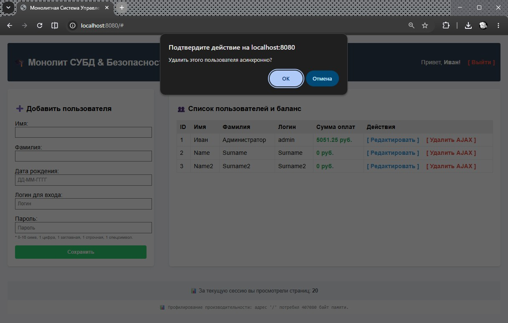
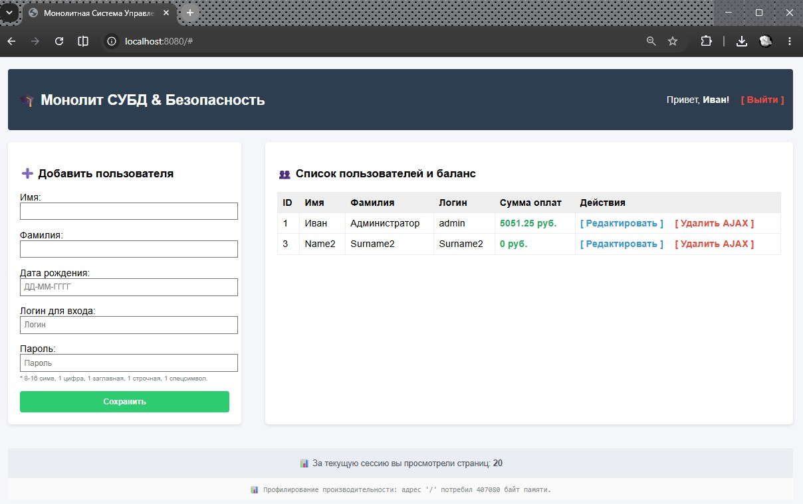
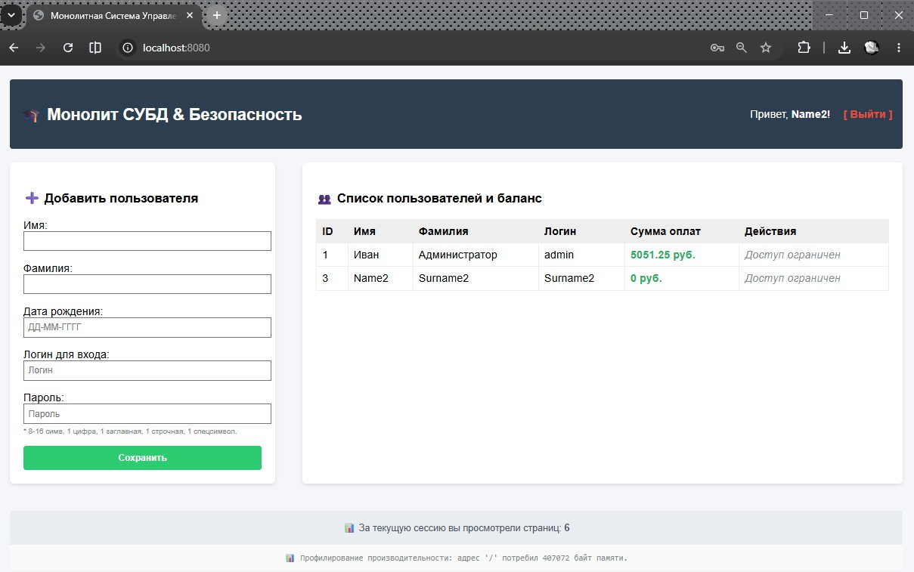

# Урок 17. Лекция. Frontend

## План урока

- организации верстки в нашем приложении
- аспектах реализации интерфейса

---

## Домашняя работа ([решение](https://github.com/olgashenkel/GeekBrains-technological_specialization/tree/main/12.%20PHP%20Basics/17.%20Lesson_09/homework))

**Задание:**

Скорректируйте список пользователей так, чтобы все пользователи с правами
администратора в таблице видели две дополнительные ссылки – редактирование и
удаление пользователя. При этом редактирование будет переходить на форму, а
удаление в асинхронном режиме будет удалять пользователя как из таблицы, так и
из БД.

***Результат выполнения Домашней работы:***

## Практическая работа на лекции ([решение](https://github.com/olgashenkel/GeekBrains-technological_specialization/tree/main/12.%20PHP%20Basics/17.%20Lesson_09/lesson))
