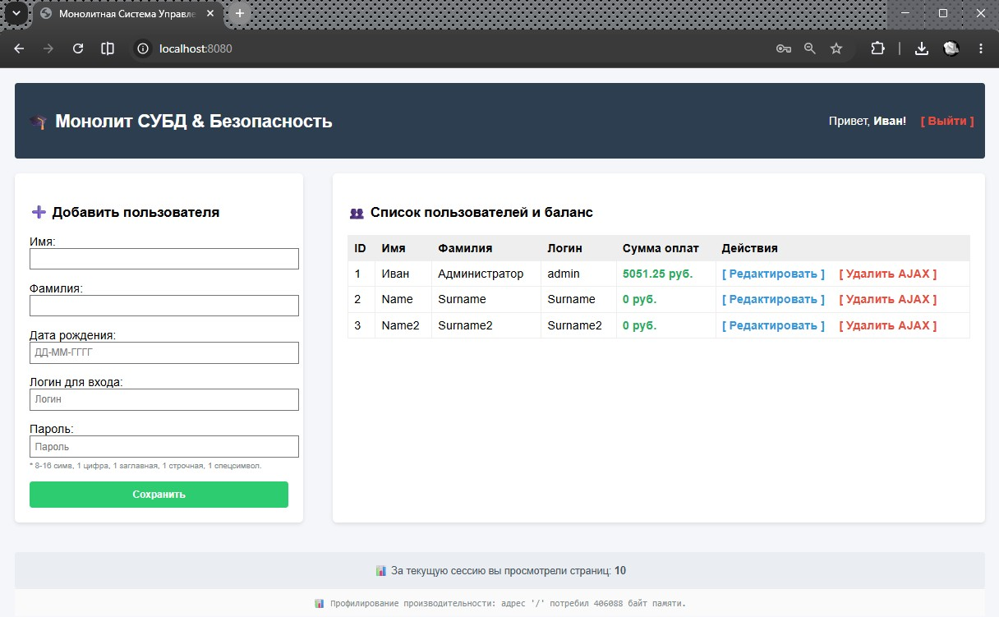
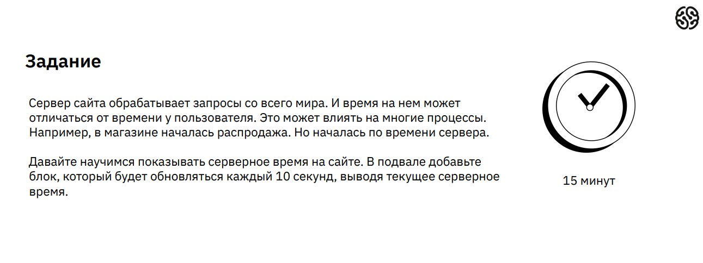
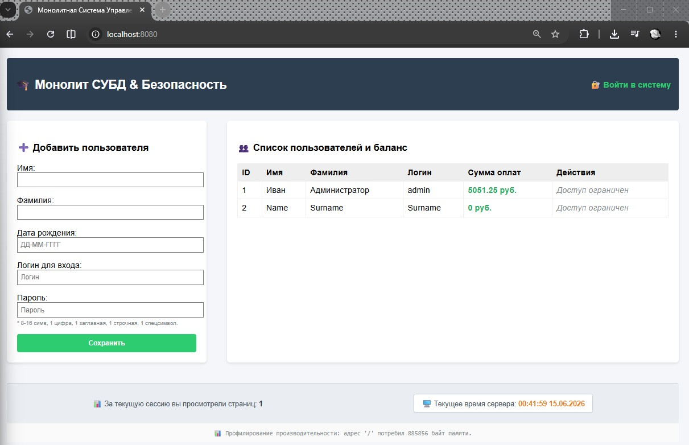

# Урок 18. Семинар. Улучшаем приложение

## План урока

- Выполнение практических заданий в соответствии с [презентацией](https://gbcdn.mrgcdn.ru/uploads/asset/6109162/attachment/5ef42ad4bdeec7c1a1744d206049cc96.pdf) к уроку
- Закреплять знания в работе с асинхронными методами


---

## Домашняя работа ([решение](https://github.com/olgashenkel/GeekBrains-technological_specialization/tree/main/12.%20PHP%20Basics/18.%20Seminar_09/homework))


**Задание:**

Скорректируйте список пользователей так, чтобы все пользователи с правами
администратора в таблице видели две дополнительные ссылки – редактирование и
удаление пользователя. При этом редактирование будет переходить на форму, а
удаление в асинхронном режиме будет удалять пользователя как из таблицы, так и
из БД.

***Результат выполнения Домашней работы:***





## Практическая работа на семинаре ([решение](https://github.com/olgashenkel/GeekBrains-technological_specialization/tree/main/12.%20PHP%20Basics/18.%20Seminar_09/seminar))

**Задание 1** 





**Результат выполнения Задания № 1:**

```
/* 1. Добавление метода в src/Controllers/UserController.php */

/**
* Асинхронная отдача серверного времени для подвала сайта (AJAX JSON)
*/
public function serverTime(): void {
header('Content-Type: application/json');

// Форматируем текущее время сервера (Часы:Минуты:Секунды ДД.ММ.ГГГГ)
$currentTime = date('H:i:s d.m.Y');

echo json_encode([
    'success' => true,
    'time' => $currentTime
]);
exit;
}
```

```
/* 2. Регистрация нового маршрута в src/Core/Router.php */

if ($urlPath === '/user/time') {
    $controller = new \App\Controllers\UserController();
    $controller->serverTime();
    return;
}
```

```
/* 3. Интеграция фонового счетчика в templates/layout.twig */

    <!-- СЧЕТЧИК СЕССИИ И СЕРВЕРНОЕ ВРЕМЯ В ПОДВАЛЕ -->
    <div style="margin-top: 40px; padding: 20px; background: #eaedf1; text-align: center; color: #4b5563; font-size: 14px; border-radius: 4px; display: flex; justify-content: space-around; align-items: center; border-top: 1px solid #d1d5db;">
        <div>
            📊 За текущую сессию вы просмотрели страниц: <strong style="color: #2c3e50;">{{ page_views }}</strong>
        </div>
        
        <!-- БЛОК ВЫВОДА СЕРВЕРНОГО ВРЕМЕНИ -->
        <div style="background: white; padding: 8px 15px; border-radius: 4px; border: 1px solid #cbd5e1; box-shadow: 0 1px 3px rgba(0,0,0,0.05);">
            🖥️ Текущее время сервера: <strong id="server-time-clock" style="color: #e67e22;">Загрузка...</strong>
        </div>
    </div>

    <!-- АСИНХРОННЫЙ ТАЙМЕР ОБНОВЛЕНИЯ ВРЕМЕНИ (КАЖДЫЕ 10 СЕКУНД) -->
    <script>
    function updateServerTime() {
        fetch('/user/time', {
            headers: { 'X-Requested-With': 'XMLHttpRequest' }
        })
        .then(response => response.json())
        .then(data => {
            if (data.success) {
                // Динамически заменяем текст в блоке подвала без перезагрузки сайта
                document.getElementById('server-time-clock').innerText = data.time;
            }
        })
        .catch(error => console.error('Ошибка получения серверного времени:', error));
    }

    // Запускаем проверку один раз сразу при загрузке страницы
    document.addEventListener('DOMContentLoaded', function() {
        updateServerTime();
        
        // Запускаем бесконечный цикл опроса сервера каждые 10000 мс (10 секунд)
        setInterval(updateServerTime, 10000);
    });
    </script>
</body>
</html>
```

``` 
/* 4. Исключение вывода профилировщика памяти в public/index.php */

// Защита: Блокируем вывод HTML-текста профилировщика на любые асинхронные AJAX вызовы
if (strpos($_SERVER['REQUEST_URI'], 'delete-async') === false && strpos($_SERVER['REQUEST_URI'], 'user/time') === false) {
    echo "<div style='text-align:center; font-family:monospace; color:#7f8c8d; padding:10px; font-size:12px; background:#fafafa; border-top:1px solid #eee;'>";
    echo "📊 Профилирование производительности: адрес '" . htmlspecialchars($_SERVER['REQUEST_URI']) . "' потребил " . $total_memory . " байт памяти.";
    echo "</div>";
}
```


