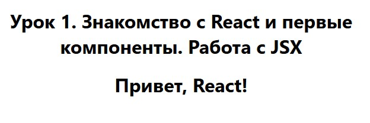
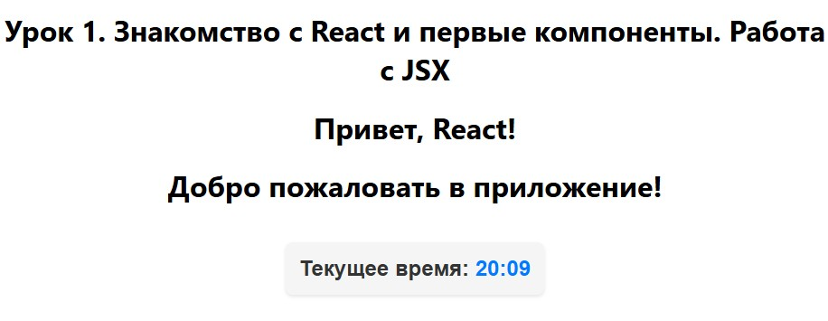
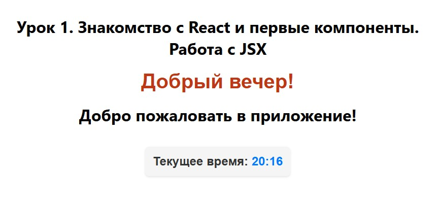
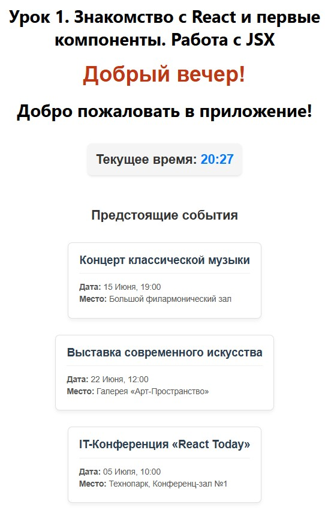

# Урок 1. Знакомство с React и первые компоненты. Работа с JSX


## План урока

- Выполнение практических заданий в соответствии с [презентацией](https://gbcdn.mrgcdn.ru/uploads/asset/6006248/attachment/41aa534d2058fbe1f14cde2a6d1322dc.pdf) к уроку


## Домашняя работа ([решение]())

**Задание 1 (тайминг 15 минут)** 
1. Установить Node.js и NPM (если еще не установлены).
2. Создать новый проект React, используя Create React App, выполнив команду `npx create-react-app my-first-react-app` в терминале.
3. Запустить проект, используя команду npm start в директории проекта, и убедиться, что приложение отображается в браузере.
4. Заменить шаблонный текст на произвольный

**Результат выполнения Задания № 1:**

```
<div className="App">
    <h1>Урок 1. Знакомство с React и первые компоненты. Работа с JSX</h1>
</div>
```


**Задание 2 (тайминг 15 минут)** 
1. Создать функциональный компонент Greeting, который выводит простое приветствие, например, `<h1>Привет, React!</h1>`.
2. Импортировать компонент Greeting в App.js и использовать его внутри компонента App.
3. Запустить приложение и убедиться, что приветствие отображается на странице.

**Результат выполнения Задания № 2:**

```
/* Задание № 2.1 */
import React from 'react';

function Greeting() {
  return <h1>Привет, React!</h1>;
}

export default Greeting;
```

```
/* Задание № 2.2*/

import logo from './logo.svg';
import './App.css';
import Greeting from './Greeting'; // Импорт компонента

function App() {
  return (
    <div className="App">
      <h1>Урок 1. Знакомство с React и первые компоненты. Работа с JSX</h1>
      <Greeting /> {/* Использование компонента */}
    
    </div>
  );
}

export default App;
```




**Задание 3 (тайминг 25 минут)** 
1. Создать функциональный компонент CurrentTime, который будет отображать текущее время, форматированное в удобочитаемом виде (например, `"Текущее время: 14:35"`).
2. Использовать объект `Date` для получения текущего времени и метод
`toLocaleTimeString()` для его форматирования.
3. Импортировать компонент `CurrentTime` в App.js и использовать его внутри компонента `App`, чтобы отобразить текущее время на странице.
4. Добавить минимальную стилизацию для компонента `CurrentTime`, чтобы выделить отображаемое время (например, использовать `<h2>` для заголовка и немного `CSS` для улучшения внешнего вида).

**Результат выполнения Задания № 3:**

```
/* Задание 3.1, 3.2 */
import React, { useState, useEffect } from 'react';
import './CurrentTime.css'; 

function CurrentTime() {
  const [time, setTime] = useState(new Date());

  useEffect(() => {
    const timerId = setInterval(() => {
      setTime(new Date());
    }, 1000);

    return () => clearInterval(timerId);
  }, []);

  const formattedTime = time.toLocaleTimeString([], {
    hour: '2-digit',
    minute: '2-digit'
  });

  return (
    <div className="time-container">
      <h2>Текущее время: <span className="time-highlight">{formattedTime}</span></h2>
    </div>
  );
}

export default CurrentTime;
```


```
/* Задание 3.3 */
import logo from './logo.svg';
import './App.css';
import Greeting from './Greeting'; 
import CurrentTime from './CurrentTime';

function App() {
  return (
    <div className="App">
      <h1>Урок 1. Знакомство с React и первые компоненты. Работа с JSX</h1>
      <Greeting /> 

      <h1>Добро пожаловать в приложение!</h1>
      <CurrentTime />
    
    </div>
  );
}

export default App;
```

```
/* Задание 3.4*/

.time-container {
  margin: 20px 0;
  padding: 15px;
  border-radius: 8px;
  background-color: #f5f5f5;
  box-shadow: 0 2px 4px rgba(0, 0, 0, 0.1);
  display: inline-block;
}

.time-container h2 {
  margin: 0;
  color: #333;
  font-family: sans-serif;
}

.time-highlight {
  color: #007bff;
  font-weight: bold;
}
```




**Задание 4 (тайминг 20 минут)** 
1. Модифицировать компонент Greeting, чтобы он выводил различные приветствия в зависимости от времени суток, например, "Доброе утро" или "Добрый вечер", используя условный рендеринг.
2. Использовать new Date().getHours() для определения текущего времени и установить условие для отображения соответствующего приветствия.
3. Запустить приложение и проверить, что отображается соответствующее приветствие в зависимости от времени суток.


**Результат выполнения Задания № 4:**

```
import React from 'react';
import './Greeting.css'; 

function Greeting() {
  const currentHour = new Date().getHours();
  let message = '';

   if (currentHour >= 4 && currentHour < 12) {
    message = 'Доброе утро';
  } else if (currentHour >= 12 && currentHour < 17) {
    message = 'Добрый день';
  } else if (currentHour >= 17 && currentHour < 23) {
    message = 'Добрый вечер';
  } else {
    message = 'Доброй ночи';
  }

  return (
    <div className="greeting-container">
      <h1 className="greeting-text">{message}!</h1>
    </div>
  );
}

export default Greeting;
```

```
.greeting-container {
  margin: 20px 0;
  text-align: center;
}

.greeting-text {
  font-family: sans-serif;
  color: #be3816;
  font-size: 2.5rem;
  margin: 0;
}
```




**Задание 5\* (тайминг 20 минут)** 
1. Создать функциональный компонент EventCard, который будет отображать информацию о событии: название, дату и место проведения. Компонент должен принимать эти данные через пропсы.
2. В компоненте App, использовать компонент EventCard несколько раз с различными данными о событиях, переданными через пропсы, чтобы показать список предстоящих событий.
3. Добавить минимальную стилизацию для компонента EventCard, используя CSS классы, чтобы визуально выделить информацию о каждом событии.


**Результат выполнения Задания № 5:**

```
import React from 'react';
import './EventCard.css'; // Импорт стилей

// Деструктуризируем пропсы: title, date, location
function EventCard({ title, date, location }) {
  return (
    <div className="event-card">
      <h3 className="event-title">{title}</h3>
      <div className="event-details">
        <p className="event-info">
          <strong>Дата:</strong> {date}
        </p>
        <p className="event-info">
          <strong>Место:</strong> {location}
        </p>
      </div>
    </div>
  );
}

export default EventCard;
```

```
.event-card {
  border: 1px solid #e0e0e0;
  border-radius: 8px;
  padding: 20px;
  margin: 15px auto;
  max-width: 400px;
  background-color: #ffffff;
  box-shadow: 0 4px 6px rgba(0, 0, 0, 0.05);
  transition: transform 0.2s ease, box-shadow 0.2s ease;
  text-align: left;
}

/* Эффект при наведении на карточку */
.event-card:hover {
  transform: translateY(-2px);
  box-shadow: 0 6px 12px rgba(0, 0, 0, 0.1);
}

.event-title {
  margin-top: 0;
  margin-bottom: 12px;
  color: #2c3e50;
  font-family: sans-serif;
  font-size: 1.3rem;
}

.event-details {
  border-top: 1px solid #f0f0f0;
  padding-top: 10px;
}

.event-info {
  margin: 6px 0;
  color: #555555;
  font-family: sans-serif;
  font-size: 0.95rem;
}
```

```
import logo from './logo.svg';
import './App.css';
import Greeting from './Greeting'; 
import CurrentTime from './CurrentTime';
import EventCard from './EventCard';

function App() {
  return (
    <div className="App" style={{ textAlign: 'center', padding: '50px' }}>
      <h1>Урок 1. Знакомство с React и первые компоненты. Работа с JSX</h1>
      <Greeting /> 

      <h1>Добро пожаловать в приложение!</h1>
      <CurrentTime />
    
          
      <h2 style={{ fontFamily: 'sans-serif', color: '#333', marginTop: '40px' }}>
        Предстоящие события
      </h2>
      
      {/* Список карточек с разными пропсами */}
      <div className="events-list" style={{ display: 'flex', flexDirection: 'column', alignItems: 'center' }}>
        <EventCard 
          title="Концерт классической музыки" 
          date="15 Июня, 19:00" 
          location="Большой филармонический зал" 
        />
        <EventCard 
          title="Выставка современного искусства" 
          date="22 Июня, 12:00" 
          location="Галерея «Арт-Пространство»" 
        />
        <EventCard 
          title="IT-Конференция «React Today»" 
          date="05 Июля, 10:00" 
          location="Технопарк, Конференц-зал №1" 
        />
      </div>

    </div>
  );
}

export default App;
```

