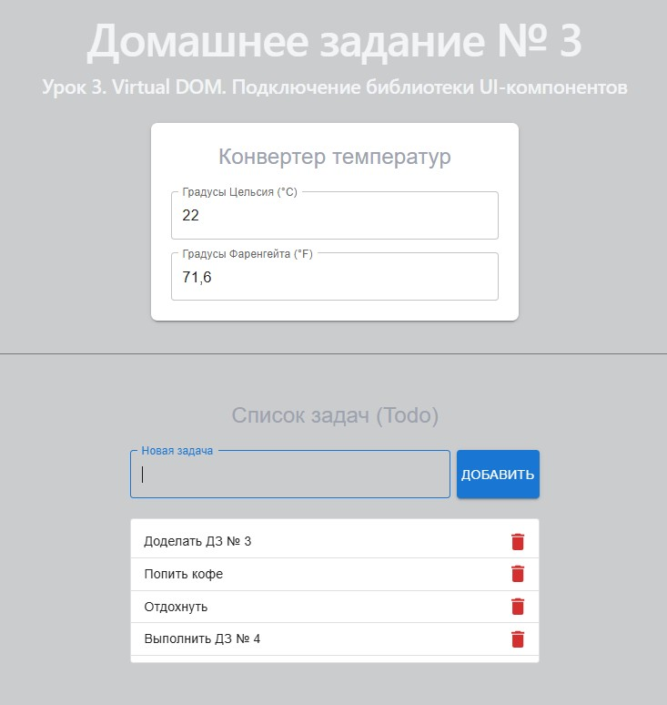

# Урок 

## План урока

- Выполнение практических заданий в соответствии с [презентацией]() к уроку

## Домашняя работа ([решение]())

**Задание:**

**Результат выполнения Домашней работы:**

## Практическая работа на семинаре ([решение]())

**Задание 1 (тайминг 15 минут)** 

**Результат выполнения Задания № 1:**
