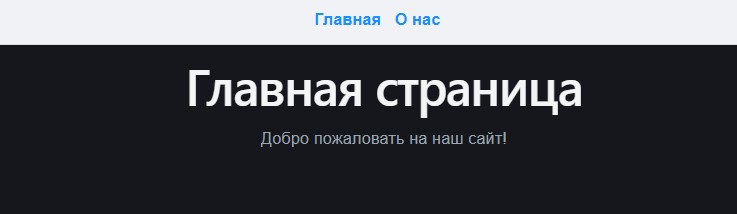
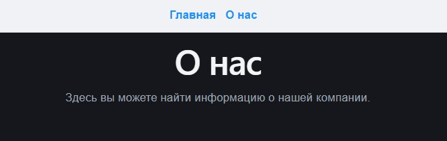
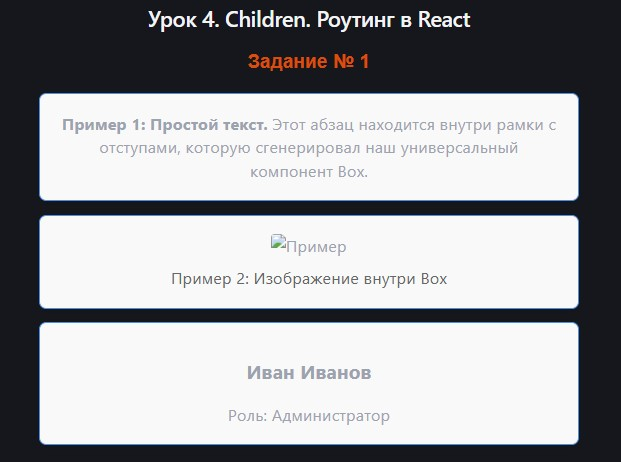
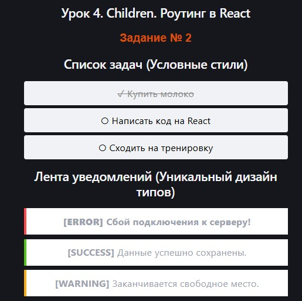
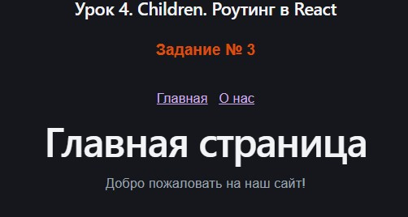
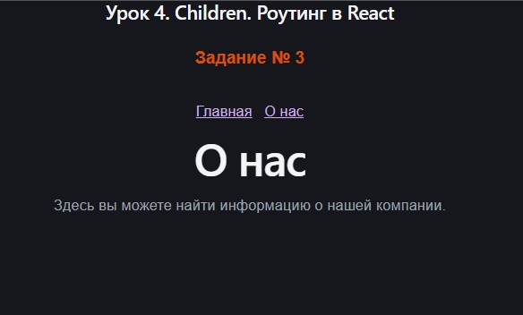
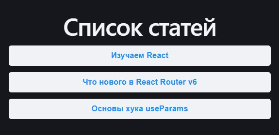
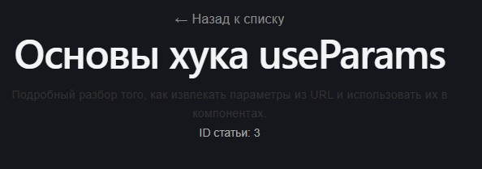
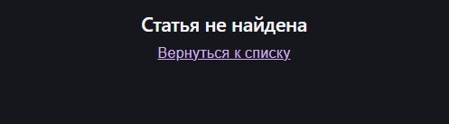

# Урок 4. Children. Роутинг в React


## План урока

- Выполнение практических заданий в соответствии с [презентацией](https://gbcdn.mrgcdn.ru/uploads/asset/6006235/attachment/286f55962cba492600568a0e400fa461.pdf) к уроку


## Домашняя работа ([решение](https://github.com/olgashenkel/GeekBrains-technological_specialization/tree/main/12.%20React%20JS%20framework/Seminar_04/homework/sr))

**Задание:**

Создать приложение с двумя страницами: `"Главная страница"` и `"О нас"`.

На каждой странице должна быть навигационная ссылка для перехода на другую страницу.

**Шаги выполнения:**

**Установка react-router-dom:**
Если еще не установлен, добавьте `react-router-dom` в ваш проект: `npm install react-router-dom`.

**Создание компонентов:**
— Создайте два компонента: `HomePage.jsx` и `AboutPage.jsx`.
— В каждом компоненте добавьте простой текст, например, `<h1>Главная страница</h1>` для `HomePage` и `<h1>О нас</h1>` для `AboutPage`.
— Реализовать переходы.

**Результат выполнения Домашней работы:**
```
/* Установка библиотеки */
npm install react-router-dom
```

```
/* HomePage.jsx */

import 'react';

const HomePage = () => {
  return (
    <div>
      <h1>Главная страница</h1>
      <p>Добро пожаловать на наш сайт!</p>
    </div>
  );
};

export default HomePage;
```

```
/* AboutPage.jsx */

import 'react';

const AboutPage = () => {
  return (
    <div>
      <h1>О нас</h1>
      <p>Здесь вы можете найти информацию о нашей компании.</p>
    </div>
  );
};

export default AboutPage;
```

```
/* Создание общего макета (Layout) с использованием children */
/* Layout.jsx */

import 'react';
import { Link } from 'react-router-dom';

const Layout = ({ children }) => {
  const navStyle = {
    padding: '15px',
    backgroundColor: '#f0f2f5',
    borderBottom: '1px solid #d9d9d9',
    marginBottom: '20px'
  };

  const linkStyle = {
    marginRight: '15px',
    textDecoration: 'none',
    color: '#1890ff',
    fontWeight: 'bold'
  };

  return (
    <div style={{ fontFamily: 'sans-serif' }}>
      {/* Общая навигационная панель */}
      <nav style={navStyle}>
        <Link to="/" style={linkStyle}>Главная</Link>
        <Link to="/about" style={linkStyle}>О нас</Link>
      </nav>

      {/* Место, куда будут подставляться наши страницы */}
      <div style={{ padding: '0 15px' }}>
        {children}
      </div>
    </div>
  );
};

export default Layout;
```

```
import 'react';
import { BrowserRouter, Routes, Route } from 'react-router-dom';
import Layout from './components/Layout';
import HomePage from './components/HomePage';
import AboutPage from './components/AboutPage';

const App = () => {
  return (
    <BrowserRouter>
      <Routes>
        {/* Главный маршрут */}
        <Route 
          path="/" 
          element={
            <Layout>
              <HomePage />
            </Layout>
          } 
        />
        
        {/* Маршрут "О нас" */}
        <Route 
          path="/about" 
          element={
            <Layout>
              <AboutPage />
            </Layout>
          } 
        />
      </Routes>
    </BrowserRouter>
  );
};

export default App;
```






## Практическая работа на семинаре ([решение](https://github.com/olgashenkel/GeekBrains-technological_specialization/tree/main/12.%20React%20JS%20framework/Seminar_04/seminar/src))

**Задание 1 (тайминг 20 минут)** 

1. Создайте компонент `Box`, который оборачивает содержимое, переданное в `children`, в `div` с определенными стилями (например, с рамкой и отступами).
2. Используйте `Box` для оборачивания различных элементов (текста, картинок, других компонентов), чтобы продемонстрировать его переиспользуемость.

**Результат выполнения Задания № 1:**
```
/* Создание компонента Box */
import 'react';

// Компонент-обертка Box
const Box = ({ children }) => {
  const boxStyle = {
    border: '2px solid #4A90E2',
    borderRadius: '8px',
    padding: '20px',
    margin: '15px 0',
    backgroundColor: '#f9f9f9',
    boxShadow: '0 4px 6px rgba(0,0,0,0.05)',
  };

  return <div style={boxStyle}>{children}</div>;
};

export default Box;
```

```
import 'react';
import Box from './components/Box';

// Простой сторонний компонент для демонстрации
const UserProfile = () => (
  <div>
    <h3>Иван Иванов</h3>
    <p>Роль: Администратор</p>
  </div>
);

const App = () => {
  return (
    <div style={{ maxWidth: '600px', margin: '0 auto', padding: '20px' }}>
      <h2>Урок 4. Children. Роутинг в React</h2>
      <h3 style={{ color: '#da4e0d', fontFamily: 'sans-serif' }}>Задание № 1</h3>
      

      {/* Пример 1: Обертка для обычного текста */}
      <Box>
        <p><strong>Пример 1: Простой текст.</strong> Этот абзац находится внутри рамки с отступами, которую сгенерировал наш универсальный компонент Box.</p>
      </Box>

      {/* Пример 2: Обертка для изображения */}
      <Box>
        <div style={{ textAlign: 'center' }}>
          
          <p style={{ margin: '10px 0 0 0', color: '#666' }}>Пример 2: Изображение внутри Box</p>
        </div>
      </Box>

      {/* Пример 3: Обертка для другого React-компонента */}
      <Box>
        <UserProfile />
      </Box>
    </div>
  );
};

export default App;
```




**Задание 2 (тайминг 20 минут)
1. Создайте компонент List, который принимает функцию через props, и эта функция возвращает элементы списка (<li>). List должен рендерить эти элементы внутри <ul>.
2. Используйте List для отображения списка пунктов, где каждый пункт может иметь свой уникальный стиль или содержимое, определенное функцией render props.** 


**Результат выполнения Задания № 2:**
```
/* Использование компонента List с уникальными стилями */
import 'react';

// Компонент List, который использует render prop
const List = ({ items, renderItem }) => {
  return (
    <ul style={{ listStyleType: 'none', padding: 0 }}>
      {items.map((item, index) => {
        // Вызываем переданную функцию для каждого элемента массива
        return renderItem(item, index);
      })}
    </ul>
  );
};

export default List;
```

```
import 'react';
import List from './components/List';

const App = () => {
  // Данные для первого списка (Задачи)
  const todoList = [
    { id: 1, text: 'Купить молоко', completed: true },
    { id: 2, text: 'Написать код на React', completed: false },
    { id: 3, text: 'Сходить на тренировку', completed: false },
  ];

  // Данные для второго списка (Уведомления)
  const notifications = [
    { id: 'a', type: 'error', message: 'Сбой подключения к серверу!' },
    { id: 'b', type: 'success', message: 'Данные успешно сохранены.' },
    { id: 'c', type: 'warning', message: 'Заканчивается свободное место.' },
  ];

  return (
    <div style={{ maxWidth: '500px', margin: '0 auto', padding: '20px' }}>
      
      <h2>1. Список задач (Условные стили)</h2>
      <List 
        items={todoList} 
        renderItem={(todo) => (
          <li 
            key={todo.id} 
            style={{
              padding: '10px',
              margin: '5px 0',
              backgroundColor: '#f0f2f5',
              borderRadius: '4px',
              // Динамический стиль в зависимости от статуса задачи
              textDecoration: todo.completed ? 'line-through' : 'none',
              color: todo.completed ? '#888' : '#000'
            }}
          >
            {todo.completed ? '✓ ' : '○ '} {todo.text}
          </li>
        )} 
      />

      <h2>2. Лента уведомлений (Уникальный дизайн типов)</h2>
      <List 
        items={notifications} 
        renderItem={(notification) => {
          // Определяем цвет рамки в зависимости от типа уведомления
          const colors = {
            error: '#ff4d4f',
            success: '#52c41a',
            warning: '#faad14'
          };

          return (
            <li 
              key={notification.id} 
              style={{
                padding: '12px',
                margin: '8px 0',
                borderLeft: `5px solid ${colors[notification.type]}`,
                backgroundColor: '#fff',
                boxShadow: '0 2px 4px rgba(0,0,0,0.1)',
                fontWeight: notification.type === 'error' ? 'bold' : 'normal'
              }}
            >
              <strong>[{notification.type.toUpperCase()}]</strong> {notification.message}
            </li>
          );
        }} 
      />

    </div>
  );
};

export default App;
```



**Задание 3 (тайминг 30 минут)** 

Создать приложение с двумя страницами: "Главная страница" и "О нас".

На каждой странице должна быть навигационная ссылка для перехода на другую страницу.

**Шаги выполнения:**
1. Установка react-router-dom:
    - Если еще не установлен, добавьте react-router-dom в ваш проект: npm install react-router-dom.
2. Создание компонентов:
    - Создайте два компонента: HomePage.jsx и AboutPage.jsx.
    - В каждом компоненте добавьте простой текст, например, `<h1>Главная страница</h1>` для `HomePage` и `<h1>О нас</h1>` для `AboutPage`.
3. Настройка роутинга:
    - В корневом компоненте (`App.jsx`), импортируйте все необходимые компоненты
    - Для навигации между страницами, добавьте в верхнюю часть каждого компонента (`HomePage` и `AboutPage`) навигационные ссылки (`<Link to="/">Главная</Link>` и `<Link to="/about">О нас</Link>`)


**Результат выполнения Задания № 3:**
```
/* Установка библиотеки */
npm install react-router-dom
```

```
/* HomePage.jsx */

import 'react';
import { Link } from 'react-router-dom';

const HomePage = () => {
  return (
    <div style={{ padding: '20px', fontFamily: 'sans-serif' }}>
      {/* Навигационные ссылки */}
      <nav style={{ marginBottom: '20px' }}>
        <Link to="/" style={{ marginRight: '15px' }}>Главная</Link>
        <Link to="/about">О нас</Link>
      </nav>
      
      <h1>Главная страница</h1>
      <p>Добро пожаловать на наш сайт!</p>
    </div>
  );
};

export default HomePage;
```

```
/* AboutPage.jsx */

import 'react';
import { Link } from 'react-router-dom';

const AboutPage = () => {
  return (
    <div style={{ padding: '20px', fontFamily: 'sans-serif' }}>
      {/* Навигационные ссылки */}
      <nav style={{ marginBottom: '20px' }}>
        <Link to="/" style={{ marginRight: '15px' }}>Главная</Link>
        <Link to="/about">О нас</Link>
      </nav>
      
      <h1>О нас</h1>
      <p>Здесь вы можете найти информацию о нашей компании.</p>
    </div>
  );
};

export default AboutPage;
```

```
import { BrowserRouter, Routes, Route } from 'react-router-dom';
import HomePage from './components/HomePage';
import AboutPage from './components/AboutPage';


const App = () => {
  return (
 
    <BrowserRouter>
      <h2>Урок 4. Children. Роутинг в React</h2>
      <h3 style={{ color: '#da4e0d', fontFamily: 'sans-serif' }}>Задание № 3</h3>
      <Routes>
        {/* Главный маршрут */}
        <Route path="/" element={<HomePage />} />
        
        {/* Маршрут страницы "О нас" */}
        <Route path="/about" element={<AboutPage />} />
      </Routes>
    </BrowserRouter>
  );
};

export default App;
```






**Задание  4 (тайминг 25 минут)**

1. Создайте маленькое приложение со страницей списка (ListPage) и страницей деталей (DetailPage).
2. На ListPage отобразите список элементов (например, статей или продуктов), где каждый элемент является ссылкой на DetailPage, содержащую детальную информацию об элементе. Используйте react-router-dom для настройки маршрутизации.
3. На DetailPage используйте useParams для извлечения параметра из URL (например, ID элемента) и отобразите детальную информацию об элементе. 


**Результат выполнения Задания № 4:**
```
/* data.js */

export const articles = [
  { id: '1', title: 'Изучаем React', content: 'Полное руководство по основам библиотеки React и созданию компонентов.' },
  { id: '2', title: 'Что нового в React Router v6', content: 'Обзор изменений, улучшений и новых хуков для работы с маршрутизацией.' },
  { id: '3', title: 'Основы хука useParams', content: 'Подробный разбор того, как извлекать параметры из URL и использовать их в компонентах.' }
];
```

```
/* ListPage.jsx */

import 'react';
import { Link } from 'react-router-dom';
import { articles } from './data';

const ListPage = () => {
  return (
    <div style={{ padding: '20px', fontFamily: 'sans-serif', maxWidth: '600px' }}>
      <h1>Список статей</h1>
      <ul style={{ listStyle: 'none', padding: 0 }}>
        {articles.map((article) => (
          <li key={article.id} style={{ margin: '15px 0', padding: '10px', backgroundColor: '#f0f2f5', borderRadius: '6px' }}>
            {/* Формируем динамическую ссылку по ID статьи */}
            <Link to={`/article/${article.id}`} style={{ textDecoration: 'none', color: '#1890ff', fontSize: '18px', fontWeight: 'bold' }}>
              {article.title}
            </Link>
          </li>
        ))}
      </ul>
    </div>
  );
};

export default ListPage;
```

```
/* DetailPage.jsx */

import 'react';
import { useParams, Link } from 'react-router-dom';
import { articles } from './data';

const DetailPage = () => {
  // Извлекаем параметр id из URL-адреса
  const { id } = useParams();

  // Ищем нужную статью в массиве данных по полученному id
  const article = articles.find((item) => item.id === id);

  // Если статья с таким ID не найдена, выводим сообщение об ошибке
  if (!article) {
    return (
      <div style={{ padding: '20px', fontFamily: 'sans-serif' }}>
        <h2>Статья не найдена</h2>
        <Link to="/">Вернуться к списку</Link>
      </div>
    );
  }

  return (
    <div style={{ padding: '20px', fontFamily: 'sans-serif', maxWidth: '600px' }}>
      <Link to="/" style={{ color: '#8c8c8c', textDecoration: 'none' }}>← Назад к списку</Link>
      <h1 style={{ marginTop: '20px' }}>{article.title}</h1>
      <p style={{ lineHeight: '1.6', fontSize: '16px', color: '#333' }}>{article.content}</p>
      <small style={{ color: '#aaaaaa' }}>ID статьи: {id}</small>
    </div>
  );
};

export default DetailPage;
```

```
import ListPage from './components/ListPage';
import DetailPage from './components/DetailPage';

const App = () => {
  return (
    <BrowserRouter>
      <Routes>
        {/* Главная страница со списком */}
        <Route path="/" element={<ListPage />} />
        
        {/* Страница деталей с динамическим параметром :id */}
        <Route path="/article/:id" element={<DetailPage />} />
      </Routes>
    </BrowserRouter>
  );
};

export default App;
```





