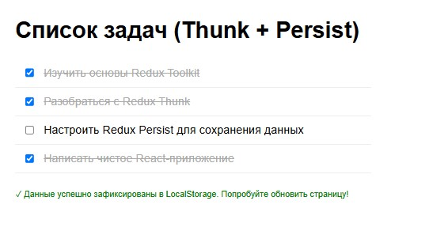
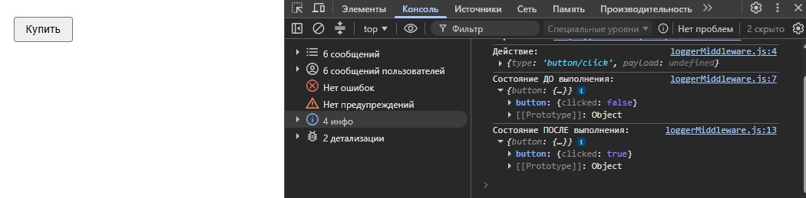
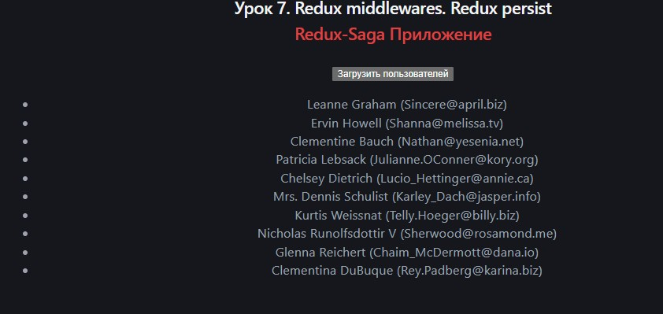

# Урок 7. Redux middlewares. Redux persist


## План урока

- Выполнение практических заданий в соответствии с [презентацией](https://gbcdn.mrgcdn.ru/uploads/asset/6006223/attachment/2dd2770ab08e2676ed6973d9a0301c7d.pdf) к уроку


## Домашняя работа ([решение]())

**Задание: Имитация асинхронной загрузки и отображения списка задач из локального хранилища.**


1. **Инициализация проекта и установка зависимостей:** Инициализируйте новый проект `React`. Установите `@reduxjs/toolkit` и `react-redux`.

2. **Создание локальных данных:** Определите массив объектов, представляющих задачи, в файле, например, `src/data/tasks.js`. Каждая задача может содержать поля, такие как `id`, `title` и `completed`.

3. **Настройка Redux store:** Создайте `Redux store` с использованием `configureStore` из `@reduxjs/toolkit`. Используйте `Redux Thunk middleware`, уже включённый в `@reduxjs/toolkit`.

4. **Создание асинхронного действия с использованием Thunk:** Используйте `createAsyncThunk` для создания асинхронного действия, которое "загружает" данные задач из локального файла. Хотя данные и локальные, имитируйте асинхронное поведение, например, с использованием `setTimeout`.

5. **Работа с компонентом:** Используйте хуки `useDispatch` и `useSelector` в компоненте для диспетчеризации асинхронного действия и выборки списка задач из состояния. Выведите список задач.

**Результат выполнения Домашней работы:**

```
npm install @reduxjs/toolkit react-redux redux-persist
```

```
/* data/tasks.js */

export const mockTasks = [
  { id: 1, title: 'Изучить основы Redux Toolkit', completed: true },
  { id: 2, title: 'Разобраться с Redux Thunk', completed: false },
  { id: 3, title: 'Настроить Redux Persist для сохранения данных', completed: false },
  { id: 4, title: 'Написать чистое React-приложение', completed: true }
];
```

```
/* store/tasksSlice.js */
import { createSlice, createAsyncThunk } from '@reduxjs/toolkit';
import { mockTasks } from '../data/tasks';

// Асинхронный Thunk-экшен для "загрузки" данных
export const fetchTasks = createAsyncThunk(
  'tasks/fetchTasks',
  async () => { // <--- Просто удалите второй аргумент, если не обрабатываете им ошибки
    return await new Promise((resolve) => {
      setTimeout(() => resolve(mockTasks), 1500);
    });
  }
);

const tasksSlice = createSlice({
  name: 'tasks',
  initialState: {
    items: [],
    loading: false,
    error: null,
  },
  reducers: {
     toggleTask: (state, action) => {
      const task = state.items.find(t => t.id === action.payload);
      if (task) task.completed = !task.completed;
    }
  },
  extraReducers: (builder) => {
    builder
      .addCase(fetchTasks.pending, (state) => {
        state.loading = true;
        state.error = null;
      })
      .addCase(fetchTasks.fulfilled, (state, action) => {
        state.loading = false;
        state.items = action.payload;
      })
      .addCase(fetchTasks.rejected, (state, action) => {
        state.loading = false;
        state.error = action.payload;
      });
  },
});

export const { toggleTask } = tasksSlice.actions;
export default tasksSlice.reducer;
```

```
/* store/store.js */

import { configureStore } from '@reduxjs/toolkit';
import { persistStore, persistReducer, FLUSH, REHYDRATE, PAUSE, PERSIST, PURGE, REGISTER } from 'redux-persist';
import storage from 'redux-persist/es/storage'; 
import tasksReducer from './tasksSlice';

// Конфигурация для сохранения данных
const persistConfig = {
  key: 'root',
  storage,
  whitelist: ['items'] // сохраняем только массив задач, игнорируя loading и error
};

const persistedReducer = persistReducer(persistConfig, tasksReducer);

export const store = configureStore({
  reducer: {
    tasks: persistedReducer,
  },
  middleware: (getDefaultMiddleware) =>
    getDefaultMiddleware({
      serializableCheck: {
        // Игнорируем системные экшены Redux Persist во избежание ошибок в консоли
        ignoredActions: [FLUSH, REHYDRATE, PAUSE, PERSIST, PURGE, REGISTER],
      },
    }),
});

export const persistor = persistStore(store);
```

```
/* main.jsx */

import React from 'react';
import ReactDOM from 'react-dom/client';
import { Provider } from 'react-redux';
import { PersistGate } from 'redux-persist/integration/react';
import { store, persistor } from './store/store';
import App from './App';

ReactDOM.createRoot(document.getElementById('root')).render(
  <React.StrictMode>
    <Provider store={store}>
      <PersistGate loading={<div>Загрузка хранилища...</div>} persistor={persistor}>
        <App />
      </PersistGate>
    </Provider>
  </React.StrictMode>
);
```

```
/* App.jsx */

import { useEffect } from 'react';
import { useDispatch, useSelector } from 'react-redux';
import { fetchTasks, toggleTask } from './store/tasksSlice';

export default function App() {
  const dispatch = useDispatch();
  const { items, loading, error } = useSelector((state) => state.tasks);

  useEffect(() => {
    // Запускаем имитацию загрузки только если список задач еще пуст
    if (items.length === 0) {
      dispatch(fetchTasks());
    }
  }, [dispatch, items.length]);

  return (
    <div style={{ padding: '30px', fontFamily: 'sans-serif', maxWidth: '500px' }}>
      <h1>Список задач (Thunk + Persist)</h1>

      {loading && <p style={{ color: 'blue' }}>⏳ Синхронизация с сервером...</p>}
      {error && <p style={{ color: 'red' }}>⚠️ Ошибка: {error}</p>}

      <ul style={{ listStyle: 'none', padding: 0 }}>
        {items.map((task) => (
          <li 
            key={task.id} 
            style={{ 
              padding: '10px', 
              borderBottom: '1px solid #eee',
              display: 'flex',
              alignItems: 'center',
              gap: '10px'
            }}
          >
            <input 
              type="checkbox" 
              checked={task.completed} 
              onChange={() => dispatch(toggleTask(task.id))}
            />
            <span style={{ textDecoration: task.completed ? 'line-through' : 'none', color: task.completed ? '#aaa' : '#000' }}>
              {task.title}
            </span>
          </li>
        ))}
      </ul>

      {items.length > 0 && (
        <p style={{ fontSize: '12px', color: 'green', marginTop: '20px' }}>
          ✓ Данные успешно зафиксированы в LocalStorage. Попробуйте обновить страницу!
        </p>
      )}
    </div>
  );
}
```




## Практическая работа на семинаре ([решение]())


**Задание 1 (тайминг 40 минут)** 

Для выполнения этого задания, вам потребуется создать логгирующее
`middleware` для `Redux`, которое будет выводить в консоль информация о действиях (`actions`) и состоянии (`state`) до и после выполнения каждого действия. Это поможет в отладке и понимании потока данных в вашем приложении.
1. Сначала установите необходимые зависимости для вашего проекта, используя `npm install @reduxjs/toolkit react-redux`. Затем создайте `middleware`, которое принимает три аргумента: `store`, `next`, и `action`. Ваше `middleware` должно выводить в консоль текущее действие и состояние до его выполнения, вызывать `next(action)` для передачи действия следующему `middleware` или `редьюсеру`, а затем выводить в консоль состояние после выполнения действия.
2. После создания `middleware`, подключите его к вашему `Redux store`. Для этого используйте функция `configureStore` из `@reduxjs/toolkit`. В результате, каждое действие, отправленное через `store.dispatch`, будет логгироваться вашим `middleware`


**Результат выполнения Задания № 1:**
```
/* Установка зависимостей */

npm install @reduxjs/toolkit react-redux
```

```
// 1. LOGGER MIDDLEWARE (loggerMiddleware.js)
export const loggerMiddleware = (store) => (next) => (action) => {
  // Выводим текущее действие в консоль
  console.log('Действие:', action);

  // Выводим состояние ДО выполнения действия
  console.log('Состояние ДО выполнения:', store.getState());

  // Передаем действие дальше редьюсеру
  const result = next(action);

  // Выводим состояние ПОСЛЕ выполнения действия
  console.log('Состояние ПОСЛЕ выполнения:', store.getState());

  // Возвращаем результат для корректной работы цепочки Redux
  return result;
};
```

```
// 2. REDUX SLICE / REDUCER (buttonSlice.js)
import { createSlice } from '@reduxjs/toolkit';

const buttonSlice = createSlice({
  name: 'button', // Префикс для экшена (получится 'button/click')
  initialState: {
    clicked: false, // Начальное состояние, как в образце
  },
  reducers: {
    click: (state) => {
      state.clicked = true; // Меняем флаг при клике на кнопку
    },
  },
});

// Экспортируем экшен для компонента и редьюсер для хранилища
export const { click } = buttonSlice.actions;
export default buttonSlice.reducer;
```

```
// 3. REDUX STORE CONFIGURATION (store.js)
import { configureStore } from '@reduxjs/toolkit';
import { loggerMiddleware } from './loggerMiddleware';
import buttonReducer from './buttonSlice'; // Импортируем редьюсер кнопки

export const store = configureStore({
  reducer: {
    button: buttonReducer, // Состояние будет лежать в ветке store.button
  },
  // Подключаем наше логгирующее middleware к стандартным
  middleware: (getDefaultMiddleware) =>
    getDefaultMiddleware().concat(loggerMiddleware),
});
```

```
// 4. REACT COMPONENT (BuyButton.jsx)
import 'react';
import { useDispatch } from 'react-redux';
import { click } from './buttonSlice'; 

export const BuyButton = () => {
  const dispatch = useDispatch();

  const handleButtonClick = () => {
    // Отправляем экшен в Redux Store
    dispatch(click());
  };

  return (
    <button 
      onClick={handleButtonClick}
      style={{
        padding: '8px 16px',
        fontSize: '16px',
        cursor: 'pointer',
        borderRadius: '4px',
        border: '1px solid #767676',
        backgroundColor: '#efefef',
        fontFamily: 'Arial, sans-serif'
      }}
    >
      Купить
    </button>
  );
};
```

```
// 5. APPLICATION ENTRY POINT (index.js / main.js)

import React from 'react';
import ReactDOM from 'react-dom/client';
import { Provider } from 'react-redux';
import { store } from './store'; 
import { BuyButton } from './BuyButton'; 

// Корневой рендеринг приложения с подключенным Store
const root = ReactDOM.createRoot(document.getElementById('root'));
root.render(
  <React.StrictMode>
    <Provider store={store}>
      <div style={{ padding: '20px' }}>
        <BuyButton />
      </div>
    </Provider>
  </React.StrictMode>
);
```




**Задание 2 (тайминг 15 минут)** 

В этом примере мы создадим базовое приложение, используя Redux Saga для выполнения асинхронного запроса данных.
- npm install redux-saga
- Создайте файл саги. Например, `src/sagas/usersSaga.js`

```
function fetchUsersApi() {
 return fetch('https://jsonplaceholder.typicode.com/users')
 .then(response => response.json());
}
```
- Рабочая сага: должна выполняться, когда сага перехватит действие `FETCH_USERS_REQUEST`
- Настройте `Redux Saga middleware`. В файле, где вы создаете ваш `store`
- Теперь, когда сага подключена к вашему приложения, вы можете инициировать загрузку пользователей, отправив действие `FETCH_USERS_REQUEST`


**Результат выполнения Задания № 2:**

```
/* sagas/usersSaga.js */

import { call, put, takeEvery } from 'redux-saga/effects';

// Функция для непосредственного запроса к API
function fetchUsersApi() {
  return fetch('https://jsonplaceholder.typicode.com/users')
    .then(response => {
      if (!response.ok) throw new Error('Ошибка сервера');
      return response.json();
    });
}

// Рабочая сага (Worker saga): выполняет асинхронную логику
function* fetchUsersWorker() {
  try {
    // call вызывает асинхронную функцию
    const users = yield call(fetchUsersApi); 
    // put отправляет экшен в редюсер (аналог dispatch)
    yield put({ type: 'FETCH_USERS_SUCCESS', payload: users });
  } catch (error) {
    yield put({ type: 'FETCH_USERS_FAILURE', payload: error.message });
  }
}

// Следящая сага (Watcher saga): перехватывает экшен FETCH_USERS_REQUEST
export default function* watchUsersSaga() {
  yield takeEvery('FETCH_USERS_REQUEST', fetchUsersWorker);
}
```

```
/* store.js */

import { createStore, applyMiddleware, combineReducers } from 'redux';
import createSagaMiddleware from 'redux-saga';
import usersReducer from './reducers/usersReducer'; 
import watchUsersSaga from './sagas/usersSaga';

const rootReducer = combineReducers({
  users: usersReducer 
});

const sagaMiddleware = createSagaMiddleware();

const store = createStore(
  rootReducer,
  applyMiddleware(sagaMiddleware)
);

sagaMiddleware.run(watchUsersSaga);

export default store;
```

```
/* reducers/usersReducer.js */

const initialState = {
  loading: false,
  data: [],
  error: null
};

export default function usersReducer(state = initialState, action) {
  switch (action.type) {
    case 'FETCH_USERS_REQUEST':
      return { ...state, loading: true, error: null };
    case 'FETCH_USERS_SUCCESS':
      return { ...state, loading: false, data: action.payload };
    case 'FETCH_USERS_FAILURE':
      return { ...state, loading: false, error: action.payload };
    default:
      return state;
  }
}
```

```
/* components/UsersList.jsx */

import "react";
import { useDispatch, useSelector } from "react-redux";

export default function UsersList() {
  const dispatch = useDispatch();

  const data = useSelector((state) => state.users?.data || []);
  const loading = useSelector((state) => state.users?.loading || false);
  const error = useSelector((state) => state.users?.error || null);

  const loadUsers = () => {
    dispatch({ type: "FETCH_USERS_REQUEST" });
  };

  return (
    <div style={{ padding: "20px" }}>
      <button onClick={loadUsers} disabled={loading}>
        {loading ? "Загрузка..." : "Загрузить пользователей"}
      </button>

      {error && <p style={{ color: "red" }}>Ошибка: {error}</p>}

      <ul>
        {data &&
          data.map((user) => (
            <li key={user.id}>
              {user.name} ({user.email})
            </li>
          ))}
      </ul>
    </div>
  );
}
```

```
/* App.jsx */

import 'react';
import { Provider } from 'react-redux';
import store from './store'; // путь к вашему store.js
import UsersList from './components/UsersList';

export default function App() {
  return (
    <Provider store={store}>
      <div className="App">
        <h2>Урок 7. Redux middlewares. Redux persist</h2>
        <h2 style={{color: '#db4242'}}>Redux-Saga Приложение</h2>
        <UsersList />
      </div>
    </Provider>
  );
}
```
