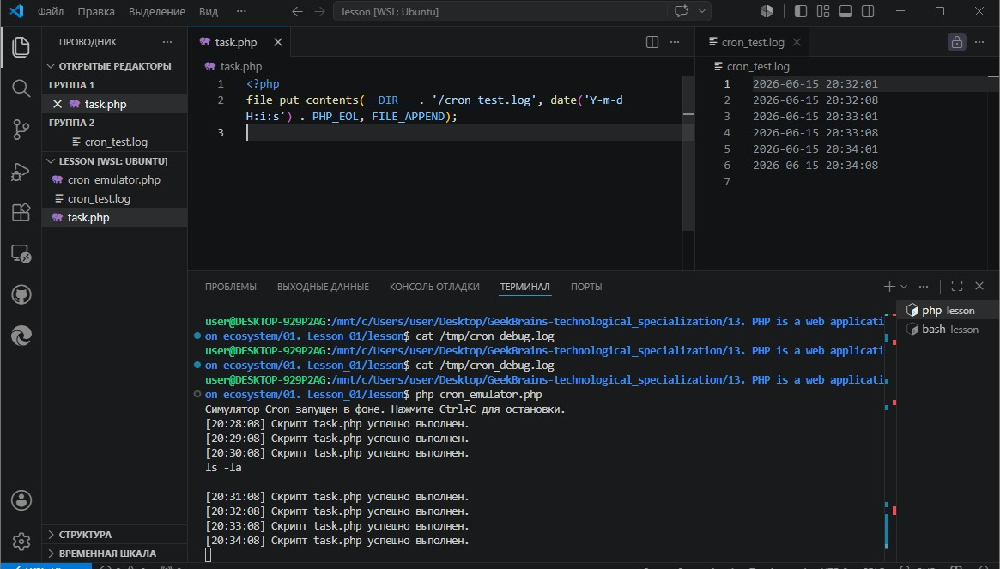
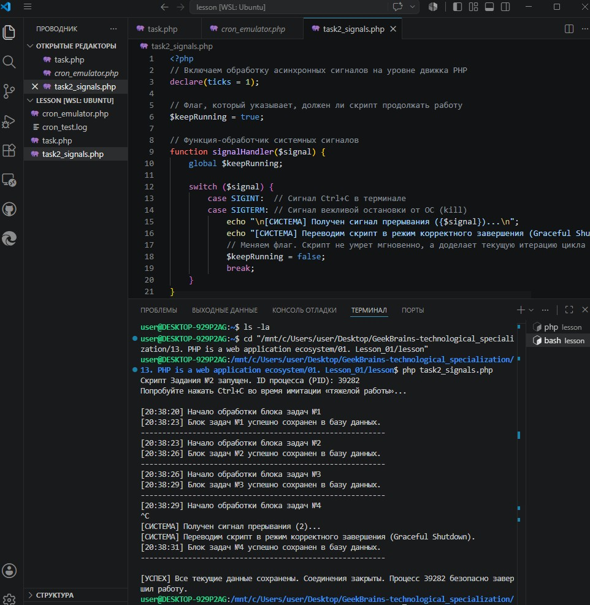
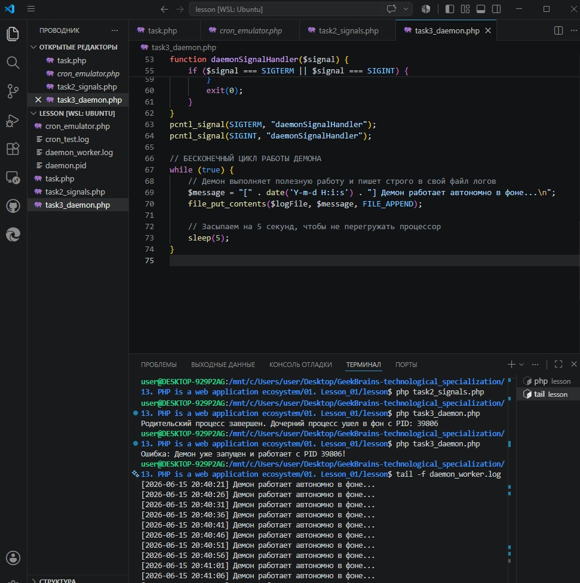
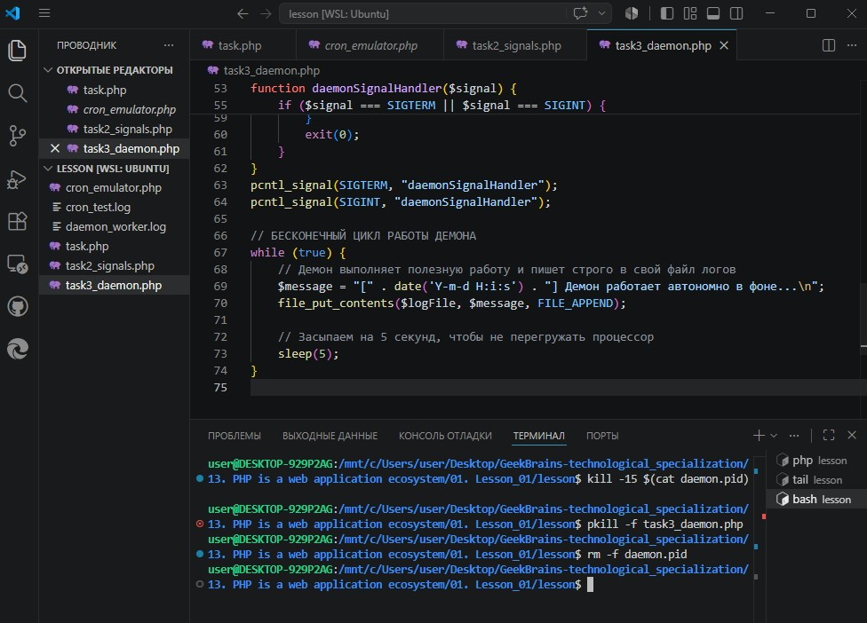

# Урок 1. Лекция: Консольный PHP

## План урока

- писать продвинутые php-cli скрипты
- обрабатывать завершающие сигналы Linux
- запускать свои скрипты по расписанию или как службы
- писать многопоточные приложения на PHP
- демонизировать php скрипты


---

## Домашняя работа ([решение](https://github.com/olgashenkel/GeekBrains-technological_specialization/tree/main/13.%20PHP%20is%20a%20web%20application%20ecosystem/01.%20Lesson_01/lesson))

1. Создайте любой PHP скрипт и настройте его запуск раз в минуту, используя crontab или systemd.
2. Возьмите скрипт из блока “Завершающие сигналы” и запустите его в вашей локальной среде разработки. Передайте сигналы SIGINT(Ctrl + C), SIGTERM и SIGKILL. 2 последних сигнала вы можете передать процессу через утилиту HTOP.
3. Создайте демонизированный PHP скрипт любым описанным в блоке “Демонизация PHP” способом.


***Результат выполнения Домашней работы:***

**Задание № 1:**

```
<?php
file_put_contents(__DIR__ . '/cron_test.log', date('Y-m-d H:i:s') . PHP_EOL, FILE_APPEND);
```




**Задание № 2:**

```
<?php
// Включаем обработку асинхронных сигналов на уровне движка PHP
declare(ticks = 1);

// Флаг, который указывает, должен ли скрипт продолжать работу
$keepRunning = true;

// Функция-обработчик системных сигналов
function signalHandler($signal) {
    global $keepRunning;
    
    switch ($signal) {
        case SIGINT:  // Сигнал Ctrl+C в терминале
        case SIGTERM: // Сигнал вежливой остановки от ОС (kill)
            echo "\n[СИСТЕМА] Получен сигнал прерывания ({$signal})...\n";
            echo "[СИСТЕМА] Переводим скрипт в режим корректного завершения (Graceful Shutdown).\n";
            // Меняем флаг. Скрипт не умрет мгновенно, а доделает текущую итерацию цикла
            $keepRunning = false; 
            break;
    }
}

// Регистрируем перехват сигналов SIGINT и SIGTERM
pcntl_signal(SIGINT, "signalHandler");
pcntl_signal(SIGTERM, "signalHandler");

$pid = getmypid();
echo "Скрипт Задания №2 запущен. ID процесса (PID): {$pid}\n";
echo "Попробуйте нажать Ctrl+C во время имитации «тяжелой работы»...\n\n";

$step = 1;

// Цикл выполняется, пока флаг равен true
while ($keepRunning) {
    echo "[" . date('H:i:s') . "] Начало обработки блока задач №{$step}\n";
    
    // Имитируем долгую и важную работу (например, отправку писем или запись в БД)
    // Если нажать Ctrl+C прямо в этот момент, скрипт не прервется на середине, 
    // а послушно дождется окончания этих 3 секунд.
    sleep(3); 
    
    echo "[" . date('H:i:s') . "] Блок задач №{$step} успешно сохранен в базу данных.\n";
    echo "---------------------------------------------------------\n";
    
    $step++;
}

// Этот код выполнится ТОЛЬКО после того, как цикл корректно завершит свою последнюю итерацию
echo "\n[УСПЕХ] Все текущие данные сохранены. Соединения закрыты. Процесс {$pid} безопасно завершил работу.\n";
```




**Задание № 3:**

```
<?php
declare(ticks = 1);

// Путь к файлу, где будет храниться ID запущенного процесса (PID-файл)
$pidFile = __DIR__ . '/daemon.pid';
// Путь к файлу, куда демон будет записывать результаты работы
$logFile = __DIR__ . '/daemon_worker.log';

// ПРОВЕРКА НА УНИКАЛЬНОСТЬ: Проверяем, не запущен ли уже этот демон
if (file_exists($pidFile)) {
    $oldPid = trim(file_get_contents($pidFile));
    
    // posix_kill с сигналом 0 не убивает процесс, а проверяет, существует ли он в системе
    if ($oldPid && posix_kill((int)$oldPid, 0)) {
        die("Ошибка: Демон уже запущен и работает с PID {$oldPid}!\n");
    } else {
        // Если файл остался от старого аварийного падения, удаляем его
        unlink($pidFile);
    }
}

// РАЗВЕТВЛЕНИЕ (ФОРК): Создаем копию процесса
$pid = pcntl_fork();

if ($pid == -1) {
    die("Не удалось форкнуть процесс.\n");
} elseif ($pid > 0) {
    // Этот код выполняется в РОДИТЕЛЬСКОМ процессе.
    // Он просто сообщает, что всё ок, и закрывается, освобождая консоль пользователю.
    echo "Родительский процесс завершен. Дочерний процесс ушел в фон с PID: {$pid}\n";
    exit(0);
}

// ВСЁ, ЧТО НИЖЕ, ВЫПОЛНЯЕТСЯ ТОЛЬКО В ДОЧЕРНЕМ ПРОЦЕССЕ (ДЕМОНЕ)

// Делаем процесс лидером новой сессии (полная отвязка от терминала)
if (posix_setsid() == -1) {
    die("Не удалось стать лидером сессии.\n");
}

// Записываем PID текущего фонового процесса в файл для контроля уникальности
file_put_contents($pidFile, getmypid());

// Меняем рабочую директорию на корневую, чтобы не блокировать текущую папку в ОС
chdir('/');

// Закрываем стандартные потоки ввода-вывода, так как консоли у демона больше нет
fclose(STDIN);
fclose(STDOUT);
fclose(STDERR);

// Обработчик сигналов для демона, чтобы его можно было вежливо остановить
function daemonSignalHandler($signal) {
    global $pidFile;
    if ($signal === SIGTERM || $signal === SIGINT) {
        // При остановке обязательно удаляем PID-файл, чтобы в следующий раз демон мог запуститься
        if (file_exists($pidFile)) {
            unlink($pidFile);
        }
        exit(0);
    }
}
pcntl_signal(SIGTERM, "daemonSignalHandler");
pcntl_signal(SIGINT, "daemonSignalHandler");

// БЕСКОНЕЧНЫЙ ЦИКЛ РАБОТЫ ДЕМОНА
while (true) {
    // Демон выполняет полезную работу и пишет строго в свой файл логов
    $message = "[" . date('Y-m-d H:i:s') . "] Демон работает автономно в фоне...\n";
    file_put_contents($logFile, $message, FILE_APPEND);
    
    // Засыпаем на 5 секунд, чтобы не перегружать процессор
    sleep(5);
}
```




Останавливаем фонового демона и очищаем файлы



