# Урок 2. Семинар: Консольный PHP

## План урока

- Выполнение практических заданий в соответствии с [презентацией](https://gbcdn.mrgcdn.ru/uploads/asset/6103327/attachment/4cf4c2db1795c5ffede2dec2dab27651.pdf) к уроку
- Викторина, которая построена на основании реальных вопросов, которые задают на собеседовании
- Имитация работы выполнения заданий от тимлида
- Получим опыт постановки ТЗ от тимлида
- Научимся по шагам работать над задачей, которая ставится от тимлида
- Приступим к реализации бота-напоминалки
- Реализуем демона


---

## Домашняя работа ([решение](https://github.com/olgashenkel/GeekBrains-technological_specialization/tree/main/13.%20PHP%20is%20a%20web%20application%20ecosystem/02.%20Seminar_01/seminar))

**Часть 1:**

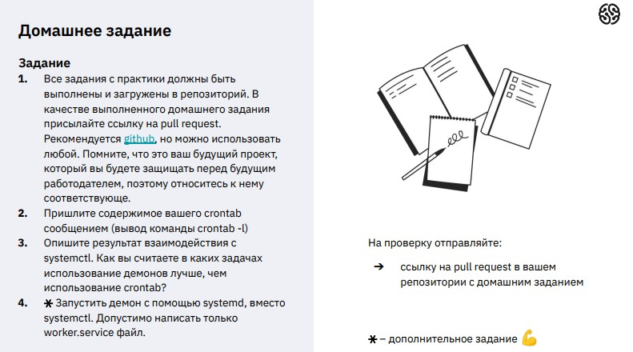

**Часть 2:**

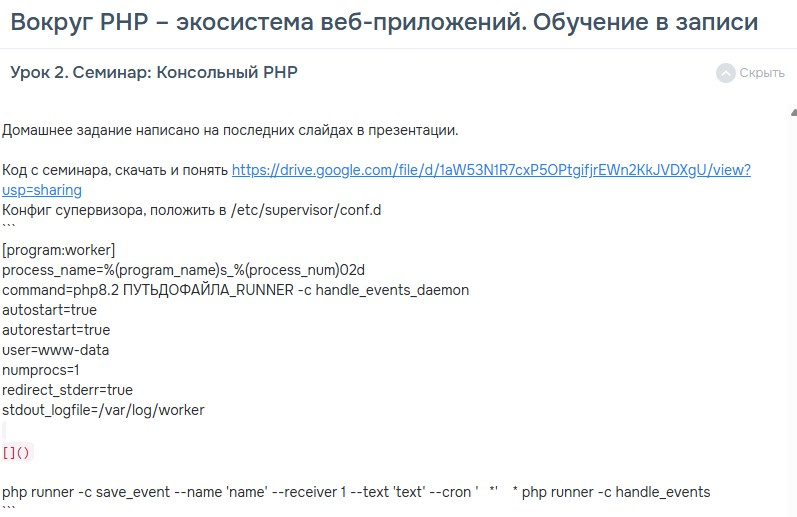

***Результат выполнения Домашней работы (часть 1):***


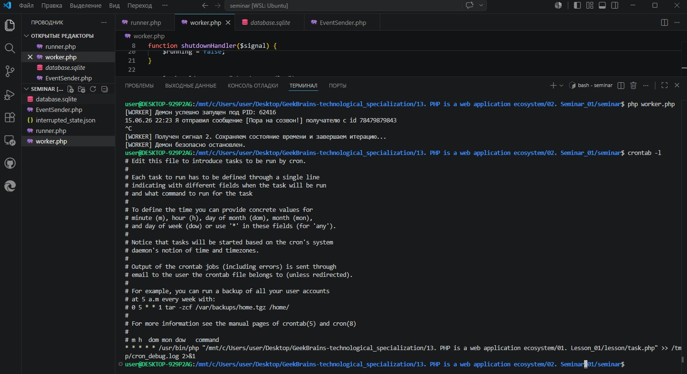

```
Задание № 3.

Использование долгоживущих демонов предпочтительнее crontab в следующих сценариях:

1. Высокая частота задач (High Frequency): cron имеет минимальный порог запуска в 1 минуту. Если задачи (очереди RabbitMQ, отправка SMS) нужно обрабатывать каждые 5–10 секунд, демон в бесконечном цикле со sleep() справляется идеально.

2. Постоянное удержание ресурсов: Демон инициализирует тяжелые соединения (подключения к БД, Redis, внешние API) один раз при старте, в то время как cron при каждом ежеминутном запуске заново поднимает интерпретатор PHP и переподключает сетевые соединения, создавая лишнюю нагрузку.

3. Сложная логика и зависимости: Демоны могут асинхронно реагировать на внешние сигналы (HUP, TERM) через pcntl_signal и динамически управлять пулом дочерних процессов, что невозможно в рамках изолированных запусков cron.
```

```
/* Задание № 4.
worker.service */

[Unit]
Description=PHP Daemon Reminder Worker Service
After=network.target

[Service]
Type=simple
ExecStart=/usr/bin/php /mnt/c/Users/user/Desktop/GeekBrains-technological_specialization/13. PHP is a web application ecosystem/02. Seminar_01/seminar/worker.php
WorkingDirectory=/mnt/c/Users/user/Desktop/GeekBrains-technological_specialization/13. PHP is a web application ecosystem/02. Seminar_01/seminar
Restart=always
RestartSec=5
User=root

[Install]
WantedBy=multi-user.target
```


***Результат выполнения Домашней работы (часть 2):***


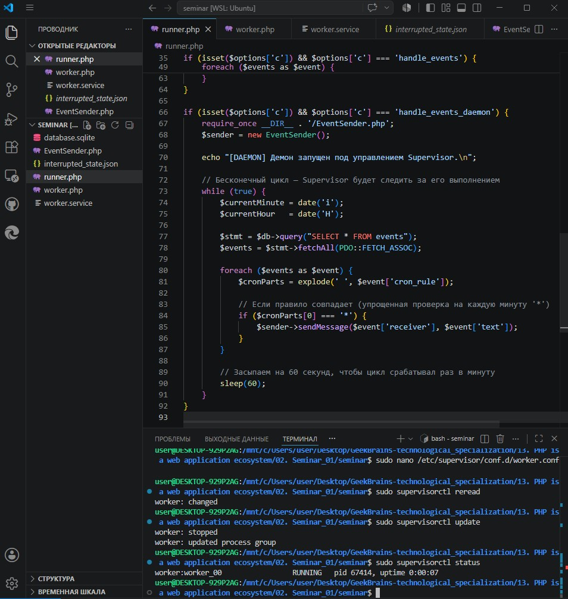


## Практическая работа на семинаре ([решение](https://github.com/olgashenkel/GeekBrains-technological_specialization/tree/main/12.%20PHP%20Basics/02.%20Seminar_01/seminar))

**Задание 1.** 

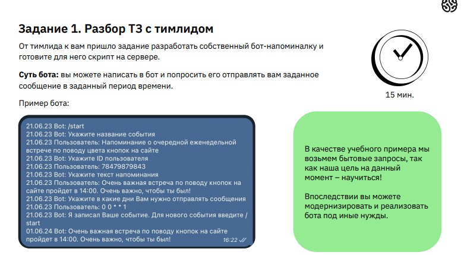

**Результат выполнения Задания № 1:**

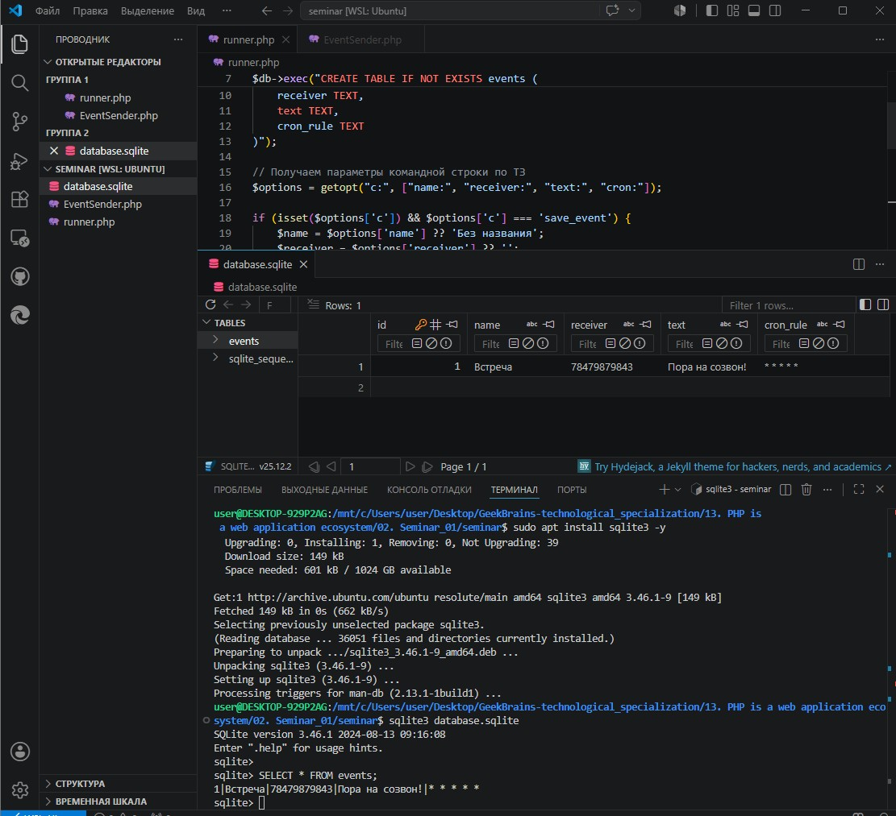


---


**Задание 2** 

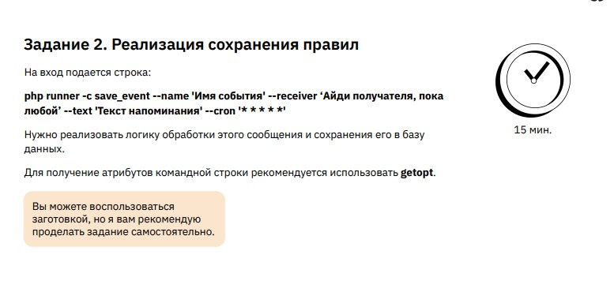


**Результат выполнения Задания № 2:**


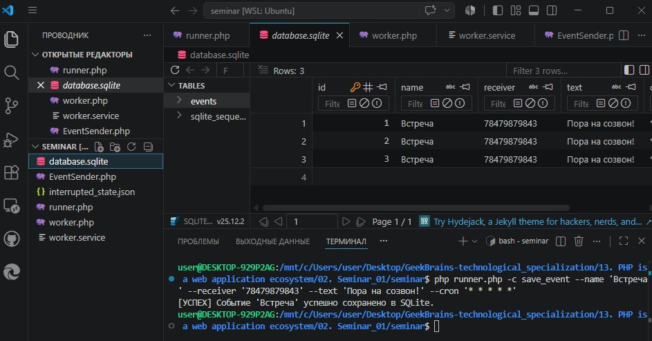


---

**Задание 3** 

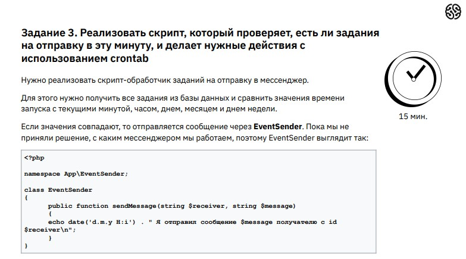


**Результат выполнения Задания № 3:**

```
/* EventSender.php */

<?php
class EventSender {
    public function sendMessage(string $receiver, string $message) {
        echo date('d.m.y H:i') . " Я отправил сообщение [{$message}] получателю с id {$receiver}\n";
    }
}
```

```
/* runner.php */

if (isset($options['c']) && $options['c'] === 'handle_events') {
    require_once __DIR__ . '/EventSender.php';
    $sender = new EventSender();

    // Берем текущие параметры времени
    $currentMinute = date('i');
    $currentHour   = date('H');
    $currentDay    = date('d');
    $currentMonth  = date('m');
    $currentWDay   = date('w'); // 0 (вс) - 6 (сб)

    $stmt = $db->query("SELECT * FROM events");
    $events = $stmt->fetchAll(PDO::FETCH_ASSOC);

    foreach ($events as $event) {
        // Простейший парсинг пяти звездочек '* * * * *'
        $cronParts = explode(' ', $event['cron_rule']);
        
        $match = true;
        if ($cronParts[0] !== '*' && (int)$cronParts[0] !== (int)$currentMinute) $match = false;
        if ($cronParts[1] !== '*' && (int)$cronParts[1] !== (int)$currentHour) $match = false;
        if ($cronParts[2] !== '*' && (int)$cronParts[2] !== (int)$currentDay) $match = false;
        if ($cronParts[3] !== '*' && (int)$cronParts[3] !== (int)$currentMonth) $match = false;
        if ($cronParts[4] !== '*' && (int)$cronParts[4] !== (int)$currentWDay) $match = false;

        if ($match) {
            $sender->sendMessage($event['receiver'], $event['text']);
        }
    }
}

```

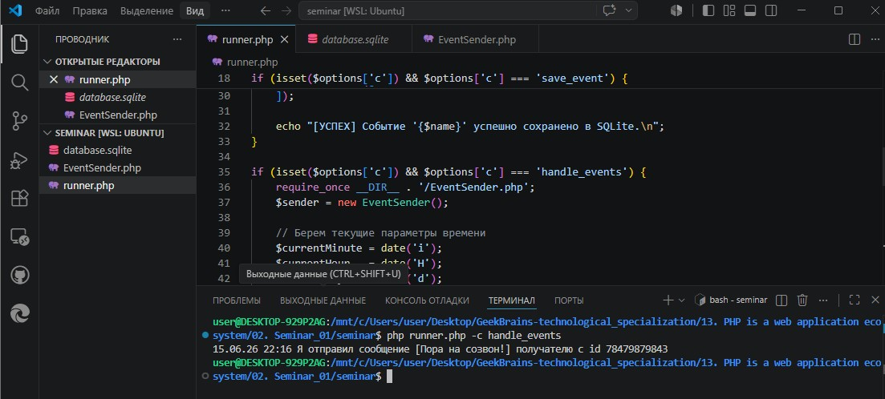


**Задание 4** 

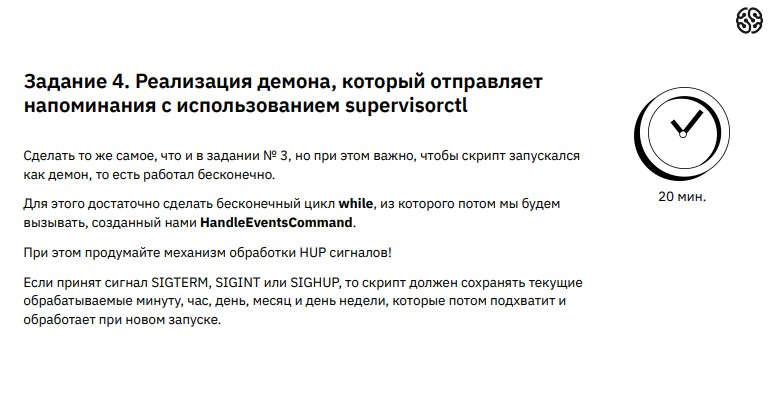


**Результат выполнения Задания № 4:**

```
/* worker.php */

<?php
declare(ticks = 1);

// Флаг работы демона
$running = true;

// По ТЗ: при сигналах сохраняем состояние, чтобы новый запуск его подхватил
function shutdownHandler($signal) {
    global $running;
    echo "\n[WORKER] Получен сигнал {$signal}. Сохраняем состояние времени и завершаем итерацию...\n";
    
    $state = [
        'minute' => date('i'),
        'hour'   => date('H'),
        'day'    => date('d'),
        'interrupted_at' => date('Y-m-d H:i:s')
    ];
    file_put_contents(__DIR__ . '/interrupted_state.json', json_encode($state));
    
    $running = false; 
}

pcntl_signal(SIGTERM, "shutdownHandler");
pcntl_signal(SIGINT, "shutdownHandler");
pcntl_signal(SIGHUP, "shutdownHandler");

echo "[WORKER] Демон успешно запущен под PID: " . getmypid() . "\n";

while ($running) {
    // Вызываем логику проверки событий из runner.php
    passthru('php ' . __DIR__ . '/runner.php -c handle_events');
    
    // Спим до начала следующей минуты, чтобы не перегружать процессор
    sleep(60); 
}

echo "[WORKER] Демон безопасно остановлен.\n";
```
